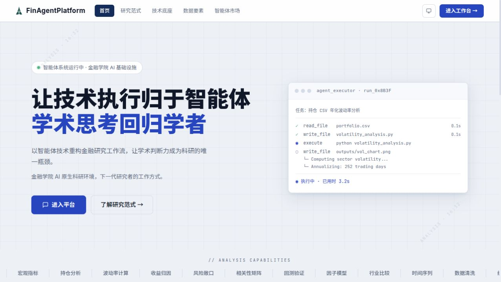
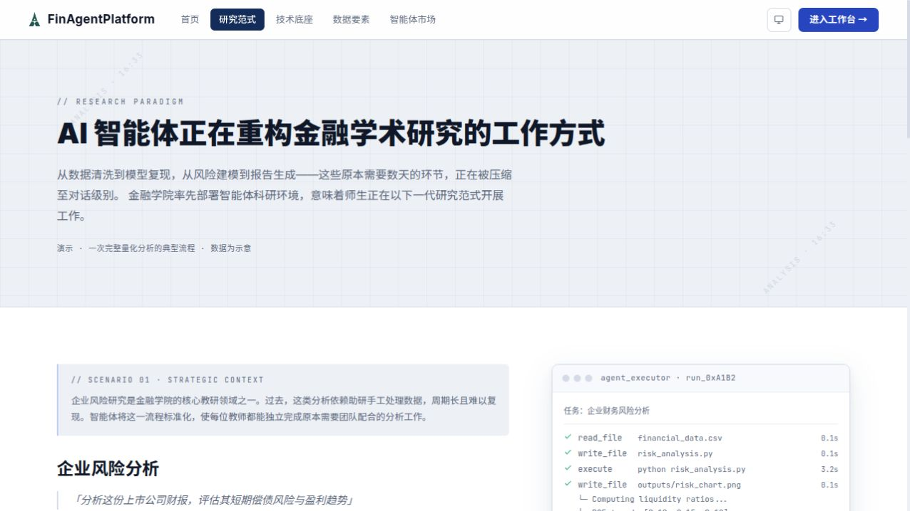
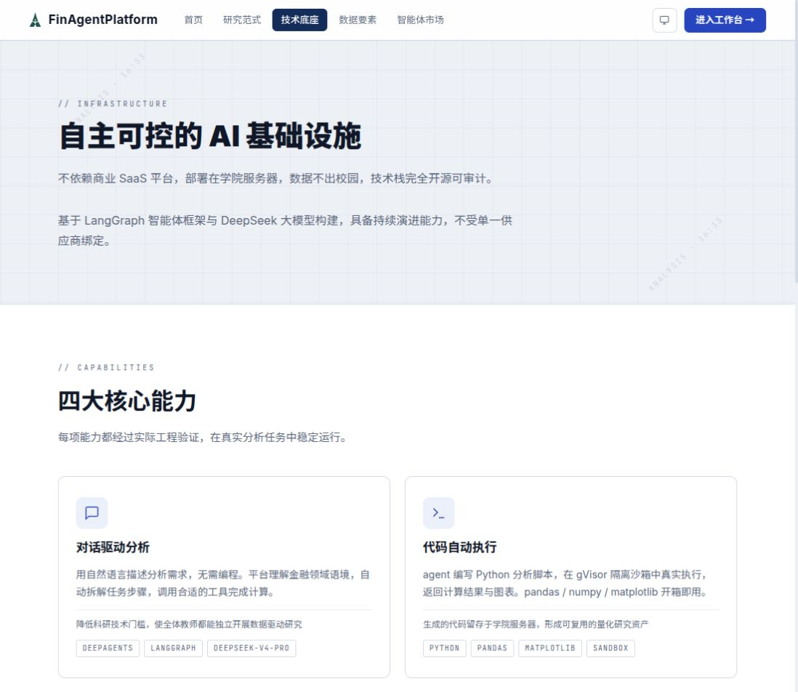

# 中南财经政法大学金融学院智能体平台

面向教师的内网单机智能体平台。教师用自然语言提出分析问题，智能体在隔离沙箱中编写并执行 Python，实时返回推理过程、结论和图表。

## 项目特点

- 基于 FastAPI、LangGraph/DeepAgents 的智能体运行时。
- 通过 Redis Stream 投递任务和传递事件，前端使用 SSE 接收实时进度。
- 使用 PostgreSQL 保存 run、会话、事件和 checkpoint 等数据。
- 每个会话按需创建独立沙箱，由 gVisor（`runsc`）隔离，并限制 CPU、内存、进程数和 workspace 磁盘配额。
- 沙箱、workspace 和 thread memory 由独立的 broker 管理；api 与 worker 不直接持有 `docker.sock`。
- 支持人工审批、断线续传、取消、配额限流、文件产物和 Skill/MCP/子智能体配置。

## 界面预览

以下截图来自本地运行实例 `http://127.0.0.1/`，展示平台首页、研究范式和技术底座页面。

<p align="center">
  
  
  
</p>

## 架构概览

```text
浏览器
  │ HTTP / SSE
  ▼
nginx ── /api/ ──> api ──> Redis Stream ──> worker ──HTTP──> broker
  │                    │                         │             │
  │                    └────── PostgreSQL ◄──────┘             └── 动态 gVisor 沙箱
  └── 前端静态文件                                              （workspace / memory）
```

Compose 固定编排六个服务：`nginx`、`api`、`worker`、`broker`、`postgres` 和 `redis`。沙箱容器不在 `docker/compose.yml` 中声明，而是由 broker 按会话动态创建和回收。

关键边界：

- 只有 broker 持有宿主机的 Docker Socket 和 workspace 目录。
- 沙箱默认使用 `runsc`、2 GiB 内存、1 个 CPU、128 个进程和 5 GiB workspace 配额；部署时可在 `.env` 中调整，但安全相关参数应结合设计文档重新评估。
- 数据库迁移只由 api 容器执行，worker 不执行 Alembic upgrade。

## 目录结构

| 路径 | 说明 |
| --- | --- |
| `src/` | Python 后端工程；api、worker、broker 共用此目录和镜像 |
| `web/` | React 19 + TypeScript + Vite 前端工程 |
| `docker/` | Compose、nginx 配置和沙箱镜像定义 |
| `script/` | 部署、宿主机初始化、环境检查和回归验收脚本 |
| `data/` | PostgreSQL、Redis、sandbox 等宿主机 bind mount 目录 |
| `doc/01design/` | 架构、运行时、安全、数据和 ADR 设计文档 |
| `doc/03plan/` | P0–P15 分期计划、决策和验收记录 |
| `Makefile` | 根级开发门禁和部署命令入口 |

## 快速开始

### 环境要求

本地开发至少需要：

- Linux 宿主机；完整部署脚本依赖 Docker、Docker Compose Plugin、systemd 和 sudo。
- Python 3.13 或更高版本，以及 [`uv`](https://docs.astral.sh/uv/)。
- Node.js 和 `pnpm` 11（前端锁定的包管理器版本为 `pnpm@11.10.0`）。
- Docker Engine；完整沙箱运行需要注册 gVisor 的 `runsc` runtime。
- 生产或真实验收环境应将 workspace 放在带 `prjquota` 的 XFS 文件系统上。

### 配置环境变量

```bash
cp .env.example .env
```

编辑 `.env`，至少确认以下配置：

- `DEEPSEEK_API_KEY`：模型服务密钥。
- `ADMIN_PASSWORD`：首个管理员密码，部署前必须修改。
- `SANDBOX_USER`：沙箱文件的宿主机属主，通常填写 `$(id -u):$(id -g)` 的实际结果。
- `SANDBOX_WORKSPACE_ROOT`：workspace 根目录，使用宿主机上的绝对路径。
- `SKILL_ROOT`：Skill 版本仓库根目录，使用宿主机上的绝对路径。

Compose 会读取 `docker/.env` 进行变量插值。首次使用时，`make up`、`make deploy` 等目标会自动创建 `docker/.env -> ../.env` 的链接；不要把真实的 `.env` 提交到仓库。

### 新机器完整部署

`make deploy` 会按需安装或配置 gVisor、准备 XFS workspace、构建沙箱镜像、启动六个服务并进行基础自检：

```bash
make sync
make deploy
```

脚本是幂等的，可以重复执行。它会保留 `data/` 下已有的 PostgreSQL、Redis 和 workspace 数据。

部署完成后访问：

```text
http://127.0.0.1/                 # 教师端前端，默认 HTTP_PORT=80
http://127.0.0.1/docs              # FastAPI Swagger 文档
http://127.0.0.1/redoc             # FastAPI ReDoc 文档
```

如果修改了 `HTTP_PORT`，将上面的端口替换为 `.env` 中的值。

### 已完成宿主机初始化时启动

如果 gVisor、XFS 和沙箱镜像已经准备好，可以直接启动应用栈：

```bash
make sync
make sandbox-image       # 沙箱镜像不存在或需要更新时执行
make up
```

## 开发与质量门禁

根目录 Makefile 是两端统一入口：

```bash
make                  # lint + 类型检查 + 测试
make fix              # 自动修复 lint 并格式化，会修改文件
make cov              # 测试并检查 80% 覆盖率下限
make hooks            # 启用提交前自动执行 make all 的 git hook
make clean            # 清理工具缓存和构建产物
```

前端需要热更新时，在另一个终端运行：

```bash
cd web
pnpm dev              # 默认访问 http://127.0.0.1:5173，/api 代理到 nginx:80
```

修改 `web/` 后，Compose 中的 nginx 镜像必须重建，推荐执行 `make rebuild`；仅 restart 不会更新镜像内已经构建好的前端静态文件。修改 `docker/nginx.conf` 时不需要重新编译前端。

后端工具在 `src/` 包根内运行，例如：

```bash
cd src
uv run pytest test/run/executor_test.py -k <测试名称>
uv run mypy
```

提交前应执行 `make` 并确保 lint、类型检查和测试全部通过。

## 部署运维命令

```bash
make ps                    # 查看服务和 quota 设备状态
make logs S=worker        # 跟随指定服务日志
make rebuild              # 重建并重启 api、worker、broker、nginx
make down                 # 停止服务，不删除 data/ 下的 bind mount 数据
make remount              # 重启机器后重新挂载 XFS 并恢复 broker/nginx
```

重启宿主机后，若 workspace 使用脚本创建的 XFS loop 文件系统，应先执行 `make remount`，不要只重启容器。该命令会重新解析当前 quota 设备并清理旧的动态沙箱容器。

## 回归验收

真实验收要求六个服务已经启动，并且会重启或停止部分服务；不要与其他用户共用这套环境：

```bash
bash script/test/verify.sh
```

不调用真实模型、也不执行破坏性宿主机测试的免费轮：

```bash
SKIP_LLM=1 SKIP_HOSTILE=1 bash script/test/verify.sh
```

跳过的场景会记录为“未验”，不等同于通过。验收脚本的完整判据、前置条件和每期结果见 [`doc/03plan/CLAUDE.md`](doc/03plan/CLAUDE.md) 及各期计划文档。

## 设计文档

- [总体架构](doc/01design/01architecture.md)
- [智能体设计](doc/01design/03agent-design.md)
- [运行时设计](doc/01design/05runtime-design.md)
- [安全设计](doc/01design/07security-design.md)
- [运维设计](doc/01design/08operation-design.md)
- [ADR 索引](doc/01design/adr/README.md)
- [分期计划与验收索引](doc/03plan/CLAUDE.md)

## 许可证

本项目采用 [GNU General Public License v3.0](LICENSE)（GPL-3.0）授权。

## 部署范围

项目面向中南财经政法大学金融学院内网单机部署。当前 Compose 配置默认把数据库、Redis 和 broker 的宿主机端口绑定到回环地址，生产部署前仍需根据学校内网、凭据管理、备份和数据外发要求完成安全评估。
