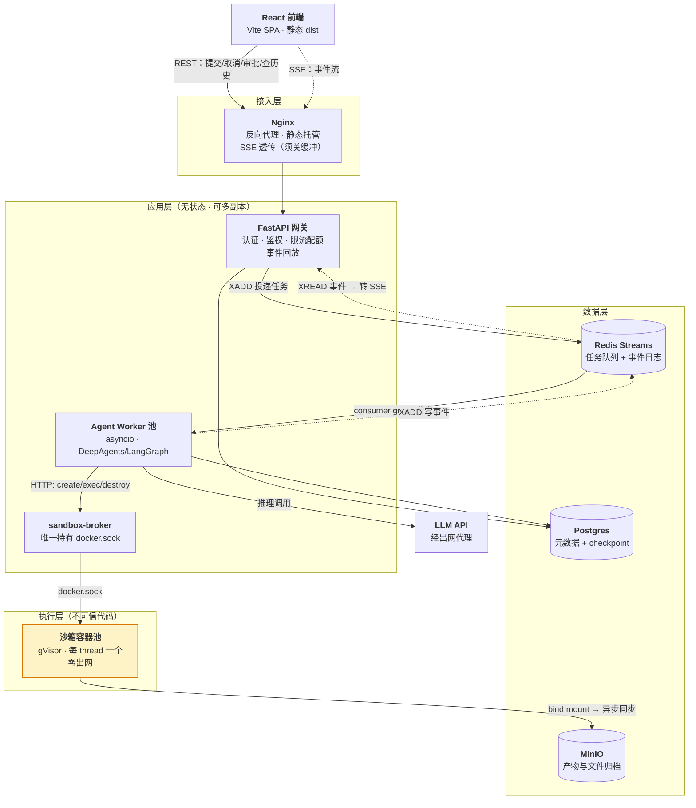
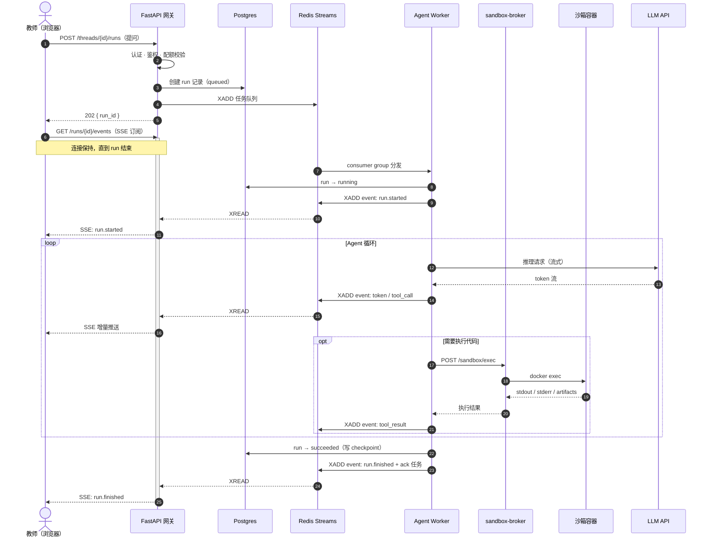
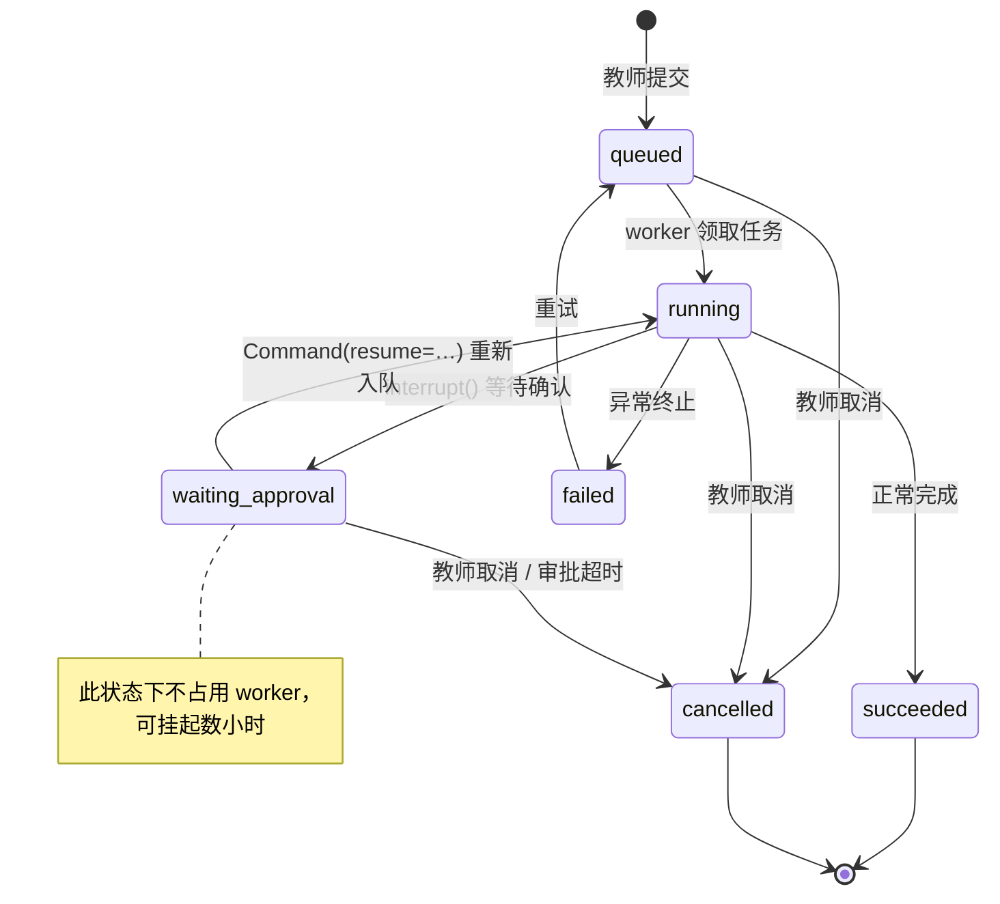
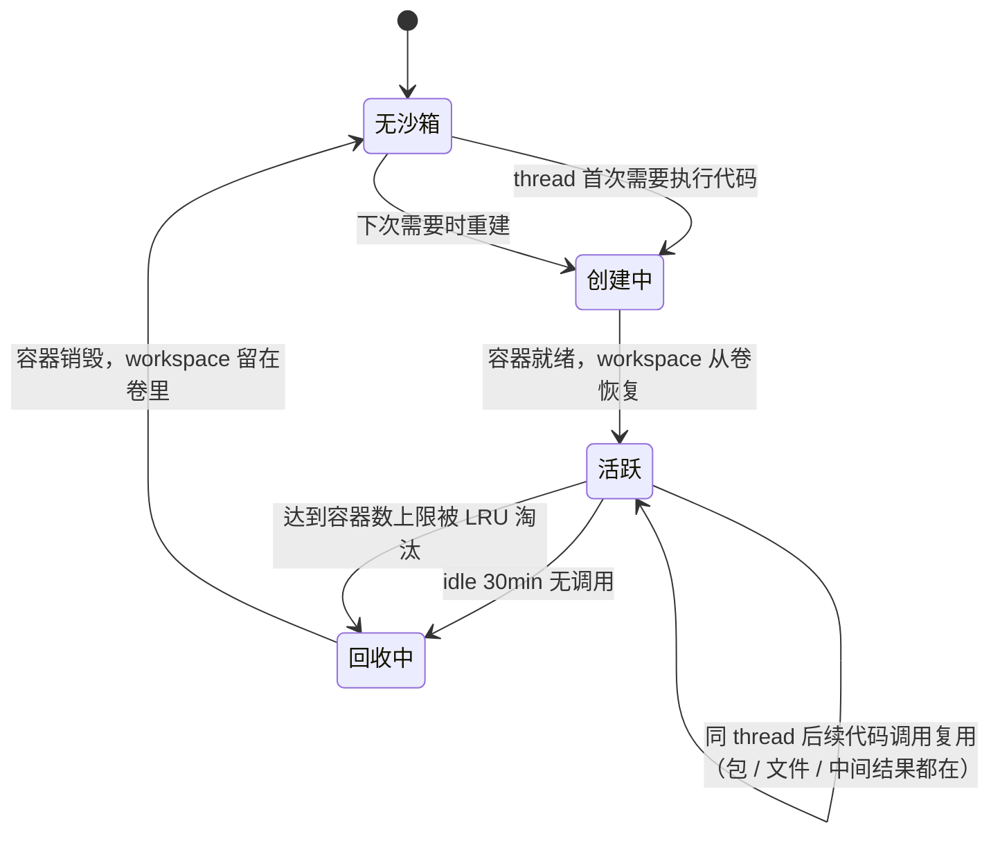

# 金融学院智能体平台 — 总体架构设计

| 项 | 值 |
|---|---|
| 文档状态 | **草稿**（骨架已定，部分章节待补） |
| 当前版本 | v0.2 |
| 作者 | hxy |
| 评审人 | 待定 |
| 批准人 | 待定 |

### 版本历史

| 版本 | 日期 | 修改人 | 说明 |
|---|---|---|---|
| v0.1 | 2026-07-29 | hxy | 初稿。按技术问题域组织（沙箱 / 中断恢复 / 并发 / 选型） |
| v0.2 | 2026-07-31 | hxy | 重构为标准架构文档结构；架构决策拆分至 [`adr/`](./adr/)；补齐空缺章节占位；图改用 Mermaid |

> **本文档的 TODO 约定**：形如 `> **TODO** ｜ 待回答：……` 的引用块表示该节骨架已就位但内容未定，并写明「这一节要回答什么问题」与「被什么阻塞」。全文可用 `grep -n "TODO"` 检索剩余缺口。

---

## 目录与阅读指引

不同角色只需要读对应章节，不必通读：

| 你是 | 建议阅读 | 想知道的问题 |
|---|---|---|
| 学院 / 项目负责人 | §1、§2、§10、§11 | 这东西解决什么问题？要花多少资源？有什么风险？什么时候能用？ |
| 架构 / 技术负责人 | 全文，重点 §3、§4、§7 | 为什么这样设计？边界在哪？哪里会先撑不住？ |
| 开发者 | §4、§5、§6、[`adr/`](./adr/) | 模块怎么划分？数据怎么流？我的模块和谁通信？ |
| 运维 | §4.4、§8 | 怎么部署？怎么监控？出事怎么恢复？ |

| 章节 | 内容 | 完成度 |
|---|---|---|
| §1 引言与背景 | 目标、范围、名词表 | 部分 |
| §2 约束与前提 | 技术方向、规模、合规 | 部分 |
| §3 架构驱动因素 | 质量属性优先级、核心权衡 | 部分 |
| §4 系统总体视图 | 逻辑架构、模块、技术栈、部署 | **已完成** |
| §5 核心流程与交互 | 时序、事件流、审批、沙箱生命周期 | 部分 |
| §6 数据架构 | 存储选型、数据模型、隔离与配额 | 部分 |
| §7 安全设计 | 威胁模型、认证、沙箱隔离 | 部分 |
| §8 运行与运维 | 容量、可用性、可观测性、发布 | 部分 |
| §9 架构决策记录 | 索引，正文见 [`adr/`](./adr/) | **已完成** |
| §10 风险与未决事项 | 阻塞项、风险登记、技术债 | **已完成** |
| §11 落地路线 | P0–P4 分期与验证标准 | **已完成** |

---

## 1. 引言与背景

### 1.1 项目背景与目标

搭建面向金融学院教师的多用户智能体平台，核心能力是**与 AI 智能体对话，由智能体编写并运行代码来完成分析任务**。

教师提出一个分析问题（例如「把这份持仓 CSV 按行业分组，算出各组的年化波动率并画图」），智能体自行编写 Python、在隔离沙箱中执行、返回结果与图表。教师不需要会写代码。

这决定了平台的两个基本性质，它们贯穿全文：

1. **任务是长的。** 一次分析可能跑几分钟到几十分钟，中途要多轮调用 LLM、多次执行代码。不能用 HTTP 请求-响应模型承载。
2. **要执行不可信代码。** 代码由 LLM 生成，无法事前审查。沙箱隔离不是可选项。

> **TODO** ｜ 待回答：可量化的业务目标是什么？（例如「替代教师目前用 Excel + 手工的哪些工作」「预期多少教师会真正使用」）
> 阻塞：需要与学院沟通确认。这一条直接影响 §3 质量属性的优先级排序，以及 §11 中 P0 的验收口径。

### 1.2 范围

**本文档覆盖**：后端服务架构、Agent 执行与沙箱、数据存储、安全隔离、部署与运维。

**本文档不覆盖**（见各自文档）：

- 前端技术选型与实现 → [前端技术选型](./02Frontend%20Technology%20Selection.md.md)
- 视觉与交互规范 → [设计风格文档 DSD](../02visual/01-DSD.md)
- 智能体的提示词工程、工具集设计、评测方案 → **尚无文档，见 §10.3**

### 1.3 名词与缩略语

阅读本文档需要的术语。带 ★ 的是本平台的核心概念，理解错会读不懂后续章节。

| 术语 | 含义 |
|---|---|
| **Agent（智能体）** | 能自主决定「下一步做什么」的 LLM 程序：思考 → 调用工具 → 看结果 → 再思考，循环至任务完成 |
| **DeepAgents** ★ | 本平台采用的智能体框架，构建于 LangGraph 之上。提供子 agent 嵌套、todo 规划、虚拟文件系统等能力 |
| **LangGraph** | 把 Agent 的执行过程建模成状态图的框架。DeepAgents 的底座 |
| **Checkpointer** ★ | LangGraph 的状态持久化机制。每执行完一步就把状态存盘，崩溃后可从断点续跑而非重头开始 |
| **Thread（会话）** ★ | 一次持续的对话上下文。教师与智能体的一轮多次往返属于同一 thread，共享文件与已装的包 |
| **Run（执行）** ★ | thread 内的一次具体执行。教师发一条消息触发一个 run；一个 thread 含多个 run |
| **HITL** | Human-In-The-Loop，人工介入。智能体执行敏感操作前暂停、等教师点确认后再继续 |
| **沙箱（Sandbox）** ★ | 运行 LLM 生成代码的隔离容器。逃逸即等于宿主机失守，故为安全设计的核心 |
| **gVisor / runsc** | Google 的容器沙箱运行时。在容器与宿主机内核之间插一层用户态内核拦截系统调用 |
| **SSE** | Server-Sent Events。基于 HTTP 的服务端单向推流协议，自带断线重连 |
| **Redis Streams** | Redis 的持久化消息日志结构。与 Pub/Sub 的关键区别是**消息会留存**，可回溯重放 |
| **Consumer Group** | Redis Streams 的消费组机制。多个 worker 分摊消息，支持 ack 确认与超时重投 |
| **XADD / XREAD** | Redis Streams 的写入 / 读取命令 |
| **MinIO** | 兼容 S3 协议的自建对象存储。本平台用于存放分析产物与文件归档 |
| **RBAC** | 基于角色的访问控制 |
| **ADR** | Architecture Decision Record，架构决策记录。见 [`adr/`](./adr/) |
| **Rate Limit** | 速率限制。此处特指 LLM 服务商对调用频次 / token 用量的限制 |

---

## 2. 约束与前提

### 2.1 已确定的技术方向

以下为立项时已定、本文档不再论证的前提：

| 项 | 取值 |
|---|---|
| 前端 | React |
| 后端接口层 | FastAPI |
| 智能体框架 | DeepAgents，要求支持异步并发 |
| 架构范式 | 事件驱动的异步 Agent 架构，支持长任务与中断恢复 |

### 2.2 规模与部署约束

三个前提决定了下游大量选型，是全文最重要的约束：

| 前提 | 取值 | 影响 |
|---|---|---|
| **规模** | 一个学院，几十到几百名教师 | 单机部署即可，不上 K8s / 队列分片（[ADR-0001](./adr/0001-single-host-compose.md)） |
| **部署环境** | 学院 / 学校内网服务器 | 自建 Postgres / Redis / MinIO；LLM 出网通道需专门确认（**阻塞项，见 §10.1**） |
| **代码执行** | 需要，agent 要能写并运行分析代码 | **必须自建沙箱**，这是架构中最重的一块（§7.3） |

由此可推出的量级判断：**同时在跑的 agent 任务大概率是个位数到几十**。这个数字是 §8.1 容量规划与 §3.2 全部权衡的依据。

### 2.3 资源与时间约束

> **TODO** ｜ 待回答：可投入的开发人力与时间窗口？服务器采购或申请周期？
> 阻塞：需与学院确认。这一条决定 §11 落地路线的分期是否现实。

### 2.4 合规与数据约束

> **TODO** ｜ 待回答：
> - 教师上传的数据是否含个人信息、未公开研究数据或涉密内容？
> - 是否受学校信息化部门的等保 / 数据出境要求约束？
> - **数据能否离开内网送往公有云 LLM？** —— 这一条与 §10.1 的出网通路是同一个问题的两面：技术上能否出网，与合规上准不准出网，需要分别确认。若合规不允许，公有云模型方案整体不成立。
>
> 阻塞：需与学院 / 信息化部门确认。**建议优先级最高**，因为结论可能推翻 §4.3 的模型选型与 §7 的整体安全论证。

---

## 3. 架构驱动因素与质量属性

### 3.1 质量属性优先级

架构决策的根源。本平台的排序与典型互联网系统**显著不同** —— 用户是可信的内部教师、量级只有几十，因此高可用与高性能都不是驱动因素，而**安全隔离**与**可恢复性**是：

| 优先级 | 质量属性 | 本平台的具体要求 | 由此产生的设计 |
|---|---|---|---|
| **P0** | **安全隔离** | LLM 生成的代码在沙箱内无论怎么错、怎么失控，都不能影响宿主机与其他教师的数据 | §7.3 全章、[ADR-0002](./adr/0002-sandbox-isolation-gvisor.md)、[ADR-0004](./adr/0004-sandbox-broker-docker-sock.md) |
| **P0** | **可恢复性** | 长任务跑了 20 分钟，worker 崩了不能让教师从头再来（既浪费时间也浪费 token 成本） | §5.3、§8.2、[ADR-0008](./adr/0008-langgraph-checkpointer.md) |
| **P1** | **成本可控** | LLM 调用是真实的钱。单个用户不能把全院的额度和资源占满 | §6.4 配额、§7.5 限流 |
| **P1** | **可演进性** | 每层保持无状态或可水平扩展，撞到瓶颈时加副本即可，不需要重构 | §4.1 分层、§3.2 |
| **P2** | **可用性** | 内网教学辅助系统，可接受计划内停机维护。不追求高 SLA | §8.2，不做多活（[附录 B](#附录-b已评估但本期不采用)） |
| **P2** | **性能** | 瓶颈在 LLM 响应速度与沙箱内存，不在架构吞吐。**首字延迟**比总吞吐重要得多 | §8.1、[ADR-0007](./adr/0007-sse-over-websocket.md) |

> **TODO** ｜ 待回答：上表的量化指标。当前只有定性排序，缺具体数字：
> - 可用性：工作日 9:00–22:00 的可用率目标？可接受的单次停机时长？
> - 性能：首 token 延迟目标？一次典型分析的端到端耗时上限？
> - 可恢复性：崩溃后允许丢失多少进度（RPO）？恢复时间上限（RTO）？
>
> 阻塞：这些数字应由学院侧的实际预期驱动，而不是我们凭空定。建议在 P0 试点跑通后，用真实数据回填。

### 3.2 核心权衡

**权衡一：架构按事件驱动设计，但不提前上分布式。**

这是全文最核心的一条。二者看似矛盾，实则针对不同问题：

- **必须事件驱动** —— 因为任务长（§1.1）。长任务不能走 HTTP 请求-响应，必须异步提交 + 事件订阅。这与规模无关，一个用户也得这么做。
- **不必分布式** —— 因为规模小（§2.2）。不上 K8s、不做队列分片、不引入服务网格。单机 Docker Compose + 一个 Postgres + 一个 Redis 足够。

在几十并发的量级下，真正的瓶颈是 **LLM API 的 rate limit、token 成本、以及沙箱容器占用的宿主机内存**，都不是架构吞吐。为吞吐做的分布式投入拿不到回报。

**权衡二：先验证效果，再做加固。**

P0 刻意使用裸 Docker 沙箱（不加固）跑通全流程，把加固推到 P1。理由与风险详见 §11。

**权衡三：一致性上选择「最终一致 + 至少一次投递」。**

任务队列采用至少一次投递（at-least-once），这意味着**极端情况下同一个 run 可能被投递两次**。之所以可以接受，是因为真正的状态在 LangGraph checkpointer 里，重复投递会从同一个 checkpoint 继续，已完成的步骤不重跑。

> **TODO** ｜ 待回答：「已完成的步骤不重跑」需要工具本身幂等才成立。`write_file`、`execute_python` 若被重复执行会产生副作用（覆盖文件、重复写数据）。需明确：是依赖 checkpointer 的步骤粒度保证不重放，还是要在工具层做幂等键？
> 阻塞：需在 P2 拆分 worker 时验证 LangGraph checkpoint 的实际重放边界。**这是当前设计中最需要动手验证的一个假设。**

---

## 4. 系统总体视图

### 4.1 逻辑架构



**分层职责**

| 层 | 组成 | 职责 | 状态 |
|---|---|---|---|
| 接入层 | Nginx | TLS 终止、静态资源托管、反向代理、SSE 透传 | 无状态 |
| 应用层 | FastAPI 网关 | 面向前端的唯一入口。认证鉴权、配额校验、任务投递、事件回放转 SSE | 无状态，可多副本 |
| | Agent Worker | 消费任务、驱动 DeepAgents 执行、写事件流 | 无状态（状态在 checkpointer），可多副本 |
| | sandbox-broker | 沙箱容器的生命周期管理。**架构中唯一持有 `docker.sock` 的组件** | 有状态（容器映射表） |
| 数据层 | Postgres / Redis / MinIO | 见 §6.1 | 有状态 |
| 执行层 | 沙箱容器 | 运行 LLM 生成的代码 | **不可信**，可随时销毁重建 |

**关键边界**：应用层与执行层之间是**信任边界**。沙箱内的一切都视为敌对，跨界只允许通过 sandbox-broker 的三个受限 API。

### 4.2 三条独立通道

前端与后端之间不是一条通道，而是三条，各自解决不同问题。这是理解整个交互模型的关键：

| 通道 | 载体 | 职责 | 方向 |
|---|---|---|---|
| **控制通道** | HTTP REST | 提交任务、取消、审批、查历史 | 前端 → 后端，请求-响应 |
| **任务通道** | Redis Streams + consumer group | 分发任务，至少一次投递，ack + pending 重投 | 网关 → worker |
| **事件通道** | 每个 run 一条 Redis Stream | worker `XADD` 写入，网关 `XREAD` 转 SSE 推给前端 | 后端 → 前端，单向流 |

事件通道的持久化设计（为什么不用 Pub/Sub）见 §5.2 与 [ADR-0006](./adr/0006-event-channel-streams-not-pubsub.md)。

### 4.3 技术栈全景

| 层 | 选择 | 说明 |
|---|---|---|
| 前端 | React + Vite + TypeScript | 详见[前端技术选型](./02Frontend%20Technology%20Selection.md.md) |
| 接入 | Nginx | 静态托管 + 反代 + SSE 透传 |
| 接口层 | FastAPI（Python） | 异步框架，与 asyncio worker 同栈 |
| 智能体 | DeepAgents / LangGraph | `async_create_deep_agent()` |
| 任务队列 | Redis Streams（自写 consumer）或 ARQ | [ADR-0005](./adr/0005-task-queue-redis-streams.md) |
| 实时推送 | SSE | [ADR-0007](./adr/0007-sse-over-websocket.md) |
| 关系库 | Postgres | 含 LangGraph `AsyncPostgresSaver` checkpoint 表 |
| 缓存 / 队列 / 事件 | Redis | |
| 对象存储 | MinIO | S3 兼容 |
| 沙箱运行时 | Docker + gVisor(runsc) | [ADR-0002](./adr/0002-sandbox-isolation-gvisor.md) |
| 包镜像 | devpi 或校内已有 pypi 镜像 | 沙箱零出网的前提下仍需装包，见 §7.3 |
| 编排 | Docker Compose | [ADR-0001](./adr/0001-single-host-compose.md) |
| LLM | deepseek-v4-pro（主）/ deepseek-v4-flush（辅） | [ADR-0009](./adr/0009-default-model-selection.md) |
| 可观测性 | OpenTelemetry | 见 §8.3，P4 落地 |

### 4.4 部署架构（内网单机）

```yaml
# docker-compose.yml 骨架
services:
  nginx:            # 反向代理 + 静态托管，SSE 配置见 §8.4
  api:              # FastAPI 网关 × 2
  worker:           # Agent Worker × 2~4
  sandbox-broker:   # 唯一持有 docker.sock 的服务
  postgres:         # 元数据 + LangGraph checkpoint
  redis:            # 任务队列 + 事件流
  minio:            # 产物与文件归档
  pypi-mirror:      # devpi，供沙箱装包（也可指向校内已有镜像）
```

沙箱容器**不在 compose 中声明** —— 它们由 sandbox-broker 在运行时动态创建与销毁，生命周期见 §5.5。

> **TODO** ｜ 待回答：服务器规格（CPU / 内存 / 磁盘）、网络拓扑（在哪个 VLAN、谁能访问）、域名与证书方案（内网 HTTPS 用自签还是校内 CA）。
> 阻塞：见 §10.1、§10.2。**内存规格直接决定沙箱并发上限（§8.1），是容量规划的唯一输入。**

---

## 5. 核心流程与交互

### 5.1 主流程：提交一次分析任务



要点：

- **提交立即返回 202**，不等执行完成。任务长度决定了不可能同步返回。
- **订阅是独立请求**，与提交解耦。这样刷新页面后可以重新订阅同一个 run。
- **worker 全程只写 Redis 与 Postgres，不直连前端**。网关是前端的唯一出口，鉴权得以集中。

### 5.2 事件流与断线重放

**核心设计：事件流必须持久化，不能用 Redis Pub/Sub。**

Pub/Sub 不持久 —— 教师刷新页面或网络抖动，中间过程就**永久丢失**了。对一个跑几十分钟的任务，这不可接受。

改用 Stream 做 per-run 的事件日志：

```
worker ──XADD──▶ stream:run:{run_id} ──XREAD──▶ 网关 ──SSE──▶ 前端
                        │
                        │ 异步归档
                        ▼
                  Postgres run_events
```

前端 SSE 天然携带 `Last-Event-ID` 请求头，断线重连时从上次的 event id 继续读，中间产生的事件全部补齐。Stream 设 `MAXLEN` 或 TTL 控制内存，同时异步归档到 Postgres 做长期存储。

> 前端侧的实现约束（原生 `EventSource` 不支持自定义 header，需改用 `@microsoft/fetch-event-source` 自行维护 `Last-Event-ID`）详见[前端技术选型 §3.3](./02Frontend%20Technology%20Selection.md.md)。

> **TODO** ｜ 待回答：SSE 事件类型的完整定义（type 枚举 + 各自 payload schema）。
> 这是前后端之间最关键的契约，前端要用 Zod 校验，后端要保证兼容。当前只知道大类：`run.started` / `token` / `tool_call` / `tool_result` / `todo.updated` / `subagent.*` / `interrupt` / `run.finished` / `error`。
> 阻塞：需先确定 DeepAgents 实际吐出的事件结构，建议在 P0 跑通后照实际输出反向定义。

### 5.3 中断恢复：三种不同语义

DeepAgents 构建在 LangGraph 之上：`create_deep_agent()` / `async_create_deep_agent()` 返回编译好的 LangGraph graph，并接受 `checkpointer` 参数（`async_create_deep_agent` 的区别是传 `is_async=True`，影响 SubAgentMiddleware 的工具执行与子 agent 调用方式）。

**因此中断恢复不需要自己造轮子** —— LangGraph 的 checkpointer（生产使用 `AsyncPostgresSaver`）已提供线程级的状态持久化与恢复。详见 [ADR-0008](./adr/0008-langgraph-checkpointer.md)。

但「中断恢复」实际上是三种不同语义，设计上必须分开处理：

| 类型 | 触发场景 | 机制 |
|---|---|---|
| **崩溃恢复** | worker OOM / 被 kill / 滚动发布 | 队列消息未 ack，pending 超时后重投给其他 worker；LangGraph 从最后一个 checkpoint 继续，已完成的步骤不重跑 |
| **人工介入 (HITL)** | agent 执行敏感操作前暂停等教师确认 | LangGraph `interrupt()` → 状态落盘，run 转 `waiting_approval`，worker 释放；批准后用 `Command(resume=...)` 重新入队 |
| **主动取消 / 暂停** | 教师点击「停止」 | Redis 中打 cancel flag，worker 在 step 边界检查后抛 `CancelledError`；已写入的 checkpoint 保留，可从该点恢复 |

第二种是长任务平台的核心价值：**任务可以挂起数小时等人，期间不占用任何 worker 资源**。

### 5.4 Run 状态机



> **TODO** ｜ 待回答：`failed → queued` 的重试策略。哪些错误可自动重试（LLM 限流、网络抖动），哪些必须人工介入（代码逻辑错、配额耗尽）？重试上限与退避？
> 另需确认 `waiting_approval` 是否设超时 —— 教师若一直不点确认，run 是否永久挂起、是否占用配额。

### 5.5 沙箱生命周期

Agent 会分多步执行代码（先 `pip install`，再读数据，再计算，再画图）。如果每次调用都开新容器，前一步装的包和写的文件全部丢失。因此采用 **per-thread 长驻**而非 per-call，详见 [ADR-0003](./adr/0003-sandbox-per-thread-lifecycle.md)：



**文件持久化** —— 让容器可以随时销毁重建，状态留在卷里：

```
沙箱容器 /workspace
    ↕ bind mount
宿主机 /data/sandbox/{thread_id}/
    ↕ 异步同步
MinIO tenant/{user_id}/thread/{thread_id}/
```

DeepAgents 的虚拟文件系统直接映射到这个 workspace。容器本身是无状态可抛弃的。

### 5.6 Agent 侧的工具接口

```
execute_python(code)      → {stdout, stderr, artifacts[], exit_code}
read_file(path)
write_file(path, content)
list_files(path)
```

这些工具在 worker 进程里全部是 `async`，内部通过 HTTP 调用 sandbox-broker，**worker 只是在等 IO**。这一性质是 §8.1 并发模型成立的前提。

### 5.7 对外接口概要

> **TODO** ｜ 待回答：REST API 的关键路径定义。当前散落在 §5.1 时序图里，需要收敛成一张表（method / path / 入参 / 出参 / 错误码），并明确：
> - 认证方式（Bearer token？Cookie？）
> - 分页约定
> - 错误响应的统一结构
>
> 建议 P0 后期直接由 FastAPI 自动生成 OpenAPI 文档，本节只保留关键路径清单 + 指向 `/docs` 的链接，避免手写文档与代码脱节。

---

## 6. 数据架构

### 6.1 存储选型

| 组件 | 用途 | 选它的理由 |
|---|---|---|
| **Postgres** | 用户、会话、run 元数据、事件归档，以及 LangGraph checkpoint 表（`AsyncPostgresSaver` 自动建表） | checkpoint 是恢复能力的根基，必须落在有事务保证、可备份的存储上 |
| **Redis** | 任务队列、事件流、取消标志、分布式限流 | 队列与事件流都要求高频读写 + 可过期，且已因 Streams 而必需，不再引入第二个中间件 |
| **MinIO** | 沙箱 workspace 归档、分析产物（图表、Excel、报告） | 产物是二进制大对象，不适合放数据库；S3 协议便于将来迁移。路径按租户前缀隔离 |

### 6.2 数据模型草案

```
users          (id, name, role, quota_tokens, quota_concurrent, ...)  -- RBAC 角色体系
threads        (id, user_id, title, agent_config, created_at)         -- 会话
runs           (id, thread_id, status, checkpoint_id, error,
                started_at, ended_at)                                 -- 一次执行
run_events     (run_id, seq, type, payload, ts)                       -- 事件归档
artifacts      (id, run_id, s3_key, mime, size)                       -- 产物
sandboxes      (thread_id, container_id, status, last_active_at)      -- 沙箱状态
-- checkpoints / checkpoint_writes 由 AsyncPostgresSaver 自建
```

> **TODO** ｜ 待回答：
> - ER 图（当前只有表清单，缺关系与基数标注）
> - 索引设计（至少 `runs(thread_id, started_at)`、`run_events(run_id, seq)`）
> - `agent_config` 存什么、用 JSONB 还是拆列
> - `users.role` 的具体枚举 —— 依赖 §7.2 的 RBAC 设计

### 6.3 多租户隔离

`thread_id` 强绑 `user_id`，所有查询在 repository 层统一注入 `user_id` 过滤（或直接启用 Postgres RLS）。

**不要指望每个接口都记得加 where 条件。** 这是多租户系统最常见的越权来源 —— 隔离必须做在数据访问层，而不是靠每个业务接口自觉。

### 6.4 配额

LLM 调用是真实成本。至少需要 per-user 的 **token 日配额** + **并发 run 数上限**，否则单个用户就能占满整个 worker 池和沙箱池。

> **TODO** ｜ 待回答：具体配额数值、超额后的行为（拒绝 / 降级到小模型 / 排队）、配额重置周期、是否需要按角色分级。
> 阻塞：需要 P0 跑出真实的单次分析 token 消耗量才好定数。

### 6.5 数据生命周期

> **TODO** ｜ 待回答：
> - **保留期**：run_events 与 checkpoint 留多久？（checkpoint 不清理会持续膨胀，这是已知的运维隐患）
> - **归档**：历史会话是否降冷、导出？
> - **清理**：教师离职 / 毕业后的数据处置？
> - **备份**：Postgres 备份频率与保留份数，见 §8.5
>
> 阻塞：部分依赖 §2.4 合规约束的结论。

---

## 7. 安全性设计

### 7.1 威胁模型

明确「防谁」，否则安全设计会失焦：

| 威胁 | 可能性 | 后果 | 本设计的应对 |
|---|---|---|---|
| **LLM 生成的代码失控**（死循环、fork 炸弹、写满磁盘、误删文件） | **高** —— 这是常态，不是攻击 | 宿主机资源耗尽，影响全体用户 | §7.3 资源限制 + 超时 |
| **沙箱逃逸**（代码利用内核漏洞突破容器） | 中 | 宿主机失守 | §7.3 gVisor + 加固清单 |
| **越权访问他人数据** | 中 | 教师看到别人的研究数据 | §6.3 数据层隔离 |
| **配额滥用** | 中 | LLM 费用失控 | §6.4、§7.5 |
| **外部定向攻击** | **低** —— 内网部署，用户是实名教师 | — | 不作为主要驱动因素 |

**关键判断**：用户是学院教师而非匿名公网用户，威胁模型主要是**「agent 生成的代码写错了或失控」**，而不是定向攻击。这一判断直接支撑了 [ADR-0002](./adr/0002-sandbox-isolation-gvisor.md) 中「gVisor 足够、不需要 Firecracker」的结论。

### 7.2 认证与授权

> **TODO** ｜ 待回答：
> - **认证**：对接学校统一身份认证（CAS / OAuth），还是自建账号体系？前者省事且符合校内惯例，后者可控但要自己管密码与找回流程。**这是本章最大的空缺。**
> - **授权**：RBAC 角色如何划分？目前 §6.2 的 `users.role` 字段还是空的。至少需要区分「教师」与「管理员」，管理员能看什么、能改谁的配额需要定义。
> - 会话有效期、令牌刷新、多端登录策略。
>
> 阻塞：需与学院信息化部门确认统一认证是否开放对接。**这一条同时阻塞前端的登录页实现与 §6.2 的数据模型。**

### 7.3 沙箱隔离（核心）

Agent 要写并运行分析代码，内网部署又意味着数据不能交给外部托管的 code execution 服务，因此必须自建沙箱。这是整个架构中最重的一块。

#### 7.3.1 隔离方案

采用 **Docker + gVisor (runsc)**。选型论证（含 Firecracker 的对比与放弃理由）见 [ADR-0002](./adr/0002-sandbox-isolation-gvisor.md)。

#### 7.3.2 安全加固清单

逐条落到容器创建参数：

```
--runtime=runsc                  # gVisor
--network=none                   # 或自定义 bridge + iptables 白名单（见 7.3.3）
--read-only                      # rootfs 只读，/tmp 挂 tmpfs
--cap-drop=ALL
--user=1000:1000                 # 非 root
--memory=2g --cpus=1
--pids-limit=128
--security-opt=no-new-privileges
+ 单次执行 wall-clock 超时（如 120s）
+ stdout/stderr 输出大小上限（防止把网关 OOM）
```

> **TODO** ｜ 待回答：这份清单缺一条磁盘配额。`--read-only` 保护的是 rootfs，但 `/workspace` 是可写 bind mount，代码可以往里写满宿主机磁盘。需要补 XFS project quota 或独立 LVM 卷。
> 这是 §7.1 表中「写满磁盘」威胁的直接缺口，**P1 加固时必须补上**。

#### 7.3.3 已知陷阱

**陷阱一：`--network=none` 会让 `pip install` 全部失败。**

Agent 一定会想装包。必须给沙箱配一个内网 pypi 镜像（清华 / 阿里源，或自建 devpi），网络策略从 `none` 改成「只允许访问镜像源 + 内网数据源」的白名单 bridge。

**陷阱二：不要把 `docker.sock` 挂进 worker 容器。**

那等于给 worker 宿主机 root 权限，worker 一旦被 agent 生成的代码影响就全线失守。改成一个独立的 **sandbox-broker** 服务持有 `docker.sock`，只暴露 `create / exec / destroy` 三个内部 API，worker 通过它间接操作。详见 [ADR-0004](./adr/0004-sandbox-broker-docker-sock.md)。

#### 7.3.4 沙箱的网络策略

沙箱**不需要访问公网**。模型调用发生在 worker 侧，不经过沙箱。沙箱的出站访问仅限：

- 内网 pypi 镜像（装包）
- 内网数据源（若有）

这条策略与 §10.1 的出网通路是**两件独立的事** —— worker 需要出网，沙箱不需要。

### 7.4 数据安全

> **TODO** ｜ 待回答：
> - 传输加密：内网是否强制 HTTPS？服务间（网关 ↔ worker ↔ broker）是否需要 mTLS，还是靠 compose 内部网络隔离即可？
> - 静态加密：教师上传的数据、MinIO 中的产物是否需要落盘加密？
> - **发往 LLM 的数据**：是否需要脱敏？这与 §2.4 合规约束直接相关 —— 教师的原始数据会作为 prompt 的一部分离开内网。
> - 审计日志：哪些操作需要留痕（登录、数据导出、管理员改配额）？留多久？
>
> 阻塞：依赖 §2.4 的合规结论。

### 7.5 限流与防滥用

- **配额层**：per-user token 日配额 + 并发 run 上限（§6.4）
- **接口层**：网关侧的请求频率限制，用 Redis 实现分布式计数
- **沙箱层**：容器数上限 + 单容器资源上限（§7.3.2、§8.1）

> **TODO** ｜ 待回答：具体限流阈值与算法（令牌桶 / 滑动窗口），以及触发限流后返回给前端的提示语。

---

## 8. 运行与运维

### 8.1 并发模型与容量

Agent run 是 **IO 密集**的 —— 绝大部分时间在等 LLM 返回。

因为所有 CPU 密集的计算（pandas / numpy / statsmodels）都跑在沙箱容器里，worker 只负责发起调用和等待结果，**worker 侧是纯 IO，不会阻塞 event loop**。这是引入沙箱带来的一个额外收益：worker 不需要 `ProcessPoolExecutor`，一个 asyncio 进程可以轻松管理几十个并发 run。

因此容量约束不在 worker，而在**沙箱容器数**：

```
最大并发活跃 thread 数 ≈ 宿主机可用内存 / 单沙箱内存上限(2GB)
```

64GB 内存的服务器约支持 25–30 个同时活跃的沙箱。对「几十到几百名教师，同时在跑个位数到几十」的量级（§2.2），单机完全够用。

**SandboxManager 需要实现**：容器数上限、LRU 回收、超限时排队等待、健康检查。

> **TODO** ｜ 待回答：超限排队时的用户体验。教师提交后如果没有空闲沙箱，是排队等（要不要告知排在第几）还是直接拒绝？

### 8.2 可用性与故障恢复

单机部署，不做多活（理由见[附录 B](#附录-b已评估但本期不采用)）。可用性依靠**快速恢复**而非**冗余**：

| 故障 | 影响 | 恢复方式 |
|---|---|---|
| worker 崩溃 | 该 worker 上的 run 中断 | 任务未 ack，pending 超时后重投；从 checkpoint 续跑（§5.3） |
| 网关崩溃 | SSE 连接断开 | 多副本 + 前端自动重连 + `Last-Event-ID` 补齐（§5.2） |
| sandbox-broker 崩溃 | 无法创建 / 执行沙箱 | 重启后需重建容器映射表；已有容器可依 label 恢复认领 |
| 沙箱容器崩溃 | 单个 thread 的执行失败 | 重建容器，workspace 从卷恢复（§5.5） |
| Postgres 故障 | **全局不可用**，且 checkpoint 丢失意味着中断任务无法恢复 | 无冗余。依赖备份恢复（§8.5）。**这是架构中最大的单点** |
| Redis 故障 | 任务与事件流中断 | 无冗余。重启后未 ack 任务可恢复，事件流丢失部分（已归档的除外） |

> **TODO** ｜ 待回答：Postgres 单点是否可接受？最低成本的改善是开启 WAL 归档 + 定期全备，能把 RPO 压到分钟级。是否需要做主从？
> 建议在 §3.1 的可用性指标确定后再决定，不要提前投入。

### 8.3 可观测性

> **TODO** ｜ 待回答：本节整体待设计，规划在 P4 落地（§11）。需覆盖：
> - **日志**：结构化日志格式、集中收集方案（内网单机可能不需要 ELK，`docker logs` + loki 或直接文件轮转就够）
> - **指标**：至少要有 —— 活跃 run 数、沙箱容器数与内存占用、LLM 调用延迟与失败率、**per-user token 消耗**、队列积压深度
> - **链路追踪**：OpenTelemetry。一个 run 的完整 trace 要能串起 网关 → worker → LLM → sandbox
> - **成本看板**：token 花费按用户 / 按时间聚合。这是 §3.1「成本可控」的落地手段
>
> 优先级判断：**日志与 token 计量不能等到 P4** —— 前者是排障的最低要求，后者是 §6.4 配额的前提。建议把这两项前移到 P1。

### 8.4 部署与发布

不做灰度 / 蓝绿 / 金丝雀（理由见[附录 B](#附录-b已评估但本期不采用)）。用户量小、停机窗口容易协调，直接 `docker compose up -d` 滚动重启即可 —— 前提是 §8.2 的崩溃恢复真的可靠，滚动发布本质上就是一次可控的崩溃。

**Nginx 的 SSE 配置必须修改。** 默认配置会让流式输出全部卡住直到响应结束：

```nginx
location /api/runs/ {
    proxy_buffering off;          # 关键：关闭缓冲
    proxy_cache off;
    proxy_read_timeout 3600s;     # 长任务，不能用默认 60s
    proxy_set_header Connection '';
    proxy_http_version 1.1;
}
```

> **TODO** ｜ 待回答：CI/CD 方案。内网环境下代码怎么进来、镜像怎么构建与分发（见 §8.5 第三条）、配置与密钥怎么管理（LLM API key 不能进 git）。

### 8.5 内网部署需提前落实的运维项

- **Postgres 定时备份** —— checkpoint 丢失意味着中断的任务无法恢复。这不只是数据备份，也是功能可用性的一部分
- **MinIO 磁盘容量监控** —— 产物只增不减，需配合 §6.5 的保留策略
- **镜像分发方式** —— 内网可能拉不到 Docker Hub，需要私有 registry 或离线导入。**这一条容易被漏到上线当天才发现**

---

## 9. 架构决策记录（ADR）

重要技术选型的完整论证（背景 / 决策 / 理由 / 后果 / 被放弃的备选）独立存放，本章仅作索引。

**索引与写作规范见 [`adr/README.md`](./adr/README.md)。**

| 编号 | 决策 | 状态 |
|---|---|---|
| [ADR-0001](./adr/0001-single-host-compose.md) | 单机 Docker Compose，不引入 K8s | 已接受 |
| [ADR-0002](./adr/0002-sandbox-isolation-gvisor.md) | 沙箱隔离用 Docker + gVisor，不用 Firecracker | 已接受 |
| [ADR-0003](./adr/0003-sandbox-per-thread-lifecycle.md) | 沙箱按 thread 长驻，不做 per-call | 已接受 |
| [ADR-0004](./adr/0004-sandbox-broker-docker-sock.md) | `docker.sock` 由独立 sandbox-broker 持有 | 已接受 |
| [ADR-0005](./adr/0005-task-queue-redis-streams.md) | 任务队列用 Redis Streams / ARQ，不用 Celery | 已接受 |
| [ADR-0006](./adr/0006-event-channel-streams-not-pubsub.md) | 事件通道用 Redis Streams，不用 Pub/Sub | 已接受 |
| [ADR-0007](./adr/0007-sse-over-websocket.md) | 实时推送用 SSE，不用 WebSocket | 已接受 |
| [ADR-0008](./adr/0008-langgraph-checkpointer.md) | 中断恢复复用 LangGraph Checkpointer，不自建 | 已接受 |
| [ADR-0009](./adr/0009-default-model-selection.md) | 默认模型 deepseek-v4-pro + 辅助模型下沉 | 待确认 |

---

## 10. 风险与未决事项

### 10.1 阻塞项

#### 出网通路开通

主模型已确定走公有云 API，内网服务器必须能访问 `api.deepseek.com`。这不再是选型问题，而是**平台能否运行的硬前提**：

| 情况 | 影响 |
|---|---|
| **有出网代理** | worker 配 `HTTPS_PROXY` 即可，无额外工作 |
| **需过审批 / 走专线** | 立即启动流程。这类审批耗时通常长于开发本身，拖到最后会直接卡住上线 |
| **完全不能出网** | 当前方案不成立，需回到章程重新评审主模型约束，转为内网私有化部署 |

沙箱的网络策略是独立的：沙箱本身保持零出网，模型调用发生在 worker 侧，不经过沙箱（§7.3.4）。

#### 数据合规

见 §2.4。技术上能出网、与合规上准不准把教师数据发出去，是两件必须分别确认的事。

#### 内网服务器配置

CPU / 内存 / 磁盘规格未确认。**内存直接决定沙箱并发上限**（§8.1）。

### 10.2 风险登记

| 风险 | 影响 | 应对 |
|---|---|---|
| **Postgres 单点** | 故障即全局不可用，且已中断的任务无法恢复 | §8.5 备份；是否上主从待 §3.1 指标确定后再评估 |
| **P0 效果不达预期** | agent 写不出有用的分析代码，则后续所有工程投入作废 | 正是 P0 先于 P1 的原因（§11） |
| **磁盘配额缺口** | 沙箱代码可写满宿主机磁盘 | §7.3.2 TODO，P1 必补 |
| **至少一次投递 vs 工具幂等** | 重复投递可能导致工具副作用重复执行 | §3.2 权衡三，P2 需实测验证 |
| **LLM 服务商 rate limit** | 并发高峰时集中报错 | 需在 worker 侧做退避重试与降级；尚未设计 |
| **checkpoint 表膨胀** | 长期运行后 Postgres 体积失控 | §6.5 保留策略待定 |

### 10.3 技术债与文档缺口

- **智能体本身尚无设计文档** —— 提示词、工具集边界、子 agent 划分、效果评测方案全部空白。这是当前**最大的文档缺口**：本文档写的是「承载智能体的平台」，但平台的价值完全取决于智能体本身好不好用（§10.2 风险二）。建议单独立 `03agent-design.md`。
- **P0 的裸 Docker 沙箱是刻意欠下的债**，P1 必须偿还，不可带入上线（§11）。
- 文件名 `02Frontend Technology Selection.md.md` 有重复扩展名，且与 `01architecture.md` 的命名风格不一致（中英混杂、空格）。建议统一为 `02frontend-selection.md`，但会影响已有引用，**待确认后再改**。

---

## 11. 落地路线

| 阶段 | 内容 | 验证标准 |
|---|---|---|
| **P0** | FastAPI in-process 跑 DeepAgents + **裸 Docker 沙箱**（先跑通，加固后置）+ SSE 流式输出 | 教师能对话；agent 能写 Python 读 CSV、算出结果并返回图表 |
| **P1** | 沙箱加固（gVisor + 完整参数 + 磁盘配额）+ sandbox-broker 拆分 + 生命周期管理 | 沙箱内运行 `while True` / fork 炸弹 / 写满磁盘，宿主机不受影响 |
| **P2** | 拆分 worker：Redis Streams + Postgres checkpointer | `kill -9` worker 后，任务能从 checkpoint 恢复继续 |
| **P3** | HITL 审批 + 取消 + 多用户隔离 + 配额限流 | 审批流程走通；30 并发压测不崩溃、不串数据 |
| **P4** | 可观测性（OpenTelemetry）、产物存储完善、成本看板 | 能定位单个 run 的完整 trace 与 token 花费 |

### 关于 P0 与 P1 的顺序

刻意把安全加固放在 P1 而非 P0：先用裸 Docker 快速验证「agent 能否真的写出有用的分析代码」这个最大的不确定性，再投入时间做加固。若 P0 发现效果不达预期，加固工作就是白做的。

但 **P1 不能省** —— 上线前必须完成。

同样，P0 不要跳过直接做分布式：如果 agent 本身效果不行，队列和 checkpoint 都是无用功。

> **建议前移的两项**（见 §8.3）：结构化日志与 token 计量不宜等到 P4。前者是排障的最低要求，后者是 P3 配额功能的前提。

---

## 附录 A：引用文档

| 文档 | 位置 | 关系 |
|---|---|---|
| 前端技术选型 | [`doc/01design/02Frontend Technology Selection.md.md`](./02Frontend%20Technology%20Selection.md.md) | 下游，依据本文档 §4.2、§5.2、§7.2 |
| 设计风格文档 DSD | [`doc/02visual/01-DSD.md`](../02visual/01-DSD.md) | 平行，视觉规范 |
| 视觉识别手册 | [`doc/02visual/02-visual-identity-manual.html`](../02visual/02-visual-identity-manual.html) | 平行 |
| 架构决策记录 | [`doc/01design/adr/`](./adr/) | 下游，本文档 §9 的展开 |
| 智能体设计文档 | *尚未创建* | 见 §10.3 |

## 附录 B：已评估但本期不采用

记录**主动裁剪**的方案。列在这里意味着已经评估过并决定不做，而不是遗漏 —— 附「重新评估的触发条件」，避免将来凭感觉推翻或永久遗忘。

| 方案 | 结论 | 理由 | 重新评估的触发条件 |
|---|---|---|---|
| **K8s 编排** | 不采用 | 单机 Docker Compose 足够；K8s 的运维成本远超收益 | 需要跨机部署，或应用副本数长期 >10 |
| **服务网格** | 不采用 | 只有 4 个内部服务，compose 内部网络已够 | 服务数量级增长且需要细粒度流量治理 |
| **分库分表 / 读写分离** | 不采用 | 几百用户的元数据量，单库单表毫无压力 | 单表超千万行，或读负载压垮主库 |
| **异地多活 / 同城双活** | 不采用 | 内网教学辅助系统，可接受计划内停机 | 学院提出明确 SLA 要求 |
| **灰度 / 蓝绿 / 金丝雀发布** | 不采用 | 用户量小、停机窗口易协调，滚动重启即可 | 用户量或可用性要求上升到不可停机 |
| **Celery** | 不采用 | 与 asyncio worker 正面冲突，见 [ADR-0005](./adr/0005-task-queue-redis-streams.md) | — |
| **WebSocket** | 不采用 | 95% 是服务端单向推流，见 [ADR-0007](./adr/0007-sse-over-websocket.md) | 出现高频双向交互需求 |
| **Firecracker microVM** | 不采用 | 隔离强度过剩，运维成本高，见 [ADR-0002](./adr/0002-sandbox-isolation-gvisor.md) | 平台对校外开放，或用户不再可信 |
| **外部托管 code execution 服务**（E2B / Modal 等） | 不采用 | 内网部署，教师数据不能交给外部服务 | 合规放开且转为公网部署 |
| **前端引入图表库** | 不采用 | 沙箱内 matplotlib 出图存 MinIO，前端渲染 `` 即可 | 需要可交互图表 |
