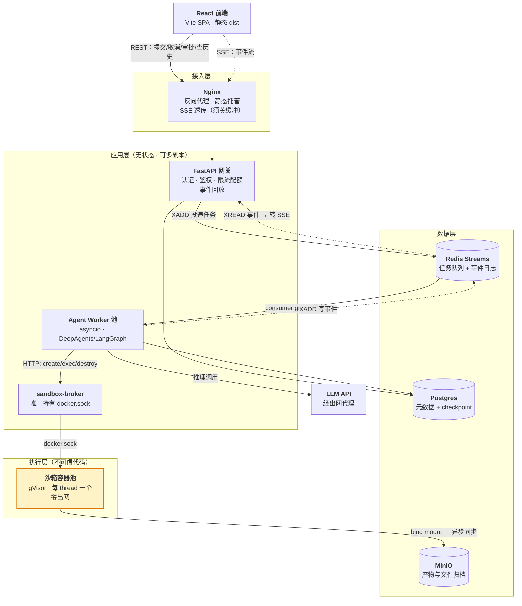
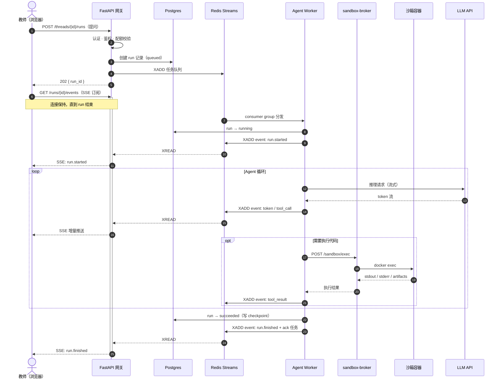
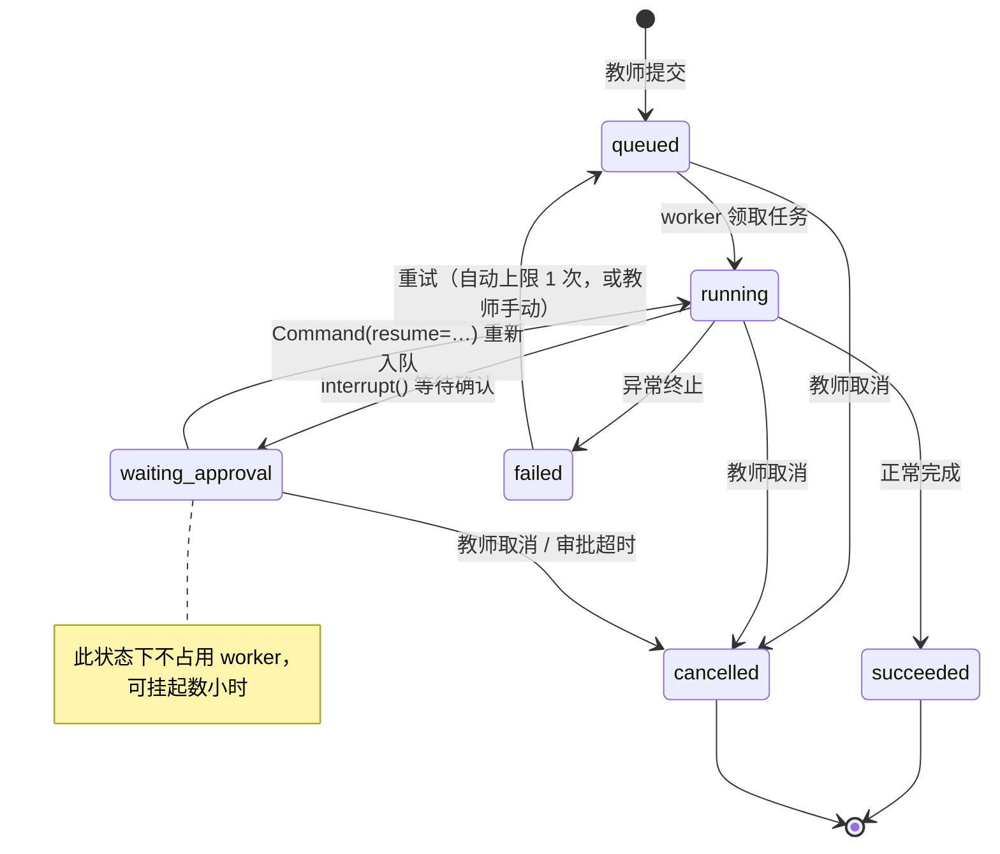
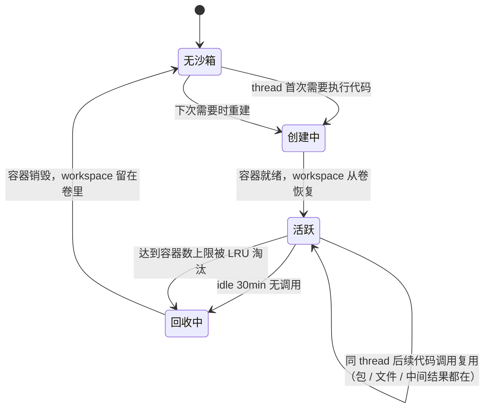
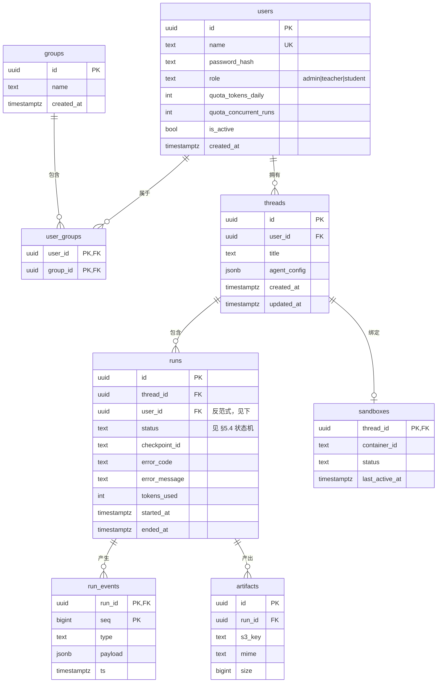

# 金融学院智能体平台 — 总体架构设计

| 项 | 值 |
|---|---|
| 文档状态 | **草稿**（§1–§7 已定稿，§8 部分待补） |
| 当前版本 | v0.9 |
| 作者 | hxy |
| 评审人 | 待定 |
| 批准人 | 待定 |

### 版本历史

| 版本 | 日期 | 修改人 | 说明 |
|---|---|---|---|
| v0.1 | 2026-07-29 | hxy | 初稿。按技术问题域组织（沙箱 / 中断恢复 / 并发 / 选型） |
| v0.2 | 2026-07-31 | hxy | 重构为标准架构文档结构；架构决策拆分至 [`adr/`](./adr/)；补齐空缺章节占位；图改用 Mermaid |
| v0.3 | 2026-07-31 | hxy | 回填外部确认结论（合规 / 出网 / 服务器规格 / 人力），**§10.1 三项阻塞全部解除** |
| v0.4 | 2026-07-31 | hxy | 定案账号体系、三角色 RBAC、Cookie 认证、TLS 方案、沙箱排队与上限 |
| v0.5 | 2026-07-31 | hxy | 补齐前后端契约：数据模型 ER 图、REST API、事件契约、重试策略 |
| v0.6 | 2026-07-31 | hxy | 依据 DeepAgents HITL 文档定案中断机制与 `interrupt` payload |
| v0.7 | 2026-07-31 | hxy | 依据 LangGraph 文档确认重放边界，定案工具幂等键 |
| v0.8 | 2026-07-31 | hxy | 新增磁盘与 tmpfs 配额，§7 全章完成 |
| v0.9 | 2026-07-31 | hxy | **结构整理**：选型论证下沉至 [`adr/`](./adr/)（新增 ADR-0010–0015），主文档只保留契约与现状，净减约 90 行；小节重编号 §7.2.x |

> **本文档的分工**：主文档回答**「系统是什么样」** —— 结构、契约、参数、现状。**「为什么这样选、否掉了什么」**在 [`adr/`](./adr/)，本文只在相应位置给出链接。
>
> **TODO 约定**：形如 `> **TODO** ｜ 待回答：……` 的引用块表示该节骨架已就位但内容未定，并写明要回答什么问题、被什么阻塞。可用 `grep -n "TODO"` 检索剩余缺口。

---

## 目录与阅读指引

不同角色只需要读对应章节，不必通读：

| 你是 | 建议阅读 | 想知道的问题 |
|---|---|---|
| 学院 / 项目负责人 | §1、§2、§10、§11 | 这东西解决什么问题？要花多少资源？有什么风险？什么时候能用？ |
| 架构 / 技术负责人 | 全文，重点 §3、§4、§7 | 为什么这样设计？边界在哪？哪里会先撑不住？ |
| 开发者 | §4、§5、§6、[`adr/`](./adr/) | 模块怎么划分？数据怎么流？我的模块和谁通信？ |
| 运维 | §4.4、§8 | 怎么部署？怎么监控？出事怎么恢复？ |

| 章节 | 内容 | 完成度 |
|---|---|---|
| §1 引言与背景 | 目标、范围、名词表 | **已完成** |
| §2 约束与前提 | 技术方向、规模、合规 | **已完成** |
| §3 架构驱动因素 | 质量属性优先级、核心权衡 | **已完成** |
| §4 系统总体视图 | 逻辑架构、模块、技术栈、部署 | **已完成** |
| §5 核心流程与交互 | 时序、事件流、审批、沙箱生命周期 | **已完成**（Agent 层事件 payload 待 P0 回填） |
| §6 数据架构 | 存储选型、数据模型、隔离与配额 | **已完成**（配额数值待 P0 回填） |
| §7 安全设计 | 威胁模型、认证、沙箱隔离 | **已完成**（仅余审计日志待定） |
| §8 运行与运维 | 容量、可用性、可观测性、发布 | 部分 |
| §9 架构决策记录 | 索引（15 条），正文见 [`adr/`](./adr/) | **已完成** |
| §10 风险与未决事项 | 阻塞项、风险登记、技术债 | **已完成** |
| §11 落地路线 | P0–P4 分期与验证标准 | **已完成** |

---

## 1. 引言与背景

### 1.1 项目背景与目标

搭建面向金融学院教师的多用户智能体平台，核心能力是**与 AI 智能体对话，由智能体编写并运行代码来完成分析任务**。

教师提出一个分析问题（例如「把这份持仓 CSV 按行业分组，算出各组的年化波动率并画图」），智能体自行编写 Python、在隔离沙箱中执行、返回结果与图表。教师不需要会写代码。

这决定了平台的两个基本性质，它们贯穿全文：

1. **任务是长的。** 一次分析可能跑几分钟到几十分钟，中途要多轮调用 LLM、多次执行代码。不能用 HTTP 请求-响应模型承载。
2. **要执行不可信代码。** 代码由 LLM 生成，无法事前审查。沙箱隔离不是可选项。

**本期目标（2026-07-31 确认）：先把端到端链路跑通，不设量化业务指标。**

即：教师能提问 → agent 能写出 Python → 在沙箱中执行 → 返回结果与图表。这同时就是 §11 中 P0 的验收口径。

这个定位有两个后续章节反复依赖的后果：

- §3.1 的质量属性**不设数字化 SLA**（可用率、延迟、RPO/RTO 均不承诺），只保留定性排序用于指导决策；
- §11 的分期不受交付日期倒逼，因此 P1 的沙箱加固**没有理由被压缩或跳过**。

量化目标待平台真实投用、积累一段使用数据后再回填。

### 1.2 范围

**本文档覆盖**：后端服务架构、Agent 执行与沙箱、数据存储、安全隔离、部署与运维。

**本文档不覆盖**（见各自文档）：

- 前端技术选型与实现 → [前端技术选型](./02Frontend%20Technology%20Selection.md.md)
- 视觉与交互规范 → [设计风格文档 DSD](../02visual/01-DSD.md)
- 智能体的提示词工程、工具集设计、评测方案 → **尚无文档，见 §10.3**

**本期明确不做**（已评估，非遗漏，见[附录 B](#附录-b已评估但本期不采用)）：用户自定义系统提示词、自定义 skill、MCP 接入。这些是确定的后续方向，但本期不实现，以免推高复杂度。§7.2 会先把角色与共享边界定下来，使将来加入时不必推翻数据模型。

### 1.3 名词与缩略语

阅读本文档需要的术语。带 ★ 的是本平台的核心概念，理解错会读不懂后续章节。

| 术语 | 含义 |
|---|---|
| **Agent（智能体）** | 能自主决定「下一步做什么」的 LLM 程序：思考 → 调用工具 → 看结果 → 再思考，循环至任务完成 |
| **DeepAgents** ★ | 本平台采用的智能体框架，构建于 LangGraph 之上。提供子 agent 嵌套、todo 规划、虚拟文件系统等能力 |
| **LangGraph** | 把 Agent 的执行过程建模成状态图的框架。DeepAgents 的底座 |
| **Checkpointer** ★ | LangGraph 的状态持久化机制。每执行完一步就把状态存盘，崩溃后可从断点续跑而非重头开始 |
| **Thread（会话）** ★ | 一次持续的对话上下文。教师与智能体的一轮多次往返属于同一 thread，共享文件与已装的包 |
| **Run（执行）** ★ | thread 内的一次具体执行。教师发一条消息触发一个 run；一个 thread 含多个 run |
| **HITL** | Human-In-The-Loop，人工介入。智能体执行敏感操作前暂停、等教师点确认后再继续 |
| **沙箱（Sandbox）** ★ | 运行 LLM 生成代码的隔离容器。逃逸即等于宿主机失守，故为安全设计的核心 |
| **gVisor / runsc** | Google 的容器沙箱运行时。在容器与宿主机内核之间插一层用户态内核拦截系统调用 |
| **SSE** | Server-Sent Events。基于 HTTP 的服务端单向推流协议，自带断线重连 |
| **Redis Streams** | Redis 的持久化消息日志结构。与 Pub/Sub 的关键区别是**消息会留存**，可回溯重放 |
| **Consumer Group** | Redis Streams 的消费组机制。多个 worker 分摊消息，支持 ack 确认与超时重投 |
| **XADD / XREAD** | Redis Streams 的写入 / 读取命令 |
| **MinIO** | 兼容 S3 协议的自建对象存储。本平台用于存放分析产物与文件归档 |
| **RBAC** | 基于角色的访问控制 |
| **ADR** | Architecture Decision Record，架构决策记录。见 [`adr/`](./adr/) |
| **Rate Limit** | 速率限制。此处特指 LLM 服务商对调用频次 / token 用量的限制 |

---

## 2. 约束与前提

### 2.1 已确定的技术方向

以下为立项时已定、本文档不再论证的前提：

| 项 | 取值 |
|---|---|
| 前端 | React |
| 后端接口层 | FastAPI |
| 智能体框架 | DeepAgents，要求支持异步并发 |
| 架构范式 | 事件驱动的异步 Agent 架构，支持长任务与中断恢复 |

### 2.2 规模与部署约束

三个前提决定了下游大量选型，是全文最重要的约束：

| 前提 | 取值 | 影响 |
|---|---|---|
| **规模** | 一个学院的教师 + 其课题组研究生，合计约一两百人（§7.2.1） | 单机部署即可，不上 K8s / 队列分片（[ADR-0001](./adr/0001-single-host-compose.md)） |
| **部署环境** | 学院 / 学校内网服务器 | 自建 Postgres / Redis / MinIO；LLM 出网通路已确认可用（§10.1） |
| **代码执行** | 需要，agent 要能写并运行分析代码 | **必须自建沙箱**，这是架构中最重的一块（§7.3） |

由此可推出的量级判断：**同时在跑的 agent 任务大概率是个位数到几十**。这个数字是 §8.1 容量规划与 §3.2 全部权衡的依据。

**`student` 角色仅限课题组内的研究生，不面向全院学生开放。** 按每位教师带数名研究生估算，总数约一两百人，与原量级相同，因此引入学生角色**不改变任何架构结论**。

> **这是一条需要守住的边界。** 若放开到全院学生（可能上千人），§3.2 的权衡、§8.1 的 20 个沙箱上限、[ADR-0001](./adr/0001-single-host-compose.md) 的单机结论**都必须重新评估**，且成本会由学生侧主导（§6.4）。已登记入 §10.2 与[附录 B](#附录-b已评估但本期不采用)。

### 2.3 资源与时间约束

| 项 | 取值 |
|---|---|
| 开发人力 | 单人 + AI 辅助开发 |
| 时间窗口 | 充裕，无外部交付截止日 |
| 服务器 | 已确认可用，无采购周期（规格见 §4.4） |

**对架构的影响**：没有工期压力，因此 §11 中 P1 的沙箱加固不存在「为赶进度而砍掉」的理由 —— §3.2 权衡二（先验证效果再加固）是为了**降低返工风险**，而不是为了赶工。

**需要警惕的反向风险**：人力集中在单人 + AI，意味着**架构决策没有第二个人复核**。§9 的 ADR 因此不只是记录，而是唯一的自我审查手段 —— 决策变更时必须同步更新，否则文档与实现脱节时没人会发现。已登记入 §10.2。

### 2.4 合规与数据约束

确认结论（2026-07-31）：

| 项 | 结论 |
|---|---|
| 教师上传数据是否含个人信息 / 未公开研究数据 / 涉密内容 | **不含** |
| 是否受等保 / 数据出境要求约束 | **不受** |
| 数据能否离开内网送往公有云 LLM | **可以** |

技术通路是另一件独立的事，也已确认：内网可访问 `api.deepseek.com`（§10.1）。**合规准许与网络可达两者都成立**，[ADR-0009](./adr/0009-default-model-selection.md) 的公有云模型方案再无前置条件。

由此撤销的设计要求（原本因合规未定而留白）：发往 LLM 的数据**不需要**脱敏、MinIO / Postgres **不需要**静态加密（见 §7.4）；§6.5 的保留期由运维成本决定，不再由合规期限驱动。

---

## 3. 架构驱动因素与质量属性

### 3.1 质量属性优先级

架构决策的根源。本平台的排序与典型互联网系统**显著不同** —— 用户是可信的校内实名师生、量级只有几十并发，因此高可用与高性能都不是驱动因素，而**安全隔离**与**可恢复性**是：

| 优先级 | 质量属性 | 本平台的具体要求 | 由此产生的设计 |
|---|---|---|---|
| **P0** | **安全隔离** | LLM 生成的代码在沙箱内无论怎么错、怎么失控，都不能影响宿主机与其他教师的数据 | §7.3 全章、[ADR-0002](./adr/0002-sandbox-isolation-gvisor.md)、[ADR-0004](./adr/0004-sandbox-broker-docker-sock.md) |
| **P0** | **可恢复性** | 长任务跑了 20 分钟，worker 崩了不能让教师从头再来（既浪费时间也浪费 token 成本） | §5.3、§8.2、[ADR-0008](./adr/0008-langgraph-checkpointer.md) |
| **P1** | **成本可控** | LLM 调用是真实的钱。单个用户不能把全院的额度和资源占满 | §6.4 配额、§7.5 限流 |
| **P1** | **可演进性** | 每层保持无状态或可水平扩展，撞到瓶颈时加副本即可，不需要重构 | §4.1 分层、§3.2 |
| **P2** | **可用性** | 内网教学辅助系统，可接受计划内停机维护。不追求高 SLA | §8.2，不做多活（[附录 B](#附录-b已评估但本期不采用)） |
| **P2** | **性能** | 瓶颈在 LLM 响应速度与沙箱内存，不在架构吞吐。**首字延迟**比总吞吐重要得多 | §8.1、[ADR-0007](./adr/0007-sse-over-websocket.md) |

> **本期不设量化 SLA。** 依据 §1.1 —— 目标是端到端跑通，学院侧未提出可用率、延迟或 RPO/RTO 的预期，凭空拍数只会得到一个没人对其负责的数字。上表的**定性排序仍然有效，且是全文的决策依据**，缺的只是数字。
>
> 一个具体后果：§8.2 中「Postgres 是否需要主从」**无法再用指标论证**，只能按故障代价判断。回填时机是平台真实投用后，用实际观测值反向定义。

### 3.2 核心权衡

**权衡一：架构按事件驱动设计，但不提前上分布式。**

这是全文最核心的一条。二者看似矛盾，实则针对不同问题：

- **必须事件驱动** —— 因为任务长（§1.1）。长任务不能走 HTTP 请求-响应，必须异步提交 + 事件订阅。这与规模无关，一个用户也得这么做。
- **不必分布式** —— 因为规模小（§2.2）。不上 K8s、不做队列分片、不引入服务网格。单机 Docker Compose + 一个 Postgres + 一个 Redis 足够。

在几十并发的量级下，真正的瓶颈是 **LLM API 的 rate limit、token 成本、以及沙箱容器占用的宿主机内存**，都不是架构吞吐。为吞吐做的分布式投入拿不到回报。

**权衡二：先验证效果，再做加固。**

P0 刻意使用裸 Docker 沙箱（不加固）跑通全流程，把加固推到 P1。理由与风险详见 §11。

**权衡三：一致性上选择「最终一致 + 至少一次投递」。**

任务队列采用至少一次投递（at-least-once），这意味着**极端情况下同一个 run 可能被投递两次**。之所以可以接受，是因为真正的状态在 LangGraph checkpointer 里，重复投递会从同一个 checkpoint 继续。

**重放边界**（依据 LangGraph 文档确认）：checkpoint 写在超步边界，但每个节点执行完其输出即写入 `checkpoint_writes`（pending writes），官方原文 *"the successful nodes' writes are already durable and **don't need to be re-run on resume**"*。

因此**保护粒度是节点而非超步** —— 「已完成的步骤不重跑」成立。真正的暴露面是另外两处：

| 场景 | checkpointer 是否保护 | 频率 |
|---|---|---|
| 崩溃，工具**已完成** | ✅ pending write 已落，不重跑 | — |
| 崩溃，工具**执行到一半** | ❌ 该节点无 pending write，整节点重跑 | 低，异常路径 |
| 队列重复投递 | 同上，取决于崩溃点 | 低 |
| **HITL 审批恢复** | ❌ **整节点从头重跑** | **每次审批必然发生**（§5.3） |

**最后一行才是重点。** interrupt 恢复不是从 `interrupt()` 那一行继续，而是重跑整个节点 —— 崩溃是异常路径，而这个是**正常路径，每次审批都发生**。

**结论：必须在工具层做幂等键，不能只依赖 checkpointer。** 方案见 §5.6 与 [ADR-0014](./adr/0014-tool-idempotency-key.md)。

---

## 4. 系统总体视图

### 4.1 逻辑架构



**分层职责**

| 层 | 组成 | 职责 | 状态 |
|---|---|---|---|
| 接入层 | Nginx | TLS 终止、静态资源托管、反向代理、SSE 透传 | 无状态 |
| 应用层 | FastAPI 网关 | 面向前端的唯一入口。认证鉴权、配额校验、任务投递、事件回放转 SSE | 无状态，可多副本 |
| | Agent Worker | 消费任务、驱动 DeepAgents 执行、写事件流 | 无状态（状态在 checkpointer），可多副本 |
| | sandbox-broker | 沙箱容器的生命周期管理。**架构中唯一持有 `docker.sock` 的组件** | 有状态（容器映射表） |
| 数据层 | Postgres / Redis / MinIO | 见 §6.1 | 有状态 |
| 执行层 | 沙箱容器 | 运行 LLM 生成的代码 | **不可信**，可随时销毁重建 |

**关键边界**：应用层与执行层之间是**信任边界**。沙箱内的一切都视为敌对，跨界只允许通过 sandbox-broker 的三个受限 API。

### 4.2 三条独立通道

前端与后端之间不是一条通道，而是三条，各自解决不同问题。这是理解整个交互模型的关键：

| 通道 | 载体 | 职责 | 方向 |
|---|---|---|---|
| **控制通道** | HTTP REST | 提交任务、取消、审批、查历史 | 前端 → 后端，请求-响应 |
| **任务通道** | Redis Streams + consumer group | 分发任务，至少一次投递，ack + pending 重投 | 网关 → worker |
| **事件通道** | 每个 run 一条 Redis Stream | worker `XADD` 写入，网关 `XREAD` 转 SSE 推给前端 | 后端 → 前端，单向流 |

事件通道的持久化设计（为什么不用 Pub/Sub）见 §5.2 与 [ADR-0006](./adr/0006-event-channel-streams-not-pubsub.md)。

### 4.3 技术栈全景

| 层 | 选择 | 说明 |
|---|---|---|
| 前端 | React + Vite + TypeScript | 详见[前端技术选型](./02Frontend%20Technology%20Selection.md.md) |
| 接入 | Nginx | 静态托管 + 反代 + SSE 透传 |
| 接口层 | FastAPI（Python） | 异步框架，与 asyncio worker 同栈 |
| 智能体 | DeepAgents / LangGraph | `async_create_deep_agent()` |
| 任务队列 | Redis Streams（自写 consumer）或 ARQ | [ADR-0005](./adr/0005-task-queue-redis-streams.md) |
| 实时推送 | SSE | [ADR-0007](./adr/0007-sse-over-websocket.md) |
| 关系库 | Postgres | 含 LangGraph `AsyncPostgresSaver` checkpoint 表 |
| 缓存 / 队列 / 事件 | Redis | |
| 对象存储 | MinIO | S3 兼容 |
| 沙箱运行时 | Docker + gVisor(runsc) | [ADR-0002](./adr/0002-sandbox-isolation-gvisor.md) |
| 包镜像 | devpi 或校内已有 pypi 镜像 | 沙箱零出网的前提下仍需装包，见 §7.3 |
| 编排 | Docker Compose | [ADR-0001](./adr/0001-single-host-compose.md) |
| LLM | deepseek-v4-pro（主）/ deepseek-v4-flush（辅） | [ADR-0009](./adr/0009-default-model-selection.md) |
| 可观测性 | OpenTelemetry | 见 §8.3，P4 落地 |

### 4.4 部署架构（内网单机）

```yaml
# docker-compose.yml 骨架
services:
  nginx:            # 反向代理 + 静态托管，SSE 配置见 §8.4
  api:              # FastAPI 网关 × 2
  worker:           # Agent Worker × 2~4
  sandbox-broker:   # 唯一持有 docker.sock 的服务
  postgres:         # 元数据 + LangGraph checkpoint
  redis:            # 任务队列 + 事件流
  minio:            # 产物与文件归档
  pypi-mirror:      # devpi，供沙箱装包（也可指向校内已有镜像）
```

沙箱容器**不在 compose 中声明** —— 它们由 sandbox-broker 在运行时动态创建与销毁，生命周期见 §5.5。

**服务器规格（2026-07-31 确认）**

| 项 | 取值 | 对架构的影响 |
|---|---|---|
| CPU | 32 核 | 沙箱按 `--cpus=1` 限制，CPU 与内存**同时**构成并发上限 |
| 内存 | 64 GB | 沙箱并发上限的主约束 |
| 磁盘 | 充裕，不作为容量约束 | 但**不等于沙箱可以随便写** —— 每 thread 限 5GB，见 §7.3.5 |
| 网络位置 | 校园内网，可出网访问 `api.deepseek.com` | worker 直连模型 API，无需代理审批 |
| 访问方式 | 内网全员可达，直接用**内网 IP** 访问，无域名 | 无法签受信证书 → 走 HTTP，见下 |

**容量推算**（§8.1 的输入）：

```
64 GB 总内存
 − 约 14 GB 基础服务（Postgres 4 / Redis 2 / MinIO 2 / worker 4 / api+nginx+broker+devpi 2）
 − 约  2 GB 宿主机 OS
 = 约 48 GB 可分配给沙箱
 ÷    2 GB 单沙箱内存上限（§7.3.2，含 /tmp tmpfs 的 512MB）
 = 24 个沙箱

CPU 侧：24 沙箱 × 1 核 = 24 核，余 8 核给基础服务 —— 与内存侧结论吻合，两边同时到顶。
```

**SandboxManager 的容器数上限配置为 20**（2026-07-31 确认），而不是算出的 24。留这 4 个余量是为了避免内存吃满时 OOM killer 误杀 Postgres —— 按 §8.2，Postgres 一旦被杀是全局不可用且中断任务无法恢复，代价远高于少 4 个并发沙箱。

> **上表规格是当前值，不是硬约束。** 真实上线后可扩充与调整，届时按同一公式重算沙箱上限即可 —— 该值应做成**配置项而非硬编码**，这是本节对实现的唯一强要求。

**TLS：走 HTTP，不启用。** 无域名签不了受信证书，自签的体验代价大于内网明文的风险。论证与重估条件见 [ADR-0012](./adr/0012-plain-http-intranet.md)。

直接后果：Session Cookie 无法设 `Secure`，凭据在内网链路明文。按 §7.1 威胁模型接受，但**不是零成本**，记入 §10.2。

---

## 5. 核心流程与交互

### 5.1 主流程：提交一次分析任务



要点：

- **提交立即返回 202**，不等执行完成。任务长度决定了不可能同步返回。
- **订阅是独立请求**，与提交解耦。这样刷新页面后可以重新订阅同一个 run。
- **worker 全程只写 Redis 与 Postgres，不直连前端**。网关是前端的唯一出口，鉴权得以集中。

### 5.2 事件流与断线重放

**核心设计：事件流必须持久化，不能用 Redis Pub/Sub。**

Pub/Sub 不持久 —— 教师刷新页面或网络抖动，中间过程就**永久丢失**了。对一个跑几十分钟的任务，这不可接受。

改用 Stream 做 per-run 的事件日志：

```
worker ──XADD──▶ stream:run:{run_id} ──XREAD──▶ 网关 ──SSE──▶ 前端
                        │
                        │ 异步归档
                        ▼
                  Postgres run_events
```

前端 SSE 天然携带 `Last-Event-ID` 请求头，断线重连时从上次的 event id 继续读，中间产生的事件全部补齐。Stream 设 `MAXLEN` 或 TTL 控制内存，同时异步归档到 Postgres 做长期存储。

> 前端侧的实现约束（原生 `EventSource` 不支持自定义 header，需改用 `@microsoft/fetch-event-source` 自行维护 `Last-Event-ID`）详见[前端技术选型 §3.3](./02Frontend%20Technology%20Selection.md.md)。

#### 事件契约

**worker 不把 DeepAgents 的事件透传给前端**，而是映射成平台自己的事件词汇再 `XADD`。消费 `astream(stream_mode=["updates","messages","custom"], subgraphs=True, version="v2")`。

选型论证（为什么要防腐层、为什么 v2 而不是 v3）见 [ADR-0013](./adr/0013-event-anticorruption-layer-v2-stream.md)。以下是契约本身。

#### 事件信封

所有事件共用一个信封，**`type` 之外的字段与事件种类无关**：

```json
{
  "id": "1753948800123-0",
  "type": "token",
  "ts": 1753948800123,
  "run_id": "8f3a…",
  "path": [],
  "data": { }
}
```

| 字段 | 说明 |
|---|---|
| `id` | **直接用 Redis Stream ID**。天然单调递增，天然可做 `Last-Event-ID`，不需要另造序号 |
| `type` | 事件类型，见下方枚举 |
| `ts` | 服务端毫秒时间戳 |
| `run_id` | 冗余，便于前端在多 run 并存时路由 |
| `path` | 子 agent 归属。`[]` 为主 agent，`["research"]` 为该名字的子 agent。**由 DeepAgents 的 `ns` 映射而来，剥掉 task id 只留可读名字** |
| `data` | 按 `type` 定义 |

#### 事件类型：两层

**平台层** —— 由我们自己产生，DeepAgents 不参与，**payload 现在即可定死**：

| type | `data` | 触发时机 |
|---|---|---|
| `run.started` | `{ thread_id }` | worker 领取任务 |
| `run.finished` | `{ status: "succeeded", tokens_used }` | 正常完成 |
| `run.failed` | `{ code, message, retryable }` | 异常终止。`retryable` 由 §5.4 的错误分类决定 |
| `run.cancelled` | `{}` | 教师取消或审批超时 |
| `sandbox.queued` | `{ position }` | 沙箱排队中。**排位每次变化都推**（§8.1） |
| `sandbox.ready` | `{}` | 拿到沙箱，排队结束 |
| `error` | `{ code, message }` | 不终止 run 的非致命错误（如单次工具调用失败但 agent 会重试） |

`run.failed` 与 `error` 的区别是**是否终止 run**。前者是终态，后者是过程中的告警。

**Agent 层** —— 映射自 DeepAgents，**payload 待 P0 跑通后按实际输出定**：

| type | 来源 | payload 状态 |
|---|---|---|
| `token` | `stream_mode="messages"` 的 `AIMessageChunk` | 待定 |
| `tool_call` | `stream_mode="updates"` 的工具节点 | 待定 |
| `tool_result` | 同上 | 待定 |
| `todo.updated` | `updates` 的 todo 节点 | 待定 |
| `subagent.started` / `subagent.finished` | `ns` 深度变化 | 待定 |
| `interrupt` | 流结束后查 `aget_state()`，见 §5.3 | **已定，见下** |

`interrupt` 的 payload 现已可定死（依据见 §5.3）：

```json
{
  "type": "interrupt",
  "data": {
    "actions": [
      {
        "index": 0,
        "tool_name": "execute_python",
        "args": { "code": "..." },
        "allowed_decisions": ["approve", "reject", "edit"]
      }
    ]
  }
}
```

DeepAgents 给的是 `action_requests` 与 `review_configs` **两个平行数组**，worker 侧合并成一个数组并加 `index` —— 前端不该被迫自己对齐两个数组的下标。

#### 映射表

| DeepAgents `StreamPart` | 平台事件 |
|---|---|
| `type="messages"`, `data=(AIMessageChunk, meta)` | `token` |
| `type="updates"`, `data={<工具节点>: …}` | `tool_call` / `tool_result` |
| `type="custom"`, `data={…}`（工具内 `get_stream_writer()` 写入） | `sandbox.*` |
| `ns` 由 `()` 变深 / 变浅 | `subagent.started` / `subagent.finished` |

#### 兼容性规则

前后端各守一条，否则这个契约撑不过第一次迭代：

- **前端必须忽略未知 `type`**，不能报错。后端加新事件类型时不应要求前端同步发版
- **`data` 只增字段，不改已有字段的语义**。前端的 Zod schema 用 `.passthrough()`，不要 `.strict()`

> **注**：`interrupt` **不经过事件流检测** —— 中断会让执行暂停、流自然结束，改为在流结束后查一次图状态。机制见 §5.3。

### 5.3 中断恢复：三种不同语义

DeepAgents 构建在 LangGraph 之上：`create_deep_agent()` / `async_create_deep_agent()` 返回编译好的 LangGraph graph，并接受 `checkpointer` 参数（`async_create_deep_agent` 的区别是传 `is_async=True`，影响 SubAgentMiddleware 的工具执行与子 agent 调用方式）。

**因此中断恢复不需要自己造轮子** —— LangGraph 的 checkpointer（生产使用 `AsyncPostgresSaver`）已提供线程级的状态持久化与恢复。详见 [ADR-0008](./adr/0008-langgraph-checkpointer.md)。

但「中断恢复」实际上是三种不同语义，设计上必须分开处理：

| 类型 | 触发场景 | 机制 |
|---|---|---|
| **崩溃恢复** | worker OOM / 被 kill / 滚动发布 | 队列消息未 ack，pending 超时后重投给其他 worker；LangGraph 从最后一个 checkpoint 继续，已完成的步骤不重跑 |
| **人工介入 (HITL)** | agent 执行敏感操作前暂停等教师确认 | LangGraph `interrupt()` → 状态落盘，run 转 `waiting_approval`，worker 释放；批准后用 `Command(resume=...)` 重新入队 |
| **主动取消 / 暂停** | 教师点击「停止」 | Redis 中打 cancel flag，worker 在 step 边界检查后抛 `CancelledError`；已写入的 checkpoint 保留，可从该点恢复 |

第二种是长任务平台的核心价值：**任务可以挂起数小时等人，期间不占用任何 worker 资源**。

#### HITL 的具体机制

DeepAgents 的中断**发生在工具调用边界之前**，不是流式过程中的某个事件。这决定了检测方式：

```
astream() 正常消费  →  中断使执行暂停，流自然结束
                    →  查 aget_state() 是否有 pending interrupt
                    →  有则映射成 interrupt 事件，run → waiting_approval
```

选查状态而非查流，是因为它**两套 stream API 都成立**，不依赖「v2 的 `updates` 模式是否吐 `__interrupt__`」这个 DeepAgents 文档未确认的行为。

**中断的数据结构**（DeepAgents 侧）：

```python
Interrupt(value={
    'action_requests': [{'name': 'execute_python', 'args': {...}}],
    'review_configs':  [{'action_name': ..., 'allowed_decisions': [...]}]
})
```

**恢复**用 `Command(resume={"decisions": [...]})`，四种决策：

| 决策 | payload | 语义 |
|---|---|---|
| `approve` | `{"type": "approve"}` | 照原样执行 |
| `reject` | `{"type": "reject", "message": "..."}` | 拒绝，message 回给 agent |
| `edit` | `{"type": "edit", "edited_action": {"name": ..., "args": {...}}}` | 改参数后执行 |
| `respond` | `{"type": "respond", "message": "..."}` | 不执行，直接把人的回复作为工具结果 |

**决策数组的顺序必须与 `action_requests` 对齐** —— 这是 DeepAgents 的硬性要求。因此 §5.7 的审批接口对前端**用显式 `index` 而非依赖数组顺序**，由 worker 负责重排。让前端保证顺序是个迟早会出错的契约。

#### 恢复时整个节点从头重跑

这是 HITL 最容易被忽略的一条。官方原文：*"any code that ran before the `interrupt()` will execute again"*、*"Do not perform non-idempotent operations before `interrupt()`"*。

**崩溃是异常路径，而 interrupt 重跑是正常路径 —— 每次审批通过都会发生。** 这直接要求工具幂等，方案见 §5.6 与 [ADR-0014](./adr/0014-tool-idempotency-key.md)。

**哪些工具触发审批**由 `interrupt_on` 声明，支持 `when` 谓词做条件拦截：

```python
interrupt_on = {
    "tool_name": {"allowed_decisions": ["approve", "reject"], "when": predicate}
}
```

> **`when` 谓词必须是工具调用的纯函数。** 多个 interrupt 靠**位置索引**匹配 resume 值，官方警告：*"Do not conditionally skip interrupt calls or loop them with **non-deterministic logic**, as this breaks the index-based matching"*。
>
> 举例：「代码涉及删除文件时拦截」✅ 只看 args，是纯函数；「单次执行预估 token 超阈值时拦截」⚠️ 仅当估算只依赖 args 才安全，若掺入外部状态或时间，重放时索引会错位。

**checkpointer 是 HITL 的硬前提** —— 官方明确要求。这与 [ADR-0008](./adr/0008-langgraph-checkpointer.md) 的选择互为印证：checkpointer 不只服务崩溃恢复，也是 HITL 成立的基础。

> **TODO** ｜ 待回答：**本平台到底哪些操作需要审批？**
> §5.3 把 HITL 称为核心价值，但没界定触发范围，而 `interrupt_on` 要求逐个工具声明。
> 需要注意的张力：沙箱隔离已经很强（§7.3），代码执行本身**未必**算敏感操作；若给 `execute_python` 全量加审批，agent 每跑一段代码就要教师点一次，平台会变得没法用。
> 倾向用 `when` 谓词做**条件拦截**（如仅在代码涉及删除文件、或单次执行预估 token 超阈值时），而非按工具名全量拦截。
> 阻塞：需要 P0 跑出真实的 agent 行为模式才知道哪些操作值得拦。HITL 本就排在 P3（§11），不急于定。

### 5.4 Run 状态机



#### 重试分两层，不要混

| 层 | 对象 | 是否改 run 状态 | 机制 |
|---|---|---|---|
| **调用级** | 单次 LLM 调用、单次 broker 请求 | 否 | worker 内部指数退避重试。**这是主要手段**，绝大部分瞬时故障在这一层就消化了 |
| **run 级** | 整个 run（`failed → queued`） | 是 | 重新入队，从 checkpoint 续跑 |

#### 错误分类

| 类别 | 例子 | 调用级重试 | run 级重试 |
|---|---|---|---|
| **瞬时** | LLM 429 / 5xx、网络超时、broker 暂时不可达 | 指数退避 1s → 2s → 4s，上限 3 次 | 允许，**上限 1 次** |
| **资源** | 沙箱排队超时（§8.1） | 不适用 | 允许，**上限 1 次**，固定延迟 30s |
| **永久** | 配额耗尽、参数校验失败、agent 代码逻辑错 | 否 | **否** |
| **未知** | 未分类异常 | 否 | **否**，按永久处理 |

分类结果同时决定 §5.2 中 `run.failed` 事件的 `retryable` 字段，前端据此决定要不要显示「重试」按钮。

#### run 级自动重试上限定为 1 次

这个数字比通常的 3 次保守得多，是**故意的**：run 级重试会从 checkpoint 恢复，而崩溃若发生在工具执行途中，该节点会整个重跑（§3.2）。在 §5.6 的幂等键落地之前，每多一次自动重试就多一次副作用重复执行的机会。

超过上限转 `failed` 终态，由教师手动决定是否重试 —— 把判断交给人，比让系统盲目重试安全。

> **§5.6 的幂等键落地后可以放开这个上限**（调到 3 次比较合理）。在那之前不要调高。

#### `waiting_approval` 超时

| 项 | 取值 | 理由 |
|---|---|---|
| 超时时长 | **24 小时**，超时后转 `cancelled` | 教师可能下班后才看到，几小时太短；但也不能永久挂着 |
| 是否占用**并发 run 配额** | **不占用** | 并发配额限制的是资源占用，而 `waiting_approval` 不占 worker 也不占沙箱（§5.3）。若占用，教师忘了点确认就会把自己的配额锁死一整天 |
| 是否占用**待审批数上限** | 占用，上限 5 个 | 不占并发配额不等于可以无限堆积。这是防堆积的那道闸，与资源无关 |

这个区分是刻意的：**「占资源」和「占名额」是两回事**，用同一个配额同时管两者会让其中一个失效。

### 5.5 沙箱生命周期

Agent 会分多步执行代码（先 `pip install`，再读数据，再计算，再画图）。如果每次调用都开新容器，前一步装的包和写的文件全部丢失。因此采用 **per-thread 长驻**而非 per-call，详见 [ADR-0003](./adr/0003-sandbox-per-thread-lifecycle.md)：



**文件持久化** —— 让容器可以随时销毁重建，状态留在卷里：

```
沙箱容器 /workspace
    ↕ bind mount
宿主机 /data/sandbox/{thread_id}/
    ↕ 异步同步
MinIO tenant/{user_id}/thread/{thread_id}/
```

DeepAgents 的虚拟文件系统直接映射到这个 workspace。容器本身是无状态可抛弃的。

### 5.6 Agent 侧的工具接口

```
execute_python(code)      → {stdout, stderr, artifacts[], exit_code}
read_file(path)
write_file(path, content)
list_files(path)
```

这些工具在 worker 进程里全部是 `async`，内部通过 HTTP 调用 sandbox-broker，**worker 只是在等 IO**。这一性质是 §8.1 并发模型成立的前提。

#### 幂等性

按 §3.2 的重放分析工具会被重复调用。逐个检查后，**只有 `execute_python` 有问题**：

| 工具 | 幂等 | 说明 |
|---|---|---|
| `read_file` / `list_files` | ✅ | 纯读 |
| `write_file(path, content)` | ✅ | 全量覆盖写。**为保持幂等，不提供追加语义** |
| **`execute_python(code)`** | ❌ | 代码由 LLM 生成，不可控 —— 可能追加写、`pip install`、删文件、累加计数 |

**方案：worker 传 `tool_call_id`，broker 侧去重**，命中已执行记录则直接返回缓存结果，不进沙箱。

```
worker ──POST /sandbox/exec { tool_call_id, code } ──▶ broker
                              已执行过该 id？ ──是──▶ 返回缓存结果
                                    否 ──▶ 进沙箱执行 → 记录 → 返回
```

论证、备选与残留风险见 [ADR-0014](./adr/0014-tool-idempotency-key.md)。

> **待验证**：该方案的支点是「`tool_call_id` 在重放中稳定」，LangGraph 文档未明说。已并入 P0 探针（§11）。

### 5.7 对外接口概要

**本节只定关键路径与全局约定。** 完整的请求/响应 schema 由 FastAPI 自动生成的 OpenAPI 文档（`/docs`）为准 —— 手写字段级文档必然与代码脱节。

所有路径前缀 `/api`。**认证一律靠 §7.2.2 的 Session Cookie**，没有 `Authorization` 头。

#### 关键路径

| Method | Path | 说明 | 成功响应 |
|---|---|---|---|
| POST | `/auth/login` | 登录 | 200 + `Set-Cookie` |
| POST | `/auth/logout` | 登出，销毁 Redis session | 204 |
| GET | `/auth/me` | 当前用户（含 role 与所属组） | 200 |
| GET | `/threads` | 会话列表，分页 | 200 |
| POST | `/threads` | 新建会话 | 201 `{id}` |
| GET | `/threads/{id}` | 会话详情 | 200 |
| PATCH | `/threads/{id}` | 改标题 / `agent_config` | 200 |
| DELETE | `/threads/{id}` | 删除会话（连带沙箱销毁） | 204 |
| POST | `/threads/{id}/files` | 上传数据文件（multipart）到 workspace | 201 |
| **POST** | **`/threads/{id}/runs`** | **提交一次分析，立即返回** | **202 `{run_id}`** |
| GET | `/runs/{id}` | run 详情与当前状态 | 200 |
| **GET** | **`/runs/{id}/events`** | **SSE 事件流，见 §5.2** | **200 `text/event-stream`** |
| POST | `/runs/{id}/cancel` | 主动取消（§5.3） | 202 |
| POST | `/runs/{id}/approve` | HITL 审批回传，见下 | 202 |
| GET | `/artifacts/{id}` | 产物下载 | 302 → MinIO 预签名 URL |
| GET | `/admin/users` | 用户列表（仅 `admin`） | 200 |
| PATCH | `/admin/users/{id}` | 改角色 / 配额 / 启禁用 | 200 |
| GET | `/admin/usage` | 用量与成本聚合（§8.3） | 200 |

产物走 **302 跳预签名 URL**，不由网关代理二进制流 —— 否则大文件下载会长时间占住网关的 worker，而网关还要同时扛所有 SSE 长连接。

#### 审批接口的 payload

对应 §5.2 的 `interrupt` 事件，每个 `action` 回一个决策：

```json
{
  "decisions": [
    { "index": 0, "type": "approve" },
    { "index": 1, "type": "reject",  "message": "这段代码会删掉原始数据" },
    { "index": 2, "type": "edit",    "edited_action": { "name": "…", "args": { } } },
    { "index": 3, "type": "respond", "message": "直接用去年的口径即可" }
  ]
}
```

**用显式 `index`，不依赖数组顺序。** DeepAgents 的 `Command(resume=...)` 要求决策顺序与 `action_requests` 严格对齐（§5.3），但把这个约束透给前端是个迟早出错的契约 —— 由 worker 按 `index` 重排。缺失或重复的 `index` 一律 `VALIDATION_ERROR`。

#### 分页：游标，不用 offset

```
GET /threads?cursor=<opaque>&limit=20
→ { "items": [...], "next_cursor": "..." | null }
```

会话列表按 `updated_at DESC` 排序，而这个字段**会因为新消息而变动**。offset 分页在翻页过程中若有会话被顶到首页，就会漏掉或重复条目。游标用 `(updated_at, id)` 复合值编码，避免这个问题。

#### 统一错误结构

```json
{
  "error": {
    "code": "QUOTA_EXCEEDED",
    "message": "今日 token 配额已用尽，明日 0 点重置",
    "details": { "used": 120000, "limit": 120000 }
  }
}
```

`code` 是**稳定的机器可读枚举**，前端据此决定行为；`message` 是中文，前端可直接展示。二者职责不能混 —— 改 `message` 的措辞不应该导致前端逻辑失效。

| code | HTTP | 场景 |
|---|---|---|
| `UNAUTHENTICATED` | 401 | 未登录或 session 过期 |
| `FORBIDDEN` | 403 | 越权访问他人资源，或非 admin 调管理接口 |
| `NOT_FOUND` | 404 | 资源不存在。**越权时也返回 404 而非 403**，避免探测他人资源是否存在 |
| `VALIDATION_ERROR` | 422 | 参数校验失败 |
| `RATE_LIMITED` | 429 | 接口频率限制（§7.5） |
| `QUOTA_EXCEEDED` | 429 | token 日配额耗尽（§6.4） |
| `CONCURRENCY_LIMIT` | 429 | 并发 run 数超限（§6.4） |
| `INTERNAL` | 500 | 未分类错误 |

**三个 429 必须用 code 区分。** 它们的用户提示语和前端行为完全不同：频率限制该自动退避重试，配额耗尽该提示明天再来，并发超限该提示先等已有任务跑完。只给 HTTP 429 的话前端无法区分。

> `NOT_FOUND` 覆盖越权这一条与 §6.3 的数据层隔离配合：repository 层注入 `user_id` 过滤后，他人的资源本来就查不出来，自然落到 404 分支 —— 不需要额外写鉴权判断，这是把隔离做在数据层的一个副产品。

---

## 6. 数据架构

### 6.1 存储选型

| 组件 | 用途 | 选它的理由 |
|---|---|---|
| **Postgres** | 用户、会话、run 元数据、事件归档，以及 LangGraph checkpoint 表（`AsyncPostgresSaver` 自动建表） | checkpoint 是恢复能力的根基，必须落在有事务保证、可备份的存储上 |
| **Redis** | 任务队列、事件流、取消标志、分布式限流 | 队列与事件流都要求高频读写 + 可过期，且已因 Streams 而必需，不再引入第二个中间件 |
| **MinIO** | 沙箱 workspace 归档、分析产物（图表、Excel、报告） | 产物是二进制大对象，不适合放数据库；S3 协议便于将来迁移。路径按租户前缀隔离 |

### 6.2 数据模型草案



LangGraph 的 `checkpoints` / `checkpoint_writes` 表由 `AsyncPostgresSaver` 自建，不在此图中，也**不要手工改动**。

**Session 不落 Postgres** —— 按 §7.2.2 存在 Redis，因此没有 `sessions` 表。

#### 三个需要说明的设计选择

**1. `runs.user_id` 是有意的反范式。**

严格范式下 run 的归属应经 `threads` 推导。冗余这一列是因为两条高频路径都要按用户聚合：§6.4 的 token 配额统计、§6.3 的隔离过滤。每次都 join `threads` 不值得。代价是写入时要保证与 `threads.user_id` 一致 —— 由创建 run 的唯一入口（§5.7 的 `POST /threads/{id}/runs`）保证，不做触发器。

**2. `run_events` 不冗余 `user_id`。**

它是全库最大的表，且唯一的查询模式是「按 `run_id` 顺序重放」，已由主键 `(run_id, seq)` 覆盖。越权检查在**上一层**做：先验证 run 属于当前用户，再读事件。

**3. `agent_config` 用 JSONB，不拆列。**

它是整体读写的配置块，从不按字段查询；且 §1.2 的后续方向（自定义提示词、skill、MCP）会持续往里加字段。拆列意味着每次加功能都要迁移。

#### 索引

| 索引 | 支撑的查询 |
|---|---|
| `threads(user_id, updated_at DESC)` | 用户的会话列表（§5.7 分页） |
| `runs(thread_id, started_at DESC)` | 会话内的执行历史 |
| `runs(user_id, started_at)` | per-user token 用量统计（§6.4） |
| `runs(status) WHERE status IN ('queued','running')` | 部分索引。崩溃后扫描待恢复的 run |
| `run_events(run_id, seq)` | 主键。事件重放与 `Last-Event-ID` 续读 |
| `user_groups(group_id)` | 反查组成员（`user_id` 方向已由主键前缀覆盖） |
| `artifacts(run_id)` | 列出一次执行的产物 |
| `sandboxes(last_active_at)` | LRU 回收扫描（§5.5） |

> **TODO** ｜ 待回答：组内共享的 skill / 提示词表本期不实现（§1.2），是否要提前预留。
> 若预留，需带 `created_by`（学生与教师同权可写，来源要可追溯，§7.2.1），**不需要**审核状态字段。
> 倾向不预留 —— 现在猜它的字段，和将来照实际需求建表，成本差不多，但猜错要迁移。

### 6.3 多租户隔离

§7.2 引入课题组后，隔离不再是单一维度，而是**两级**：

| 资源 | 可见范围 | 实现 |
|---|---|---|
| 会话 thread、run、事件、产物、上传的数据文件 | **严格私有**，仅所属 `user_id` 可见 | `thread_id` 强绑 `user_id` |
| 课题组共享的 skill、智能体提示词配置 | **组内可见**。用户可属多个组，可见范围是所有所属组的**并集** | 按 `user_groups` 关联表过滤（本期不实现，见 §1.2） |

所有查询在 repository 层统一注入过滤条件（或直接启用 Postgres RLS）。

**不要指望每个接口都记得加 where 条件。** 这是多租户系统最常见的越权来源 —— 隔离必须做在数据访问层，而不是靠每个业务接口自觉。

**管理员不例外。** §7.2.1 规定管理员不可查看他人的会话内容与上传数据，因此管理员身份**不应该**在数据访问层被实现成「绕过过滤」的旁路。这条边界最容易在后期为了「方便排查问题」而被悄悄破坏，一旦破坏就很难再收回来。

### 6.4 配额

LLM 调用是真实成本。至少需要 per-user 的 **token 日配额** + **并发 run 数上限**，否则单个用户就能占满整个 worker 池和沙箱池。

**必须按角色分级**（§7.2.1 确认后新增）。`teacher` 与 `student` 在权限上完全相同，**配额是二者唯一的实质差别**，也是控制成本的唯一手段 —— 学生人数通常远多于教师，若配额相同，成本结构会由学生侧主导。

> **TODO** ｜ 待回答：具体配额数值、超额后的行为（拒绝 / 降级到小模型 / 排队）、配额重置周期。
> 阻塞：需要 P0 跑出真实的单次分析 token 消耗量才好定数。**分级机制本身要在 P3 实现，数值可以后填。**

### 6.5 数据生命周期

> **TODO** ｜ 待回答：
> - **保留期**：run_events 与 checkpoint 留多久？（checkpoint 不清理会持续膨胀，这是已知的运维隐患）
> - **workspace 本地副本的回收策略** —— §7.3.5 新增。每 thread 配额 5GB，而 workspace 在容器销毁后仍留在宿主机卷里，因此磁盘占用是「历史 thread 总数 × 最多 5GB」而非「活跃沙箱数 × 5GB」。**需要：归档到 MinIO 后删除本地副本，下次需要时拉回。** 这是本节唯一有硬约束的一条，不做会撞墙
> - **归档**：历史会话是否降冷、导出？
> - **清理**：教师离职 / 毕业后的数据处置？
> - **备份**：Postgres 备份频率与保留份数，见 §8.5
>
> §2.4 的合规结论已解除本节的合规依赖，剩下的纯粹由运维成本驱动。

---

## 7. 安全性设计

### 7.1 威胁模型

明确「防谁」，否则安全设计会失焦：

| 威胁 | 可能性 | 后果 | 本设计的应对 |
|---|---|---|---|
| **LLM 生成的代码失控**（死循环、fork 炸弹、写满磁盘、误删文件） | **高** —— 这是常态，不是攻击 | 宿主机资源耗尽，影响全体用户 | §7.3.2 资源限制 + 超时、§7.3.5 磁盘与 tmpfs 配额 |
| **沙箱逃逸**（代码利用内核漏洞突破容器） | 中 | 宿主机失守 | §7.3 gVisor + 加固清单 |
| **越权访问他人数据** | 中 | 教师看到别人的研究数据 | §6.3 数据层隔离 |
| **配额滥用** | 中 | LLM 费用失控 | §6.4、§7.5 |
| **外部定向攻击** | **低** —— 内网部署，用户是实名师生 | — | 不作为主要驱动因素 |

**关键判断**：用户是学院的实名师生而非匿名公网用户，威胁模型主要是**「agent 生成的代码写错了或失控」**，而不是定向攻击。这一判断直接支撑了 [ADR-0002](./adr/0002-sandbox-isolation-gvisor.md) 中「gVisor 足够、不需要 Firecracker」的结论。

> §7.2.1 引入 `student` 角色后这一判断**基本不变** —— 学生同样是校内实名用户。但需注意学生的**主动探测意愿**通常高于教师（好奇心驱动的沙箱逃逸尝试），这提高了 §11 中 P1 沙箱加固的必要性，不宜再往后拖。

### 7.2 认证与授权

**账号自建，不对接学校统一身份认证。** 论证见 [ADR-0010](./adr/0010-self-hosted-accounts-rbac.md)。

#### 7.2.1 角色与课题组

| 角色 | 会话与数据 | 课题组共享资源 | 管理能力 |
|---|---|---|---|
| **管理员 `admin`** | 仅自己的 | — | 创建 / 禁用账号、管理课题组与成员、查看与调整任意用户配额、查看全局用量与审计日志 |
| **教师 `teacher`** | 仅自己的 | 所属组**可读可写** | — |
| **学生 `student`** | 仅自己的 | 所属组**可读可写**，与教师同权 | — |

- **管理员不能查看他人的会话内容与上传数据。** 这条边界落在数据访问层，见 §6.3
- **一个用户可同属多个课题组**，可见性走**并集**（`user_groups` 关联表，§6.2）
- **不引入组内角色**（组长 / 成员），读写权限只由全局 `role` 决定
- 组内共享**仅限配置类资源**（skill、智能体提示词）；**不共享**会话、数据文件、产物
- `teacher` 与 `student` 权限完全相同，**区别只在配额档位**（§6.4）

> 组内共享的 skill、自定义系统提示词、MCP 接入**本期均不实现**（§1.2）。此处先定角色模型与共享边界，是为了让 §6.2 的表结构将来不必推倒重来。

#### 7.2.2 认证方式

**HttpOnly Cookie + 服务端 Session（存 Redis）。不用 OAuth2，不用 JWT。** 论证见 [ADR-0011](./adr/0011-cookie-session-not-oauth2.md)。

| 项 | 取值 |
|---|---|
| 凭据载体 | HttpOnly + `SameSite=Lax` Cookie |
| Session 存储 | Redis |
| 有效期 | 7 天滑动过期 |
| 多端登录 | 允许并存 |

**两个实现上的坑**：

1. **SSE 的凭据携带** —— `@microsoft/fetch-event-source`（§5.2）默认**不带**凭据，须配置 `credentials: 'include'`，否则 SSE 请求 401
2. **Cookie 无 `Secure` 标志** —— §4.4 走 HTTP，凭据在内网链路明文。已按 §7.1 接受，记入 §10.2

### 7.3 沙箱隔离（核心）

Agent 要写并运行分析代码，内网部署又意味着数据不能交给外部托管的 code execution 服务，因此必须自建沙箱。这是整个架构中最重的一块。

#### 7.3.1 隔离方案

采用 **Docker + gVisor (runsc)**。选型论证（含 Firecracker 的对比与放弃理由）见 [ADR-0002](./adr/0002-sandbox-isolation-gvisor.md)。

#### 7.3.2 安全加固清单

逐条落到容器创建参数：

```
--runtime=runsc                  # gVisor
--network=none                   # 或自定义 bridge + iptables 白名单（见 7.3.3）
--read-only                      # rootfs 只读
--tmpfs /tmp:rw,noexec,nosuid,size=512m   # /tmp 必须限容，见 7.3.5
--cap-drop=ALL
--user=1000:1000                 # 非 root
--memory=2g --cpus=1
--pids-limit=128
--security-opt=no-new-privileges
+ /workspace 磁盘配额 5GB（XFS project quota，见 7.3.5）
+ 单次执行 wall-clock 超时（如 120s）
+ stdout/stderr 输出大小上限（防止把网关 OOM）
```

#### 7.3.3 已知陷阱

**陷阱一：`--network=none` 会让 `pip install` 全部失败。**

Agent 一定会想装包。必须给沙箱配一个内网 pypi 镜像（清华 / 阿里源，或自建 devpi），网络策略从 `none` 改成「只允许访问镜像源 + 内网数据源」的白名单 bridge。

**陷阱二：不要把 `docker.sock` 挂进 worker 容器。**

那等于给 worker 宿主机 root 权限，worker 一旦被 agent 生成的代码影响就全线失守。改成一个独立的 **sandbox-broker** 服务持有 `docker.sock`，只暴露 `create / exec / destroy` 三个内部 API，worker 通过它间接操作。详见 [ADR-0004](./adr/0004-sandbox-broker-docker-sock.md)。

#### 7.3.4 沙箱的网络策略

沙箱**不需要访问公网**。模型调用发生在 worker 侧，不经过沙箱。沙箱的出站访问仅限：

- 内网 pypi 镜像（装包）
- 内网数据源（若有）

这条策略与 §10.1 的出网通路是**两件独立的事** —— worker 需要出网，沙箱不需要。

#### 7.3.5 磁盘与 tmpfs 配额

堵的是 §7.1 威胁表里「写满磁盘」那一格 —— 加固清单最后一个缺口。选型论证见 [ADR-0015](./adr/0015-sandbox-disk-quota-xfs.md)。

| 目标 | 限额 | 机制 |
|---|---|---|
| `/workspace` | **5 GB / thread** | XFS project quota（`projid` 映射由 broker 维护） |
| `/tmp` | **512 MB** | tmpfs `size=`，计入单沙箱 2GB 内存预算**之内** |

```bash
# 前提：承载 /data/sandbox 的文件系统以 XFS + prjquota 挂载（部署前提，见 §8.5）
xfs_quota -x -c "project -s -p /data/sandbox/{thread_id} {projid}" /data
xfs_quota -x -c "limit -p bhard=5g {projid}" /data
```

**`/tmp` 限容比磁盘配额更急**：`--read-only` 使 `/tmp` 只能挂 tmpfs，而 tmpfs 吃的是**宿主机内存**。不限容则一句 `dd` 就能写满内存触发 OOM killer —— 而 §4.4 特意留的 4 个沙箱余量防的正是 OOM killer 误杀 Postgres。

**配额不等于总量有界。** 按 §5.5，容器销毁后 workspace 仍留在卷里，故总占用是「历史 thread 数 × 最多 5GB」而非「活跃沙箱数 × 5GB」，worst case 是 TB 级。§4.4 的「磁盘充裕」**不解除这个问题**，扩容只是推迟撞墙 —— 真正的解法是 §6.5 的归档回收。

> **实现提醒**：rootfs 只读使 `pip` 装的包落在 workspace 里，而科学计算栈就要 1–2 GB。建议**把常用栈预装进沙箱镜像**，否则 5GB 里小一半被基础包吃掉，且每个 thread 都要重装一遍。

### 7.4 数据安全

§2.4 的合规结论（不含敏感数据、不受等保约束、允许出网）**大幅简化了本节** —— 原本因合规未定而必须保留的脱敏与加密要求现在都不成立：

| 项 | 结论 |
|---|---|
| 发往 LLM 的数据脱敏 | **不需要**。§2.4 已确认教师数据可送公有云 |
| MinIO / Postgres 静态加密 | **不需要**。无涉密内容，落盘加密的收益不抵运维复杂度 |
| 服务间 mTLS（网关 ↔ worker ↔ broker） | **不需要**。全部在 Docker Compose 内部网络，不暴露到宿主机外 |
| 传输加密（浏览器 ↔ Nginx） | **不启用**，走 HTTP。理由与代价见 §4.4 |

> **TODO** ｜ 待回答：审计日志。哪些操作需要留痕（登录、管理员改配额、管理员禁用账号、数据导出）？留多久？
> 注意这一条**没有**被合规结论解除 —— 它的驱动因素不是合规，而是 §7.2.1 中管理员权限较大，需要可追溯。

### 7.5 限流与防滥用

- **配额层**：per-user token 日配额 + 并发 run 上限（§6.4）
- **接口层**：网关侧的请求频率限制，用 Redis 实现分布式计数
- **沙箱层**：容器数上限 + 单容器资源上限（§7.3.2、§8.1）

> **TODO** ｜ 待回答：具体限流阈值与算法（令牌桶 / 滑动窗口），以及触发限流后返回给前端的提示语。

---

## 8. 运行与运维

### 8.1 并发模型与容量

Agent run 是 **IO 密集**的 —— 绝大部分时间在等 LLM 返回。

因为所有 CPU 密集的计算（pandas / numpy / statsmodels）都跑在沙箱容器里，worker 只负责发起调用和等待结果，**worker 侧是纯 IO，不会阻塞 event loop**。这是引入沙箱带来的一个额外收益：worker 不需要 `ProcessPoolExecutor`，一个 asyncio 进程可以轻松管理几十个并发 run。

因此容量约束不在 worker，而在**沙箱容器数**：

```
最大并发活跃 thread 数 ≈ 宿主机可用内存 / 单沙箱内存上限(2GB)
```

按 §4.4 已确认的 **32 核 / 64 GB** 实算（推算过程见 §4.4）：**理论上限约 24 个沙箱，建议配置为 20**。CPU 侧与内存侧结论吻合，两边同时到顶，没有一边先成为瓶颈。

对「同时在跑个位数到几十」的量级（§2.2）够用，但**余量不算宽裕**。若实际活跃度高于预期，处置顺序是：先把单沙箱内存上限从 2GB 降到 1GB → 再扩服务器内存（§4.4 已确认可扩）→ 最后才考虑多机。

> 这一结论依赖 §2.2 中「学生 = 课题组研究生」的口径。若将来放开到全院学生，需重新评估。

**SandboxManager 需要实现**：容器数上限、LRU 回收、超限时排队等待、健康检查。

#### 沙箱排队（2026-07-31 确认：排队，不直接拒绝）

沙箱数达到上限时，新的沙箱创建请求**进入队列等待**，而不是返回失败。设计如下：

| 项 | 取值 | 理由 |
|---|---|---|
| 排队位置 | sandbox-broker 内部，FIFO | broker 是唯一知道容器总数的组件（§4.1），队列放在别处都要同步状态 |
| worker 侧行为 | `create` 调用异步挂起等待，不轮询 | worker 本就是纯 IO 等待模型（§5.6），多等一个 IO 不改变并发模型 |
| 前端反馈 | 事件流推 `sandbox.queued`，带当前排位 | 教师能看到「前面还有 N 个」，而不是界面卡住不动 |
| 等待上限 | 建议 10 分钟，超时则 run → `failed` | 无限等待会让 run 永远挂着，且占着配额 |
| 公平性 | 靠 §6.4 的 per-user 并发 run 上限保证 | 队列本身不做按用户加权 —— 单用户占满队列的问题应该在入口（配额）解决，而不是在队列里做复杂调度 |

**run 状态机不新增状态。** 「等沙箱」期间 run 仍是 `running`，只通过事件表达子状态。理由：这是个短暂的进程内状态，不值得持久化到 `runs` 表；且 worker 崩溃恢复后会从 checkpoint 重新请求沙箱、重新排队，本来就不需要恢复排队位置。

**`sandbox.queued` 在排位每次变化时推送**（2026-07-31 确认），而非只推一次。队列长度最多 20 量级（§4.4），事件量可忽略，换来的是教师能看到队伍在动而不是一个静止的数字。该事件的 payload schema 归入 §5.2 的事件契约一并定义。

### 8.2 可用性与故障恢复

单机部署，不做多活（理由见[附录 B](#附录-b已评估但本期不采用)）。可用性依靠**快速恢复**而非**冗余**：

| 故障 | 影响 | 恢复方式 |
|---|---|---|
| worker 崩溃 | 该 worker 上的 run 中断 | 任务未 ack，pending 超时后重投；从 checkpoint 续跑（§5.3） |
| 网关崩溃 | SSE 连接断开 | 多副本 + 前端自动重连 + `Last-Event-ID` 补齐（§5.2） |
| sandbox-broker 崩溃 | 无法创建 / 执行沙箱 | 重启后需重建容器映射表；已有容器可依 label 恢复认领 |
| 沙箱容器崩溃 | 单个 thread 的执行失败 | 重建容器，workspace 从卷恢复（§5.5） |
| Postgres 故障 | **全局不可用**，且 checkpoint 丢失意味着中断任务无法恢复 | 无冗余。依赖备份恢复（§8.5）。**这是架构中最大的单点** |
| Redis 故障 | 任务与事件流中断 | 无冗余。重启后未 ack 任务可恢复，事件流丢失部分（已归档的除外） |

> **TODO** ｜ 待回答：Postgres 单点是否可接受？最低成本的改善是开启 WAL 归档 + 定期全备，能把 RPO 压到分钟级。是否需要做主从？
> 建议在 §3.1 的可用性指标确定后再决定，不要提前投入。

### 8.3 可观测性

> **TODO** ｜ 待回答：本节整体待设计，规划在 P4 落地（§11）。需覆盖：
> - **日志**：结构化日志格式、集中收集方案（内网单机可能不需要 ELK，`docker logs` + loki 或直接文件轮转就够）
> - **指标**：至少要有 —— 活跃 run 数、沙箱容器数与内存占用、LLM 调用延迟与失败率、**per-user token 消耗**、队列积压深度
> - **链路追踪**：OpenTelemetry。一个 run 的完整 trace 要能串起 网关 → worker → LLM → sandbox
> - **成本看板**：token 花费按用户 / 按时间聚合。这是 §3.1「成本可控」的落地手段
>
> 优先级判断：**日志与 token 计量不能等到 P4** —— 前者是排障的最低要求，后者是 §6.4 配额的前提。建议把这两项前移到 P1。

### 8.4 部署与发布

不做灰度 / 蓝绿 / 金丝雀（理由见[附录 B](#附录-b已评估但本期不采用)）。用户量小、停机窗口容易协调，直接 `docker compose up -d` 滚动重启即可 —— 前提是 §8.2 的崩溃恢复真的可靠，滚动发布本质上就是一次可控的崩溃。

**Nginx 的 SSE 配置必须修改。** 默认配置会让流式输出全部卡住直到响应结束：

```nginx
location /api/runs/ {
    proxy_buffering off;          # 关键：关闭缓冲
    proxy_cache off;
    proxy_read_timeout 3600s;     # 长任务，不能用默认 60s
    proxy_set_header Connection '';
    proxy_http_version 1.1;
}
```

> **TODO** ｜ 待回答：CI/CD 方案。内网环境下代码怎么进来、镜像怎么构建与分发（见 §8.5 第三条）、配置与密钥怎么管理（LLM API key 不能进 git）。

### 8.5 内网部署需提前落实的运维项

- **Postgres 定时备份** —— checkpoint 丢失意味着中断的任务无法恢复。这不只是数据备份，也是功能可用性的一部分
- **MinIO 磁盘容量监控** —— 产物只增不减，需配合 §6.5 的保留策略
- **镜像分发方式** —— 内网可能拉不到 Docker Hub，需要私有 registry 或离线导入。**这一条容易被漏到上线当天才发现**

---

## 9. 架构决策记录（ADR）

重要技术选型的完整论证（背景 / 决策 / 理由 / 后果 / 被放弃的备选）独立存放，本章仅作索引。

**索引与写作规范见 [`adr/README.md`](./adr/README.md)。**

| 编号 | 决策 | 状态 |
|---|---|---|
| [ADR-0001](./adr/0001-single-host-compose.md) | 单机 Docker Compose，不引入 K8s | 已接受 |
| [ADR-0002](./adr/0002-sandbox-isolation-gvisor.md) | 沙箱隔离用 Docker + gVisor，不用 Firecracker | 已接受 |
| [ADR-0003](./adr/0003-sandbox-per-thread-lifecycle.md) | 沙箱按 thread 长驻，不做 per-call | 已接受 |
| [ADR-0004](./adr/0004-sandbox-broker-docker-sock.md) | `docker.sock` 由独立 sandbox-broker 持有 | 已接受 |
| [ADR-0005](./adr/0005-task-queue-redis-streams.md) | 任务队列用 Redis Streams / ARQ，不用 Celery | 已接受 |
| [ADR-0006](./adr/0006-event-channel-streams-not-pubsub.md) | 事件通道用 Redis Streams，不用 Pub/Sub | 已接受 |
| [ADR-0007](./adr/0007-sse-over-websocket.md) | 实时推送用 SSE，不用 WebSocket | 已接受 |
| [ADR-0008](./adr/0008-langgraph-checkpointer.md) | 中断恢复复用 LangGraph Checkpointer，不自建 | 已接受 |
| [ADR-0009](./adr/0009-default-model-selection.md) | 默认模型 deepseek-v4-pro + 辅助模型下沉 | 已接受 |
| [ADR-0010](./adr/0010-self-hosted-accounts-rbac.md) | 自建账号体系与三角色 RBAC | 已接受 |
| [ADR-0011](./adr/0011-cookie-session-not-oauth2.md) | 认证用 Cookie + Redis Session，不用 OAuth2 / JWT | 已接受 |
| [ADR-0012](./adr/0012-plain-http-intranet.md) | 内网走 HTTP，不启用 TLS | 已接受 |
| [ADR-0013](./adr/0013-event-anticorruption-layer-v2-stream.md) | 事件契约做防腐层，worker 消费 v2 `astream` | 已接受 |
| [ADR-0014](./adr/0014-tool-idempotency-key.md) | 工具幂等键用 `tool_call_id`，broker 侧去重 | 已接受（支点待验证） |
| [ADR-0015](./adr/0015-sandbox-disk-quota-xfs.md) | 沙箱磁盘配额用 XFS project quota | 已接受 |

---

## 10. 风险与未决事项

### 10.1 阻塞项（2026-07-31：已全部解除）

v0.2 时登记的三项阻塞已全部确认，**当前无阻塞项**：

| 原阻塞项 | 结论 | 详见 |
|---|---|---|
| **数据合规** | 不含敏感数据、不受等保约束、允许送公有云 LLM | §2.4 |
| **出网通路** | 内网可访问 `api.deepseek.com`，worker 直连，无需代理审批 | §2.2 |
| **内网服务器配置** | 32 核 / 64 GB / 磁盘充裕 | §4.4 |

**由此解除的下游依赖**：[ADR-0009](./adr/0009-default-model-selection.md) 从「待确认」转为「已接受」；§7.4 的脱敏与加密要求整体撤销；§8.1 的容量数字从假设变为实算。

> **部署时仍需复验一次**：出网结论应在实际部署的那台服务器上用 `curl https://api.deepseek.com` 复验，而不是依赖「内网应该能通」的一般判断 —— 出网策略常按网段或主机粒度配置。成本几秒钟。

沙箱的网络策略与此**无关且不变**：沙箱保持零出网，模型调用发生在 worker 侧，不经过沙箱（§7.3.4）。

### 10.2 风险登记

| 风险 | 影响 | 应对 |
|---|---|---|
| **Postgres 单点** | 故障即全局不可用，且已中断的任务无法恢复 | §8.5 备份。§3.1 已决不设 SLA，**无法再用指标论证是否上主从**，改按故障代价判断（§8.2） |
| **P0 效果不达预期** | agent 写不出有用的分析代码，则后续所有工程投入作废 | 正是 P0 先于 P1 的原因（§11） |
| ~~磁盘配额缺口~~ | **已关闭**（2026-07-31）。`/workspace` 5GB XFS project quota + `/tmp` tmpfs 512MB | §7.3.5，P1 落地 |
| **workspace 本地副本无界增长** | 配额是 per-thread 的，而 workspace 在容器销毁后仍留在宿主机。总量 = 历史 thread 数 × 5GB，worst case 是 TB 级 | §6.5 保留策略待定。**扩容只是推迟撞墙**，必须做归档回收 |
| **单人开发，架构决策无人复核** | 错误决策可能拖到实现阶段才暴露，返工成本高 | §9 的 ADR 是唯一的自我审查手段，决策变更须同步更新（§2.3） |
| **会话凭据明文传输** | 走 HTTP（§4.4），Session Cookie 无 `Secure` 标志，同网段抓包可窃取会话 | 已按 §7.1 威胁模型接受。触发重估的条件见 §4.4 |
| **用户范围被悄悄放开到全院学生** | 基数增一个数量级，§3.2 权衡、§8.1 容量、ADR-0001 单机结论同时失效 | §2.2 已明确边界为「课题组研究生」。放开前必须重审这三处，不能当作纯运营决定 |
| **`execute_python` 重复执行** | HITL 每次审批恢复都会整节点重跑（§3.2），重复执行 LLM 生成的代码会造成数据污染 | §5.6 幂等键方案，**必须在 P3 的 HITL 之前或同期落地**。在那之前 §5.4 的 run 级自动重试上限压到 1 次 |
| **`tool_call_id` 重放稳定性未经验证** | 若不稳定，§5.6 的幂等键方案失效，需退到 worker 侧自构造确定性键 | 已并入 P0 探针（§11），验证成本几分钟 |
| ~~`interrupt` 的流式表示无文档依据~~ | **已关闭**（2026-07-31）。官方文档确认 HITL 在工具调用边界暂停而非流式事件，改为流结束后查 `aget_state()`，不依赖未文档化行为 | §5.3 已定机制与 payload |
| **HITL 的触发范围未定** | 若给 `execute_python` 全量加审批，agent 每跑一段代码就要教师点一次，平台不可用 | §5.3 TODO。倾向用 `when` 谓词做条件拦截；P0 跑出真实行为模式后再定，HITL 本就排 P3 |
| **LLM 服务商 rate limit** | 并发高峰时集中报错 | 需在 worker 侧做退避重试与降级；尚未设计 |
| **checkpoint 表膨胀** | 长期运行后 Postgres 体积失控 | §6.5 保留策略待定 |

### 10.3 技术债与文档缺口

- **智能体本身尚无设计文档** —— 提示词、工具集边界、子 agent 划分、效果评测方案全部空白。这是当前**最大的文档缺口**：本文档写的是「承载智能体的平台」，但平台的价值完全取决于智能体本身好不好用（§10.2 风险二）。建议单独立 `03agent-design.md`。
- **P0 的裸 Docker 沙箱是刻意欠下的债**，P1 必须偿还，不可带入上线（§11）。
- 文件名 `02Frontend Technology Selection.md.md` 有重复扩展名，且与 `01architecture.md` 的命名风格不一致（中英混杂、空格）。建议统一为 `02frontend-selection.md`，但会影响已有引用，**待确认后再改**。

---

## 11. 落地路线

| 阶段 | 内容 | 验证标准 |
|---|---|---|
| **P0** | FastAPI in-process 跑 DeepAgents + **裸 Docker 沙箱**（先跑通，加固后置）+ SSE 流式输出 | 教师能对话；agent 能写 Python 读 CSV、算出结果并返回图表。**另加三个探针**：① 记录 DeepAgents 实际吐出的 `StreamPart` 结构，回填 §5.2 中 Agent 层事件的 payload；② 记录一次典型分析的真实 token 消耗与 agent 行为模式，供 §6.4 定配额、§5.3 定 HITL 触发范围；③ **跑一次 `interrupt()`，比对恢复前后的 `tool_call_id` 是否一致**（§5.6 幂等键方案的支点） |
| **P1** | 沙箱加固（gVisor + 完整参数 + `/workspace` 5GB 配额 + `/tmp` 限容）+ sandbox-broker 拆分 + 生命周期管理 | 沙箱内运行 `while True` / fork 炸弹 / **写满 `/workspace`** / **写满 `/tmp`**，宿主机均不受影响 |
| **P2** | 拆分 worker：Redis Streams + Postgres checkpointer | `kill -9` worker 后，任务能从 checkpoint 恢复继续 |
| **P3** | **§5.6 工具幂等键**（HITL 的前置）+ HITL 审批 + 取消 + 多用户隔离 + 配额限流 | 审批流程走通，且**审批恢复后 `execute_python` 不重复执行**；30 并发压测不崩溃、不串数据 |
| **P4** | 可观测性（OpenTelemetry）、产物存储完善、成本看板 | 能定位单个 run 的完整 trace 与 token 花费 |

### 关于 P0 与 P1 的顺序

刻意把安全加固放在 P1 而非 P0：先用裸 Docker 快速验证「agent 能否真的写出有用的分析代码」这个最大的不确定性，再投入时间做加固。若 P0 发现效果不达预期，加固工作就是白做的。

但 **P1 不能省** —— 上线前必须完成。

同样，P0 不要跳过直接做分布式：如果 agent 本身效果不行，队列和 checkpoint 都是无用功。

> **建议前移的两项**（见 §8.3）：结构化日志与 token 计量不宜等到 P4。前者是排障的最低要求，后者是 P3 配额功能的前提。

---

## 附录 A：引用文档

| 文档 | 位置 | 关系 |
|---|---|---|
| 前端技术选型 | [`doc/01design/02Frontend Technology Selection.md.md`](./02Frontend%20Technology%20Selection.md.md) | 下游，依据本文档 §4.2、§5.2、§7.2 |
| 设计风格文档 DSD | [`doc/02visual/01-DSD.md`](../02visual/01-DSD.md) | 平行，视觉规范 |
| 视觉识别手册 | [`doc/02visual/02-visual-identity-manual.html`](../02visual/02-visual-identity-manual.html) | 平行 |
| 架构决策记录 | [`doc/01design/adr/`](./adr/) | 下游，本文档 §9 的展开 |
| 智能体设计文档 | *尚未创建* | 见 §10.3 |

## 附录 B：已评估但本期不采用

记录**主动裁剪**的方案。列在这里意味着已经评估过并决定不做，而不是遗漏 —— 附「重新评估的触发条件」，避免将来凭感觉推翻或永久遗忘。

| 方案 | 结论 | 理由 | 重新评估的触发条件 |
|---|---|---|---|
| **K8s 编排** | 不采用 | 单机 Docker Compose 足够；K8s 的运维成本远超收益 | 需要跨机部署，或应用副本数长期 >10 |
| **服务网格** | 不采用 | 只有 4 个内部服务，compose 内部网络已够 | 服务数量级增长且需要细粒度流量治理 |
| **分库分表 / 读写分离** | 不采用 | 几百用户的元数据量，单库单表毫无压力 | 单表超千万行，或读负载压垮主库 |
| **异地多活 / 同城双活** | 不采用 | 内网教学辅助系统，可接受计划内停机 | 学院提出明确 SLA 要求 |
| **灰度 / 蓝绿 / 金丝雀发布** | 不采用 | 用户量小、停机窗口易协调，滚动重启即可 | 用户量或可用性要求上升到不可停机 |
| **Celery** | 不采用 | 与 asyncio worker 正面冲突，见 [ADR-0005](./adr/0005-task-queue-redis-streams.md) | — |
| **WebSocket** | 不采用 | 95% 是服务端单向推流，见 [ADR-0007](./adr/0007-sse-over-websocket.md) | 出现高频双向交互需求 |
| **Firecracker microVM** | 不采用 | 隔离强度过剩，运维成本高，见 [ADR-0002](./adr/0002-sandbox-isolation-gvisor.md) | 平台对校外开放，或用户不再可信 |
| **外部托管 code execution 服务**（E2B / Modal 等） | 不采用 | 内网部署，教师数据不能交给外部服务 | 合规放开且转为公网部署 |
| **前端引入图表库** | 不采用 | 沙箱内 matplotlib 出图存 MinIO，前端渲染 `` 即可 | 需要可交互图表 |
| **用户自定义系统提示词 / skill / MCP 接入** | 本期不做 | 确定的后续方向，但会显著推高复杂度，与 §1.1「先跑通」的定位冲突。§7.2.1 已预留角色与共享边界 | P0–P4 跑通，且教师提出实际需求 |
| **面向全院学生开放** | 本期不做 | 用户范围限定为教师 + 其课题组研究生（§2.2）。放开会使基数增一个数量级 | 学院明确要求扩大范围 —— 届时须重审 §3.2、§8.1 与 [ADR-0001](./adr/0001-single-host-compose.md) |
| **静态加密 / 服务间 mTLS / 发往 LLM 的数据脱敏** | 不采用 | §2.4 合规结论已解除这些要求，见 §7.4 | 合规要求变化，或平台开始承载敏感数据 |

以下几项已有完整 ADR，不在此重复：**对接学校统一认证**与**课题组内角色**（[ADR-0010](./adr/0010-self-hosted-accounts-rbac.md)）、**OAuth2 / JWT**（[ADR-0011](./adr/0011-cookie-session-not-oauth2.md)）、**自签证书 HTTPS**（[ADR-0012](./adr/0012-plain-http-intranet.md)）、**透传 DeepAgents 事件 / v3 投影**（[ADR-0013](./adr/0013-event-anticorruption-layer-v2-stream.md)）、**LVM / loop 设备磁盘配额**（[ADR-0015](./adr/0015-sandbox-disk-quota-xfs.md)）。
