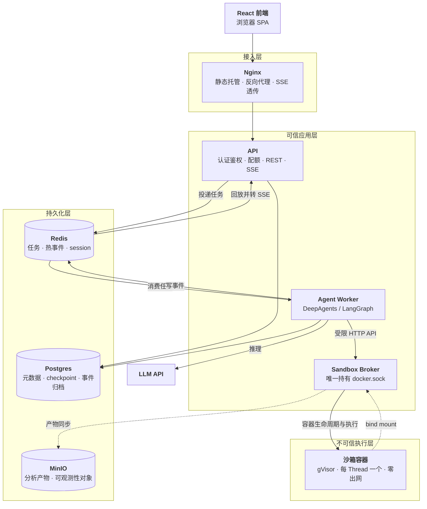
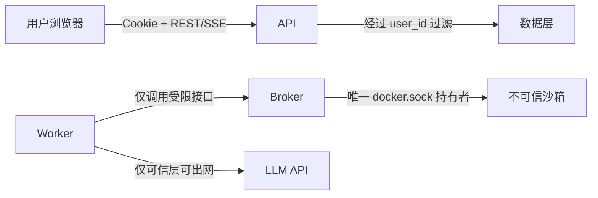
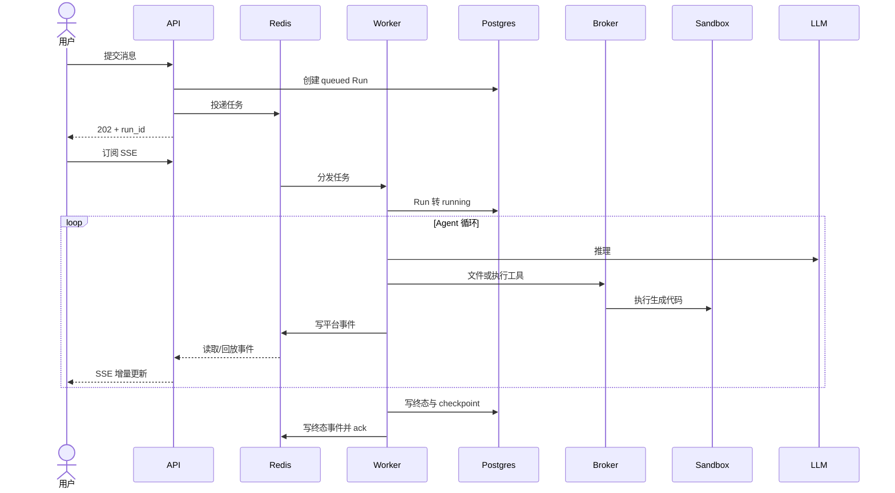
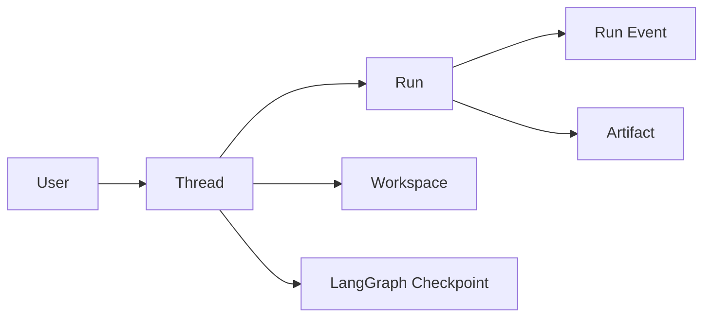

# 金融学院智能体平台 — 总体架构

| 项 | 值 |
|---|---|
| 文档状态 | 已落地，随系统演进维护 |
| 当前版本 | v1.0 |
| 更新日期 | 2026-08-10 |
| 作者 | hxy |

本文只回答三个问题：**平台解决什么问题、系统由哪些部分组成、关键边界在哪里**。运行时契约、数据模型、安全参数和运维步骤不在这里展开；选型理由与放弃的方案由 ADR 记录。

## 文档地图

| 想了解什么 | 文档 |
|---|---|
| 系统边界、模块关系、关键数据流 | 本文 |
| Run、事件、审批、重试、沙箱生命周期与 API | [运行时与接口设计](./05runtime-design.md) |
| 存储、数据模型、多租户、配额与保留期 | [数据设计](./06data-design.md) |
| 威胁模型、认证授权与沙箱隔离 | [安全设计](./07security-design.md) |
| 容量、恢复、可观测性与部署前提 | [运行与运维设计](./08operation-design.md) |
| 当前风险、技术债与待决事项 | [风险登记](./09risk-register.md) |
| Agent 工具、文件系统与上下文 | [智能体设计](./03agent-design.md) |
| 前端技术边界 | [前端技术选型](./02frontend-selection.md) |
| 外部提示词、Skill 与 MCP 的接入规范 | [第三方接入规范](./04extension-integration.md) |
| 架构选择及其理由 | [架构决策记录](./adr/) |
| 分期实施与验收结果 | [实施计划索引](../03plan/CLAUDE.md) |

> 2026-08-10 将原 1,600 余行的总体架构文档按上述职责拆分。此前版本历史保留在 Git 中；本次只改变信息组织方式，不改变已经落地的架构结论。

---

## 1. 背景与范围

### 1.1 目标

平台面向金融学院教师及其课题组研究生。用户用自然语言提出分析问题，Agent 自行编写 Python，在隔离沙箱中执行，并返回结果、图表和文件。用户不需要会写代码。

这个目标带来两个贯穿全局的架构事实：

1. **任务是长的。** 一次分析可能持续几分钟到几十分钟，不能由一次 HTTP 请求同步承载。
2. **代码是不可信的。** 代码由 LLM 生成，无法事前审查，必须与平台和其他用户的数据隔离。

P0–P4 已于 2026-08-10 全部验收通过。当前状态是“平台链路跑得住”，不等于“教师已经用得好”：前端真实交互和 Agent 效果评测仍是待完成工作，见[风险登记](./09risk-register.md)。

### 1.2 系统范围

本文覆盖后端服务、Agent 执行、沙箱、数据存储以及单机部署中的模块关系。

以下内容由专题文档负责：

- 前端实现与视觉规范；
- Agent 提示词、子 Agent 划分和效果评测；
- 第三方提示词、Skill、MCP 的具体接入；
- 分期任务、验收脚本和实施复盘。

本期用户范围限定为**教师及其课题组研究生，约一两百人**。若扩展到全院学生，必须重新评估容量、配额和单机部署结论。

### 1.3 核心概念

| 概念 | 含义 |
|---|---|
| Thread | 一段持续的对话上下文，共享文件、已安装包和 checkpoint |
| Run | Thread 内由一条用户消息触发的一次执行 |
| Agent Worker | 驱动 DeepAgents/LangGraph、调用模型和工具的进程 |
| Checkpointer | LangGraph 的状态持久化机制，用于崩溃恢复和人工审批续跑 |
| Sandbox | 运行 LLM 生成代码的隔离容器，每个 Thread 按需拥有一个 |
| HITL | 敏感工具执行前暂停，等待用户批准、拒绝、编辑或回应 |
| Artifact | 分析生成的图表、表格或报告，持久化到 MinIO |

---

## 2. 约束与架构驱动因素

### 2.1 已知约束

| 约束 | 当前结论 | 架构影响 |
|---|---|---|
| 用户规模 | 教师及课题组研究生，约一两百人 | 单机部署，不引入 K8s 与队列分片 |
| 部署环境 | 学院内网，单台 32 核 / 64 GB 服务器 | 自建 Postgres、Redis、MinIO，以 Docker Compose 编排 |
| 模型通路 | Worker 可访问公有云 LLM API | 模型调用留在可信应用层，沙箱保持零出网 |
| 数据合规 | 当前不承载涉密或受等保约束的数据，可发送至公有云模型 | 本期不增加脱敏、静态加密和服务间 mTLS |
| 开发资源 | 单人 + AI 辅助，无外部交付截止日 | 控制组件数量，以 ADR 和自动验收降低单人决策风险 |

若部署环境、用户范围或数据敏感级别发生变化，上表不是继续沿用的事实，而是触发架构重审的条件。

### 2.2 质量属性优先级

| 优先级 | 质量属性 | 要求 | 主要落点 |
|---|---|---|---|
| P0 | 安全隔离 | 不可信代码不能影响宿主机或其他用户 | [安全设计](./07security-design.md)、[ADR-0002](./adr/0002-sandbox-isolation-gvisor.md) |
| P0 | 可恢复性 | Worker 崩溃或审批挂起后从 checkpoint 继续 | [运行时设计](./05runtime-design.md)、[ADR-0008](./adr/0008-langgraph-checkpointer.md) |
| P1 | 成本可控 | 限制单用户的 token、并发和请求速率 | [数据设计](./06data-design.md)、[安全设计](./07security-design.md) |
| P1 | 可演进性 | API 与 Worker 可加副本，框架事件不泄漏给前端 | [运行时设计](./05runtime-design.md)、[ADR-0013](./adr/0013-event-anticorruption-layer-v2-stream.md) |
| P2 | 可用性 | 可接受计划内停机，不承诺高 SLA | [运行与运维设计](./08operation-design.md) |
| P2 | 性能 | 优先首字延迟；瓶颈主要在模型和沙箱资源 | [运行与运维设计](./08operation-design.md) |

本期没有人为设定可用率、延迟或 RPO/RTO 数字。平台真实投用并积累数据后，再据观测结果定义服务目标。

### 2.3 架构原则

- **事件驱动，但不提前分布式化。** 长任务要求异步提交、队列消费和事件订阅；当前规模不要求 K8s、服务网格或分库分表。见 [ADR-0001](./adr/0001-single-host-compose.md)。
- **持久状态离开进程。** Run 元数据和 checkpoint 在 Postgres，任务与热事件在 Redis，产物在 MinIO；API 与 Worker 因而可以重启和扩副本。
- **不可信执行面最小化。** 只有 sandbox-broker 持有 `docker.sock`，沙箱零出网，应用服务不直接执行生成代码。见 [ADR-0004](./adr/0004-sandbox-broker-docker-sock.md)。
- **契约隔离框架变化。** Worker 把 DeepAgents/LangGraph 事件映射成平台事件，前端不依赖框架内部结构。见 [ADR-0013](./adr/0013-event-anticorruption-layer-v2-stream.md)。
- **至少一次投递配合幂等。** 队列允许重投；写工具由 broker 按稳定键去重，避免崩溃恢复重复副作用。见 [ADR-0014](./adr/0014-tool-idempotency-key.md)。

---

## 3. 系统总体视图

### 3.1 组件职责

| 组件 | 职责 | 状态特征 |
|---|---|---|
| Nginx | 静态托管、反向代理、屏蔽内部管理端点、SSE 透传 | 无状态 |
| API | 登录与授权、业务校验、Run 投递、历史查询、事件回放 | 无状态，可多副本 |
| Agent Worker | 消费任务、驱动 Agent、调用 LLM、产生平台事件 | 无状态，可多副本 |
| Sandbox Broker | 管理沙箱、文件和写工具去重；唯一接触 Docker 守护进程 | 持有运行期租约与容器视图 |
| Postgres | 用户、Thread、Run、事件归档、Artifact 元数据和 checkpoint | 核心持久状态 |
| Redis | Session、任务队列、Run 热事件、取消标志和限流数据 | 可过期的运行期状态；重启会使 Session 失效 |
| MinIO | 分析产物，以及 Tempo/Loki 的对象存储后端 | 持久对象 |
| Sandbox | 执行生成代码，工作区通过 bind mount 持久化 | 不可信、可销毁重建 |

### 3.2 信任与所有权边界

- API 是浏览器的唯一后端入口，认证与资源归属校验不下放给前端。
- Repository 查询默认注入 `user_id`，越权资源与不存在资源统一表现为 404。
- Worker 不持有 `docker.sock`，不直接管理容器。
- 沙箱不访问 Postgres、Redis、MinIO、LLM 或公网；跨边界能力只有 broker 暴露的受限接口。
- 每个 Thread 的 workspace 独立，目录、容器、配额和产物路径都以 Thread 与用户归属为边界。

---

## 4. 运行模型

### 4.1 三条通道

| 通道 | 载体 | 用途 |
|---|---|---|
| 控制通道 | HTTP REST | 登录、提交、取消、审批和查询 |
| 任务通道 | Redis Streams consumer group | API 向 Worker 至少一次投递 Run |
| 事件通道 | 每个 Run 一条 Redis Stream + SSE | Worker 写入过程事件，API 回放给浏览器 |

任务通道和事件通道虽然都使用 Redis Streams，但生命周期和消费语义不同，不能合并成一条 Stream。完整契约见[运行时与接口设计](./05runtime-design.md)。

### 4.2 一次分析的主流程

提交与订阅解耦，因此刷新页面后可以按事件 ID 继续回放。Worker 崩溃时，未 ack 的任务会被重投，LangGraph 从 checkpoint 继续。HITL 中断时 Run 转为 `waiting_approval` 并释放 Worker，用户决策后再入队恢复。

### 4.3 沙箱生命周期

沙箱按 Thread 创建并复用，而不是按工具调用创建。空闲 30 分钟或达到容器上限时可以销毁；workspace 保留在宿主机，下次执行时重建容器即可继续使用。这样同时满足多步分析的连续性和容器可回收性。

文件读写由 broker 操作 workspace，只有 `execute` 进入容器。完整状态机、工具契约和幂等机制见[运行时与接口设计](./05runtime-design.md)与[智能体设计](./03agent-design.md)。

---

## 5. 数据、安全与运行视图

### 5.1 数据所有权

Postgres 保存可查询的业务事实和 checkpoint，Redis 保存需要低延迟消费或过期的运行期数据，MinIO 保存二进制产物。三者的职责不互相替代。表结构、配额计量和保留期见[数据设计](./06data-design.md)。

### 5.2 安全基线

- 身份认证使用 Cookie + Redis Session，角色为 `admin`、`teacher`、`student`。
- 沙箱使用 Docker + gVisor，rootfs 只读，去除 capabilities，限制 CPU、内存、进程数与临时目录。
- workspace 使用 XFS project quota，每个 Thread 5 GB；配额设置失败时 fail-closed。
- 沙箱网络关闭，模型请求只由 Worker 发起。
- 当前内网部署使用 HTTP，这意味着 Session Cookie 不能设置 `Secure`；该风险在现有威胁模型下被明确接受。

威胁、具体参数、部署陷阱和重估条件见[安全设计](./07security-design.md)及对应 ADR。

### 5.3 单机部署

生产形态是单机 Docker Compose：Nginx、API、Worker、Broker、Postgres、Redis、MinIO，以及 OpenTelemetry Collector、Tempo、Loki、Prometheus、Grafana。沙箱由 Broker 动态创建，不在 Compose 中静态声明。

当前 32 核 / 64 GB 服务器的沙箱上限为 20，超出时排队。这个数字是配置值，不是架构常量；服务器规格或真实负载变化后，应按 CPU、内存和观测数据重算。

XFS `prjquota` 挂载、Broker 重启顺序、持久化目录、备份与监控都是上线前提，不能只看 Compose 容器是否启动。完整清单见[运行与运维设计](./08operation-design.md)。

---

## 6. 关键架构决策

总体架构只列决策结果，不在此重复论证。完整背景、备选、代价和重估条件见 [ADR 索引](./adr/README.md)。

| 决策主题 | 当前结论 | ADR |
|---|---|---|
| 部署拓扑 | 单机 Docker Compose | [ADR-0001](./adr/0001-single-host-compose.md) |
| 沙箱隔离 | Docker + gVisor | [ADR-0002](./adr/0002-sandbox-isolation-gvisor.md) |
| 沙箱生命周期 | 每 Thread 一个、按需回收 | [ADR-0003](./adr/0003-sandbox-per-thread-lifecycle.md) |
| Docker 权限 | 只有独立 Broker 持有 `docker.sock` | [ADR-0004](./adr/0004-sandbox-broker-docker-sock.md) |
| 任务与事件 | Redis Streams；事件不用 Pub/Sub | [ADR-0005](./adr/0005-task-queue-redis-streams.md)、[ADR-0006](./adr/0006-event-channel-streams-not-pubsub.md) |
| 浏览器推送 | SSE，不用 WebSocket | [ADR-0007](./adr/0007-sse-over-websocket.md) |
| 恢复机制 | LangGraph Checkpointer | [ADR-0008](./adr/0008-langgraph-checkpointer.md) |
| 认证授权 | 自建账号 + RBAC；Cookie Session | [ADR-0010](./adr/0010-self-hosted-accounts-rbac.md)、[ADR-0011](./adr/0011-cookie-session-not-oauth2.md) |
| 事件边界 | 平台事件防腐层，不透传框架事件 | [ADR-0013](./adr/0013-event-anticorruption-layer-v2-stream.md) |
| 写操作恢复 | Broker 侧幂等去重 | [ADR-0014](./adr/0014-tool-idempotency-key.md) |
| workspace 配额 | XFS project quota | [ADR-0015](./adr/0015-sandbox-disk-quota-xfs.md) |
| Agent 文件系统 | 自实现 Sandbox Backend | [ADR-0016](./adr/0016-sandbox-filesystem-backend.md) |

---

## 7. 演进边界

以下变化会使当前总体架构的前提失效，发生前必须先更新架构与 ADR：

| 变化 | 必须重评的内容 |
|---|---|
| 用户扩展到全院学生或校外用户 | 单机容量、配额、限流、隔离强度与 Firecracker 方案 |
| 需要跨主机部署或长期运行的应用副本超过 10 个 | Compose、任务分片、服务发现和 K8s |
| 开始承载敏感、涉密或受监管数据 | 脱敏、静态加密、TLS/mTLS、审计与模型出网策略 |
| 学院提出明确 SLA | Postgres 高可用、备份恢复目标、无停机发布 |
| 出现高频双向实时交互 | SSE 与 WebSocket 的边界 |
| workspace 或对象存储增长接近磁盘上限 | 归档、清理与容量扩展策略 |
| ~~外部提示词、Skill 或 MCP 进入实施~~ | ~~共享模型、准入审核、凭据注入和工具级计量~~ —— **已于 2026-08-13 触发并重评完毕**，见下 |

> **2026-08-13：最后一行已触发。** [P6 决策文档](../03plan/P6-decision.md) 用 68 条定案把这一行要求重评的四项逐一回答，排成 P6–P10 五期：
>
> | 要重评的 | 结论 |
> |---|---|
> | **共享模型** | 三档可见性：私有 / 组内（免审）/ 平台目录（要审）。落在 P5 已建好的三张组表上 |
> | **准入审核** | 新增 `reviewer` 角色（[ADR-0010](./adr/0010-self-hosted-accounts-rbac.md) 2026-08-13 补记）；一张 `review` 表；拒绝理由必填 |
> | **凭据注入** | 平台统一持有，进仓库根 `.env`，与 DeepSeek key 同一条路径 |
> | **工具级计量** | **不做。** 外网 MCP 自己烧的 token 不属于平台的账；平台侧只按调用次数计数 |
>
> **一处架构前提因此变了**：MCP server **不部署在这台机器上**，而是外网既有服务。[接入规范 §2.4](./04extension-integration.md) 的形式 C 整节改写，§3.7 的「每接一个服务全平台并发降一格」对它作废 —— **这是本次唯一影响本文 §3 分层的一条**：第三方工具的代码不再进应用层的信任区，它根本不在这台机器上。

当前风险和未决事项以[风险登记](./09risk-register.md)为准；已经决定但尚未实施的扩展以[第三方接入规范](./04extension-integration.md)、[P6 决策文档](../03plan/P6-decision.md)和[实施计划索引](../03plan/CLAUDE.md)为准。
