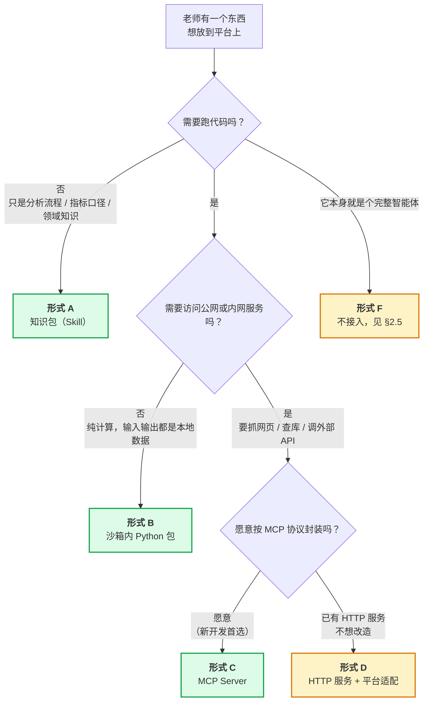

# 金融学院智能体平台 — 第三方接入规范

| 项 | 值 |
|---|---|
| 文档状态 | **草稿**（规范先行，平台侧尚未实现） |
| 当前版本 | v0.1 |
| 作者 | hxy |
| 上游文档 | [总体架构设计](./01architecture.md) · [智能体设计](./03agent-design.md) |
| 面向读者 | **平台外的开发者**（其他教师及其课题组）与平台维护者 |

### 版本历史

| 版本 | 日期 | 修改人 | 说明 |
|---|---|---|---|
| v0.1 | 2026-08-03 | hxy | 初稿。回应「其他老师的已有成果如何接入」，定接入形式谱系、通用约定与提交物清单。**平台侧实现未排期** |

> **本文档的分工**：[总体架构](./01architecture.md)写**平台自己**，[智能体设计](./03agent-design.md)写**平台自带的智能体**，本文写**别人的东西怎么进来**。
>
> 三者的交界面是本文 §3 的通用约定 —— 那些约束不是本文发明的，全部由架构既有决策推导而来，每条都给出了出处链接。

---

## 1. 本文回答什么

**一句话**：其他教师已经开发或打算开发的东西（RAG、爬虫、数据服务、智能体），能以哪些形式接入本平台；他们该按什么规则开发；交付时要交什么。

### 1.1 先说现状：平台目前一个都接不了

必须先讲清楚，否则后面全是空头支票：

| 事实 | 出处 |
|---|---|
| 平台**自身还没跑通** —— P0 的 Run 执行器与 FastAPI/SSE 尚未落地，前端未排期 | [P0 实施计划 §3](../03plan/P0-plan.md) |
| 「用户自定义提示词 / skill / MCP 接入」是**架构明确裁剪掉的本期范围** | [架构 §1.2、附录 B](./01architecture.md) |
| 该裁剪的重估触发条件是「**P0–P4 跑通，且**教师提出实际需求」—— 两个条件是**并且** | [架构 附录 B](./01architecture.md) |

现在被触发的是后半条（有老师提出需求），前半条差得远。**因此本文是规范，不是承诺**：它定义「将来怎么接」，不代表现在能接。平台侧的实现见 §6，尚未排期。

### 1.2 那为什么现在就要写

因为**规范滞后于开发的代价是不对称的**。

老师们现在正在写代码。如果等平台准备好再定规则，那时他们的东西已经写成了另一副样子 —— 同步阻塞、自带 LLM 调用、自己存用户数据、工具名撞车。届时要么平台迁就（把架构约束破坏掉），要么老师返工（他们大概率不愿意，于是接入不了了之）。

**现在发一份约定，成本几乎为零；将来再发，成本是别人的返工。** 这是本文唯一的紧迫性来源。

---

## 2. 接入形式谱系

### 2.1 分类依据：代码跑在哪一层

不按「是 RAG 还是爬虫」分类，按**代码最终在哪一层执行**分类。因为这一件事同时决定了出网能力、隔离强度、资源账、故障影响面 —— 是所有下游约束的根。

平台的分层见[架构 §4.1](./01architecture.md)，与接入相关的是两层：

- **应用层**（worker / broker 所在）：**信任区**，可出网，故障影响全平台
- **执行层**（沙箱容器）：**不可信区**，[零出网](./01architecture.md)，故障只影响单个会话

### 2.2 决策路径

### 2.3 五种形式一览

| 形式 | 代码跑在 | 出网 | 平台改动量 | 适合什么 |
|---|---|---|---|---|
| **A. 知识包** | 不跑代码，进提示词 | — | 极小 | 分析流程、指标口径、术语表、few-shot 范例 |
| **B. 沙箱内 Python 包** | 执行层（沙箱） | ❌ **不可能有** | 小（进镜像或内网源） | 计算库、回测框架、绘图封装、因子库 |
| **C. MCP Server** | 应用层（独立容器） | ✅ 可申请 | 小（配置声明） | **RAG 检索、爬虫、外部数据 API** |
| **D. HTTP 服务 + 适配** | 应用层（独立容器） | ✅ 可申请 | **中（平台要写适配代码）** | 存量已开发、不便改造的服务 |
| **E. 数据源** | 不跑代码 | — | 小 | 数据库、共享数据集 |

| 老师的东西 | 推荐形式 | 关键理由 |
|---|---|---|
| **RAG** | C（新写）/ D（已有） | 要查向量库、可能要调 embedding 服务，必须在应用层 |
| **爬虫** | C（新写）/ D（已有） | **必须在应用层。**沙箱零出网，爬虫在沙箱里跑不了 —— 见 §3.3，这是最容易踩的坑 |
| **智能体服务** | 见 §2.5 | 整体接入不推荐，拆成 C 才有意义 |

### 2.4 逐个展开

#### 形式 A：知识包（Skill）

**是什么**：一组 Markdown 文件，描述「做某类分析时应该遵循的步骤、口径、注意事项」。不含可执行代码。

**为什么它排第一**：成本最低、风险为零、见效最快。金融分析里大量的价值其实是**口径共识**（年化怎么算、缺失值怎么补、哪些指标不能直接平均），而不是代码。一位老师把自己的口径写成两页 Markdown，比交一个库更有用。

**交付物**：Markdown 文件 + 一个「用了它和没用它，输出有何不同」的对照例子。

**边界**：不能包含 API key、不能指示 agent 绕过平台约束（如「用 requests 从网上下载数据」—— 沙箱做不到，只会浪费轮次）。

#### 形式 B：沙箱内 Python 包

**是什么**：一个可 `pip install` 的纯计算库，agent 写分析代码时 `import` 它。

**硬性前提 —— 零出网**：沙箱[不能访问公网](./01architecture.md)，出站只允许内网 pypi 镜像与内网数据源。因此**库里任何联网取数的代码在沙箱里必然失败**。若你的库需要联网，它属于形式 C，不属于 B。

**两条落地路径**：

| 路径 | 适用 | 代价 |
|---|---|---|
| 发布到内网 pypi 镜像 | 更新频繁、只有部分课题组用 | agent 需要 `pip install`，占 5GB workspace 配额 |
| 预装进沙箱镜像 | 稳定、通用性强 | 全平台共享，镜像体积增大 |

镜像预装清单见[架构 §7.3.5](./01architecture.md)。**默认走内网源**，被多个课题组反复使用后再考虑预装。

**交付物**：源码仓库 + `pyproject.toml` + 锁定的依赖 + 一份「典型用法」示例脚本。

#### 形式 C：MCP Server ★ 推荐

**是什么**：按 [Model Context Protocol](https://modelcontextprotocol.io) 封装的工具服务，作为独立容器部署在应用层，平台 agent 通过协议调用它。

**为什么这是新开发的首选**：它是**唯一不需要平台为你写代码**的形式。工具的名称、参数 schema、描述文本都由 MCP server 自己声明，平台按配置连接即可。接第二个、第三个老师的服务时，平台侧的边际成本接近零。

**这也正是架构[附录 B](./01architecture.md) 早已认定的后续方向**，本文只是把它从「一个方向」细化成「一份规范」。

**交付物**：见 §5。**必须遵守 §3 的全部通用约定** —— 它跑在信任区。

#### 形式 D：HTTP 服务 + 平台适配

**是什么**：老师已有的 Flask / FastAPI / Django 服务，原样打包成容器；平台侧写一层薄适配，把它的接口翻译成 agent 工具。

**它存在的唯一理由是兼容存量。** 与 C 的差别只有一处，但很重要：**适配代码由平台写、平台维护**。接一个还行，接五个就是五份要长期维护的胶水代码，且老师那边接口一改，平台这边就跟着坏。

**因此本文的态度是**：已有的服务走 D，新开发的一律走 C。若老师愿意把存量服务补一层 MCP 封装（通常是几十行），也算 C。

**额外交付物**：OpenAPI 描述（`/openapi.json` 或手写），否则适配层无从下手。

#### 形式 E：数据源

**是什么**：老师维护的数据库或共享数据集，希望 agent 能读到。

**两条路**：

| 路 | 做法 | 适合 |
|---|---|---|
| 走沙箱内网白名单 | 把数据库地址加入沙箱出站白名单，agent 直接连 | 内网数据库，读多写少 |
| 包成形式 C 的工具 | 由 MCP server 代理查询 | 需要权限控制、审计、或查询复杂 |

**默认走第二条。** 第一条等于把沙箱（不可信区）直接接到数据库上，一旦 agent 写出 `DROP TABLE` 就是真的执行了。若坚持走第一条，**必须是只读账号**，这没有商量余地。

### 2.5 形式 F：完整的独立智能体 —— 不建议接入

老师若已有一个完整的智能体应用（自带模型调用、自带会话管理、自带界面），**把它整体挂进本平台是笔坏买卖**，理由是它会同时绕过平台的四项核心能力：

| 平台能力 | 独立 agent 接进来后 | 出处 |
|---|---|---|
| 沙箱隔离 | 绕过。它的代码执行不受本平台管控 | [架构 §7.3](./01architecture.md) |
| 事件流与断线重放 | 绕过。前端拿不到它的过程，界面上是个黑盒 | [架构 §5.2](./01architecture.md) |
| token 配额与成本核算 | 绕过。它自带 LLM 调用，平台管不住花销 | [架构 §6.4](./01architecture.md) |
| 多租户隔离 | 绕过。它自己存数据，越权与否平台无从保证 | [架构 §6.3](./01architecture.md) |

四项全绕过之后，「接入平台」实际上只剩下**共用一个登录入口**这一点价值 —— 那不叫接入，那叫两个系统装在同一台服务器上。

**替代方案（推荐）**：把该智能体**最有价值的那个能力**拆出来，按形式 C 封装成工具。例如一个「财报问答智能体」，真正稀缺的是它背后的财报库与检索逻辑，把这部分做成 MCP 工具，由平台的 agent 调用 —— 平台的沙箱、事件流、配额全都还在，老师的核心资产也用上了。

---

## 3. 通用开发约定

**以下七条适用于所有形式**（A 与 E 只涉及部分）。每条都注明**要求 / 为什么 / 违反的后果**，因为不解释「为什么」的规范没人会遵守。

这些约束**没有一条是本文新造的**，全部由架构既有决策推导而来。

### 3.1 不许阻塞：worker 是单进程管几十个会话

| 项 | 内容 |
|---|---|
| **要求** | 提供异步接口；确实做不到时，保证单次调用有**明确超时上限**并能在线程池中运行 |
| **为什么** | 平台 worker 是一个 asyncio 进程管理几十个并发 run（[架构 §8.1](./01architecture.md)），因为所有重活都在沙箱里，worker 侧是纯 IO 等待 |
| **违反的后果** | 一次同步阻塞调用会卡住**整个事件循环**。你的服务慢 30 秒，全平台所有教师的对话同时卡 30 秒 —— 而不是只有调用你的那一个 |

**这是七条里最容易违反、后果最严重的一条。**普通 Python 开发习惯（`requests.get()` 直接调）在这里就是违规。

### 3.2 出错要返回，不要抛异常

| 项 | 内容 |
|---|---|
| **要求** | 一切异常在你的服务内部捕获，转成**结构化的错误返回值**（带 `error` 字段），不要向上抛 |
| **为什么** | [智能体设计 §3.4](./03agent-design.md) 的硬性要求：工具抛异常会让 LangGraph 节点失败 → 整个 run 失败 |
| **违反的后果** | 教师看到「任务挂了」。而正确做法下，LLM 收到错误信息后会自己改参数重试、换个思路或如实告知教师 —— 这才是 agent 该有的行为 |

超时、连接失败、查无结果、参数非法 —— 全都要返回而非抛出。

### 3.3 出网能力由所在层决定，不由你申请

| 项 | 内容 |
|---|---|
| **要求** | 需要联网的东西，**只能是形式 C 或 D**（应用层），不能是形式 B |
| **为什么** | 沙箱[零出网](./01architecture.md)，出站只有内网 pypi 与内网数据源。模型调用发生在 worker 侧，不经过沙箱 |
| **违反的后果** | 代码在你本机测得好好的，进了沙箱所有网络请求全部超时失败 |

**这是「爬虫」类需求最容易踩的坑**，值得单独强调：

> 不要设计成「我写个爬虫脚本，让 agent 在沙箱里运行它」。这条路在本平台上是死的。
> 正确做法是把爬虫做成应用层的 MCP 工具（形式 C），agent 调用它、拿回结构化数据，再在沙箱里分析这些数据。

应用层的出网也**不是无条件**的：需在交付时声明要访问哪些域名，由平台按白名单放行（见 §5.1）。

### 3.4 工具名必须带命名空间

| 项 | 内容 |
|---|---|
| **要求** | 工具名格式 `{来源标识}_{动作}`，如 `wang_rag_search`、`li_crawler_fetch`。**不要**用 `search`、`query`、`fetch` 这类通名 |
| **为什么** | 平台自带工具名[已冻结](./03agent-design.md)，且工具名会同时出现在四处：事件 payload、前端渲染分支、HITL 审批谓词、broker 去重表 |
| **违反的后果** | 与平台自带的 8 个工具或其他老师的工具**撞名**。改名要同时动四处，还要处理已经落库的历史事件 |

平台自带的 8 个名字是 `ls` / `read_file` / `write_file` / `edit_file` / `delete` / `glob` / `grep` / `execute`，一律不可占用。

### 3.5 写操作要能安全重放

| 项 | 内容 |
|---|---|
| **要求** | 有副作用的操作（写库、发消息、扣费）需**自身幂等**，或接受平台传入的幂等键并据此去重 |
| **为什么** | 平台的任务队列是至少一次投递，崩溃路径下工具可能被重复调用（[架构 §3.2、§5.6](./01architecture.md)、[ADR-0014](./adr/0014-tool-idempotency-key.md)） |
| **违反的后果** | worker 崩溃恢复后，你的写操作执行两次 —— 数据污染，或让 LLM 看到一个首次执行时没有的错误，行为随之偏离 |

**纯读的工具（检索、查询、抓取）不受此条约束**，这也是大多数 RAG / 爬虫工具的情况。

### 3.6 不自持用户数据，不自调 LLM

| 项 | 内容 |
|---|---|
| **要求** | ① 不要自己存储教师的会话内容或上传数据；② 尽量不要在你的服务里自行调用大模型 |
| **为什么** | ① 多租户隔离统一做在平台的数据访问层（[架构 §6.3](./01architecture.md)），你自建存储就绕开了它；② token 配额与成本核算按 per-user 计（[架构 §6.4](./01architecture.md)） |
| **违反的后果** | ① 越权风险，且平台无法保证也无法排查；② 平台的成本看板上看不到你的花销，配额形同虚设 |

**确实需要调 LLM 时**（如 RAG 的 rerank、query 改写）：不要硬编码自己的 API key，改为接受平台在启动时注入的凭据与 base_url，并在返回值里带上本次消耗的 token 数，以便平台计入配额。具体注入方式待 §6 实现时定。

### 3.7 资源要声明，因为它从沙箱预算里扣

| 项 | 内容 |
|---|---|
| **要求** | 声明服务的内存上限、CPU 需求、是否需要持久卷、冷启动耗时 |
| **为什么** | 服务器是 64 GB，[架构 §4.4](./01architecture.md) 已把它排满：约 14 GB 基础服务 + 2 GB 系统 + 48 GB 给沙箱 = 20 个沙箱（配置值） |
| **违反的后果** | **接入不是免费的。**你的服务吃 4 GB，可用沙箱数就要从 20 降到约 18 —— 直接减少全平台的并发能力 |

这条对老师而言可能反直觉，但必须讲明：**每接一个服务，全平台的并发上限就往下走一格**。因此资源占用是接入评审的实质性考量，不是走过场的表格。向量库这类内存大户尤其要如实声明。

---

## 4. 安全边界：为什么第三方代码要单独关起来

一个容易被忽略的事实：**形式 C 和 D 的代码跑在应用层，也就是平台的信任区**，与沙箱里 LLM 生成的代码性质完全不同。

平台的威胁模型（[架构 §7.1](./01architecture.md)）认定「用户是校内实名师生，主要威胁是代码写错或失控，而非定向攻击」。这个判断对第三方接入**依然成立** —— 交东西进来的是同事，不是攻击者。

但「不是攻击者」不等于「代码不会出事」。因此平台侧的接收姿态是**防事故，不防人**：

| 措施 | 防的是什么 |
|---|---|
| 每个第三方服务跑在**独立容器**，不与 worker 同进程 | 崩溃 / 内存泄漏不波及平台 |
| **不给** `docker.sock`、**不给**数据库直连、**不给**宿主机文件系统 | 无心之失变成全局故障（[ADR-0004](./adr/0004-sandbox-broker-docker-sock.md) 的同一条理由） |
| compose 侧硬性 `mem_limit` / `cpus` | §3.7 的资源账落到实处 |
| 出站白名单按声明放行 | 避免服务意外访问预期外的地址 |
| 接入前**通读一遍代码** | 单人开发无第二人复核（[架构 §2.3](./01architecture.md)），这是唯一的审查环节 |

**责任边界也要提前说清**，否则出事时扯不清：

- **老师负责**：服务本身的正确性、性能、依赖可用性，以及后续维护
- **平台负责**：容器编排、资源限制、调用链路、故障隔离
- **服务连续失败时，平台有权停用它**并通知作者 —— 一个坏掉的工具会让 agent 反复重试、烧掉教师的 token 配额

---

## 5. 提交物清单

### 5.1 所有形式通用

| # | 交什么 | 为什么要 |
|---|---|---|
| 1 | **源码仓库地址**（或压缩包） | §4 的代码通读环节 |
| 2 | **一句话说明**：它解决什么问题、教师会在什么场景用到 | 决定要不要接、以及怎么写工具描述给 LLM |
| 3 | **维护责任人**与联系方式 | 出问题找谁。**无人认领的东西不接** |
| 4 | **一个可复现的验收用例**：输入 → 期望输出 | 没有这个就无法判断「接好了没有」 |

### 5.2 形式 A（知识包）追加

| # | 交什么 |
|---|---|
| 5 | Markdown 文件本体 |
| 6 | 用了 / 没用的输出对照例子 |

### 5.3 形式 B（沙箱内 Python 包）追加

| # | 交什么 | 说明 |
|---|---|---|
| 5 | `pyproject.toml` + **锁定的依赖** | 可复现构建（[技术章程第四条](../../.claude/python-constitution.md)） |
| 6 | 依赖里**是否有联网行为**的说明 | §3.3，有则改走形式 C |
| 7 | 安装后的体积 | 占 5GB workspace 配额 |

### 5.4 形式 C / D（服务类）追加 —— 最严格

| # | 交什么 | 说明 |
|---|---|---|
| 5 | **Dockerfile**，且能在**内网**构建完成 | 内网可能拉不到 Docker Hub（[架构 §8.5](./01architecture.md)）。依赖基础镜像要一并说明 |
| 6 | **接口描述**：MCP tool schema（形式 C）或 OpenAPI（形式 D） | 工具描述文本是给 LLM 读的，写清楚「什么时候该用它」比写清楚参数更重要 |
| 7 | **健康检查端点** | 平台据此判断服务是否可用，失败时才能优雅降级而非卡死 |
| 8 | **资源声明**：内存上限 / CPU / 持久卷 / 冷启动耗时 | §3.7，直接影响沙箱并发数 |
| 9 | **出网声明**：需要访问的域名或内网地址清单 | §3.3，按白名单放行 |
| 10 | **耗时声明**：单次调用的典型耗时与最坏耗时 | 超过约 30 秒的要专门设计进度反馈，否则界面看着像卡死 |
| 11 | **数据声明**：是否存储用户数据、是否外发数据 | §3.6，涉及隔离边界 |
| 12 | **LLM 调用声明**：是否自带模型调用、用哪个模型 | §3.6，涉及配额与成本 |
| 13 | **配置项清单**：需要哪些环境变量 | 凭据由平台注入，**不要硬编码进镜像** |

### 5.5 验收流程

第 5 步在**隔离环境**进行，不直接进生产 —— 第三方服务的第一次运行不该发生在教师正在用的平台上。

---

## 6. 平台侧要做什么（未排期）

本文定的是**对外的规范**，平台侧还需要相应的**接收能力**，目前一项都没有：

| 能力 | 依赖 | 状态 |
|---|---|---|
| agent 装配时加载外部 MCP 工具 | [智能体设计 §2.2](./03agent-design.md) 的能力开关 | 未实现 |
| 第三方工具的事件映射与前端渲染分支 | [架构 §5.2](./01architecture.md) 事件契约 | 未实现（契约的兼容性规则已预留：前端须忽略未知 `type`） |
| skill / 提示词的存储与组内共享 | [架构 §6.2](./01architecture.md) 的 `agent_config` JSONB、`user_groups` 表 | 表结构已预留，功能未实现 |
| 第三方服务的 compose 编排与资源限制 | [ADR-0001](./adr/0001-single-host-compose.md) | 未实现 |
| 工具级的配额计量 | [架构 §6.4](./01architecture.md) | 未实现 |

**排期建议**：接在 P4 之后作为 P5，或在 P3（多用户隔离 + 配额）落地后插入。**不建议早于 P3** —— 第三方工具的配额计量与越权隔离要依赖 P3 的成果，提前做会返工。

值得注意的是，架构里有两处**已经为此预留了位置**，说明这个方向早在设计时就被考虑过：

- `threads.agent_config` 用 JSONB 而非拆列，理由原文就写着「后续方向（自定义提示词、skill、MCP）会持续往里加字段」（[架构 §6.2](./01architecture.md)）
- 角色与课题组共享边界已定义，原文写明「是为了让表结构将来不必推倒重来」（[架构 §7.2.1](./01architecture.md)）

---

## 7. 未决事项

| # | 待回答 | 阻塞于 |
|---|---|---|
| 1 | **谁来审、按什么标准准入？** 是否需要学院层面的评审机制，还是平台维护者一人拍板 | 需与学院确认。单人开发下，第三方接入量一旦上来会成为维护瓶颈 |
| 2 | **第三方工具的 token 消耗算谁的？** 算调用它的教师，还是算工具作者 | [架构 §6.4](./01architecture.md) 的配额数值本身也未定 |
| 3 | **组内共享还是全院共享？** 一个老师的 RAG 工具默认对谁可见 | [架构 §6.2](./01architecture.md) 的 TODO：共享资源表是否预留尚未决定 |
| 4 | **凭据注入的具体形式** —— §3.6 提到平台注入 LLM 凭据，机制未定 | 依赖 §6 的实现 |
| 5 | **长耗时工具的进度反馈** —— 超过 30 秒的调用如何推事件 | 平台自身的 `sandbox.queued` 机制（[智能体设计 §3.5](./03agent-design.md)）尚未实现，届时同一套 |

---

## 附录：与其他文档的对应

| 本文章节 | 上游依据 |
|---|---|
| §2 形式谱系 | [架构 §4.1](./01architecture.md) 分层、[§7.3.4](./01architecture.md) 沙箱网络策略 |
| §3.1 不许阻塞 | [架构 §8.1](./01architecture.md) 并发模型 |
| §3.2 错误返回 | [智能体设计 §3.4](./03agent-design.md) |
| §3.4 工具命名 | [智能体设计 §3.2](./03agent-design.md) 工具名冻结 |
| §3.5 可重放 | [架构 §3.2 §5.6](./01architecture.md)、[ADR-0014](./adr/0014-tool-idempotency-key.md) |
| §3.6 隔离与配额 | [架构 §6.3 §6.4](./01architecture.md) |
| §3.7 资源账 | [架构 §4.4](./01architecture.md) 容量推算 |
| §4 安全边界 | [架构 §7.1](./01architecture.md) 威胁模型、[ADR-0004](./adr/0004-sandbox-broker-docker-sock.md) |
| §6 平台侧能力 | [架构 附录 B](./01architecture.md) 的重估触发条件 |
