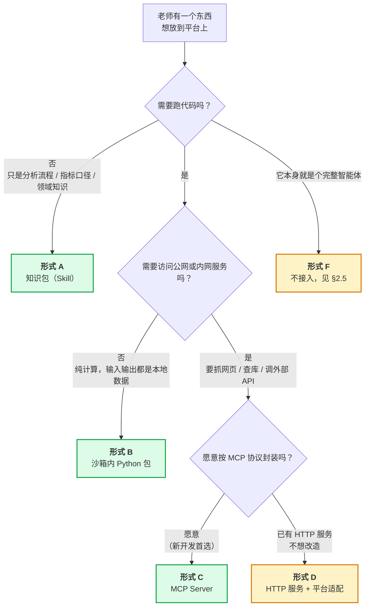

# 金融学院智能体平台 — 第三方接入规范

| 项 | 值 |
|---|---|
| 文档状态 | **已排期**（接收能力由 P6–P10 分五期落地，见 [P6 决策文档](../03plan/P6-decision.md)） |
| 当前版本 | v0.3 |
| 作者 | hxy |
| 上游文档 | [总体架构设计](./01architecture.md) · [智能体设计](./03agent-design.md) · [P6 决策文档](../03plan/P6-decision.md) |
| 面向读者 | **平台外的开发者**（其他教师及其课题组）与平台维护者 |

### 版本历史

| 版本 | 日期 | 修改人 | 说明 |
|---|---|---|---|
| v0.3 | 2026-08-13 | hxy | **[P6 决策文档](../03plan/P6-decision.md) 的 68 条定案推翻了本文三处结论**：形式 C 从「独立容器部署在应用层」改为**外网既有服务，平台不本地部署**（§2.4、§3.7、§5.4）；形式 F 从「不建议接入」改为**平台不接受**（§2.5）；§6 五项接收能力与 §7 五条未决事项**全部关闭并给出期次**。**§5.4 的 13 项交付物在全外网前提下只剩 4 项成立** |
| v0.2 | 2026-08-10 | hxy | **§1.1 的现状全面改写：P0–P4 已全部跑通**（2026-08-10 P4 验收八条全过），重估触发条件的**两个条件因此都满足了** —— 这一项不再是「被裁剪掉」，而是待排期。§6 同步改正 `user_groups` 的状态（P3 定案不建那两张表，不是「已预留」）|
| v0.1 | 2026-08-03 | hxy | 初稿。回应「其他老师的已有成果如何接入」，定接入形式谱系、通用约定与提交物清单。**平台侧实现未排期** |

> **本文档的分工**：[总体架构](./01architecture.md)写**平台自己**，[智能体设计](./03agent-design.md)写**平台自带的智能体**，本文写**别人的东西怎么进来**。
>
> 三者的交界面是本文 §3 的通用约定 —— 那些约束不是本文发明的，全部由架构既有决策推导而来，每条都给出了出处链接。

---

## 1. 本文回答什么

**一句话**：其他教师已经开发或打算开发的东西（RAG、爬虫、数据服务、智能体），能以哪些形式接入本平台；他们该按什么规则开发；交付时要交什么。

### 1.1 现状：已排期，尚未实现

> **2026-08-13 改写。** 下面保留了 v0.2 的原文（删线部分），因为它记录着这一项是怎么从「被裁剪」走到「已排期」的。

~~**先说现状：平台目前一个都接不了。**~~

| 事实 | 出处 |
|---|---|
| **平台自身已跑通**（2026-08-10，P0–P4 五期验收全过） | [实施计划索引](../03plan/) |
| ~~「用户自定义提示词 / skill / MCP 接入」是**架构裁剪掉的本期范围**~~ —— **2026-08-13 起不再成立** | [总体架构 §7](./01architecture.md) |
| ~~该裁剪的重估触发条件是「P0–P4 跑通，且教师提出实际需求」~~ —— **两个条件已于 2026-08-10 全部满足** | [总体架构 §7](./01architecture.md) |

**2026-08-13 更新：排期已定，本文从「规范」升级为「有落地期次的规范」。**

[P6 决策文档](../03plan/P6-decision.md) 用 68 条定案回答了 §6 那五项接收能力各自怎么做，并把它们切成五期：

| 期 | 与本文的关系 |
|---|---|
| **P6** | 前端底座 + 自定义提示词生效。对应本文的**形式 A（知识包）中「纯提示词」那一半** |
| **P7** | agent 表、三档可见性、审核流程。回答本文 §7 的问题 1 与问题 3 |
| **P8** | skill 全链路。对应本文**形式 A** |
| **P9** | 子智能体。本文未覆盖 —— 它是平台内部的编排，不是「别人的东西接进来」 |
| **P10** | MCP 目录。对应本文**形式 C，但部署形态已被推翻**，见 §2.4 |

**仍然不是承诺的部分**：五期都还没开工。**已经是承诺的部分**：怎么接、按什么标准审、交什么材料，这三样不会再变。

### 1.2 那为什么现在就要写

因为**规范滞后于开发的代价是不对称的**。

老师们现在正在写代码。如果等平台准备好再定规则，那时他们的东西已经写成了另一副样子 —— 同步阻塞、自带 LLM 调用、自己存用户数据、工具名撞车。届时要么平台迁就（把架构约束破坏掉），要么老师返工（他们大概率不愿意，于是接入不了了之）。

**现在发一份约定，成本几乎为零；将来再发，成本是别人的返工。** 这是本文唯一的紧迫性来源。

---

## 2. 接入形式谱系

### 2.1 分类依据：代码跑在哪一层

不按「是 RAG 还是爬虫」分类，按**代码最终在哪一层执行**分类。因为这一件事同时决定了出网能力、隔离强度、资源账、故障影响面 —— 是所有下游约束的根。

平台的分层见[总体架构 §3](./01architecture.md)，与接入相关的是两层：

- **应用层**（worker / broker 所在）：**信任区**，可出网，故障影响全平台
- **执行层**（沙箱容器）：**不可信区**，[零出网](./01architecture.md)，故障只影响单个会话

### 2.2 决策路径

### 2.3 五种形式一览

| 形式 | 代码跑在 | 出网 | 平台改动量 | 适合什么 |
|---|---|---|---|---|
| **A. 知识包** | 不跑代码，进提示词 | — | 极小 | 分析流程、指标口径、术语表、few-shot 范例 |
| **B. 沙箱内 Python 包** | 执行层（沙箱） | ❌ **不可能有** | 小（进镜像或内网源） | 计算库、回测框架、绘图封装、因子库 |
| **C. MCP Server** | **校外，不在本平台上**（2026-08-13 改） | ✅ 天然有 | 小（一条目录记录） | **RAG 检索、爬虫、外部数据 API** |
| **D. HTTP 服务 + 适配** | 应用层（独立容器） | ✅ 可申请 | **中（平台要写适配代码）** | 存量已开发、不便改造的服务 |
| **E. 数据源** | 不跑代码 | — | 小 | 数据库、共享数据集 |

> **2026-08-13：形式 C 那一行整行改过。** 原文是「应用层（独立容器）/ 可申请出网 / 小（配置声明）」。[P6 决策 F3](../03plan/P6-decision.md) 定了 **MCP 一律是外网既有服务，平台不本地部署** —— 详见 §2.4。形式 D 未受影响（它本来就要平台写适配代码，那部分仍在应用层）。

| 老师的东西 | 推荐形式 | 关键理由 |
|---|---|---|
| **RAG** | C（新写）/ D（已有） | 要查向量库、可能要调 embedding 服务，必须在应用层 |
| **爬虫** | C（新写）/ D（已有） | **必须在应用层。**沙箱零出网，爬虫在沙箱里跑不了 —— 见 §3.3，这是最容易踩的坑 |
| **智能体服务** | 见 §2.5 | 整体接入不推荐，拆成 C 才有意义 |

### 2.4 逐个展开

#### 形式 A：知识包（Skill）

**是什么**：一组 Markdown 文件，描述「做某类分析时应该遵循的步骤、口径、注意事项」。不含可执行代码。

**为什么它排第一**：成本最低、风险为零、见效最快。金融分析里大量的价值其实是**口径共识**（年化怎么算、缺失值怎么补、哪些指标不能直接平均），而不是代码。一位老师把自己的口径写成两页 Markdown，比交一个库更有用。

**交付物**：Markdown 文件 + 一个「用了它和没用它，输出有何不同」的对照例子。

**边界**：不能包含 API key、不能指示 agent 绕过平台约束（如「用 requests 从网上下载数据」—— 沙箱做不到，只会浪费轮次）。

#### 形式 B：沙箱内 Python 包

**是什么**：一个可 `pip install` 的纯计算库，agent 写分析代码时 `import` 它。

**硬性前提 —— 零出网**：沙箱[不能访问公网](./01architecture.md)，出站只允许内网 pypi 镜像与内网数据源。因此**库里任何联网取数的代码在沙箱里必然失败**。若你的库需要联网，它属于形式 C，不属于 B。

**两条落地路径**：

| 路径 | 适用 | 代价 |
|---|---|---|
| 发布到内网 pypi 镜像 | 更新频繁、只有部分课题组用 | agent 需要 `pip install`，占 5GB workspace 配额 |
| 预装进沙箱镜像 | 稳定、通用性强 | 全平台共享，镜像体积增大 |

镜像预装清单见[安全设计 §7.3.5](./07security-design.md)。**默认走内网源**，被多个课题组反复使用后再考虑预装。

**交付物**：源码仓库 + `pyproject.toml` + 锁定的依赖 + 一份「典型用法」示例脚本。

#### 形式 C：MCP Server ★ 推荐

**是什么**：按 [Model Context Protocol](https://modelcontextprotocol.io) 封装的工具服务，**由你自己部署在校外并保持可用**，平台通过协议调用它。

> **2026-08-13 定案改写（[P6 决策 F3](../03plan/P6-decision.md)）：不再由平台部署。**
>
> 原文写的是「作为独立容器部署在应用层」，平台侧写进 `compose.yml` 并做资源限制。**现在改为：服务跑在你自己的地方，平台只存一条目录记录（地址、工具清单、四项声明）。**
>
> | | 原方案（作废） | 现方案 |
> |---|---|---|
> | 部署 | 交 Dockerfile，平台写进 compose | **你自己部署并维护可用性** |
> | 传输 | compose 内网服务名 | **SSE 或 streamable-http，地址不限。禁止 stdio** |
> | 资源 | 要声明内存 / CPU，占平台的沙箱并发预算（§3.7） | **不占。那笔账整条作废** |
> | 上架 | 改 compose + 重启 | 纯后台操作（需要 API key 时仍要改 `.env` + 重启） |
> | 凭据 | 平台注入 | 平台统一持有，进仓库根的 `.env` |
>
> **你换到的**：不必交 Dockerfile、不必内网可构建、不占平台资源、上架更快。
> **你付出的**：**服务的可用性完全由你负责**。平台侧只有 30 秒超时与「连续失败 5 次自动停用」两道保护 —— 触发停用后平台会告警，但你的工具在那之前已经让教师的分析失败了若干次。

**为什么这仍是新开发的首选**：它是**唯一不需要平台为你写代码**的形式。工具的名称、参数 schema、描述文本都由 MCP server 自己声明，平台按目录记录连接即可。接第二个、第三个老师的服务时，平台侧的边际成本接近零。

**交付物**：见 §5.4 —— **全外网之后那 13 项只剩 4 项成立**。

**§3 的通用约定仍然全部适用**，其中 §3.1（不许阻塞）与 §3.2（出错要返回）在外网前提下**更重要而不是更轻** —— 平台对你的服务没有任何控制力。

#### 形式 D：HTTP 服务 + 平台适配

**是什么**：老师已有的 Flask / FastAPI / Django 服务，原样打包成容器；平台侧写一层薄适配，把它的接口翻译成 agent 工具。

**它存在的唯一理由是兼容存量。** 与 C 的差别只有一处，但很重要：**适配代码由平台写、平台维护**。接一个还行，接五个就是五份要长期维护的胶水代码，且老师那边接口一改，平台这边就跟着坏。

**因此本文的态度是**：已有的服务走 D，新开发的一律走 C。若老师愿意把存量服务补一层 MCP 封装（通常是几十行），也算 C。

**额外交付物**：OpenAPI 描述（`/openapi.json` 或手写），否则适配层无从下手。

#### 形式 E：数据源

**是什么**：老师维护的数据库或共享数据集，希望 agent 能读到。

**两条路**：

| 路 | 做法 | 适合 |
|---|---|---|
| 走沙箱内网白名单 | 把数据库地址加入沙箱出站白名单，agent 直接连 | 内网数据库，读多写少 |
| 包成形式 C 的工具 | 由 MCP server 代理查询 | 需要权限控制、审计、或查询复杂 |

**默认走第二条。** 第一条等于把沙箱（不可信区）直接接到数据库上，一旦 agent 写出 `DROP TABLE` 就是真的执行了。若坚持走第一条，**必须是只读账号**，这没有商量余地。

### 2.5 形式 F：完整的独立智能体 —— **平台不接受**（2026-08-13 从「不建议」改为「不接受」）

> **[P6 决策 A7](../03plan/P6-decision.md) 把这个概念整条砍掉了。**
>
> 需求侧曾提出「用户上传的智能体分两类：提示词类与服务器部署 agent」，后者就是本节说的形式 F。**定案是只保留提示词类，形式 F 在平台上不再有任何入口** —— 不是「不推荐但可以谈」，而是没有这条路。
>
> 前端为它准备的界面（创建页的类型二选一、「部署中」状态、审核后台的部署分支）一并删除。
>
> **理由没变，就是下面这张表。** 变的只是态度的强度 —— 四项核心能力全绕过之后，「接入平台」实际上只剩共用一个登录入口，那不值得为它维护一套并行的数据模型、详情页与调用路径。

老师若已有一个完整的智能体应用（自带模型调用、自带会话管理、自带界面），**把它整体挂进本平台是笔坏买卖**，理由是它会同时绕过平台的四项核心能力：

| 平台能力 | 独立 agent 接进来后 | 出处 |
|---|---|---|
| 沙箱隔离 | 绕过。它的代码执行不受本平台管控 | [安全设计 §7.3](./07security-design.md) |
| 事件流与断线重放 | 绕过。前端拿不到它的过程，界面上是个黑盒 | [运行时设计 §5.2](./05runtime-design.md) |
| token 配额与成本核算 | 绕过。它自带 LLM 调用，平台管不住花销 | [数据设计 §6.4](./06data-design.md) |
| 多租户隔离 | 绕过。它自己存数据，越权与否平台无从保证 | [数据设计 §6.3](./06data-design.md) |

四项全绕过之后，「接入平台」实际上只剩下**共用一个登录入口**这一点价值 —— 那不叫接入，那叫两个系统装在同一台服务器上。

**替代方案（推荐）**：把该智能体**最有价值的那个能力**拆出来，按形式 C 封装成工具。例如一个「财报问答智能体」，真正稀缺的是它背后的财报库与检索逻辑，把这部分做成 MCP 工具，由平台的 agent 调用 —— 平台的沙箱、事件流、配额全都还在，老师的核心资产也用上了。

---

## 3. 通用开发约定

**以下七条适用于所有形式**（A 与 E 只涉及部分）。每条都注明**要求 / 为什么 / 违反的后果**，因为不解释「为什么」的规范没人会遵守。

这些约束**没有一条是本文新造的**，全部由架构既有决策推导而来。

### 3.1 不许阻塞：worker 是单进程管几十个会话

| 项 | 内容 |
|---|---|
| **要求** | 提供异步接口；确实做不到时，保证单次调用有**明确超时上限**并能在线程池中运行 |
| **为什么** | 平台 worker 是一个 asyncio 进程管理几十个并发 run（[运维设计 §8.1](./08operation-design.md)），因为所有重活都在沙箱里，worker 侧是纯 IO 等待 |
| **违反的后果** | 一次同步阻塞调用会卡住**整个事件循环**。你的服务慢 30 秒，全平台所有教师的对话同时卡 30 秒 —— 而不是只有调用你的那一个 |

**这是七条里最容易违反、后果最严重的一条。**普通 Python 开发习惯（`requests.get()` 直接调）在这里就是违规。

### 3.2 出错要返回，不要抛异常

| 项 | 内容 |
|---|---|
| **要求** | 一切异常在你的服务内部捕获，转成**结构化的错误返回值**（带 `error` 字段），不要向上抛 |
| **为什么** | [智能体设计 §3.4](./03agent-design.md) 的硬性要求：工具抛异常会让 LangGraph 节点失败 → 整个 run 失败 |
| **违反的后果** | 教师看到「任务挂了」。而正确做法下，LLM 收到错误信息后会自己改参数重试、换个思路或如实告知教师 —— 这才是 agent 该有的行为 |

超时、连接失败、查无结果、参数非法 —— 全都要返回而非抛出。

### 3.3 出网能力由所在层决定，不由你申请

| 项 | 内容 |
|---|---|
| **要求** | 需要联网的东西，**只能是形式 C 或 D**（应用层），不能是形式 B |
| **为什么** | 沙箱[零出网](./01architecture.md)，出站只有内网 pypi 与内网数据源。模型调用发生在 worker 侧，不经过沙箱 |
| **违反的后果** | 代码在你本机测得好好的，进了沙箱所有网络请求全部超时失败 |

**这是「爬虫」类需求最容易踩的坑**，值得单独强调：

> 不要设计成「我写个爬虫脚本，让 agent 在沙箱里运行它」。这条路在本平台上是死的。
> 正确做法是把爬虫做成应用层的 MCP 工具（形式 C），agent 调用它、拿回结构化数据，再在沙箱里分析这些数据。

应用层的出网也**不是无条件**的：需在交付时声明要访问哪些域名，由平台按白名单放行（见 §5.1）。

### 3.4 工具名必须带命名空间

| 项 | 内容 |
|---|---|
| **要求** | 工具名格式 `{来源标识}_{动作}`，如 `wang_rag_search`、`li_crawler_fetch`。**不要**用 `search`、`query`、`fetch` 这类通名 |
| **为什么** | 平台自带工具名[已冻结](./03agent-design.md)，且工具名会同时出现在四处：事件 payload、前端渲染分支、HITL 审批谓词、broker 去重表 |
| **违反的后果** | 与平台自带的 8 个工具或其他老师的工具**撞名**。改名要同时动四处，还要处理已经落库的历史事件 |

平台自带的 8 个名字是 `ls` / `read_file` / `write_file` / `edit_file` / `delete` / `glob` / `grep` / `execute`，一律不可占用。

> **2026-08-13（[F6](../03plan/P6-decision.md)）：平台不替你加前缀，只在上架时查撞名。**
>
> 考虑过由平台强制把工具名改写成 `mcp_{server}_{tool}`，**否决了** —— 那会改掉你写在 schema 里的名字，而工具名与描述都是给 LLM 读的，改了会影响它「什么时候该用这个工具」的判断。
>
> **代价落到你身上**：撞名的一方要改名，先来后到。
>
> **还有一个只在外网形态下存在的漏洞**：你上架之后**改了工具名或新增了工具，平台不会知道** —— 上架时查过的清单会过期，撞名可能在上架之后才发生，而它是静默的（两个同名工具，LLM 调哪个由注册顺序决定）。平台的缓解是**每次装配 agent 时把实际拿到的工具名与目录里那份清单比对，不一致就跳过整个 server 并记 warn**。**因此改了工具清单要来更新目录记录，否则你的服务会安静地不再被调用。**

### 3.5 写操作要能安全重放

| 项 | 内容 |
|---|---|
| **要求** | 有副作用的操作（写库、发消息、扣费）需**自身幂等**，或接受平台传入的幂等键并据此去重 |
| **为什么** | 平台的任务队列是至少一次投递，崩溃路径下工具可能被重复调用（[总体架构 §2.3](./01architecture.md)、[运行时设计 §5.6](./05runtime-design.md)、[ADR-0014](./adr/0014-tool-idempotency-key.md)） |
| **违反的后果** | worker 崩溃恢复后，你的写操作执行两次 —— 数据污染，或让 LLM 看到一个首次执行时没有的错误，行为随之偏离 |

**纯读的工具（检索、查询、抓取）不受此条约束**，这也是大多数 RAG / 爬虫工具的情况。

### 3.6 不自持用户数据，不自调 LLM

| 项 | 内容 |
|---|---|
| **要求** | ① 不要自己存储教师的会话内容或上传数据；② 尽量不要在你的服务里自行调用大模型 |
| **为什么** | ① 多租户隔离统一做在平台的数据访问层（[数据设计 §6.3](./06data-design.md)），你自建存储就绕开了它；② token 配额与成本核算按 per-user 计（[数据设计 §6.4](./06data-design.md)） |
| **违反的后果** | ① 越权风险，且平台无法保证也无法排查；② 平台的成本看板上看不到你的花销，配额形同虚设 |

> **2026-08-13：这两条对形式 C 从「平台能保证」降为「只能靠你自觉」。**
>
> §2.4 定了 MCP server 跑在校外。平台**既管不了也查不了**你的服务内部做了什么：
>
> - **①「不自持用户数据」失去执行力**。原方案里平台靠代码通读 + 隔离部署来保证它，现在两样都没有了。**平台的应对是把知情权交给教师** —— [P6 决策 F13](../03plan/P6-decision.md) 要求上架时声明数据外发情况，并在 MCP 卡片与配置界面上显式标明「此服务位于校外，调用时你的数据会发送至外部」。**你的声明是这条标注的唯一依据，如实填写。**
> - **②「不自调 LLM」由「尽量不要」改为「不管」**（[F10](../03plan/P6-decision.md)）。你在校外烧的 token 是你自己的成本，平台的配额只管平台自己发起的调用。**因此下面那段「接受平台注入凭据并上报 token 数」的做法对形式 C 已作废** —— 平台不注入，也不接收上报。

**确实需要调 LLM 时**（如 RAG 的 rerank、query 改写）：~~不要硬编码自己的 API key，改为接受平台在启动时注入的凭据与 base_url，并在返回值里带上本次消耗的 token 数，以便平台计入配额。~~ **（2026-08-13 作废，见上）** 形式 C 自行解决凭据与成本；形式 D 仍按原文办。

### 3.7 资源要声明，因为它从沙箱预算里扣 —— **形式 C 已豁免（2026-08-13）**

> **[P6 决策 F11](../03plan/P6-decision.md)：本条对形式 C 整条作废。** MCP server 改为部署在校外（§2.4），不占这台 64 GB 机器一格。
>
> **仍然适用于形式 D**（HTTP 服务 + 平台适配）—— 它仍然部署在应用层。
>
> 这是全外网换来的最实在的一样东西：它原本是接入评审里最硬的一条约束。

| 项 | 内容 |
|---|---|
| **要求** | 声明服务的内存上限、CPU 需求、是否需要持久卷、冷启动耗时 |
| **为什么** | 服务器是 64 GB，[运维设计：部署拓扑与容量输入](./08operation-design.md) 已把它排满：约 14 GB 基础服务 + 2 GB 系统 + 48 GB 给沙箱 = 20 个沙箱（配置值） |
| **违反的后果** | **接入不是免费的。**你的服务吃 4 GB，可用沙箱数就要从 20 降到约 18 —— 直接减少全平台的并发能力 |

这条对老师而言可能反直觉，但必须讲明：**每接一个部署在平台上的服务，全平台的并发上限就往下走一格**。因此资源占用是接入评审的实质性考量，不是走过场的表格。向量库这类内存大户尤其要如实声明。

---

## 4. 安全边界：为什么第三方代码要单独关起来

一个容易被忽略的事实：**形式 D 的代码跑在应用层，也就是平台的信任区**，与沙箱里 LLM 生成的代码性质完全不同。

平台的威胁模型（[安全设计 §7.1](./07security-design.md)）认定「用户是校内实名师生，主要威胁是代码写错或失控，而非定向攻击」。这个判断对第三方接入**依然成立** —— 交东西进来的是同事，不是攻击者。

但「不是攻击者」不等于「代码不会出事」。因此平台侧的接收姿态是**防事故，不防人**：

| 措施 | 防的是什么 | 2026-08-13 后适用于 |
|---|---|---|
| 每个第三方服务跑在**独立容器**，不与 worker 同进程 | 崩溃 / 内存泄漏不波及平台 | **只有形式 D** |
| **不给** `docker.sock`、**不给**数据库直连、**不给**宿主机文件系统 | 无心之失变成全局故障（[ADR-0004](./adr/0004-sandbox-broker-docker-sock.md) 的同一条理由） | **只有形式 D** |
| compose 侧硬性 `mem_limit` / `cpus` | §3.7 的资源账落到实处 | **只有形式 D** |
| 出站白名单按声明放行 | 避免服务意外访问预期外的地址 | **只有形式 D** |
| 接入前**通读一遍代码** | 单人开发无第二人复核（[总体架构 §2.1](./01architecture.md)），这是唯一的审查环节 | **形式 D 与 skill；形式 C 做不到** |

### 4.1 形式 C 走到校外之后，这五道防线还剩几道（2026-08-13）

**一道都不剩。** 这一节原本整节是围绕「第三方代码跑在平台的信任区里」写的，而 §2.4 定了形式 C 部署在校外 —— 平台既没有它的容器，也读不到它的代码。

**取而代之的是三样东西，强度明显更低，这一点必须写出来而不是含糊过去**：

| 剩下的防线 | 防得住什么 | 防不住什么 |
|---|---|---|
| **30 秒硬超时**（[F5](../03plan/P6-decision.md)） | 慢服务卡住 worker 事件循环 —— §3.1 那条最严重的后果 | 快速返回错误结果的服务 |
| **连续失败 5 次自动停用 + 告警**（[F5](../03plan/P6-decision.md)） | 坏掉的工具反复重试、烧掉教师的 token 配额 | 时好时坏的服务 |
| **上架时的 4 项声明 + UI 标注**（[§5.4](#形式-cmcp-server外网--只剩这-4-项但每一项都是硬性的)、[F13](../03plan/P6-decision.md)） | 教师在不知情的前提下把数据发出校 | **声明不实** —— 平台无从核验 |

**因此形式 C 的准入实质上退化成「信任提交人」**，而这与威胁模型（校内实名同事）是自洽的 —— 但它比原方案弱，弱在哪里写在这里，将来出事时不必再推演一遍。

**两个仍然成立的硬约束**：MCP **必须**走 SSE 或 streamable-http，**stdio 一律禁止**（那等于在 worker 容器里 `fork/exec`，是任意代码执行）；**声明有写操作的一律不批**（§5.4 第 8 项）。

**责任边界也要提前说清**，否则出事时扯不清：

- **老师负责**：服务本身的正确性、性能、依赖可用性，以及后续维护
- **平台负责**：容器编排、资源限制、调用链路、故障隔离
- **服务连续失败时，平台有权停用它**并通知作者 —— 一个坏掉的工具会让 agent 反复重试、烧掉教师的 token 配额

---

## 5. 提交物清单

### 5.1 所有形式通用

| # | 交什么 | 为什么要 |
|---|---|---|
| 1 | **源码仓库地址**（或压缩包） | §4 的代码通读环节 |
| 2 | **一句话说明**：它解决什么问题、教师会在什么场景用到 | 决定要不要接、以及怎么写工具描述给 LLM |
| 3 | **维护责任人**与联系方式 | 出问题找谁。**无人认领的东西不接** |
| 4 | **一个可复现的验收用例**：输入 → 期望输出 | 没有这个就无法判断「接好了没有」 |

### 5.2 形式 A（知识包）追加

| # | 交什么 |
|---|---|
| 5 | Markdown 文件本体 |
| 6 | 用了 / 没用的输出对照例子 |

### 5.3 形式 B（沙箱内 Python 包）追加

| # | 交什么 | 说明 |
|---|---|---|
| 5 | `pyproject.toml` + **锁定的依赖** | 可复现构建（[技术章程第四条](../../.claude/python-constitution.md)） |
| 6 | 依赖里**是否有联网行为**的说明 | §3.3，有则改走形式 C |
| 7 | 安装后的体积 | 占 5GB workspace 配额 |

### 5.4 形式 C / D（服务类）追加

> **2026-08-13：形式 C 与形式 D 的清单从这一版起分开。** §2.4 定了形式 C 部署在校外，下面 13 项里有 9 项是针对「部署在平台上」写的，对形式 C 不再成立。

#### 形式 C（MCP Server，外网）—— **只剩这 4 项，但每一项都是硬性的**

| # | 交什么 | 说明 |
|---|---|---|
| 5 | **接口描述**：MCP tool schema | 工具描述文本是给 LLM 读的，写清楚「什么时候该用它」比写清楚参数更重要。**平台会在装配时把实际拿到的工具名与这份清单比对，不一致就跳过整个 server**（[F6](../03plan/P6-decision.md)）—— 你改了工具名要来更新它 |
| 6 | **耗时声明**：单次调用的典型耗时与最坏耗时 | 平台按 **30 秒硬超时**执行（[F5](../03plan/P6-decision.md)），超过的调用一律算失败 |
| 7 | **数据声明**：是否存储用户数据、是否外发数据 | §3.6。**这一项会原样显示给教师看**（[F13](../03plan/P6-decision.md) 的外发标注），是他们决定用不用你的服务的依据 |
| 8 | **写操作声明**：工具里有没有副作用（写库、发消息、扣费） | **声明有写操作的一律先不批。** 平台目前既不拦截审批也不传幂等键（[F8 / F9](../03plan/P6-decision.md)），而队列是至少一次投递 —— 崩溃恢复会让你的写操作执行两次，且没有人在中间看一眼 |

**不再要求**：Dockerfile、内网可构建、健康检查端点、资源声明、出网声明、LLM 调用声明、配置项清单。**这些不是被放宽，是因为平台不再部署你的服务，它们对平台没有意义了。**

**换来的责任**：服务的可用性、升级、兼容性全部由你负责。平台只有超时与熔断两道保护。

#### 形式 D（HTTP 服务 + 平台适配）—— 原 13 项全部保留

| # | 交什么 | 说明 |
|---|---|---|
| 5 | **Dockerfile**，且能在**内网**构建完成 | 内网可能拉不到 Docker Hub（[运维设计 §8.5](./08operation-design.md)）。依赖基础镜像要一并说明 |
| 6 | **接口描述**：OpenAPI | 工具描述文本是给 LLM 读的，写清楚「什么时候该用它」比写清楚参数更重要 |
| 7 | **健康检查端点** | 平台据此判断服务是否可用，失败时才能优雅降级而非卡死 |
| 8 | **资源声明**：内存上限 / CPU / 持久卷 / 冷启动耗时 | §3.7，直接影响沙箱并发数 |
| 9 | **出网声明**：需要访问的域名或内网地址清单 | §3.3，按白名单放行 |
| 10 | **耗时声明**：单次调用的典型耗时与最坏耗时 | 超过约 30 秒的要专门设计进度反馈，否则界面看着像卡死 |
| 11 | **数据声明**：是否存储用户数据、是否外发数据 | §3.6，涉及隔离边界 |
| 12 | **LLM 调用声明**：是否自带模型调用、用哪个模型 | §3.6，涉及配额与成本 |
| 13 | **配置项清单**：需要哪些环境变量 | 凭据由平台注入，**不要硬编码进镜像** |

### 5.5 验收流程

第 5 步在**隔离环境**进行，不直接进生产 —— 第三方服务的第一次运行不该发生在教师正在用的平台上。

---

## 6. 平台侧要做什么 —— **五项全部有定案与期次（2026-08-13）**

本文定的是**对外的规范**，平台侧还需要相应的**接收能力**。v0.2 时这里写着「目前一项都没有」，[P6 决策文档](../03plan/P6-decision.md) 已把五项逐一定案：

| 能力 | 定案 | 期次 |
|---|---|---|
| agent 装配时加载外部 MCP 工具 | 只从已放行目录勾选，不许自填；SSE / streamable-http，禁 stdio（[F1 / F2](../03plan/P6-decision.md)） | **P10** |
| 第三方工具的事件映射与前端渲染分支 | **后端一行不用改** —— `event/mapper.py` 按 `ToolMessage` 提取，与工具是谁提供的无关。前端加一个「未知工具」通用分支（[F7](../03plan/P6-decision.md)） | **P10** |
| skill / 提示词的存储与组内共享 | 字节存宿主机目录由 broker 持有；每次 run 开跑前全量对齐进会话 workspace；**三档可见性（私有 / 组内 / 平台目录），组内免审**（[D1 / D4 / B1](../03plan/P6-decision.md)） | 提示词 **P6**、可见性 **P7**、skill **P8** |
| 第三方服务的 compose 编排与资源限制 | **不做了。** §2.4 定了 MCP 部署在校外，平台不编排也不限资源 | **作废** |
| 工具级的配额计量 | **不做。** 外网服务自己烧的 token 不属于平台的账（[F10](../03plan/P6-decision.md)）；平台侧只按调用次数计数，用于判断哪些资源值得收编进平台目录（[I1](../03plan/P6-decision.md)） | 计数 **P7** |

**「组内共享还少一层」这个障碍已经消失**：v0.2 时 `groups` / `user_groups` 于 P3 定案不建，而 **P5 已经把三张组表建出来了**（`0007_group`，含 `groups.owner_id` 与 `invite_code`）。[B1](../03plan/P6-decision.md) 的组内共享因此可以直接落在既有表上 —— 而且它给了这三张表除邀请码注册之外的第一个真实用途。

架构里那两处**为此预留的位置都兑现了**：

- `threads.agent_config` 用 JSONB 而非拆列，理由原文写着「后续方向（自定义提示词、skill、MCP）会持续往里加字段」（[数据设计 §6.2](./06data-design.md)）—— P6 起它第一次被真正读取。**在此之前它横跨 P3、P4、P5 三期，写得进读不出，装配层从未看过它一眼**（[P6 决策 §1.2](../03plan/P6-decision.md)）
- 角色与课题组共享边界已定义，原文写明「是为了让表结构将来不必推倒重来」（[安全设计 §7.2.1](./07security-design.md)）—— 这一条也兑现了，但要补一个角色：C1 新增 `reviewer`，见 [ADR-0010](./adr/0010-self-hosted-accounts-rbac.md) 的 2026-08-13 补记

---

## 7. 未决事项 —— **五条全部关闭（2026-08-13）**

| # | 原问题 | 定案 | 出处 |
|---|---|---|---|
| 1 | **谁来审、按什么标准准入？** | **新增 `reviewer` 角色**，不复用 `admin`（后者捆绑了建号 / 停用账号 / 看成本看板三项权限，而审核只需要看内容与点通过）。准入标准见 §5.4 —— 形式 C 只审 4 项声明。**减压阀是「组内共享免审」**，只有推平台目录才进审核队列 | [C1 · B1](../03plan/P6-decision.md) |
| 2 | **第三方工具的 token 消耗算谁的？** | **都不算。** 外网服务内部烧的 token 是它自己的成本，平台配额只管平台自己发起的模型调用。这个答案不在原文预设的两个选项里 | [F10](../03plan/P6-decision.md) |
| 3 | **组内共享还是全院共享？** | **三档：私有 / 组内 / 平台目录。砍掉「全院可见但不经审核」这个中间态。** 原文说的障碍（那两张组表不建）已经消失 —— P5 的 `0007_group` 已经把三张表建出来了 | [B1](../03plan/P6-decision.md) |
| 4 | **凭据注入的具体形式** | **平台统一持有，进仓库根的 `.env`**，与 DeepSeek key 同一条路径；不入库、不进日志、模板补进 `.env.example`。**代价**：所有用户共用一把 key，用量分不开；上架一个带 key 的服务要改 `.env` + 重启 | [F4](../03plan/P6-decision.md) |
| 5 | ~~**长耗时工具的进度反馈**~~ | 已于 v0.2 关闭（照 `sandbox.queued` 同一套做）。**2026-08-13 补充**：平台侧现在有 **30 秒硬超时**，超过即算失败，因此「长耗时」在形式 C 上不再是设计问题而是拒绝条件 | [F5](../03plan/P6-decision.md) |

### 7.1 新开的两条（由本次定案引出）

| # | 待回答 | 阻塞于 |
|---|---|---|
| 6 | **教师的数据发到校外，学院层面接受吗？** §2.4 定了 MCP 部署在校外，教师上传的财报、论文、企业数据会作为工具调用参数发出去。平台的应对是「上架声明 + UI 标明 + 教师自己决定」，**但这是技术层面的知情权，不是学院层面的许可** | 需与学院确认。平台本来就在往校外发数据（DeepSeek API），因此这是程度问题而非性质问题 —— 但程度变了 |
| 7 | **带写操作的 MCP 什么时候能接？** 现在一律不批。要接的前提是 [F8 与 F9](../03plan/P6-decision.md) 一起重定（拦截审批 + 幂等键），因为队列是至少一次投递而平台两样都没做 | 等第一个真实的写操作需求出现 |

---

## 附录：与其他文档的对应

| 本文章节 | 上游依据 |
|---|---|
| §2 形式谱系 | [总体架构 §3](./01architecture.md) 分层、[§7.3.4](./07security-design.md) 沙箱网络策略 |
| §3.1 不许阻塞 | [运维设计 §8.1](./08operation-design.md) 并发模型 |
| §3.2 错误返回 | [智能体设计 §3.4](./03agent-design.md) |
| §3.4 工具命名 | [智能体设计 §3.2](./03agent-design.md) 工具名冻结 |
| §3.5 可重放 | [总体架构 §2.3](./01architecture.md)、[运行时设计 §5.6](./05runtime-design.md)、[ADR-0014](./adr/0014-tool-idempotency-key.md) |
| §3.6 隔离与配额 | [数据设计 §6.3 §6.4](./06data-design.md)；形式 C 的降级见 [P6 决策 F10 / F13](../03plan/P6-decision.md) |
| §3.7 资源账 | [运维设计：部署拓扑与容量输入](./08operation-design.md) 容量推算；**形式 C 已豁免**（[P6 决策 F11](../03plan/P6-decision.md)） |
| §4 安全边界 | [安全设计 §7.1](./07security-design.md) 威胁模型、[ADR-0004](./adr/0004-sandbox-broker-docker-sock.md)；**形式 C 的五道防线全失效**，剩下什么见 §4.1 |
| §6 平台侧能力 | [总体架构 §7](./01architecture.md) 的重估触发条件（**已于 2026-08-13 触发**）、[P6 决策文档](../03plan/P6-decision.md) 的 68 条定案 |
