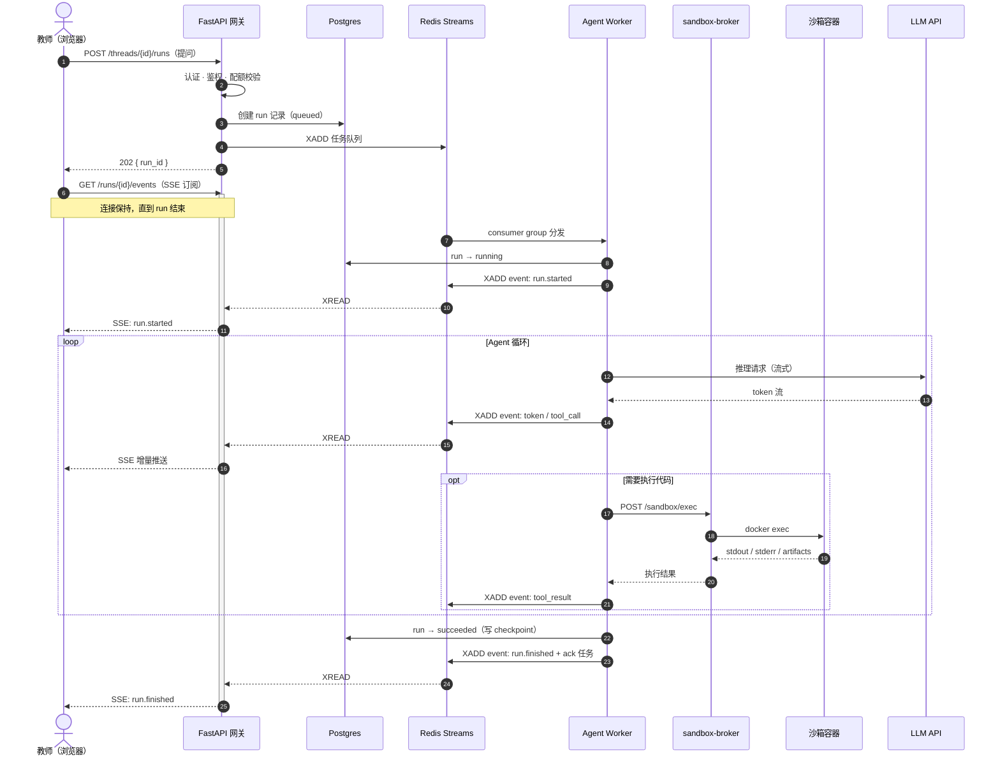
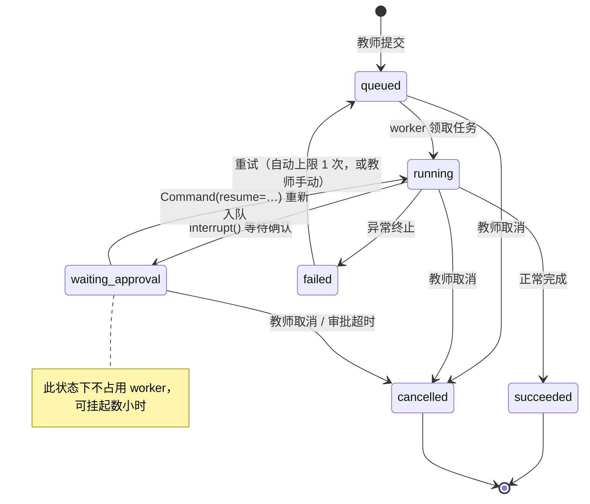
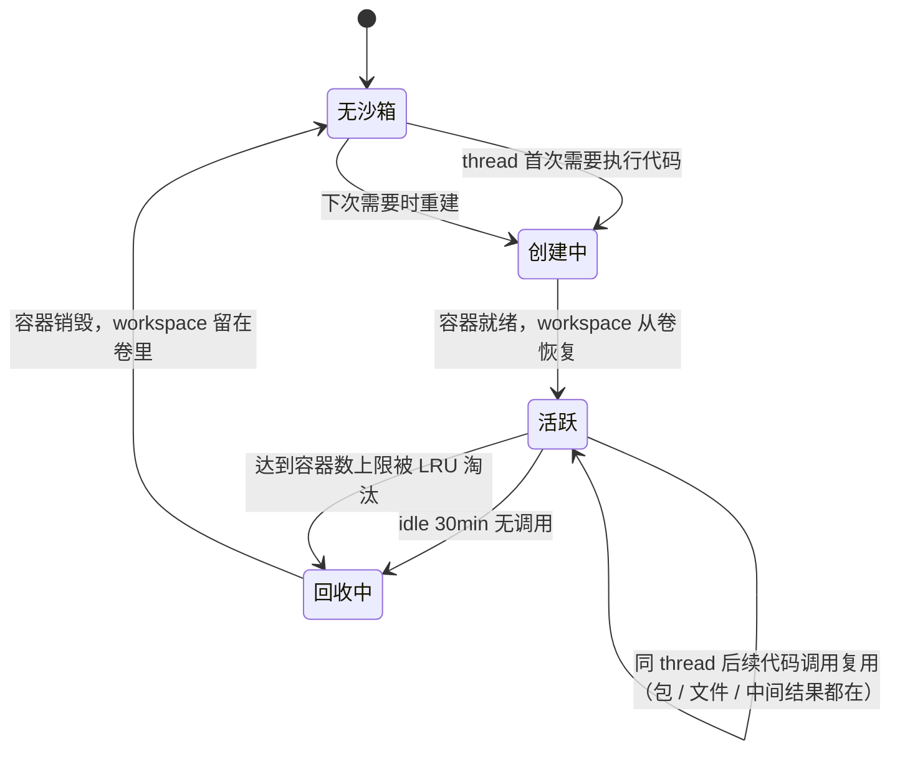

# 运行时与接口设计

| 项 | 值 |
|---|---|
| 上游 | [总体架构](./01architecture.md) |
| 相关决策 | [ADR-0005](./adr/0005-task-queue-redis-streams.md) · [ADR-0006](./adr/0006-event-channel-streams-not-pubsub.md) · [ADR-0007](./adr/0007-sse-over-websocket.md) · [ADR-0008](./adr/0008-langgraph-checkpointer.md) · [ADR-0013](./adr/0013-event-anticorruption-layer-v2-stream.md) · [ADR-0014](./adr/0014-tool-idempotency-key.md) |

本文定义 Run 从提交到终止的运行时语义，以及前端、API、Worker 与 Broker 之间的稳定契约。章节继续使用拆分前的 §5.x 编号，便于追溯历史引用。

---

## 5.1 主流程：提交一次分析任务



要点：

- **提交立即返回 202**，不等执行完成。任务长度决定了不可能同步返回。
- **订阅是独立请求**，与提交解耦。这样刷新页面后可以重新订阅同一个 run。
- **worker 全程只写 Redis 与 Postgres，不直连前端**。网关是前端的唯一出口，鉴权得以集中。

## 5.2 事件流与断线重放

**核心设计：事件流必须持久化，不能用 Redis Pub/Sub。**

Pub/Sub 不持久 —— 教师刷新页面或网络抖动，中间过程就**永久丢失**了。对一个跑几十分钟的任务，这不可接受。

改用 Stream 做 per-run 的事件日志：

```
worker ──XADD──▶ stream:run:{run_id} ──XREAD──▶ 网关 ──SSE──▶ 前端
                        │
                        │ 异步归档
                        ▼
                  Postgres run_events
```

前端用 `@microsoft/fetch-event-source` 自行维护续读位置。同页断线时，它保留最后一条已成功处理的事件 id 与当前 UI，重连请求把该 id 放进 `Last-Event-ID` header，中间事件由 Stream 补齐。后端**只从该 header 读游标**，不接受 query 参数退路。

整页刷新是另一种语义：新页不复用旧页的游标或 UI，而是从 Stream 起点重放到空 reducer，重建完整对话。**绝不只持久化游标**；否则空 UI 会缺少游标之前的所有内容。Stream 设 `MAXLEN` 或 TTL 控制内存，同时异步归档到 Postgres 做长期存储。前端约束详见[前端技术选型 §3.3](./02frontend-selection.md)。

### 事件契约

**worker 不把 DeepAgents 的事件透传给前端**，而是映射成平台自己的事件词汇再 `XADD`。消费 `astream(stream_mode=["updates","messages","custom"], subgraphs=True, version="v2")`。

选型论证（为什么要防腐层、为什么 v2 而不是 v3）见 [ADR-0013](./adr/0013-event-anticorruption-layer-v2-stream.md)。以下是契约本身。

### 事件信封

所有事件共用一个信封，**`type` 之外的字段与事件种类无关**：

```json
{
  "id": "1753948800123-0",
  "type": "token",
  "ts": 1753948800123,
  "run_id": "8f3a…",
  "path": [],
  "data": { }
}
```

| 字段 | 说明 |
|---|---|
| `id` | **直接用 Redis Stream ID**。天然单调递增，天然可做 `Last-Event-ID`，不需要另造序号 |
| `type` | 事件类型，见下方枚举 |
| `ts` | 服务端毫秒时间戳 |
| `run_id` | 冗余，便于前端在多 run 并存时路由 |
| `path` | 子 agent 归属。`[]` 为主 agent，`["research"]` 为该名字的子 agent。**由 DeepAgents 的 `ns` 映射而来，剥掉 task id 只留可读名字** |
| `data` | 按 `type` 定义 |

### 事件类型：两层

**平台层** —— 由我们自己产生，DeepAgents 不参与，**payload 现在即可定死**：

| type | `data` | 触发时机 |
|---|---|---|
| `run.started` | `{ thread_id, resumed }` | worker 领取任务。**`resumed` 的含义是「这不是第一次开跑」**，审批续跑与崩溃重投都为 `true` —— 两者对前端是同一件事：别把已经显示的对话重置（P4 步骤三定案） |
| `run.finished` | `{ status: "succeeded", tokens: { input_cache_read, input_uncached, output } }` | 正常完成。`tokens` 按 §6.4 的口径拆分，**刻意不给总数** |
| `run.failed` | `{ code, message, retryable }` | 异常终止。`retryable` 由 §5.4 的错误分类决定 |
| `run.cancelled` | `{ tokens: { input_cache_read, input_uncached, output } }` | 教师取消或审批超时。worker 在 step 边界发现取消时带上本程已观测用量；api 直接取消与审批超时当前填零（这两条路径拿不到 worker 尚未落库的在途用量） |
| `sandbox.queued` | `{ position }` | 沙箱排队中。**排位每次变化都推**（§8.1） |
| `sandbox.ready` | `{}` | 拿到沙箱，排队结束 |
| `error` | `{ code, message }` | 不终止 run 的非致命错误（如单次工具调用失败但 agent 会重试） |

`run.failed` 与 `error` 的区别是**是否终止 run**。前者是终态，后者是过程中的告警。

**Agent 层** —— 映射自 DeepAgents。**payload 已按 P0 探针实测定案**（2026-08-02）：

| type | 来源 | `data` |
|---|---|---|
| `token` | `messages` 模式 `AIMessageChunk.content` | `{ text }` |
| **`reasoning`** | `messages` 模式 `AIMessageChunk.additional_kwargs.reasoning_content` | `{ text }` |
| `tool_call` | **`updates` 模式 `model` 节点**的 `AIMessage.tool_calls[]` | `{ id, name, args }` |
| `tool_result` | **`updates` 模式 `tools` 节点**的 `ToolMessage` | `{ tool_call_id, name, content, status }` |
| `todo.updated` | `updates` 的 todo 节点 | **仍待定** —— 实测 agent 一次都没调 `write_todos`，无样本 |
| `subagent.started` / `subagent.finished` | `ns` 深度变化 | **仍待定** —— 本期不开子 agent，`ns` 全程为 `()` |
| `interrupt` | 流结束后查 `aget_state()`，见 §5.3 | 已定，见下 |

三点必须注意：

**1. `reasoning` 是新增的类型，不能省。** `deepseek-v4-pro` 的思考过程走 `additional_kwargs.reasoning_content`，与 `content` 是两个字段、交替流出。若都映射成 `token`，前端会把思考过程和正式答复混在一起渲染：

```json
{"__type__": "AIMessageChunk", "content": "", "additional_kwargs": {"reasoning_content": "The"}}
```

**2. `tool_call` 与 `tool_result` 不在同一个节点。** 实测 `updates` 只有三个节点名，且**工具不按名字分节点，全部共用一个 `tools`**：

| 节点 | 出现次数（一次完整分析） | payload |
|---|---|---|
| `PatchToolCallsMiddleware.before_agent` | 1 | `null` |
| `model` | 17 | `{"messages": [AIMessage]}` |
| `tools` | 16 | `{"messages": [ToolMessage]}` |

**3. 若要做「工具参数逐字流式渲染」**，用 `messages` 模式的 `AIMessageChunk.tool_call_chunks`（`{name, args, id, index, type:"tool_call_chunk"}`）；只需一次性拿到完整调用则用 `updates`。

`interrupt` 的 payload 现已可定死（依据见 §5.3）：

```json
{
  "type": "interrupt",
  "data": {
    "actions": [
      {
        "index": 0,
        "tool_name": "execute",
        "args": { "command": "python analysis.py" },
        "allowed_decisions": ["approve", "reject", "edit"]
      }
    ]
  }
}
```

DeepAgents 给的是 `action_requests` 与 `review_configs` **两个平行数组**，worker 侧合并成一个数组并加 `index` —— 前端不该被迫自己对齐两个数组的下标。

### 映射表

chunk 的实际形状是 `(namespace, mode, payload)` 三元组（`stream_mode` 传 list 且 `subgraphs=True` 时）。

| DeepAgents `StreamPart` | 平台事件 |
|---|---|
| `mode="messages"`, `payload=(AIMessageChunk, meta)`，chunk 有 `content` | `token` |
| `mode="messages"`，chunk 有 `additional_kwargs.reasoning_content` | `reasoning` |
| `mode="updates"`, `payload={"model": {"messages": [AIMessage]}}` | `tool_call`（取 `AIMessage.tool_calls[]`） |
| `mode="updates"`, `payload={"tools": {"messages": [ToolMessage]}}` | `tool_result` |
| `mode="custom"`, `payload={…}`（工具内 `get_stream_writer()` 写入） | `sandbox.*` |
| `ns` 由 `()` 变深 / 变浅 | `subagent.started` / `subagent.finished` |

> `custom` 模式在 P0 探针中一条都没观测到 —— 符合预期，当时的 backend 没用 `get_stream_writer()`。§8.1 的 `sandbox.queued` 排队事件靠它，要等排队逻辑实现后才能验证。

### 兼容性规则

前后端各守一条，否则这个契约撑不过第一次迭代：

- **前端必须忽略未知 `type`**，不能报错。后端加新事件类型时不应要求前端同步发版
- **`data` 只增字段，不改已有字段的语义**。前端的 Zod schema 用 `.passthrough()`，不要 `.strict()`

> **注**：`interrupt` **不经过事件流检测** —— 中断会让执行暂停、流自然结束，改为在流结束后查一次图状态。机制见 §5.3。

## 5.3 中断恢复：三种不同语义

DeepAgents 构建在 LangGraph 之上：`create_deep_agent()` 返回编译好的 LangGraph graph，并接受 `checkpointer` 参数。

> **v0.6 写的 `async_create_deep_agent(is_async=True)` 不存在**（2026-08-02 探针核对，deepagents 0.7.1）。异步不需要另一个构造函数，直接 `await agent.ainvoke(...)` / `agent.astream(...)` 即可；子 agent 侧的异步由 `AsyncSubAgent` / `AsyncSubAgentMiddleware` 表达，本期不开子 agent，不受影响。

**因此中断恢复不需要自己造轮子** —— LangGraph 的 checkpointer（生产使用 `AsyncPostgresSaver`）已提供线程级的状态持久化与恢复。详见 [ADR-0008](./adr/0008-langgraph-checkpointer.md)。

但「中断恢复」实际上是三种不同语义，设计上必须分开处理：

| 类型 | 触发场景 | 机制 |
|---|---|---|
| **崩溃恢复** | worker OOM / 被 kill / 滚动发布 | 队列消息未 ack，pending 超时后重投给其他 worker；LangGraph 从最后一个 checkpoint 继续，已完成的步骤不重跑 |
| **人工介入 (HITL)** | agent 执行敏感操作前暂停等教师确认 | LangGraph `interrupt()` → 状态落盘，run 转 `waiting_approval`，worker 释放；批准后用 `Command(resume=...)` 重新入队 |
| **主动取消 / 暂停** | 教师点击「停止」 | Redis 中打 cancel flag，worker 在 step 边界检查后抛 `CancelledError`；已写入的 checkpoint 保留，可从该点恢复 |

第二种是长任务平台的核心价值：**任务可以挂起数小时等人，期间不占用任何 worker 资源**。

### HITL 的具体机制

DeepAgents 的中断**发生在工具调用边界之前**，不是流式过程中的某个事件。这决定了检测方式：

```
astream() 正常消费  →  中断使执行暂停，流自然结束
                    →  查 aget_state() 是否有 pending interrupt
                    →  有则映射成 interrupt 事件，run → waiting_approval
```

选查状态而非查流，是因为它**两套 stream API 都成立**，不依赖「v2 的 `updates` 模式是否吐 `__interrupt__`」这个 DeepAgents 文档未确认的行为。

**中断的数据结构**（DeepAgents 侧）：

```python
Interrupt(
    value={
        "action_requests": [{"name": "execute", "args": {...}}],
        "review_configs": [{"action_name": ..., "allowed_decisions": [...]}],
    }
)
```

**恢复**用 `Command(resume={"decisions": [...]})`，四种决策：

| 决策 | payload | 语义 |
|---|---|---|
| `approve` | `{"type": "approve"}` | 照原样执行 |
| `reject` | `{"type": "reject", "message": "..."}` | 拒绝，message 回给 agent |
| `edit` | `{"type": "edit", "edited_action": {"name": ..., "args": {...}}}` | 改参数后执行 |
| `respond` | `{"type": "respond", "message": "..."}` | 不执行，直接把人的回复作为工具结果 |

**决策数组的顺序必须与 `action_requests` 对齐** —— 这是 DeepAgents 的硬性要求。因此 §5.7 的审批接口对前端**用显式 `index` 而非依赖数组顺序**，由 worker 负责重排。让前端保证顺序是个迟早会出错的契约。

### 恢复时重跑的是 middleware 钩子，不是工具

官方原文：*"any code that ran before the `interrupt()` will execute again"*、*"Do not perform non-idempotent operations before `interrupt()`"*。

v0.6–v0.10 把这句理解成「工具所在节点整个重跑，每次审批都发生」。**P0 探针实测推翻了这个理解**（2026-08-02）：中断落在 `HumanInTheLoopMiddleware.after_model`，工具在另一个节点 `tools` 执行，审批通过后**工具只执行 1 次**。

「`interrupt()` 之前的代码」指的是 middleware 钩子内的代码 —— 那里只组装审批请求，没有副作用。**官方那条告诫仍然有效，但约束的是自定义 middleware，不是工具实现。**

对幂等键的影响见 [总体架构的“至少一次投递配合幂等”原则](./01architecture.md) 修正后的结论与 [ADR-0014](./adr/0014-tool-idempotency-key.md)。

**哪些工具触发审批**由 `interrupt_on` 声明，支持 `when` 谓词做条件拦截：

```python
interrupt_on = {
    "tool_name": {"allowed_decisions": ["approve", "reject"], "when": predicate}
}
```

> **`when` 谓词必须是工具调用的纯函数。** 多个 interrupt 靠**位置索引**匹配 resume 值，官方警告：*"Do not conditionally skip interrupt calls or loop them with **non-deterministic logic**, as this breaks the index-based matching"*。
>
> 举例：「代码涉及删除文件时拦截」✅ 只看 args，是纯函数；「单次执行预估 token 超阈值时拦截」⚠️ 仅当估算只依赖 args 才安全，若掺入外部状态或时间，重放时索引会错位。

**checkpointer 是 HITL 的硬前提** —— 官方明确要求。这与 [ADR-0008](./adr/0008-langgraph-checkpointer.md) 的选择互为印证：checkpointer 不只服务崩溃恢复，也是 HITL 成立的基础。

> ~~**TODO** ｜ 待回答：**本平台到底哪些操作需要审批？**~~ **已于 2026-08-08 关闭，见本块末尾。**
> §5.3 把 HITL 称为核心价值，但没界定触发范围，而 `interrupt_on` 要求逐个工具声明。
> 需要注意的张力：沙箱隔离已经很强（§7.3），代码执行本身**未必**算敏感操作；若给 `execute` 全量加审批，agent 每跑一段代码就要教师点一次，平台会变得没法用。
> 倾向用 `when` 谓词做**条件拦截**（如仅在代码涉及删除文件、或单次执行预估 token 超阈值时），而非按工具名全量拦截。
> 阻塞：需要 P0 跑出真实的 agent 行为模式才知道哪些操作值得拦。HITL 本就排在 P3（[实施计划基线](../03plan/CLAUDE.md)），不急于定。
>
> **P0 首轮行为数据（2026-08-02）**：一次完整分析里 agent 只调了 `ls` / `read_file` / `write_file` / `execute` 四个工具，16 次调用中 `execute` 占多数，**一次 `delete` 都没有**。若按工具名全量拦 `execute`，这一次分析就要教师点十几次确认 —— 印证了上面「会变得没法用」的担心。`delete` 反而是低频高危、适合全量拦的候选。仍是单次样本，继续积累。
>
> **已关闭（2026-08-08，[P3 计划 §7.2](../03plan/P3-plan.md)）：P3 只全量拦 `delete`，不写任何 `when` 谓词。** 上面那句「`delete` 是适合全量拦的候选」被采纳为定案。`execute` 的条件拦截推后，**加它之前先补一条观察项**（一次真实分析里谓词命中几次）—— 命中 0 次说明太严，命中十几次说明平台没法用，不量就定是在猜。

> **注意**：本平台没有真实用户，因此「继续积累行为样本」这条路是走不通的（[P3 计划 §7.2](../03plan/P3-plan.md) 说明）。上面的定案是**明知证据不足仍先定一版**，靠「只拦低频高危工具」把定错的代价压到最低。

## 5.4 Run 状态机



### 重试分两层，不要混

| 层 | 对象 | 是否改 run 状态 | 机制 |
|---|---|---|---|
| **调用级** | 单次 LLM 调用、单次 broker 请求 | 否 | worker 内部指数退避重试。**这是主要手段**，绝大部分瞬时故障在这一层就消化了 |
| **run 级** | 整个 run（`failed → queued`） | 是 | 重新入队，从 checkpoint 续跑 |

### 错误分类

| 类别 | 例子 | 调用级重试 | run 级重试 |
|---|---|---|---|
| **瞬时** | LLM 429 / 5xx、网络超时、broker 暂时不可达 | 指数退避 1s → 2s → 4s，上限 3 次 | 允许，**上限 1 次** |
| **资源** | 沙箱排队超时（§8.1） | 不适用 | 允许，**上限 1 次**，固定延迟 30s |
| **永久** | 配额耗尽、参数校验失败、agent 代码逻辑错 | 否 | **否** |
| **未知** | 未分类异常 | 否 | **否**，按永久处理 |

分类结果同时决定 §5.2 中 `run.failed` 事件的 `retryable` 字段，前端据此决定要不要显示「重试」按钮。

### run 级自动重试上限定为 1 次

这个数字比通常的 3 次保守得多，是**故意的**：run 级重试会从 checkpoint 恢复，而崩溃若发生在工具执行途中，该节点会整个重跑（[总体架构的“至少一次投递配合幂等”原则](./01architecture.md)）。在 §5.6 的幂等键落地之前，每多一次自动重试就多一次副作用重复执行的机会。

超过上限转 `failed` 终态，由教师手动决定是否重试 —— 把判断交给人，比让系统盲目重试安全。

> **§5.6 的幂等键落地后可以放开这个上限**（调到 3 次比较合理）。在那之前不要调高。
>
> **2026-08-02 复核：这个上限维持 1 次不变。** [总体架构的“至少一次投递配合幂等”原则](./01architecture.md) 的实测改正只否掉了「HITL 审批恢复」那条路径，而本节的理由从来就是「崩溃发生在工具执行途中」—— 那条路径不受影响，仍然成立。
>
> **2026-08-09 发现：这一节从未落地，实现是「一次都不自动重试」。** `run/executor.py` 的模块 docstring 写的是「没有自动重试：失败时只在 `run.failed` 里给出 `retryable`，重不重试由人决定」，`runs` 表里也没有记重试次数的列 —— 也就是说本节设计的那 1 次从来没有实现过。**尚未裁决是改文档还是补实现**：两者都说得通（本节的理由是「幂等键没落地之前少重试一次少一次风险」，而 §5.6 的幂等键已于 P3 落地，因此放开重试的前提其实已经具备）。孤儿收割器（§8 运维那节）不依赖这个裁决 —— 它不重投的理由是多副本会撞出双重执行，与重试几次无关。

### `waiting_approval` 超时

| 项 | 取值 | 理由 |
|---|---|---|
| 超时时长 | **24 小时**，超时后转 `cancelled` | 教师可能下班后才看到，几小时太短；但也不能永久挂着 |
| 是否占用**并发 run 配额** | **不占用** | 并发配额限制的是资源占用，而 `waiting_approval` 不占 worker 也不占沙箱（§5.3）。若占用，教师忘了点确认就会把自己的配额锁死一整天 |
| 是否占用**待审批数上限** | 占用，上限 5 个 | 不占并发配额不等于可以无限堆积。这是防堆积的那道闸，与资源无关 |

这个区分是刻意的：**「占资源」和「占名额」是两回事**，用同一个配额同时管两者会让其中一个失效。

## 5.5 沙箱生命周期

Agent 会分多步执行代码（先 `pip install`，再读数据，再计算，再画图）。如果每次调用都开新容器，前一步装的包和写的文件全部丢失。因此采用 **per-thread 长驻**而非 per-call，详见 [ADR-0003](./adr/0003-sandbox-per-thread-lifecycle.md)：



**文件持久化** —— 让容器可以随时销毁重建，状态留在 workspace 卷里：

```
沙箱容器 /workspace
    ↕ bind mount
宿主机 /data/sandbox/{thread_id}/
```

DeepAgents 的文件工具由自实现的 `SandboxBackend` 接到这个 workspace 上：**文件操作由 broker 直接读写宿主机的 bind-mount 目录，只有 `execute` 进容器**（[ADR-0016](./adr/0016-sandbox-filesystem-backend.md)、[智能体设计 §4](./03agent-design.md)）。因此容器是无状态可抛弃的，且上图的回收不影响文件读写。

## 5.6 Agent 侧的工具接口

工具集就是 DeepAgents 内置的 8 个，**不自定义工具** —— 只把驱动它们的 backend 换成自实现的 `SandboxBackend`（[ADR-0016](./adr/0016-sandbox-filesystem-backend.md)）。完整契约见[智能体设计 §3](./03agent-design.md)：

| 工具 | 需要活跃容器 | broker 去重 |
|---|---|---|
| `ls` / `read_file` / `glob` / `grep` | ❌ | 否（纯读） |
| `write_file` / `edit_file` / `delete` | ❌ | **是** |
| `execute` | ✅ | **是** |

这些工具在 worker 进程里全部是 `async`，内部通过 HTTP 调用 sandbox-broker，**worker 只是在等 IO**。这一性质是 §8.1 并发模型成立的前提。

### 幂等性

按 [总体架构的“至少一次投递配合幂等”原则](./01architecture.md) 的重放分析，工具在**崩溃路径**上会被重复调用（HITL 路径已由实测排除，见 [总体架构的“至少一次投递配合幂等”原则](./01architecture.md)）。换用内置工具集后，不幂等的**不止 `execute`**：`edit_file` 重放时 `old_string` 已不存在、`delete` 重放时文件已不存在，都会返回一个首次执行时没有的错误，使 LLM 的后续行为偏离。三者的实测行为见[智能体设计 §3.3](./03agent-design.md)（`write_file` 已确认是覆盖写，单次幂等）。

**方案：worker 传 `tool_call_id`，broker 对全部写操作去重**，命中已执行记录则直接返回缓存结果（含错误结果），不进沙箱。

```
worker ──POST /sandbox/{op} { tool_call_id, ... } ──▶ broker
                              已执行过该 id？ ──是──▶ 返回缓存结果
                                    否 ──▶ 执行 → 记录 → 返回
```

这样**单个工具是否幂等就不再是正确性的前提**。论证、备选与残留风险见 [ADR-0014](./adr/0014-tool-idempotency-key.md)。

> **去重键已改为 `(thread_id, checkpoint_ns)`**（2026-08-03 定案，[ADR-0014 §落地方式](./adr/0014-tool-idempotency-key.md)）。上图里「worker 传 `tool_call_id`」改成传这两项。
>
> `tool_call_id` 的重放稳定性验证是通过的，但**backend 拿不到它** —— `BackendProtocol.write(file_path, content)` 的签名里没有，middleware 拿得到却不往下传，`get_config()['configurable']` 里也没有。而 worker 侧唯一能改的就是 backend 实现。
>
> `checkpoint_ns` 则两个条件都实测满足：崩溃重放前后一致；且 LangGraph 把每个工具调用扇出成独立 task，同一轮的并行调用拿到的 ns 不同，因此它按**调用**唯一而非按节点唯一。

## 5.7 对外接口概要

**本节只定关键路径与全局约定。** 完整的请求/响应 schema 由 FastAPI 自动生成的 OpenAPI 文档（`/docs`）为准 —— 手写字段级文档必然与代码脱节。

所有路径前缀 `/api`。**认证一律靠 §7.2.2 的 Session Cookie**，没有 `Authorization` 头。

### 关键路径

| Method | Path | 说明 | 成功响应 |
|---|---|---|---|
| POST | `/auth/login` | 登录 | 200 + `Set-Cookie` |
| POST | `/auth/logout` | 登出，销毁 Redis session | 204 |
| GET | `/auth/me` | 当前用户（含 role；**「所属组」P3 不返回**，见 §6.2） | 200 |
| GET | `/threads` | 会话列表，游标分页 | 200 |
| POST | `/threads` | 新建会话 | 201 `{id}` |
| GET | `/threads/{id}` | 会话详情（含 `agent_config`） | 200 |
| PATCH | `/threads/{id}` | 改标题 / `agent_config`，两个字段各自可选 | 200 |
| DELETE | `/threads/{id}` | 删除会话：**软删** + 沙箱与 workspace 目录真删 | 204 |
| GET | `/threads/{id}/runs` | 会话内的执行历史，游标分页 | 200 |
| GET | `/threads/{id}/files` | 工作目录的结构（扁平条目表，含目录） | 200 |
| POST | `/threads/{id}/files` | 上传一个数据文件（multipart，字段名 `file`）到 workspace | 201 |
| GET | `/threads/{id}/files/content?path=` | 按行分页读一个文件，给代码查看器用 | 200 |
| GET | `/threads/{id}/files/raw?path=` | 取原始字节；`download=1` 时另存为 | 200 |
| DELETE | `/threads/{id}/files?path=` | 删一个文件（目录删不了） | 204 |
| **POST** | **`/threads/{id}/runs`** | **提交一次分析，立即返回** | **202 `{run_id}`** |
| GET | `/runs/{id}` | run 详情与当前状态 | 200 |
| **GET** | **`/runs/{id}/events`** | **SSE 事件流，见 §5.2** | **200 `text/event-stream`** |
| POST | `/runs/{id}/cancel` | 主动取消（§5.3） | 202 |
| POST | `/runs/{id}/approve` | HITL 审批回传，见下 | 202 |
| GET | `/admin/users` | 用户列表（仅 `admin`） | 200 |
| PATCH | `/admin/users/{id}` | 改角色 / 配额 / 启禁用 | 200 |

**工作目录是文件与产物的唯一存储路径。** 教师上传的数据、agent 写的脚本与交付的图表都在会话的 workspace 里，统一经 `/threads/{id}/files/*` 列出、预览、下载与删除；不再有 `artifacts` 表或对象存储上的第二份身份。

`/threads/{id}/files/raw` 由 api 完成鉴权与路径解析，然后回 `X-Accel-Redirect`，由 nginx 从挂载的 workspace 直发字节；nginx 的目标 location 是 `internal`，外部不能绕过 api 直读。开发机直跑 uvicorn、没有 nginx 时才退回经 broker 边收边发，内存占用与文件大小无关。

`path` 一律走**查询参数**而不是路径段：文件名里带 `/`、`#`、`?` 与中文都是常事，塞进路径段要在两侧各写一遍转义，错一次就是一个打不开的文件。

上传**一次一个**。多文件批量要么整批退回（一个坏名字连累其余），要么允许部分成功——而后者就得额外规定「整批都失败时仍要给 2xx 之外的码」，否则 `curl -fsS` 那类「非 2xx 才算失败」的调用方会以为传上去了（验收脚本正是这么判的）。两条都是为「一次选十个」付的复杂度，而前端一个一个发同样做得到，还天然有逐个的进度与重试。响应里的 `path` **不能靠 `directory + filename` 拼**：文件名会被收成末段，拼出来的可能不是真正落盘的那个。

请求体上限由 `UPLOAD_MAX_BYTE` 与 nginx 的 `client_max_body_size` 两侧对齐（都是 64 MiB），两边不一致时大的那一侧形同虚设。**超限时答话的是 nginx，而它的 413 正文是一段 HTML，不是平台的 `{"error":{code,message}}`** —— 2026-08-11 实测确认。前端处理这一条只能认状态码，不能去解正文；api 那道闸只在没有 nginx 时（开发机直跑 uvicorn）才会答话。

**上传这条路上字节是整块进内存的**（`UploadFile.read()` 之后还要 base64 一次交给 broker），实测 60 MiB 的一次上传让 api 进程涨了约 78 MiB。上限就是这块内存的上限，因此它不能随手调大。**下载那条路相反** —— 有 nginx 时 api 不经手字节，直跑 uvicorn 时的退路也是边收边发，实测 300 MiB 的文件下载全程只涨了 1.6 MiB。

### 审批接口的 payload

对应 §5.2 的 `interrupt` 事件，每个 `action` 回一个决策：

```json
{
  "decisions": [
    { "index": 0, "type": "approve" },
    { "index": 1, "type": "reject",  "message": "这段代码会删掉原始数据" },
    { "index": 2, "type": "edit",    "edited_action": { "name": "…", "args": { } } },
    { "index": 3, "type": "respond", "message": "直接用去年的口径即可" }
  ]
}
```

**用显式 `index`，不依赖数组顺序。** DeepAgents 的 `Command(resume=...)` 要求决策顺序与 `action_requests` 严格对齐（§5.3），但把这个约束透给前端是个迟早出错的契约 —— 由 worker 按 `index` 重排。缺失或重复的 `index` 一律 `VALIDATION_ERROR`。

### 分页：游标，不用 offset

```
GET /threads?cursor=<opaque>&limit=20
→ { "items": [...], "next_cursor": "..." | null }
```

会话列表按 `updated_at DESC` 排序，而这个字段**会因为新消息而变动**。offset 分页在翻页过程中若有会话被顶到首页，就会漏掉或重复条目。游标用 `(updated_at, id)` 复合值编码，避免这个问题。

会话历史（`/threads/{id}/runs`）用同一套游标，复合值换成 `(started_at, id)`，走 `runs(thread_id, started_at DESC)` 那条索引。**游标是不透明的**：解析不了一律 `VALIDATION_ERROR`，不当成「从头开始」—— 那会让客户端收到一整页重复数据而看不出发生了什么。

### 聊天历史：两段拼起来，不是一个接口

翻看以前的对话要两次请求：`GET /threads/{id}/runs` 给出「问了什么、结局如何」，每一轮的过程再单独取。

**过程按 run 的状态分两条端点走**（2026-08-16 改，此前两者共用 `/events`）：还在跑的那一轮订阅 `GET /runs/{id}/events`，它要的是「新事件一产生就推过来」；已经终态的那些走 `GET /runs/{id}/replay`，一次取完即止。

原先一条端点兼办两件事，省掉了前端的一套代码，代价是**拿一条长连接去读一份不再变化的历史**：连接断了要重连，而每次重连都消耗一个频率限流名额。这个代价在 2026-08-16 兑现成了一次真实故障——一条被 429 拒掉的流以固定 1 秒重连，速率高过 60 秒滑动窗口的清空速度，闸门再也开不了，症状是「点什么都是 429」而没有一处指得出源头在一条流上。一次性端点读完即止，失败就是失败，不会自己把自己喂饱。

**回放端点合并相邻的同类增量**：`token` 与 `reasoning` 逐个推是打字机效果的前提，翻旧账没有这个前提。实测一条 run 由 201 条 / 31.5 KB 降到 5 条 / 1.8 KB，而前端把增量拼进同一段的结果与合并前逐字相同。只合并相邻的、同类且同 `path` 的那些——跨工具调用会让文本前后颠倒，跨 `path` 会把两个子 agent 的话混成一句。

**仍然不把事件塞进历史列表**：一轮实测 1602 条（814 token 增量 + 767 reasoning + 9 对工具调用/结果 + 3 个生命周期），塞进列表会让打开会话变成一次几 MB 的下载，而教师多数时候只想看到问题与结论。前端因此只重放最近一两轮，往上滚再拉更早的。

> **`runs.content` 是这条路的前提**（2026-08-11 定案，迁移 `0008_thread_history`）。此前提问只随任务消息走、跑完就没了，而事件流里没有承载它的事件——把一个 run 的事件全部重放一遍，重建出来的对话只有 agent 那一半。历史行在这一列上是 NULL，那是遗留而不是待回填的空缺。

#### 能翻多久：两层，只有一层无限

| 层 | 存哪 | 保留期 |
|---|---|---|
| 骨架（问了什么、结局、用量） | `runs` | **不清**，永久 |
| 过程（agent 的输出、工具、图） | `run_events` | **180 天**（§6.5） |

超过 180 天的那一轮只剩骨架，没有 agent 那一半。这是有意的取舍——`run_events` 是全库最大的表。

> **超期之后必须是空流，不能是挂着**（2026-08-11 修复）。事件全部过期之后，事件层面看到的是「一条都没有」，而这与「run 刚提交、worker 还没写第一条」**完全无法区分**——前者该收尾，后者该接着等。此前一律按后者处理，于是订阅一个半年前的 run 会永远挂着且不报错，前端只是一直转圈。
>
> 判据改取 `runs` 表里的状态：那一行不随保留期清理，是事件没了之后唯一还答得出「它结束了没有」的东西。SSE 端点把它传给事件日志（不额外查库——越权检查已经把状态拿回来了）。
>
> **只在「一条事件都没有」时用这个判据。** 不能拿它去短路「有事件但最后一条不是终态」那一支：执行器是先落库终态、再推终态事件的，中间那一瞬状态已经变了而事件还没到，收尾会把 `run.finished` 漏掉——教师看到的是一次卡在最后一步的分析。
>
> 在此之前这个缺陷碰不到：没有任何接口能列出旧 run，所以没人点得到它们。是本次的会话历史接口把它暴露到了主路径上。

### 会话标题：首次提问后由辅助模型起

新建的会话标题是空的。**第一次提问之后**，网关挂一个响应之后的后台任务，用辅助模型跑一次概括写回 `threads.title`；教师随时可以 `PATCH` 改掉，改过的不会被盖。

**不让教师先起名**：那是一道横在「我想问个问题」前面的门槛，多数人会跳过它，于是侧边栏变成一排「未命名」。**挂在响应之后**：提交那条路要在几十毫秒内返回 202，而模型往返要几秒。起不出来就留空，不影响任何一次分析。

这次调用的 token **不计入教师配额，也不进成本看板**——它不属于任何一个 run，且输入几十、输出十几个 token，相对一次分析的几万是千分之几。

> **不要给它设 `max_tokens`**（2026-08-11 实测）。辅助模型是推理模型，那个参数掐的是「推理 + 输出」的总和，而推理不会因为预算见底就收尾：48 / 256 / 512 / 1024 四档全部把额度花光在推理上、`content` 一个字不剩，而**每一次都是 HTTP 200**——调用成功、日志全绿、标题恒为空。止损交给超时（60 秒）与标题长度的硬截断（20 字）。超时同样不能掐紧：15 秒会在真实长度的提问上把第一次调用掐掉，客户端接着重试一次，总耗时反而 18 秒还白花一份 token。

### 统一错误结构

```json
{
  "error": {
    "code": "QUOTA_EXCEEDED",
    "message": "今日 token 配额已用尽，明日 0 点重置",
    "details": { "used": 120000, "limit": 120000 }
  }
}
```

`code` 是**稳定的机器可读枚举**，前端据此决定行为；`message` 是中文，前端可直接展示。二者职责不能混 —— 改 `message` 的措辞不应该导致前端逻辑失效。

| code | HTTP | 场景 |
|---|---|---|
| `UNAUTHENTICATED` | 401 | 未登录或 session 过期 |
| `FORBIDDEN` | 403 | 越权访问他人资源，或非 admin 调管理接口 |
| `NOT_FOUND` | 404 | 资源不存在。**越权时也返回 404 而非 403**，避免探测他人资源是否存在 |
| `VALIDATION_ERROR` | 422 | 参数校验失败 |
| `RATE_LIMITED` | 429 | 接口频率限制（§7.5） |
| `QUOTA_EXCEEDED` | 429 | token 日配额耗尽（§6.4） |
| `CONCURRENCY_LIMIT` | 429 | 并发 run 数超限（§6.4） |
| `INTERNAL` | 500 | 未分类错误 |

**三个 429 必须用 code 区分。** 它们的用户提示语和前端行为完全不同：频率限制该自动退避重试，配额耗尽该提示明天再来，并发超限该提示先等已有任务跑完。只给 HTTP 429 的话前端无法区分。

> `NOT_FOUND` 覆盖越权这一条与 §6.3 的数据层隔离配合：repository 层注入 `user_id` 过滤后，他人的资源本来就查不出来，自然落到 404 分支 —— 不需要额外写鉴权判断，这是把隔离做在数据层的一个副产品。

---
