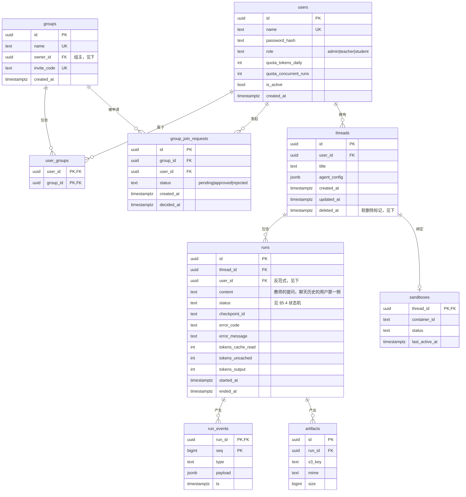

# 数据设计

| 项 | 值 |
|---|---|
| 上游 | [总体架构](./01architecture.md) |
| 相关设计 | [运行时与接口设计](./05runtime-design.md) · [安全设计](./07security-design.md) |

本文定义存储职责、业务数据模型、租户隔离、配额口径和数据生命周期。章节继续使用拆分前的 §6.x 编号，便于追溯历史引用。

---

## 6.1 存储选型

| 组件 | 用途 | 选它的理由 |
|---|---|---|
| **Postgres** | 用户、会话、run 元数据、事件归档，以及 LangGraph checkpoint 表（`AsyncPostgresSaver` 自动建表） | checkpoint 是恢复能力的根基，必须落在有事务保证、可备份的存储上 |
| **Redis** | 任务队列、事件流、取消标志、分布式限流 | 队列与事件流都要求高频读写 + 可过期，且已因 Streams 而必需，不再引入第二个中间件 |
| **MinIO** | 分析产物（图表、Excel、报告）；**兼作 Tempo 与 Loki 的对象存储后端**（§8.3） | 产物是二进制大对象，不适合放数据库；S3 协议便于将来迁移。路径按租户前缀隔离 |

## 6.2 数据模型草案

LangGraph 的 `checkpoints` / `checkpoint_writes` 表由 `AsyncPostgresSaver` 自建，不在此图中，也**不要手工改动**。

> **`sandboxes` 表大概率永远不建**（2026-08-07）。设计它是为了存容器映射与 `projid`，但 P1 两个用途都用了更简单的方案：容器靠 label 认领（[`sandbox/container.py`](../../app/sandbox/container.py) 的 `running_sandbox`），`projid` 从 `thread_id` 派生而不查表（[ADR-0015](./adr/0015-sandbox-disk-quota-xfs.md) 原写的表映射已被取代）。留在图里是为了说明它为什么不需要，不是待办。

**Session 不落 Postgres** —— 按 §7.2.2 存在 Redis，因此没有 `sessions` 表。

> **`artifacts` 于 P4 建表**（2026-08-08）。它的主键同时是产物的对外标识，但**不是唯一的一种** —— P4 之前的历史事件里存的是旧形状 `{thread_id}/{相对路径}`，而 `run_events` 保留 180 天，端点因此在兼容期内同时认两种（§5.2 的 `run.finished`）。**表里的每一行都必须指向一个真的对象**：上传失败的产物不落表，走 workspace 回落那条路。

### 五个需要说明的设计选择

**1. `runs.user_id` 是有意的反范式。**

严格范式下 run 的归属应经 `threads` 推导。冗余这一列是因为两条高频路径都要按用户聚合：§6.4 的 token 配额统计、§6.3 的隔离过滤。每次都 join `threads` 不值得。代价是写入时要保证与 `threads.user_id` 一致 —— 由创建 run 的唯一入口（§5.7 的 `POST /threads/{id}/runs`）保证，不做触发器。

**2. `run_events` 不冗余 `user_id`。**

它是全库最大的表，且唯一的查询模式是「按 `run_id` 顺序重放」，已由主键 `(run_id, seq)` 覆盖。越权检查在**上一层**做：先验证 run 属于当前用户，再读事件。

**3. `agent_config` 用 JSONB，不拆列。**

它是整体读写的配置块，从不按字段查询；且 §1.2 的后续方向（自定义提示词、skill、MCP）会持续往里加字段。拆列意味着每次加功能都要迁移。

> **2026-08-13：这个判断兑现了，但要补两件事（[P6 决策 H1 / H3](../03plan/P6-decision.md)）。**
>
> **① 它从 P3 建表起横跨三期没有被读过一次。** `PATCH /api/threads/{id}` 写得进、`GET` 读得出、测试也覆盖了它，**而装配层从来没看过它一眼** —— `agent/factory.py` 的 `system_prompt` 是硬编码常量。P6 起它第一次真正生效。**这是本平台「写得进、读不出、门禁全绿」这类失效最完整的一个样本**，P6 的验收口径（「配与不配，行为可见地不同」）就是从它推出来的。
>
> **② 要加一个同名列到 `runs` 上，语义不同。**
>
> | 列 | 语义 |
> |---|---|
> | `threads.agent_config` | 这个会话的**默认**配置 |
> | `runs.agent_config`（P6 新增） | 这一次 run **实际生效的快照** |
>
> 快照而非引用，是因为配置可以每次提问都改（J5），而「那次 run 当时用了什么」是出事时第一个要问的问题 —— 与 §5.2 事件日志不可变是同一条精神。
>
> **③ JSONB 不等于不校验。** P6 起用 pydantic 模型（`AgentConfig`）严格校验，四条规则集中在这一处执行：skill 不得重名、被选作子智能体的 agent 其 `subagents` 必须为空、子智能体不超过 5 个、用户提示词不超过 4000 字符。**裸 `dict[str, object]` 的失效方式是静默的** —— 写错一个 key 不报错，只是不生效。

**4. 删会话是软删除（`threads.deleted_at`）。**（2026-08-11 定案，迁移 `0008_thread_history`）

硬删会撞上 `runs.thread_id` 的外键，而顺着删掉 runs 等于把成本账本挖掉一块 —— `runs` 正是下方生命周期表里明确「不清」的那张。**教师删会话要的是「从我的列表里消失、别再占磁盘」**，两件事分别由这一列和「broker 真删 workspace 目录 + 销毁沙箱」负责，都不需要动 `runs`。

代价是每条会话查询都要多带一个 `deleted_at IS NULL`。两个过滤条件（归属 + 未删）集中在仓储的一处，各写各的迟早会漏掉一处，而漏掉的症状是「删了还在」。

放弃的替代方案：**级联删 runs**（账本出洞，成本看板的历史缺一段）、**拒绝删有 run 的会话**（教师删不掉任何用过的会话，等于这个功能不存在）。

**5. `runs.content` 存教师的提问。**（同上）

在这一版之前提问只随任务消息走、跑完就没了，而事件流里没有承载它的事件 —— 于是「翻看以前问过什么」做不到（详见 §5.7 聊天历史）。checkpoint 里的 messages 不能当数据源：那是 LangGraph 自建的表，保留期比 `runs` 短得多，且它不是业务的真相源。

### 索引

| 索引 | 支撑的查询 |
|---|---|
| `threads(user_id, updated_at DESC)` | 用户的会话列表（§5.7 分页） |
| `runs(thread_id, started_at DESC)` | 会话内的执行历史 |
| `runs(user_id, started_at)` | per-user token 用量统计（§6.4） |
| `runs(status) WHERE status IN ('queued','running')` | 部分索引。崩溃后扫描待恢复的 run |
| `run_events(run_id, seq)` | 主键。事件重放与 `Last-Event-ID` 续读 |
| `user_groups(group_id)` | 反查组成员（`user_id` 方向已由主键前缀覆盖） |
| `group_join_requests(group_id, user_id) WHERE status = 'pending'` | 条件唯一索引。同一个人在同一个组里只能挂着一条待审批，同时支撑组主的待办列表 |
| `artifacts(run_id)` | 列出一次执行的产物 |
| `sandboxes(last_active_at)` | LRU 回收扫描（§5.5） |

> ~~**TODO** ｜ 待回答：组内共享的 skill / 提示词表是否要提前预留~~
> **已关闭（2026-08-08，[P3 计划 §7.6](../03plan/P3-plan.md)）：不预留，而且连 `groups` / `user_groups` 也不建。**
>
> 原文倾向不预留 skill 表，理由是「现在猜它的字段，和将来照实际需求建表，成本差不多，但猜错要迁移」。P3 定案把**同一条理由推到了 `groups` 上** —— 两处不该用两套标准，何况那两张表只有三列与两列，将来照实际需求建也谈不上「推倒重来」。
>
> **skill 表至今仍未预留**，这一条不变。
>
> **组表已于 2026-08-11 建出（迁移 `0007_group`）**，触发它的正是 ADR-0010 自己列的重估条件「出现需要按组区分权限的实际需求」：教师要凭邀请码招学生、管人、批申请。当初「等照实际需求再建」的判断因此得到兑现而不是被推翻 —— 现在建出来的三张表比当时猜的多了三样东西，而这三样恰恰是当时猜不出来的：
>
> - `groups.owner_id`：组主。没有它就没人能批申请
> - `groups.invite_code`：注册时的准入凭证，全库唯一
> - `group_join_requests`：申请与审批这条流程本身
>
> **组仍然不改变任何数据可见性**（§6.3 那张表照旧）：它是名册与准入，不是权限边界。
> **因此 `/auth/me` 依然不返回「所属组」** —— 所属组走 `/groups/mine`，认身份这条路径不必每次多查一张表。

## 6.3 多租户隔离

§7.2 引入课题组后，隔离不再是单一维度，而是**两级**：

| 资源 | 可见范围 | 实现 |
|---|---|---|
| 会话 thread、run、事件、产物、上传的数据文件 | **严格私有**，仅所属 `user_id` 可见 | `thread_id` 强绑 `user_id` |
| 课题组共享的 skill、智能体提示词配置 | **组内可见**。用户可属多个组，可见范围是所有所属组的**并集** | ~~按 `user_groups` 关联表过滤（本期不实现，见 §1.2）~~ → **P7 起实现**，见下 |

> **`user_groups` 建表之后这张表仍然一行未改（2026-08-11）。** 组做的是名册与准入，
> 不是可见性 —— 教师看不到组内学生的会话，也看不到他们的用量。上面那条「组内可见」
> 至今没有任何资源挂在上面，它描述的仍是将来。

> **2026-08-13：「将来」到了 —— 第二行第一次有资源挂上去（[P6 决策 B1 / B2](../03plan/P6-decision.md)）。**
>
> 可见性定为**三档**而不是这张表暗示的两档：**私有 / 组内（免审）/ 平台目录（要审）**。砍掉的是「全院可见但不经审核」这个中间态。
>
> **过滤方式比原文写的更重**：定案允许一个资源**同时共享给多个组**（B2），因此要多一张 `resource_group` 关联表（`resource_kind` + `resource_id` + `group_id`），而**「我能看见哪些」这个查询从单列过滤变成 JOIN** —— 它出现在每一个列表端点上，是 P7 之后被调用最频繁的一条查询。
>
> **第一行一字未改，这是本次最容易被顺手破掉的边界。** 共享的是**配置类资源**（skill 文件、提示词、MCP 选择），不是会话、上传的数据文件与产物。skill 共享给组，与「组员能看见我上传的 CSV」之间只隔一个 join —— 而那条边界一旦开就收不回来（[安全设计 §7.2.1](./07security-design.md) 的同一条告诫）。

所有查询在 repository 层统一注入过滤条件（或直接启用 Postgres RLS）。

**不要指望每个接口都记得加 where 条件。** 这是多租户系统最常见的越权来源 —— 隔离必须做在数据访问层，而不是靠每个业务接口自觉。

**管理员不例外。** §7.2.1 规定管理员不可查看他人的会话内容与上传数据，因此管理员身份**不应该**在数据访问层被实现成「绕过过滤」的旁路。这条边界最容易在后期为了「方便排查问题」而被悄悄破坏，一旦破坏就很难再收回来。

## 6.4 配额

LLM 调用是真实成本。至少需要 per-user 的 **token 日配额** + **并发 run 数上限**，否则单个用户就能占满整个 worker 池和沙箱池。

**必须按角色分级**（§7.2.1 确认后新增）。`teacher` 与 `student` 在权限上完全相同，**配额是二者唯一的实质差别**，也是控制成本的唯一手段 —— 学生人数通常远多于教师，若配额相同，成本结构会由学生侧主导。

### 计量口径：必须按 cache 命中拆分（2026-08-02 P0 实测）

一次典型分析（持仓 CSV → 按行业算年化波动率 → 出图）的实测消耗：

| 运行 | 模型调用 | input | 其中 `cache_read` | 未命中 | output | 其中 reasoning |
|---|---|---|---|---|---|---|
| 完整分析 | 17 次 | 304,640 | 189,312（**62.1%**） | 115,328 | 8,701 | 1,670 |
| 一次简单问答 | 2 次 | 5,918 | 5,760（97.3%） | 158 | 90 | 36 |

DeepSeek 有 prompt cache，`usage_metadata.input_token_details.cache_read` 直接给出命中量。**配额不能按 `input_tokens` 总数扣**，两个理由：

1. **高估成本约 1.6 倍** —— cache_read 的计费单价远低于未命中部分；
2. **方向性错误** —— 会话越长，命中率越高、边际成本越低，而按总数扣却扣得越狠。这等于惩罚正是平台想鼓励的长会话深度分析。

**口径：分开记 `cache_read` 与未命中两个数，配额按未命中部分加权计算。** 两个值都在 `usage_metadata` 里现成，不需要额外统计。

> ~~**TODO** ｜ 待回答：具体配额数值、超额后的行为、配额重置周期~~
> **已关闭（2026-08-08，[P3 计划 §7.2](../03plan/P3-plan.md)）：P3 给一版保守初值，全部可配置，每个都注明外推依据。**
>
> 原文写的是「需要 P0 跑更多真实任务积累分布后再定数，数值可以后填」。**这条路走不通**：平台没有前端也就没有真实用户，所有样本都是验收脚本跑的同一个 case，等不到分布。而「数值后填」意味着上线时没有任何成本闸门 —— **LLM 调用是真金白银**，这个代价比定错一版初值大得多。
>
> 单次分析约 31 万 token（见上表）仍是唯一的实测输入，初值由它外推。
>
> **超额行为与重置周期其实早就定了，只是没写在这里**：§5.7 的错误表里 `QUOTA_EXCEEDED` 的 message 原文是「今日 token 配额已用尽，明日 0 点重置」—— 那句话同时定了「拒绝」和「每日 0 点重置」。本条 TODO 与 §5.7 一直互相矛盾着，2026-08-08 以 §5.7 为准。

## 6.5 数据生命周期

**workspace 回收已定案（2026-08-07）：P1 不回收，只做可见性；归档删除跟着 MinIO 走 —— 该期次已于 2026-08-08 定在 P4。**

原先这里写的是「磁盘占用是**历史 thread 总数 × 最多 5GB**，不做会撞墙」。P1 跑完后实测把这个判断校准了：

| 项 | 实测（2026-08-07，7 个真实会话） |
|---|---|
| 单会话占用 | 最大 408 KB，典型 ~350 KB（一张产物 PNG 占绝大部分） |
| 与 5GB 配额的距离 | **四个数量级** |
| 按 100 教师 × 50 会话/年 推算 | 约 2.5 GB/年 |

**5GB 是上限不是均值**，所以撞墙由**个别异常会话**推动，而不是由数量累积推动。据此：

- **不做 TTL 删除**。为回收几百 KB 而毁掉教师的图表是坏交易，且删了拉不回来 —— 「归档到 MinIO 后删除本地副本，下次需要时拉回」这条原方案没错，**错的是它的前提眼下不存在**（MinIO 原排 P2，2026-08-07 按 [P2 计划 §2.1](../03plan/P2-plan.md) 改到 P3，**2026-08-08 按 [P3 计划 §7.1](../03plan/P3-plan.md) 定案退回 P4** —— 见下方说明）。
- **做可见性**：[`deploy/workspace-report.sh`](../../deploy/workspace-report.sh) 报磁盘水位并点名超过 1GB 的会话，超阈值退出码为 1，可直接挂 cron。它替代不了告警系统（那是 P4），但把「什么时候该管」变成了一个能自动回答的问题。
- **重新评估的触发条件**：体检脚本连续报红，或单会话占用逼近配额成为常态 —— 届时 MinIO 归档要从 P4 里提前抽出来单做。

> **MinIO 的期次两次改动，2026-08-08 落定在 P4。** P2 那次把它挪出自己身上时顺手指了 P3；写 P3 计划时才发现驱动理由是「租户前缀隔离依赖 P3 的用户模型」—— 那说明它**不能早于** P3，不等于**必须在** P3。而 P3 已有八个步骤，是四期里最大的一期。落回 P4 也与本文 [实施计划基线](../03plan/CLAUDE.md) 的 P4 一行「产物存储完善」一致，两处不再打架。

> **另外四问的期次已于 2026-08-07 排定**（[P2 计划 §2.3](../03plan/P2-plan.md)）。原先这里写的是「P2 规划时必须把这四项一并关闭」，写那句时没核对四项各自的依赖 —— 实际只有两项在 P2 答得了：
>
> | 问题 | 期次 | 为什么 |
> |---|---|---|
> | `run_events` 与 checkpoint 的保留期 | **P2** | 两者都在 P2 落到 Postgres，保留期是它们自己的属性 |
> | Postgres 备份频率与保留份数 | **P2** | §8.5 已列为上线前必办；checkpoint 一丢，中断任务就无法恢复 |
> | 归档降冷 / 导出 | **P4 ✅ 已关闭** | 依赖 MinIO，随它一起改到 P4（2026-08-08）。定案见 §6.5.1 |
> | 教师离职 / 毕业后的数据处置 | **P4 ✅ 已关闭** | 用户模型在 P3 就位，但「处置」要连产物一起删，那依赖 MinIO。定案见 §6.5.2 |
>
> **四问已于 2026-08-08 全部关闭**（前两项 P2，后两项 P4 步骤八）。「不许无限往后滚」这一条兑现了。
>
> [总体架构的合规约束](./01architecture.md) 的合规结论已解除本节的合规依赖，剩下的纯粹由运维成本驱动。

**保留期已于 2026-08-07 定案并落地**（P2 步骤五），实现见 [`store/retention.py`](../../app/store/retention.py)：

| 数据 | 存在哪 | 留多久 | 判据 |
|---|---|---|---|
| 事件（热） | Redis Stream，per-run 一条 | **7 天**（TTL，每次追加续期）或最近 20000 条（`MAXLEN`） | 断线重连、刷新页面、第二天回来接着看都在几天之内 |
| 事件（历史） | Postgres `run_events` | **180 天** | 翻半年前的分析是合理需求；再往前没人看，而这是全库最大的表 |
| 会话 checkpoint | Postgres，LangGraph 自建的三张表 | **180 天** | 判据是**会话最后一次活动**（由 `runs` 反推），不是 checkpoint 自己的时间 —— 那几张表没有时间列 |
| `runs` | Postgres | **不清** | 它是历史的索引，一行几十字节。清掉等于把目录烧了只留正文 |
| 分析产物 | MinIO（P4 落地） | **不清** | 图表是教师要的东西本身，删了拉不回来；而量级是 2.5 GB/年（§6.5.1），一年也吃不掉一块盘的零头。**这一行是 P4 补的**，`retention.py` 不碰对象存储 |

两个要点：

- **事件是同步双写，不是异步归档到 Postgres。** P2 计划原本写「异步归档」，但异步意味着「裁剪与归档之间有个时间窗」，那个窗口里被裁掉的事件会变成一段**不报错的空白**。同步双写把窗口变成零，代价是每条事件多一次 INSERT（一次完整分析约 300 条）。
- **清理是 cron 任务，`python -m store.retention`，可重跑。** 删的是「早于某个时点」的行，重跑不会多删。

> **剩下的一问是 §8.5 的 Postgres 备份**：频率与保留份数属运维配置，不在代码里，仍是上线前必办项。

### 6.5.1 归档降冷 / 导出（2026-08-08 定案，P4 步骤八）

**定案：降冷不做，导出维持现状（单个产物按 URL 取回），批量导出仍无期次。**

**降冷不做，因为没有需要降的量。** MinIO 已经就位（P4 步骤一），本来是这一问的前提；但把实测数字摆出来之后，前提成立了而需求消失了：

| 项 | 数 |
|---|---|
| 单会话产物 | 典型 ~350 KB（P1 实测 7 个真实会话） |
| 按 100 教师 × 50 会话/年 | 约 2.5 GB/年 |
| 宿主机磁盘 | [运维设计的部署拓扑与容量输入](./08operation-design.md)「充裕，不作为容量约束」 |

一年 2.5 GB 意味着**十年也用不掉一块普通盘的零头**。为它引入「热层 / 冷层 + 迁移策略 + 拉回路径」，多出来的是三条随时可能不一致的状态，换回来的是几个 GB —— 这笔账在任何一个方向上都算不平。**这与 [P4 §2.3](../03plan/P4-plan.md) 定案「不做 workspace 归档回收」是同一个理由的两次应用。**

**重估条件**（任一成立即重开这一问）：单会话产物的典型值涨到 100 MB 量级（例如开始产出大数据集而不只是图表）；或用户基数从「课题组研究生」放开到全院（[总体架构的用户范围](./01architecture.md) 的边界，§10.2 已把它列为风险）。

**导出的现状是够用的**：产物有稳定 URL、鉴权在 api 那一侧、字节由 nginx 直发（[P4 §2.1](../03plan/P4-plan.md)）。教师要哪张图就下哪张图。**「把我这一年的分析打包带走」没有期次** —— 它需要一个前端按钮，而前端本身仍无期次（[P4 §1.4](../03plan/P4-plan.md) 的第一大债）。列在这里是为了让它有名有姓，不是为了假装它被安排了。

### 6.5.2 教师离职 / 毕业后的数据处置（2026-08-08 定案，P4 步骤八）

**定案：默认停用账号并保留数据，不自动删除；真要删除时按下表逐处执行，且必须由人显式发起。**

**为什么默认不删。** 这是研究数据。一位教师离职时，他的分析很可能仍属于课题组，甚至正被别人引用；而学生毕业更是常态而非例外。**删除不可逆，保留可逆** —— 在一个一年只涨 2.5 GB 的系统里，把不可逆的操作设成默认值换不到任何东西。停用之后账号登不上（`users.is_active` 在登录时就挡掉），数据仍在原处。

**为什么不做成「一条命令删干净」。** 它跨四处存储，且是一个罕见、后果不可逆的操作 —— 把它压缩成一条命令，收益是省几分钟，代价是**误触一次就没了**。相比之下，让它保持为一份要照着做的清单，天然带来「想一想」和「留个痕」。这与 §7.3 那三条不做成开关是同一条思路：**不给静默的、不可逆的失手留入口。**

一个用户的数据分布在这四处，删除时缺一处就是留了一份孤儿：

| 在哪 | 怎么定位 | 怎么删 |
|---|---|---|
| Postgres：`users` / `threads` / `runs` / `run_events` | `users.id` → `threads.user_id` → `runs.thread_id` | 按外键顺序 DELETE；`runs` 与 `run_events` 是量最大的两张 |
| Postgres：LangGraph checkpoint 三张表 | 按 `thread_id`，**不是按 user** —— 那几张表不认识用户 | 先从 `threads` 取出该用户的全部 `thread_id` |
| MinIO 产物 | 前缀 `tenant/{user_id}/`，租户隔离就是为此而设（[P4 §8.2](../03plan/P4-plan.md)） | `mc rm --recursive --force local/artifact/tenant/{user_id}/` |
| 宿主机 workspace | 目录名是 `thread_id`，**同样不认识用户** | 同 checkpoint，先取 `thread_id` 列表 |

> **两处「不认识用户」是这张表存在的全部理由。** checkpoint 与 workspace 都按 thread 组织 —— 只删「看得见的那两处」的人会以为清干净了，而磁盘上和 checkpoint 表里还留着全部内容。这件事不写下来，半年后没人记得。

**现状与欠账，说明白**：

- **停用目前没有端点，要一条 SQL**（`UPDATE users SET is_active = false WHERE name = …`）。管理员的账号管理界面属于前端，**仍无期次**。
- **上面那张删除清单目前是手工执行的**，没有脚本。按上面的理由，这是**刻意的**，不是欠账 —— 但如果哪天这个操作变得频繁（例如每年毕业季批量处理），就该做成一个带 dry-run 的脚本，而不是继续手工。
- **没有「保留 N 年后自动删除」这条规则。** 定它需要学校的数据管理规定，而 [总体架构的合规约束](./01architecture.md) 的结论是本平台不处理敏感数据、无合规硬约束 —— 没有约束就没有依据，凭感觉定一个年限只是把随意写进文档。**触发条件**：学校出台相关规定，或磁盘占用真的成为约束（见上一节的重估条件）。

---
