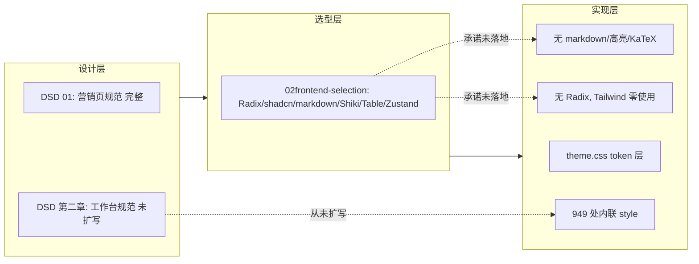
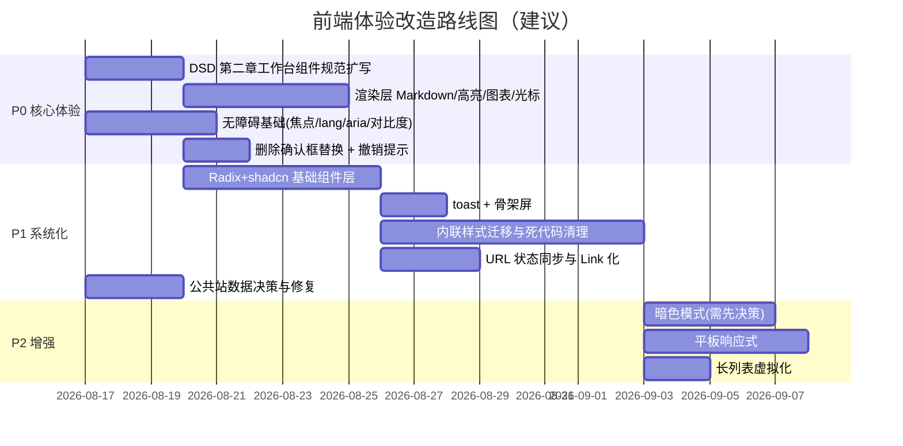

# 前端 UI/UX 审查与改进建议

> 版本：v1.0
> 日期：2026-08-16
> 状态：建议稿，待评审
> 审查范围：`web/` 全部源代码（`src/**`、`index.html`、`package.json`），对照
> [Web Interface Guidelines](https://github.com/vercel-labs/web-interface-guidelines)（2026-08-16 拉取）
> 与当前主流 Web 产品（ChatGPT / Claude / Notion 一类）的使用体验
> 上游文档：[设计风格文档 01-DSD](./01-DSD.md) · [前端技术选型](../01design/02frontend-selection.md)

---

## 1. 结论摘要

当前前端的**视觉底子不差**（DSD 的 Intelligence-Minimal 方向清晰、token 层已就位、
配色克制），但**实际体验与"当前 Web 产品"差距明显**。差距不在美观，而在三件事：

1. **对话渲染层整体缺失** —— 智能体的答复以纯文本渲染：没有 Markdown、没有代码高亮、
   没有公式、**图表不在对话里显示**。平台的核心承诺是"返回结果与图表"，而教师要看图
   必须自己去文件面板翻。这是全站最大的体验缺口。
2. **实现与设计文档严重漂移** —— 选型文档承诺的 Radix / shadcn/ui / react-markdown /
   Shiki / TanStack Table / Zustand **一个都没有安装**；Tailwind 装了但除 token 映射外
   **零使用**；全站 949 处内联 `style={{}}`；两套 Vite 模板残留样式与一个纯 mock 组件
   仍躺在仓库里。
3. **无障碍与反馈模式停留在"能用"** —— 无键盘焦点样式、输入框全部 `outline: none`、
   会话列表用 `div onClick` 导航、删除用 `window.confirm`、无 toast、无骨架屏、无
   `aria-live`、`<html lang="en">` 写着英文。

本文给出逐项修改建议与分阶段路线图。**结论先行：先修渲染层与无障碍（P0），再统一
组件层与反馈模式（P1），最后做暗色、响应式与性能（P2）。**

---

## 2. 现状盘点：三个层面的割裂



### 2.1 实现层事实清单（2026-08-16 核实）

| 事实 | 证据 |
|---|---|
| 全站组件均为内联 `style={{}}` | 949 处，遍布 30+ 个 tsx |
| Tailwind v4 只用于 token 映射 | `className` 全站仅 `grid-bg`/`navbar`/`section-tag`/`status-badge`/`dot` 五类 |
| Radix / shadcn / react-markdown / remark-gfm / rehype-katex / Shiki / TanStack Table / Zustand 均未安装 | `web/package.json` 只有 react-query、react-router、lucide-react 等 6 个运行时依赖 |
| lucide-react 已装但**零 import**，图标全部手写内联 SVG | 同选型文档 §2 的图标决策相悖 |
| `web/src/index.css`、`web/src/App.css` 是 Vite 模板残留，**未被任何文件 import** | `web/src/main.tsx:4` 只引入 `theme.css` |
| `web/src/workspace/components/ArtifactPanel.tsx` 是纯 mock 死代码，**无任何引用** | 全库 grep `ArtifactPanel` 仅定义处 |
| LOGO SVG path 在 5 个文件里复制粘贴 | Navbar / Footer / Login / WorkspaceSidebar / AdminLayout |
| Logo 颜色三处不一致：`var(--logo-green)`(#08574E) / 硬编码 `#0E8A7B` / `var(--brand)`；DSD §6 写的是 `#A61B29` | `Navbar.tsx:35`、`WorkspaceSidebar.tsx:68`、`AdminLayout.tsx:51`、`Footer.tsx:14` |
| 字体只声明不打包：`JetBrains Mono` / `Inter` / `Noto Sans SC` 均无 `@font-face`，内网无 CDN 时全部回退系统字体 | 违反选型文档 §4.4 的自托管承诺 |
| 公共站（Home/Marketplace/Scenarios/Capabilities/DataAssets）全部是**硬编码 mock 数据** | `Marketplace.tsx:31-112` 的 FEATURED_SCENES / ALL_AGENTS / STATS |
| 错误/警告色（#DC2626、#FEF2F2、#FFFBEB、#92400E…）在十余个文件里反复硬编码，未进 token | 违反选型文档 §4.1"任何组件不得出现硬编码颜色值" |

### 2.2 决策留痕：为什么会出现这种漂移

P5 期公共站是"演示向"产物，DSD 只写了营销页规范，选型文档 §6 自己写明
"**扩写 DSD 第二章工作台组件规范**"是第一步 —— 但这一步至今未做（DSD 仍只有
营销页章节）。P6 起工作台直接开工，没有规范可依，于是每页各自发明样式：
工作台深色侧栏 + 内联样式、后台 `AdminStyles.ts` 共享样式对象、公共站 DSD 装饰
——**三套风格并存，没有一套被正式定稿**。本次改动的第一步必须是补上"工作台组件
规范"，否则任何重构都还会再漂移一次。

---

## 3. 目标体验：对齐"当前 Web"

用户期望与当前主流 Web 产品一致的使用感。对一款对话驱动的平台，基准产品是
ChatGPT / Claude。逐条对照：

| 维度 | 当前 Web 产品标准 | 本项目现状 |
|---|---|---|
| 答复渲染 | Markdown + 代码高亮 + 公式 + 行内图表 | 纯文本 `pre-wrap`，代码无高亮，图表不显示 |
| 流式输出 | 打字机光标、逐字渲染 | 逐字追加但无光标指示 |
| 加载态 | 骨架屏（skeleton） | 一行灰字"正在加载…" |
| 操作反馈 | toast（右上角、自动消失、可撤销） | 页面角落内联一行小字 |
| 危险操作 | 自定义确认框 + 撤销窗口 | `window.confirm` 阻塞式弹窗 |
| 键盘 | 全键盘可达、Esc 关弹窗、⌘K 命令面板 | 焦点不可见、列表项不可键盘导航、弹窗无 Esc |
| 状态同步 | 筛选/tab/分页进 URL，可分享可后退 | 全部 `useState`，刷新即丢 |
| 深色模式 | 标配 | `.dark { /* TODO */ }` |
| 响应式 | 桌面/平板/手机三档 | 工作台固定 220+240+380px 三栏，无断点 |

这些差距的具体修复建议见 §5。

---

## 4. 问题清单（按优先级）

优先级定义：
- **P0 —— 教师每次使用都会撞上的缺陷**，必须最先修；
- **P1 —— 体验显著低于现代 Web 标准的系统性欠账**；
- **P2 —— 锦上添花，或受外部决策约束**。

### 4.1 P0-1 对话渲染层：Markdown / 代码 / 图表

**现状**：`MessageList.tsx:79-81` 将答复渲染为 `<div style={{whiteSpace:'pre-wrap'}}>{item.text}</div>`。
事件流里只有 `token`/`reasoning`/`tool`/`notice` 四类（`eventReducer.ts`），没有图片通道；
沙箱产出的 PNG 只能去右侧文件面板点开（`WorkspaceFiles.tsx:253`）。

**建议**（按选型文档 §2 的既定决策补装依赖，不是新决策）：

1. 安装 `react-markdown + remark-gfm + rehype-katex` 与 `shiki`，答复与 `reasoning`
   文本改走 Markdown 渲染；代码块用 Shiki 双主题（选型文档 §4.2 明确要求一次配双主题）。
2. 图表：最终答复中的图片以 Markdown 图片语法引用相对路径（后端已给出文件 URL 通道，
   `api/files.ts` 的 `rawFileUrl`），前端渲染时把相对路径重写为带凭证的 raw URL。
   需要与后端确认最终答复里的引用格式（一条 contract 约定，见 §5.4）。
3. 流式输出加光标：DSD 4.3 早已决定 `.cursor` 复用作流式光标，`theme.css` 里 `blink`
   关键帧现成，但 Chat 从未使用 —— 给最后一条未结束的 `answer` 渲染尾部加光标块。
4. 删除死代码 `ArtifactPanel.tsx`（mock 产物面板）。真实产物面板就是
   `WorkspaceFiles`，它已经工作；若要在对话内突出"产物"，应基于它做，而不是启用 mock。

**涉及文件**：`web/package.json`、`MessageList.tsx`、新增 `components/MarkdownAnswer.tsx`、
`theme.css`、`ArtifactPanel.tsx`（删除）。

> **详细实现方案已展开**：[对话答复渲染层实现方案](./04-answer-rendering-plan.md)
> （2026-08-16）。含依赖清单、流式渲染策略、图表双通道、安全边界、测试计划与估时。

### 4.2 P0-2 可访问性基础

按 Web Interface Guidelines 逐条核对的结果（完整逐文件索引见附录 A），P0 级别：

| 问题 | 证据 | 修复 |
|---|---|---|
| `<html lang="en">`，全站中文 | `index.html:2` | 改 `lang="zh-CN"` |
| 输入框全部 `outline: none` 且无替代焦点样式 | `Login.tsx:173`、`Register.tsx:80`、`ChatInput.tsx:217`、`CreateAgent.tsx:261`、`Catalog.tsx:29` 等 9 处 | theme.css 补 `:focus-visible` 全局规则（2px ring + offset），删掉各处 `outline:none` |
| 会话列表 `<div onClick>` 导航，键盘不可达 | `ThreadSidebar.tsx:57`、`Overview.tsx:135`、`Overview.tsx:167` | 改 `<Link>` 或 `role="link" tabIndex={0}` + 回车处理 |
| 纯图标按钮缺 `aria-label`（发送 ↗、停止 ■、刷新 ↻） | `ChatInput.tsx:219`、`WorkspaceFiles.tsx:200` | 补 `aria-label`（现有 `title` 不能替代） |
| 触控目标过小：发送 36px、删除会话 22×22 | `ChatInput.tsx:219`、`ThreadSidebar.tsx:63` | 交互目标 ≥ 40px（触控）/ 视觉可稍小但命中区放大 |
| `--text-muted #8E9BB0` 在白底上对比度约 2.4:1，却用于大量 11-13px 正文级说明 | `theme.css:9` + 全站 | 加深为 `#6E7B90` 级别（≥4.5:1），或降级为仅装饰性用途 |
| 无 `aria-live` 区域；流式消息、状态变化对读屏不可见 | 全站 grep 为 0 | 消息区与状态行包 `aria-live="polite"` |
| 无 skip link、无 `<meta name="description">`、无 `theme-color` | `index.html` | 补 `lang`、`description`、`theme-color`；正文首元素加跳到主内容的链接 |
| 弹窗无焦点陷阱、无 Esc 关闭、无 `overscroll-behavior` | `ChatInput.tsx:137`（配置弹窗）、`WorkspaceFiles.tsx:266` | 引入 Radix Dialog（见 P1-1），一步到位 |

### 4.3 P0-3 危险操作与反馈

**现状**：删除会话与删除文件用 `window.confirm`（`ThreadSidebar.tsx:62`、
`WorkspaceFiles.tsx:125`）——阻塞主线程、样式不可控、无法撤销，与现代 Web 标准
直接冲突（指南明列"destructive actions need confirmation modal or undo window"）。

**建议**：自定义确认弹窗（Radix AlertDialog）+ 成功后 toast 带撤销窗口（后端 `deleteThread`
/ `deleteFile` 若支持恢复则真撤销；不支持则至少前端延迟执行 + 明确"不可恢复"文案）。
短期（未引入 Radix 前）可先用现有手写 modal 模式替换 `window.confirm`。

### 4.4 P1-1 组件层统一：消灭 949 处内联样式

**现状**：同一颗"主按钮"至少以 6 种不同写法出现（`Home.tsx:85`、`Navbar.tsx:61`、
`ThreadSidebar.tsx:42`、`Marketplace.tsx:185`、`ChatInput.tsx:219`、`AdminStyles.ts:118`），
圆角 5/6/7/8/10/12/16px 混用，hover 态时有时无（`WorkspaceSidebar.tsx:44` 的导航项
写了 `transition: background` 却根本没定义 hover 背景——过渡了一个不存在的状态）。

**建议**（先文档后实现，遵守项目约定）：

1. **扩写 DSD 第二章「工作台组件规范」**（选型文档 §6 承诺未兑现的那一步）：定义
   Button（primary/secondary/ghost/danger/icon）、Input、Select、Checkbox/Radio、
   Dialog、Toast、Badge、EmptyState、Skeleton、消息气泡、工具块、审批卡片的规格。
2. 按选型文档 §3.2 既定决策安装 Radix primitives + 复制 shadcn/ui 源码改造为 DSD token；
   建立 `src/components/ui/`（选型文档 §5 目录结构已有此规划）。
3. 错误/警告色进 token（`--danger`、`--danger-bg`、`--warn`、`--warn-bg` 等），替换全站
   硬编码 `#DC2626` 族。这是暗色模式与一致性的前提。
4. 抽 `components/Logo.tsx` 统一 LOGO 与颜色，删除 5 份复制。

### 4.5 P1-2 反馈系统：toast + 骨架屏

**现状**：保存成功/失败、上传成功、复制路径等全部渲染为面板底部一行小字
（`WorkspaceFiles.tsx:278`、`ChatInput.tsx:214`），位置不固定、无自动消失、无 aria-live；
加载态全部是"正在加载…"文字（`ThreadSidebar.tsx:50`、`Overview.tsx:129` 等）。

**建议**：实现轻量 toast 系统（单例、右上角、3s 自动消失、`aria-live="polite"`、
成功/失败/警告三态）；列表与卡片加载改骨架屏。两者纳入 DSD 第二章规范。

### 4.6 P1-3 URL 状态同步与导航语义

**现状**：`Marketplace.tsx:214-215` 的 tab 与学科筛选是 `useState`，刷新即丢、无法分享；
`ThreadSidebar`/`Overview` 用 `div onClick` 而非 `<Link>`（失去 Cmd+点击新标签页能力，
见指南"Links use `<a>`/`<Link>`"）；SPA 内两处整页跳转：`Home.tsx:85` 的
`<a href="/workspace">` 与 `Login.tsx:152` 的 `<a href="/register">`。

**建议**：筛选/tab/分页写进 `useSearchParams`（不引入 nuqs，手写 20 行封装即可，或按
选型文档口径评估后引入）；全部导航改 `<Link>`；整页跳转统一为路由内导航。

### 4.7 P1-4 公共站 mock 数据

**现状**：公共站五页全部硬编码（`Marketplace.tsx:31-112`），数字（"847 次分析任务已完成"、
"127 次使用"）无法与真实数据对上；且文案含错字（`Marketplace.tsx:51` "识别识别策略缺陷"）、
emoji 装饰（`Marketplace.tsx:303` 的 💡🤖🎯📚）违反 DSD"终端美学、无暖色装饰"。

**建议**：两条路二选一，**需评审定夺**（决策留痕）：
- A. 接真实 API（`/api/agents` 目录接口已有），公共站与工作台共享数据 —— 体验最一致，工作量中等；
- B. 保持静态页但**明确标注"示例数据"**，去掉具体数字、修错字、去 emoji —— 工作量小，但"市场页数字是假的"这种失信风险仍在。

推荐 A；若排期不允许，先做 B 再去 A。

### 4.8 P1-5 细节修复清单

| 问题 | 证据 | 修复 |
|---|---|---|
| `transition: 'all'`（指南明列反模式） | `Navbar.tsx:49`、`Marketplace.tsx:332`、`Catalog.tsx:51`、`Home.tsx:89` | 显式列出 transition 属性 |
| 无 `prefers-reduced-motion` 降级 | ticker/blink/card-enter/thinking-bounce/progress-pulse 全部无条件运行 | `@media (prefers-reduced-motion: reduce)` 关闭全部装饰动画 |
| 省略号 `...` 混用（应为 `…`） | `ArtifactPanel.tsx:229`、`Marketplace.tsx:51` 等 | 统一 `…` |
| 图片无尺寸，预览图加载引发布局跳动 | `WorkspaceFiles.tsx:253` | `img` 加 `width/height` 或容器占位 |
| 面向教师用户的字号普遍 10-13px，低于 DSD 正文 14-15px 规范 | `ThreadSidebar.tsx:59`（11px 时间）、`WorkspaceFiles.tsx` 按钮（10px）、后台表格 11-13px | 正文 ≥13px、次要 ≥12px、仅装饰性标签可用 10-11px |
| 会话侧栏删除按钮仅 hover 可见（键盘聚焦不显示） | `ThreadSidebar.tsx:60` | 用 `:focus-within` 或恒显 |
| 配置弹窗 620px 内塞 2 列 checkbox 网格，12px 字号，信息密度过高 | `ChatInput.tsx:137-216` | 改为输入框上方的锚定 popover（类 ChatGPT 模型选择器），分组折叠 |
| 总览"本月会话"只统计已加载的第一页 | `Overview.tsx:90` | 加专用统计接口或加载全量再统计（数据正确性问题） |
| 会话无重命名、无状态指示（哪个会话还在跑） | `ThreadSidebar.tsx` | 侧栏条目加进行中状态点；标题支持行内重命名（后端已有 thread title 字段） |

### 4.9 P2-1 暗色模式

选型文档 §4.2 决策"只预留结构不实现"仍成立（DSD 未定义暗色色值）。本次建议**维持
该决策**，但把 P1-1 的 token 纪律（含错误色 token 化、Shiki 双主题）做掉，使将来补
暗色只需填一套色值。若评审决定现在做，先补 DSD 暗色色板再动组件。

### 4.10 P2-2 响应式

选型文档 §7 遗留问题"响应式范围未定"仍未解决。工作台三栏 220+240+380px 固定宽度，
在 <1024px 下不可用。建议：
- 先只承诺**桌面（≥1280px）+ 平板横屏（≥1024px）**：侧栏可折叠为图标栏，文件面板
  变抽屉；这是教师主要使用场景，成本可控；
- 手机端暂不承诺（沙箱产物查看在手机上本来受限），在文档里写明该边界。

### 4.11 P2-3 性能

- 长会话的消息与工具块列表建议虚拟化（指南：>50 项列表虚拟化）。当前一个 thread 的
  run 全部 `map` 渲染（`Chat.tsx:178`），会话页数多时 DOM 会膨胀。引入 `virtua` 或
  `content-visibility: auto` 兜底即可，不必上重型虚拟列表。
- 流式消息逐 token 触发 `setState` 已属每按键级别更新，可接受；但 `MessageList` 的
  `jsonArgs` 在 render 里对每条 tool 做 `JSON.stringify`（`MessageList.tsx:60`），长参数
  时建议 `useMemo`。

---

## 5. 改造路线图



阶段间依赖：P1-1 的组件层是 P0-3、P1-2 的地基，也是暗色与响应式的先决条件，
建议最先排（与 P0-2 并行）。

### 5.1 需要评审拍板的四个决策点

| # | 决策 | 选项 | 本文推荐 |
|---|---|---|---|
| D1 | 公共站 mock 数据 | A 接真实 API / B 标注示例数据 | A，见 §4.7 |
| D2 | 暗色模式时机 | 维持"预留不实现" / 本期实现 | 维持预留，见 §4.9 |
| D3 | 响应式范围 | 桌面+平板 / 全端 | 桌面+平板，见 §4.10 |
| D4 | 图表引用契约 | 答复 Markdown 中引用相对路径（需后端配合） | 定契约后前后端各半天，见 §5.4 说明 |

### 5.2 验收口径

- P0 完成后：一次完整"提问→流式→思考→工具→审批→答复含图"走查中，
  教师全程无需离开对话区；键盘可完成全部操作；`make all` 前端用例全绿。
- P1 完成后：全站无 `window.confirm`、无 `transition: all`、无组件内硬编码颜色；
  `grep "style={{" web/src | wc -l` 降至少于基线 1/3；lint 增加对应规则固化。
- P2 完成后：1024px 宽度下工作台可用。

---

## 附录 A：逐文件问题索引（Web Interface Guidelines 格式）

```text
## web/index.html
index.html:2      - html lang="en" → zh-CN（全站中文）
index.html:5      - 缺 <meta name="description">
index.html:5      - 缺 <meta name="theme-color">（应匹配 --bg）
index.html:10     - 缺 skip link；正文无主 landmark 锚点

## web/src/main.tsx
main.tsx:4        - 只引入 theme.css；index.css/App.css 为死代码，应删除

## web/src/index.css（死代码，建议整体删除）
index.css:53      - #root 限宽 1126px，与工作台 100vw 布局冲突（未生效但误导）
index.css:20      - color-scheme: light dark 声明在未引用的文件里，实际无效

## web/src/styles/theme.css
theme.css:32      - .dark 空壳；暗色预留需文档化验收标准
theme.css:60      - 字体栈声明 Noto Sans SC/JetBrains Mono 但未打包（内网回退系统字体）
theme.css:67-70   - 全局滚动条 4px 过细，可发现性差
theme.css:81-97   - blink/ticker/card-enter/progress-pulse 均无 prefers-reduced-motion 降级
theme.css:9       - --text-muted #8E9BB0 对比度 ~2.4:1，用于正文级说明文字，低于 AA
theme.css:123     - 无 :focus-visible 全局规则（全站焦点不可见）

## web/src/components/Navbar.tsx
Navbar.tsx:35     - logo 色 var(--logo-green) 与工作台 #0E8A7B 不一致
Navbar.tsx:49     - transition: 'all' → 显式属性
Navbar.tsx:61-72  - 按钮无 hover 态

## web/src/components/Footer.tsx
Footer.tsx:14     - logo 用 var(--brand)，第三种 logo 颜色

## web/src/pages/Home.tsx
Home.tsx:85       - <a href="/workspace"> 整页跳转，SPA 内应改 <Link> 或按钮+路由
Home.tsx:89       - transition: 'all'
Home.tsx:107-111  - ticker 动画无 reduced-motion 降级
Home.tsx:124      - card-enter 动画无 reduced-motion 降级

## web/src/pages/Login.tsx
Login.tsx:137,141 - 输入无 name 属性；placeholder 无示例模式
Login.tsx:145     - 提交按钮 disabled+opacity 无 spinner 图标
Login.tsx:152     - <a href="/register"> 整页跳转
Login.tsx:173     - outline:none 无 focus-visible 替代
Login.tsx:159-168 - label 未用 htmlFor 关联输入

## web/src/pages/Register.tsx
Register.tsx:55   - autoFocus 可接受（桌面单主输入），但需在规范中注明理由
Register.tsx:55-59 - 输入无 name 属性
Register.tsx:73   - label 未用 htmlFor 关联
Register.tsx:80   - outline:none 无 focus 替代

## web/src/pages/Marketplace.tsx
Marketplace.tsx:31-112 - 全页硬编码 mock 数据；STATS 数字不可信
Marketplace.tsx:51     - 文案错字「识别识别策略缺陷」
Marketplace.tsx:303    - emoji 装饰违反 DSD 终端美学
Marketplace.tsx:332    - transition: 'all'

## web/src/workspace/WorkspaceSidebar.tsx
WorkspaceSidebar.tsx:44 - 导航项有 transition 但无 hover 定义（无效过渡）
WorkspaceSidebar.tsx:68 - logo 硬编码 #0E8A7B，与 token 不一致
WorkspaceSidebar.tsx:87-96 - 用户菜单无 Esc 关闭、无点击外部关闭

## web/src/workspace/components/ThreadSidebar.tsx
ThreadSidebar.tsx:57  - div onClick 导航，键盘不可达；应 <Link>
ThreadSidebar.tsx:59  - 11px 时间字号过小
ThreadSidebar.tsx:60-63 - 删除按钮仅 hover 可见（键盘聚焦不显示）；22x22 触控目标过小
ThreadSidebar.tsx:62  - window.confirm 应换自定义确认框
ThreadSidebar.tsx:7-10 - 标题无重命名能力；无进行中状态指示

## web/src/workspace/components/ChatInput.tsx
ChatInput.tsx:137    - role="dialog" 缺 aria-modal、焦点陷阱、Esc 关闭、overscroll-behavior
ChatInput.tsx:139    - 配置单选组无 fieldset/legend 语义
ChatInput.tsx:150-153 - select 有 aria-label ✓；但选项文本可读性差
ChatInput.tsx:217    - textarea outline:none 无 focus 替代
ChatInput.tsx:219    - 发送/停止按钮 36px、仅 title 无 aria-label
ChatInput.tsx:268-269 - selectStyle 无 :focus 样式；outbound 警告色硬编码

## web/src/workspace/components/MessageList.tsx
MessageList.tsx:59-60 - render 中每项 JSON.stringify 长参数，建议 useMemo
MessageList.tsx:79-81 - 答复纯文本渲染：无 Markdown/代码高亮/KaTeX/图片（P0）
MessageList.tsx:74    - reasoning 默认 open ✓；但无流式光标
MessageList.tsx:127-144 - 审批卡片交互完备 ✓；respond textarea 缺 label
MessageList.tsx:138    - 必填理由 textarea 无 aria-required

## web/src/workspace/components/WorkspaceFiles.tsx
WorkspaceFiles.tsx:125 - window.confirm 应换自定义确认框 + 撤销
WorkspaceFiles.tsx:200 - 刷新按钮仅 title 无 aria-label
WorkspaceFiles.tsx:232 - 「复制/下载/删除」10px 文字按钮触控目标过小
WorkspaceFiles.tsx:253 - img 无 width/height（CLS）
WorkspaceFiles.tsx:266 - dialog 无焦点陷阱、无 overscroll-behavior: contain
WorkspaceFiles.tsx:269 - autoFocus 可接受（新建对话框单主输入）
WorkspaceFiles.tsx:278 - 通知为无 aria-live 的普通文本

## web/src/workspace/components/Catalog.tsx
Catalog.tsx:29      - outline:none，焦点仅改 borderColor（键盘用户无 ring）
Catalog.tsx:51      - transition: 'all'

## web/src/workspace/components/ArtifactPanel.tsx（死代码，建议删除）
ArtifactPanel.tsx:21-43 - 纯 mock 数据
ArtifactPanel.tsx:229    - "执行中..." 省略号不规范

## web/src/workspace/pages/Chat.tsx
Chat.tsx:172       - 空状态仅一行文字，无引导性示例
Chat.tsx:178       - 全部 run 无虚拟化直接 map
Chat.tsx:166       - 「收起工作目录」11px 按钮过小

## web/src/workspace/pages/Overview.tsx
Overview.tsx:90    - monthlyThreads 只统计已加载页（数据正确性问题）
Overview.tsx:135,167 - div onClick 导航，键盘不可达
Overview.tsx:41    - StatCard 值用 JetBrains Mono ✓ 但 tabular-nums 未显式声明

## web/src/workspace/pages/MyData.tsx
MyData.tsx:44-46   - 列表按钮 ✓；但 11px 时间字号过小

## web/src/workspace/pages/CreateAgent.tsx
CreateAgent.tsx:261 - outline:none 无 focus 替代

## web/src/workspace/pages/admin/AdminStyles.ts
AdminStyles.ts:73-84 - th 11px、td 12-13px，偏小
AdminStyles.ts:131-133 - 危险色硬编码 #DC2626，应 token 化

## web/src/workspace/pages/admin/AdminUsers.tsx
AdminUsers.tsx:127 - 搜索框 outline:none 无 focus 替代；无清除按钮
AdminUsers.tsx:277 - modal 输入 outline:none 无 focus 替代
```

---

## 附录 B：与上游文档的冲突点（按项目约定需先确认）

按 AGENTS.md「先问再写」约定，以下条目实现前需确认是改文档还是改实现：

| 冲突 | 文档说 | 实现现状 | 建议 |
|---|---|---|---|
| DSD §2 `--logo-green: #A61B29`（红） | 唯一暖色仅 Logo | theme.css 实际 `#08574E`（绿），工作台又用 `#0E8A7B` | 以 theme.css 为准改 DSD，并统一为一处 token |
| 选型文档 §2 技术栈 | Radix/shadcn/markdown/Shiki/Table/Zustand | 均未安装 | 本文件 §4.4/§4.1 按原决策补齐（markdown/Shiki/Radix）；Table/Zustand 若无场景继续不用，在选型文档注明降级 |
| 选型文档 §4.4 | Inter/JetBrains Mono 自托管子集 | 未做 | 纳入 P1，字体子集脚本进构建 |
| 选型文档 §6 | 先扩写 DSD 第二章再实现 | 未扩写 | 本次路线图第一步（§5） |

---

## 6. 实施进度记录

> 2026-08-16 起随改造回填，格式：日期 · 完成项 · 依据。

| 日期 | 完成项 | 依据 |
|---|---|---|
| 2026-08-16 | P0-1 对话渲染层：Markdown/高亮/公式/文内图/产物区/流式光标；M3 提示词契约 | [04-answer-rendering-plan](./04-answer-rendering-plan.md) §11 |
| 2026-08-16 | DSD 第二章「工作台组件规范」扩写（v1.1） | 01-DSD.md |
| 2026-08-16 | P0-2 无障碍基线：lang/description/theme-color、focus-visible、删 10 处 outline:none、`--text-muted` 加深至 `#5D6D82`、会话/总览 Link 化、aria-label、40px 触控目标、skip link、表单 label 关联 | §4.2 全项 |
| 2026-08-16 | P0-3 ConfirmDialog 替换两处 window.confirm（alertdialog、焦点陷阱、Esc） | §4.3 |
| 2026-08-16 | P1-2 反馈系统：Toast（Radix Toast）替换 WorkspaceFiles/ChatInput/ThreadSidebar 内联通知；Skeleton 骨架屏替换会话列表/总览/广场加载态 | §4.5 |
| 2026-08-16 | P1-5 部分：`transition: all` ×4 改显式属性；`...` 改 `…`；预览图固定尺寸；Marketplace 文案笔误；Overview「本月会话」改为有界翻页全量统计 | §4.8 |
| 待办 | 会话重命名：前端无入口（`updateThread` 已支持 title 通道）；会话状态指示：`ThreadSummary` 无 run 状态字段，需后端配合 | §4.8 |

---

*最后更新：2026-08-16*
