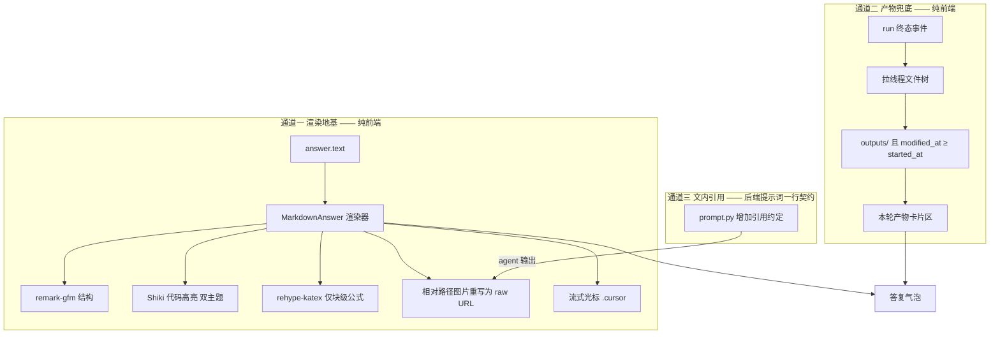

# 对话答复渲染层实现方案（P0-1 展开）

> 版本：v1.0
> 日期：2026-08-16
> 状态：**已实现（2026-08-16）**
> 上游依据：[UI/UX 审查 §4.1](./03-ui-ux-review.md) · [前端技术选型 §2/§4.2](../01design/02frontend-selection.md)
> 范围：`web/` 前端为主；涉及后端提示词一行契约（§6）

---

## 1. 背景与目标

平台的核心承诺是"返回结果与图表"，但当前智能体答复以纯文本渲染（
`MessageList.tsx:79-81` 的 `<div style={{whiteSpace:'pre-wrap'}}>`）。教师看到的答复：

- **没有 Markdown 结构** —— 标题、列表、表格全是一坨等宽换行文本；
- **没有代码高亮** —— 智能体解释代码时是灰字一块；
- **没有公式渲染** —— LaTeX 原样露出来；
- **图表不在对话里** —— PNG 产出在文件面板里，与答复正文分离。

本方案把答复渲染补齐到与 ChatGPT / Claude 同级，并顺带解决图表呈现。目标：

1. 答复按 Markdown 渲染（GFM：表格、任务列表、删除线）+ 代码高亮 + 块级公式；
2. 沙箱产出的图表出现在对话中（双通道：文内引用 + 本轮产物区兜底）；
3. 流式输出期间渲染稳定不卡顿、结束态与流式态过渡可接受；
4. 渲染层对 LLM 输出是防御式的：无 XSS、无路径逃逸、坏输入降级不崩。

---

## 2. 已核实的关键事实（2026-08-16）

| 事实 | 证据 | 对方案的影响 |
|---|---|---|
| 答复文本经 `token` 事件逐段累积，`eventReducer` 已聚合为完整 `answer.text` | `eventReducer.ts:124-125` | 渲染层输入是"整段字符串"，无需改事件层 |
| 图片下载走同源 cookie 会话：`/api/threads/{id}/files/raw?path=…`，nginx X-Accel-Redirect 出字节 | `api/files.ts:47-49`、`app/test/api/file_direct_test.py:31` | `` 同源直用，**无需签名 URL**，只需把相对路径重写成该端点 |
| 产物目录契约为 `/workspace/outputs/`，是平台判定交付文件的唯一依据 | `app/agent/prompt.py:10-11,22` | 前端只认 `outputs/` 前缀，白名单天然存在 |
| **提示词当前没有要求 agent 在答复里引用产物** | `app/agent/prompt.py:19-25` | 文内图片依赖新增契约（§6）；产物区兜底不依赖它 |
| `RunHistory` 有 `started_at`/`ended_at`，`WorkspaceEntry` 有 `modified_at` | `types.ts:307-316,332-337` | 产物区可用"run 开始后修改的 outputs 文件"做归属过滤（§5.2） |
| thread 内 run 串行：运行中禁止再提交（`ChatInput` disabled + `isRunning`） | `ChatInput.tsx:112` | 按 `started_at` 过滤不会被并发 run 污染 |
| 事件流无图片事件；`RunViewItem` 只有 reasoning/answer/tool/notice 四类 | `events.ts:61-78` | 图片通道只能走"Markdown 文本引用"或"产物区"，没有第三条路 |
| 选型文档已定 react-markdown + remark-gfm + rehype-katex + Shiki，且要求 Shiki 一次配双主题 | `02frontend-selection.md §2、§4.2` | 本方案是**执行既定决策**，不引入新选型 |
| 内网部署，无公网 CDN；KaTeX 字体与 Shiki 主题必须本地打包 | `02frontend-selection.md §4.4` | 所有渲染资源走 npm 包 + Vite 打包 |
| 金融语境大量出现 `$`（金额），KaTeX 行内 `$` 定界符会误伤 | `Settings.tsx:63`（`$0.00` 先例）、答复中的"股价 $32.5" | 行内公式必须关闭（§4.4） |

---

## 3. 方案总览

三个通道各司其职，互不阻塞：



- **M1 渲染地基（必做）**：Markdown / 高亮 / 公式 / 路径重写 / 流式光标。即使 M2、M3 都不做，答复可读性也回到现代产品水平。
- **M2 产物兜底（必做）**：run 结束后把本轮 `outputs/` 新文件（PNG 缩略图、CSV 下载卡）列在答复下方。**不依赖模型行为**，图表 100% 出现在对话里。
- **M3 文内引用（可选，需后端确认）**：提示词加一行契约，让 agent 在答复正文里用
  `` 引图。模型遵守时图嵌在正文中间（体验最佳）；不遵守时
  M2 兜底，体验不受损。

**为什么是 M1+M2 而不是只做 M2**：只做产物区的话，答复正文仍是纯文本一坨，核心可读性问题没解决；只做 M1 的话，图表依赖模型是否自觉引用，不可靠。两者叠加才同时满足"答复可读"与"图表必达"。

**M1 与 M2 都不需要改后端 API**：raw URL 端点、文件树端点均已存在。M3 只改提示词文本。

---

## 4. 核心设计决策

> 每条按项目约定写清"选了什么、为什么、放弃了什么"。

### 4.1 依赖清单（执行选型文档 §2，补装 5 个包）

| 包 | 用途 | 备注 |
|---|---|---|
| `react-markdown` v10 | Markdown 渲染 | v10 原生支持 React 19，[生态已普遍在 v10](https://www.repoportal.com/en/remarkjs-react-markdown) |
| `remark-gfm` v4 | 表格、任务列表、删除线 | |
| `rehype-katex` + `katex` | 公式渲染 | KaTeX 的 css 与字体从 node_modules 打包，`main.tsx` 本地 import |
| `shiki` v3 | 代码高亮 | 细粒度按需加载语言，见 4.3 |

**放弃的替代**：`react-markdown` 之外的成品聊天渲染器（如 assistant-ui 的 Markdown 组件）——选型文档 §3.4 已论证对话 UI 自研，渲染层同样按此口径；highlight.js 替 Shiki——选型文档 §2 已定 Shiki 且 §4.2 的双主题要求就是为它写的。

### 4.2 流式期间渲染策略：轻量渲染 → 终态升格

**选了什么**：一条 `answer` 分两态渲染——`isStreaming` 时用"轻量管线"
（GFM 段落/列表/表格 + 行内 code/加粗 + 未闭合围栏降级，**不开 Shiki、不开 KaTeX**）；
`run.finished`/`run.failed` 后升格为完整管线（+Shiki +KaTeX）。

**为什么**：
- Shiki 异步高亮 + KaTeX 排版在每 token 触发时重算，长答复必然掉帧；轻量管线是纯同步
  parse，量级小两个档；
- 流式期间代码围栏与 `$$` 必然处于未闭合状态，高亮器与公式器对坏输入的行为是库内部
  细节，不值得逐库验证——降级管线自己掌控坏输入；
- 终态升格只有一次重排版，肉眼是一次轻微的"定型"跳动。ChatGPT/Claude 在流式期间的
  数学渲染有同样问题，它们的做法与"定型"观感一致，属可接受。

**放弃的替代**：流式期间全量渲染 + 节流（复杂度高、收益只在"结束时无跳变"一点）；
全程纯文本流式（丢失流式期间的结构观感，且结束瞬间跳变更突兀）。

**实现**：`useRunEvents` 已把状态收敛在 `view.status`；`MessageList` 增加
`streamingItemIds: Set<string>`（或等价布尔）入参，仅最后一条未终态 `answer` 走轻量
管线。组件内部用 `React.memo` 隔离：一条已终态的消息，其渲染结果不因其他消息在流而
重算（当前 `ItemView` 每 token 全列表重渲染，顺带修掉这个无谓开销）。

### 4.3 Shiki 接入：CSS 变量主题 + 按需语言 + 同步可用

**选了什么**：`createCssVariablesTheme` 生成双主题（light/dark 各一套 CSS 变量），
高亮结果缓存于组件外 Map；语言只加载 `python | json | bash | text | markdown | sql |
r | latex | yaml`（智能体场景实际会出现的集合），未知语言回落 `text`。

**为什么**：
- CSS 变量主题让代码块颜色跟随主题 token —— 这是选型文档 §4.2"一次配双主题"的落法，
  将来暗色模式只需补变量值，代码块零改动；
- 细粒度按语言打包控制 bundle（全量语言集约 3MB+，按需约 200KB 级别）；
- Shiki 高亮是异步 API，但结果缓存后同文本只算一次；流式期间不调它（4.2），不存在
  竞态。

**放弃的替代**：静态双主题对象（暗色补做时要改代码，违反预留纪律）；构建期高亮
（答复是运行时数据，无从预生成）。

### 4.4 公式：只开块级 `$$`，关闭行内 `$`

**选了什么**：`remark-math` 只启用 `$$…$$` 块级定界（`singleDollarTextMath: false`）。

**为什么**：金融答复里 `$` 最常见身份是金额（"股价 $32.5""成本 $1.2M"），KaTeX 行内
定界会把 `$32.5` 误当公式，输出变成公式排版灾难。这是本平台语境与通用聊天产品的
本质差异，必须关。块级 `$$` 与 `\[` 仍支持，覆盖"给出公式推导"的真实需求。

**放弃的替代**：开启行内公式（体验赌博）；完全不上公式（agent 输出推导时露源码，
DSD"数据可信、分析深度"调性受损）。

### 4.5 图片路径重写与安全边界

**选了什么**：自定义 `components.img`，规则：
- `src` 为相对路径（无 scheme、无 `//`）→ 规范化后仅当以 `outputs/` 开头时重写为
  `rawFileUrl(threadId, path)`；否则不渲染图片，降级为纯文本 `文件名`；
- `src` 为 `http(s)` 绝对 URL → 原样渲染 + `loading="lazy"` + `referrerPolicy="no-referrer"`；
- 全部 `` 加 `alt`（无 alt 时用文件名兜底）、`loading="lazy"`、`decoding="async"`；
- 全部 `<a>` 加 `target="_blank" rel="noopener noreferrer"`；外链图标不用。

**为什么**：raw 端点是同源 cookie 会话，无需签名（§2 事实三）；`outputs/` 白名单与
后端"平台只交付 outputs 目录"的契约（`prompt.py:10`）对齐——即使模型幻觉出一个
`../../etc/passwd` 路径，前端不发出该请求（后端另有一层 path 归一化防御，两侧独立）。
外链 lazy+no-referrer 是内网平台的保守姿态：模型几乎不会给外链，给了也不该替它预取。

**放弃的替代**：任意相对路径都重写（破坏白名单纪律）；外链直接渲染（无防护）。

### 4.6 XSS 与协议白名单

**选了什么**：**不安装 `rehype-raw`**，HTML 原文一律按文本转义渲染（react-markdown
默认行为）；`components.a` 对 `href` 做协议白名单（仅 `http`/`https`/`mailto` 与相对
路径，其余替换为 `#` 并保留文本）；图片规则见 4.5。

**为什么**：答复文本是**不可信 LLM 输出**，且会话内容可能来自别人共享的智能体模板
（间接输入）。转义渲染 + 协议白名单 + 路径白名单三层之后，渲染层没有可注入面。
这是安全边界不是体验取舍，不留配置口子。

### 4.7 流式光标

**选了什么**：最后一条处于流式态的 `answer` 尾部追加 `.cursor` 块（复用 `theme.css:81-85`
的 `blink` 关键帧），状态结束即移除。

**为什么**：DSD 4.3 早已决定 `.cursor`"保留，用作流式输出光标"，这是执行既定决策；
资产现成（`blink` 已定义、Home hero 已在用）。同时给光标容器挂
`aria-hidden="true"`，读屏用户不受闪烁干扰（消息区整体有 `aria-live`，见 4.8）。

### 4.8 无障碍配套（与渲染层同批落地）

- 消息流容器 `aria-live="polite"`（流式新增内容对读屏可感知，但不会打断审批表单
  这类交互）；单条终态消息的加载态用 `role="status"`；
- 代码块容器 `role="region"` + `aria-label="代码"`；表格渲染后仍是原生 `<table>`，
  沿用浏览器表格导航；
- 图片 `alt` 兜底见 4.5；产物区（M2）为 `<section aria-label="本轮产物">`。

### 4.9 依赖与构建

- KaTeX：`import 'katex/dist/katex.min.css'`（`main.tsx`），fonts 由 Vite 静态处理自动
  进 dist —— 内网无需外联任何资源；
- Shiki：v3 的 `createCssVariablesTheme` 输出 CSS 变量进 `theme.css`；语言模块按 4.3
  白名单 import；
- 构建后检查 `web/dist` chunk 体积（shiki+katex 合入后主 bundle 预计 +500KB 以内，
  超出则把渲染器拆为 `React.lazy` 独立 chunk —— 对话页是登录后主场景，懒加载价值有限，
  但保留选项）。

---

## 5. 通道二细节：本轮产物区（ArtifactStrip）

### 5.1 渲染形态

run 终态（succeeded；failed/cancelled 也显示——部分产物可能已生成）且该 run 有产物时，
在 `RunTurn` 的答复与状态行之间插入产物区：

```
┌─ 本轮产物（3）──────────────────────────────┐
│  [PNG 缩略图 160px 高，点击新标签打开原图]     │
│  📄 volatility_chart.png · 84 KB · 下载      │
│  ┌────────────────────────────────────────┐ │
│  │ CSV 卡片：rebalance_plan.csv · 18 KB    │ │
│  │ [下载]                                  │ │
│  └────────────────────────────────────────┘ │
└──────────────────────────────────────────────┘
```

PNG/JPG/WebP/SVG 显示缩略图（点击 `<a>` 打开 raw URL 新标签页）；其他类型（CSV/XLSX/PDF…）
渲染为下载卡片；目录忽略。超过 6 个文件折叠为"+N 个更多"，展开后全列。

### 5.2 归属过滤算法

```
tree.entries
  .filter(e => !e.is_dir)
  .filter(e => e.path.startsWith('outputs/'))
  .filter(e => Date.parse(e.modified_at) >= Date.parse(run.started_at))
  .sort(by modified_at desc)
```

**为什么可靠**：thread 内 run 串行（§2 事实六），`started_at` 之后的 outputs 写入只能
属于本轮；沙箱 per-thread 生命周期下历史文件的 `modified_at` 早于 `started_at`，
天然排除。数据来自现成的 `listFiles` 端点（`fileKeys.tree` 缓存已存在，`Chat.tsx:41`
终态时本就在 invalidate），**零后端改动**。

**容错**：文件树拉取失败/`truncated` 时产物区整体不渲染（答复不受影响），右上文件面板
永远可用。这不是新风险——文件面板本来就依赖同一个端点。

---

## 6. 通道三细节：提示词契约（需后端确认）

`app/agent/prompt.py` 的 `ENVIRONMENT_SEGMENT` 追加一条（草拟）：

```text
- 交付图表时，在最终答复中用 Markdown 图片语法引用，路径相对 /workspace 写，
  例如 
```

**影响面评估**：这是提示词契约变更，属后端行为改动。改动一行文本，但"模型是否稳定
遵守"需要一轮真实 run 验证（免费判据即可覆盖）。若验证发现遵守率低，删掉该行即可，
M2 兜底不受影响——因此 M3 与 M1/M2 **解耦**，可作为独立小项排期或搁置。

**决策留痕**：为什么不把图内嵌做成"平台强制"（如 run.finished 后由前端把全部产物
强行拼进答复正文）——因为图表在答复中的位置语义（哪张图对应哪段结论）只有模型知道，
平台强插只会得到"正文与图错位"。M2 的产物区是对"位置语义不可得"这一事实的诚实回应。

---

## 7. 文件改动清单

| 文件 | 动作 | 内容 |
|---|---|---|
| `web/package.json` | 修改 | + react-markdown、remark-gfm、rehype-katex、katex、shiki（版本装最新稳定并锁 pnpm-lock） |
| `web/src/workspace/components/MarkdownAnswer.tsx` | 新增 | 核心渲染器：双管线（轻量/完整）、路径重写、协议白名单、Shiki 缓存、流式光标 |
| `web/src/workspace/components/ArtifactStrip.tsx` | 新增 | 产物区：树拉取 + 归属过滤 + 缩略图/下载卡 |
| `web/src/workspace/components/MessageList.tsx` | 修改 | `answer`/`reasoning` 分支接 MarkdownAnswer；增加 `streaming` 入参；`React.memo` 隔离；`aria-live` |
| `web/src/workspace/pages/Chat.tsx` | 修改 | `RunTurn` 传 `threadId`/`started_at`/流式态；挂 ArtifactStrip |
| `web/src/styles/theme.css` | 修改 | Shiki 变量主题色、代码块样式 token、产物区样式 |
| `web/src/main.tsx` | 修改 | `import 'katex/dist/katex.min.css'` |
| `web/src/workspace/components/ArtifactPanel.tsx` | 删除 | 死代码 mock 组件（审查文档 §4.1 已定） |
| `app/agent/prompt.py` | 修改（可选） | M3 契约一行，独立排期 |
| `doc/02visual/01-DSD.md` | 修改 | 扩写"答复渲染规范"小节（与审查文档 P1-1 的扩写合并做） |

---

## 8. 测试计划

单元（vitest，沿用 `*.test.tsx` 同目录惯例，参考 `MessageList.test.tsx`）：

| 用例 | 断言 |
|---|---|
| 结构渲染 | 标题/列表/表格/任务列表/删除线 渲染为对应元素（`getByRole('heading')` 等） |
| 代码高亮 | python 围栏出现带 token 标记的 `<code>`；未知语言回落 text 不崩 |
| 块级公式 | `$$x^2$$` 渲染出 KaTeX 元素；`$32.5` 金额**不**被当公式 |
| 路径重写 | `outputs/chart.png` → raw URL；`../etc/passwd` 与 `/etc/passwd` 不渲染为 img，降级文本 |
| 外链防护 | 外链 img lazy；`<a>` 带 `rel="noopener noreferrer"`；`javascript:` href 被替换 |
| XSS | `<script>`、`` 等原文按文本出现，无 DOM 注入 |
| 未闭合围栏（流式态） | 结尾未闭合的 ``` 块按纯文本渲染，不抛错 |
| 流式光标 | 流式态末尾存在 `.cursor`，终态消失 |
| 产物归属 | `modified_at < started_at` 的 outputs 不出现；PNG 出缩略图、CSV 出下载卡；空产物不渲染 |
| 现有用例回归 | `MessageList.test.tsx` 子智能体折叠/未知工具两条保持绿（渲染层替换不动这两块语义） |

集成：`runEventTransport` 已有 integration test 惯例；本次渲染层不触传输层，仅保证
`parseRunEvent` 契约不变（**事件 schema 一行不改**，这是明确边界）。

浏览器判据（可选）：仿 `P7⑥` 惯例在 `script/test/verify.sh` 加一条"真实 run 答复含
产物区"——依赖六个服务起全，不计入 `make all`。

---

## 9. 实施顺序与工作量

| 步骤 | 内容 | 估时 |
|---|---|---|
| 1 | 装依赖 + KaTeX css + Shiki 变量主题进 theme.css | 0.5 天 |
| 2 | MarkdownAnswer（完整管线，先不管流式）+ 单测 | 1.5 天 |
| 3 | MessageList 接入 + streaming 双管线 + 光标 + aria-live | 1 天 |
| 4 | ArtifactStrip + Chat 接入 + 单测 | 1 天 |
| 5 | 删除 ArtifactPanel、DSD 答复渲染小节、审查文档 §4.1 回填 | 0.5 天 |
| 6 | M3 提示词契约（后端，独立） | 0.5 天 + 一轮真实 run 验证 |

合计前端约 4.5 人日（含测试）。**顺序不可乱**：步骤 2 是地基；步骤 5 的 DSD 扩写必须
在 P1-1 组件化开始前完成（否则渲染规范与组件规范分两次改文档）。

---

## 10. 决策确认记录

| # | 事项 | 2026-08-16 确认结果 |
|---|---|---|
| C1 | 流式轻量 → 终态升格 | ✅ 接受（按 §4.2 实现） |
| C2 | 行内公式关闭 | ✅ 只开 `$$` 块级公式（按 §4.4 实现） |
| C3 | M3 提示词契约 | ✅ 本期做（§6） |
| C4 | Shiki 语言白名单 | ✅ 够用（§4.3 白名单为准） |
| C5 | 是否开工 | ✅ 按 §9 顺序实现 |

## 11. 实施记录（2026-08-16）

按 §9 顺序全部落地，验证结果：

| 项 | 结果 |
|---|---|
| 前端全量单测（vitest） | 174/174 通过（新增 MarkdownAnswer 15 条 + ArtifactStrip 5 条） |
| 前端 lint（oxlint） | 0 错误 0 警告 |
| 前端构建（tsc -b + vite build） | 通过；KaTeX 字体与 Shiki 语言全部本地打包，无外联资源 |
| 后端提示词契约测试 | `test/agent/prompt_test.py` 新增 1 条，连同相关 41 条全过 |
| 死代码 | `ArtifactPanel.tsx` 已删除 |

实现与方案的偏差（如实记录）：

1. **Shiki 版本**：方案写 v3，实际安装 v4.4.3（当前最新大版本）。API 用法一致
   （`shiki/core` + `createCssVariablesTheme`），语言模块走 `@shikijs/langs` 按需 import；
2. **语言白名单**：`text` 无独立语言模块 —— 未知/纯文本语言直接走未高亮降级
   （`data-unhighlighted`），行为与方案一致；
3. **产物区归属过滤**：`outputs/` 前缀 + `..`/`.` 段白名单双重校验（比方案多一层防御）；
4. 依赖安装过程中 pnpm 曾尝试把 store 落到仓库内 `.pnpm-store`（本机 pnpm 与
   环境 store 路径不一致所致），最终统一 `--store-dir` 到用户级 store，未污染仓库。

**待验证**：M3 提示词契约对模型行为的实际遵守率需要一轮真实 run 观察（免费判据）。
M1/M2 不依赖它，若遵守率低可随时删行。

---

*最后更新：2026-08-16*
