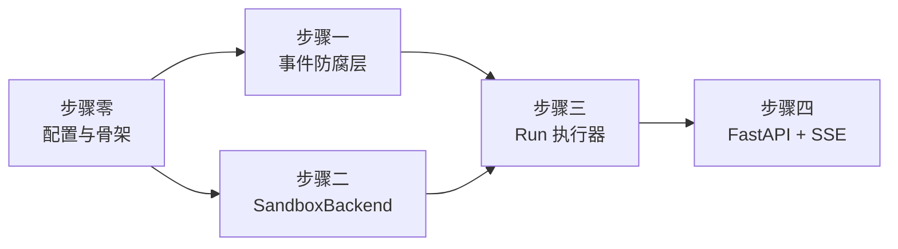

# P0 实施计划

| 项 | 值 |
|---|---|
| 文档状态 | 草稿 |
| 当前版本 | v0.5 |
| 作者 | hxy |
| 日期 | 2026-08-03 |
| 上游文档 | [总体架构设计](../01design/01architecture.md) · [智能体设计](../01design/03agent-design.md) |

### 版本历史

| 版本 | 日期 | 修改人 | 说明 |
|---|---|---|---|
| v0.1 | 2026-08-03 | hxy | 初稿。四个验证探针已于 2026-08-02 完成，本文只覆盖剩余的构造工作 |
| v0.2 | 2026-08-03 | hxy | 关闭两个待决项：测试 fixture 已入库、幂等键去重键已定案（探针⑤）。仅余「P0 是否连前端」待定 |
| v0.3 | 2026-08-03 | hxy | **P0 不做前端，用 curl 验收**。待决事项全部关闭，可以开工 |
| v0.4 | 2026-08-03 | hxy | 改正步骤一验证标准③：事件 `id` 由步骤三的事件日志分配（[架构 §5.2](../01design/01architecture.md) 定的是 Redis Stream ID），映射层不发号，步骤一验的是顺序 |
| v0.5 | 2026-08-03 | hxy | **沙箱池并入步骤三**（原先无人认领的范围空白），补验证标准④；步骤三改名并补上智能体装配这项产出 |

> **本文档的职责**：回答 **「P0 具体怎么做、做到什么程度算完」**。
>
> **不回答**「为什么这样设计」（在[架构文档](../01design/01architecture.md)与 [`adr/`](../01design/adr/)）、「智能体怎么配」（在[智能体设计](../01design/03agent-design.md)）。本文只给相对链接，不复制正文。

---

## 1. P0 的边界

**目标**（[架构 §1.1](../01design/01architecture.md)）：端到端跑通，不设量化业务指标。教师提问 → agent 写 Python → 沙箱执行 → 返回结果与图表。

**当前进度**：[架构 §11](../01design/01architecture.md) 列的四个探针已全部完成（2026-08-02），另补做探针⑤定案幂等键（08-03）。结论已全部回填[架构 v0.11](../01design/01architecture.md)，原始探针结论存于 git 历史（`git show 30b0fa6:app/spike/FINDINGS.md`）。契约、工具名、事件结构、幂等键均已定案，**P0 剩下的是构造工作，没有未知**。

### 1.1 做什么

| 范围 | 依据 |
|---|---|
| 事件防腐层：DeepAgents `StreamPart` → 平台事件 | [架构 §5.2](../01design/01architecture.md)、[ADR-0013](../01design/adr/0013-event-anticorruption-layer-v2-stream.md) |
| `SandboxBackend`：接 DeepAgents 的 8 个内置工具到 Docker 沙箱 | [ADR-0016](../01design/adr/0016-sandbox-filesystem-backend.md)、[智能体设计 §3 §4](../01design/03agent-design.md) |
| Run 执行器与事件日志 | [架构 §5.1 §5.4](../01design/01architecture.md) |
| FastAPI 网关 + SSE 流式推送 | [架构 §5.7](../01design/01architecture.md)、[ADR-0007](../01design/adr/0007-sse-over-websocket.md) |

### 1.2 明确不做

**不是遗漏，是分期。**每条都写明由哪一期偿还 —— [架构 §10.3](../01design/01architecture.md) 要求 P0 欠的债不可带入上线。

| 不做 | 后果 | 由哪期偿还 |
|---|---|---|
| 沙箱加固（gVisor、资源限制、网络白名单、磁盘配额） | 沙箱内代码可耗尽宿主机资源 | **P1，不可跳过** |
| 拆分 `sandbox-broker` | 执行进程直接持有 Docker 访问权，违反 [ADR-0004](../01design/adr/0004-sandbox-broker-docker-sock.md) | P1 |
| Redis Streams 任务队列与事件通道 | 事件日志在内存，进程重启即丢 | P2 |
| Postgres checkpointer | 用 `InMemorySaver`，进程重启无法恢复 | P2 |
| MinIO 产物存储 | 产物直接从 workspace 目录读，[§5.7](../01design/01architecture.md) 的 `302 → 预签名 URL` 改为直接返回字节 | P2 |
| 认证、RBAC、配额、限流 | 全程用固定假 `user_id`，无越权隔离 | P3 |
| HITL 审批、主动取消 | run 只有 `queued → running → succeeded/failed` 四态 | P3 |
| 工具幂等键 | 崩溃在工具执行途中会重复执行。方案已定案（去重键 `thread_id` + `checkpoint_ns`，见 [ADR-0014](../01design/adr/0014-tool-idempotency-key.md)），只是不在 P0 实现 | P3 |
| Nginx | 直接跑 uvicorn | P1 |
| **前端** | 只能用 curl 验收，没有教师视角的界面 | **另行排期**，见 §4 |
| 可观测性、成本看板 | — | P4 |

> **`app/spike/` 已于 2026-08-03 删除**（结论回填完毕）。它曾继承 `BaseSandbox`（文件操作进容器），与[智能体设计 §4.2](../01design/03agent-design.md) 相反，且不符合[技术章程](../../.claude/python-constitution.md)。**它是验证工具，不是实现起点** —— 步骤二按 [ADR-0016](../01design/adr/0016-sandbox-filesystem-backend.md) 重写，不要从 git 捞回它改造。

---

## 2. 验收标准

与[智能体设计 §7.2](../01design/03agent-design.md) 的口径一致，**一条命令能跑完**：

```bash
make all                                    # 门禁全绿
uv run --project app uvicorn api.app:app    # 启动

# 1. 建会话 → 2. 上传持仓 CSV → 3. 提交分析 → 4. 订阅事件流
curl -X POST localhost:8000/api/threads
curl -X POST localhost:8000/api/threads/{tid}/files -F 'file=@holdings.csv'
curl -X POST localhost:8000/api/threads/{tid}/runs -d '{"content":"按行业分组算年化波动率并画图"}'
curl -N localhost:8000/api/runs/{rid}/events
```

**通过条件**（四条全中才算完）：

1. 事件流里能看到 `run.started` → `reasoning`/`token` 增量 → `tool_call`/`tool_result` → `run.finished`
2. agent 自行写出 `.py` 文件并 `execute` 运行，产物落在 `/workspace/outputs/` 下
3. 断开 SSE 连接后带 `Last-Event-ID` 重连，中间产生的事件被补齐、不重不漏
4. 能取回产物图片并正常显示

---

## 3. 任务分解

五个步骤，**每步有独立的验证标准，未通过不进下一步**（[技术章程第四条](../../.claude/python-constitution.md)）。



步骤一与步骤二**互不依赖，可任意先后**。

### 步骤零：配置与目录骨架

| 项 | 内容 |
|---|---|
| 产出 | `app/config.py`：`pydantic_settings.BaseSettings` 统一读取仓库根 `.env`；各包目录与 `__init__.py` |
| 依据 | [风格指南 §六](../../.claude/python-style.md)：业务代码禁止直接 `os.getenv` |
| 验证 | `make all` 全绿；单测覆盖「缺必填变量时启动即失败」而非运行时才炸 |

目录按[风格指南 §一](../../.claude/python-style.md)的单数命名：

```
app/
├── config.py              # Settings
├── event/
│   ├── model.py           # 平台事件信封与类型枚举
│   └── mapper.py          # StreamPart → 平台事件
├── sandbox/
│   ├── path.py            # agent 视角与 workspace 虚拟根之间的双向翻译
│   ├── container.py       # Docker 容器生命周期
│   ├── pool.py            # 按 thread 复用、上限、LRU、排队
│   └── backend.py         # SandboxBackendProtocol 实现
├── agent/
│   ├── prompt.py          # 系统提示词
│   └── factory.py         # create_deep_agent 装配
├── run/
│   ├── log.py             # 事件日志（内存，接口按 Redis Stream 形状）
│   └── executor.py        # 驱动 agent、写事件
├── api/
│   ├── app.py             # FastAPI 实例
│   └── route/
└── test/                  # 测试树，按源码结构镜像
    └── event/
        ├── mapper_test.py
        └── fixture/       # 已入库，见下方步骤一
```

测试放独立的 `app/test/` 树并镜像源码结构，不与源码同放。测试文件名 `{module}_test.py`（[风格指南 §一](../../.claude/python-style.md)）。

### 步骤一：事件防腐层

**先做这一步的理由**：它是前后端唯一共用的契约（前端 Zod schema 直接照它写），而且**验证不花一分钱** —— 真实 chunk 已入库为 fixture，映射器纯离线跑真实数据，不用调模型。这也是整个 P0 里最适合严格执行[测试先行](../../.claude/python-constitution.md)的一块。

| 项 | 内容 |
|---|---|
| 产出 | 平台事件的 pydantic 模型 + `StreamPart` → 事件的映射函数 |
| 依据 | [架构 §5.2](../01design/01architecture.md) 的信封、类型枚举、映射表（均已按实测定案） |
| 前置 | ~~把 chunk 收窄成 fixture 入库~~ **已完成** → [`app/event/fixture/`](../../app/test/event/fixture/)，359 条完整未裁剪的真实 chunk，覆盖映射器要区分的全部结构分支（含 `status="error"` 的 `tool_result`）。来源与空缺见该目录的 README |
| 验证 | ① 真实 chunk 全量回放，无未知类型漏网、无异常；② 每种事件类型有独立单测；③ 事件顺序严格跟随 chunk 顺序 |

**两个容易做错的地方**（都是探针里发现的）：

- `tool_call` 出自 `updates` 的 **`model`** 节点，`tool_result` 出自 **`tools`** 节点，**两者不在同一个节点**；且工具不按名字分节点，8 个工具共用一个 `tools`。
- `reasoning` 与 `token` 必须分开。主模型的思考过程走 `additional_kwargs.reasoning_content`，与 `content` 是两个字段、交替流出，合并会让前端把思考和结论混在一起渲染。

`todo.updated` 与 `subagent.*` **无实测样本**（探针中 agent 一次没调 `write_todos`，且本期不开子 agent）。按契约留好分支，但不要假装验证过。

### 步骤二：SandboxBackend

| 项 | 内容 |
|---|---|
| 产出 | 实现 `SandboxBackendProtocol` 的 backend + Docker 容器生命周期管理 |
| 依据 | [ADR-0016](../01design/adr/0016-sandbox-filesystem-backend.md)、[智能体设计 §3 §4](../01design/03agent-design.md) |
| 验证 | ① 8 个工具逐个通；② `../` 穿越被挡；③ **容器停掉后 7 个文件工具仍可用**；④ 产物按 `outputs/` 下 mtime 变化判定；⑤ 一切异常转成 `error` 字段而非抛出 |

**三条硬约束，违反了就是白写**：

- **直接实现 `SandboxBackendProtocol`，不要继承 `BaseSandbox`。** 后者把文件操作转成 shell 命令进容器，验证标准③直接不成立。协议位于 `deepagents.backends.protocol`，未从 `deepagents.backends` 导出，须写全路径 import。
- **错误返回不抛出**（[智能体设计 §3.4](../01design/03agent-design.md)）。抛异常会让整个 run 失败；返回 `error` 字段才能让 LLM 自己改代码重试。
- **容器须以 `--user` 对齐宿主 uid/gid，并设 `HOME` 与 `MPLCONFIGDIR`**（[架构 §7.3.5 §8.5](../01design/01architecture.md)）。不设会让 matplotlib 告警混进 `execute` 的返回值，agent 会把告警当执行出错。

镜像预装清单见[架构 §7.3.5](../01design/01architecture.md) —— **中文字体是必须项**，探针实测 agent 会为找字体白跑几轮。

### 步骤三：Run 执行器、事件日志与沙箱池

| 项 | 内容 |
|---|---|
| 产出 | 事件日志（内存实现）+ 沙箱池 + 智能体装配 + 驱动 agent 消费流、写事件、维护 run 状态 |
| 依据 | [架构 §5.1](../01design/01architecture.md) 时序、[§5.4](../01design/01architecture.md) 状态机（P0 只用四态）、[§8.1](../01design/01architecture.md) 并发与排队、[ADR-0003](../01design/adr/0003-sandbox-per-thread-lifecycle.md) |
| 验证 | ① 跑通验收 case；② 事件序列完整、`id` 单调递增；③ **能从任意 `id` 之后重放**，这是步骤四断线重连的前提；④ 沙箱按 thread 复用、达上限时 LRU 淘汰空闲者、无可淘汰则 FIFO 排队并推排位、idle 超时回收、交出容器前探一次存活 |

**事件日志的接口要照 Redis Stream 的形状设计**（追加、按 id 之后范围读、有上限），P2 换实现时只改一个类，不动调用方。这是 P0 唯一值得提前投入的抽象 —— 其余一律按[技术章程](../../.claude/python-constitution.md)「不做推测性设计」。

**沙箱池并入本步骤**（2026-08-03 决定）。它原先谁都没认领：步骤二的五条验证标准一条都没涉及，§1.2 的「明确不做」也没列 —— 是范围空白而非已登记的欠债。放在这里是因为它的两个消费者都在本步骤：执行器要申请沙箱，排队事件要写进事件日志。[架构 §8.1](../01design/01architecture.md) 点名的四项（容器数上限、LRU 回收、超限排队、健康检查）本期全做，但**健康检查只在交出容器前探一次，不做定期主动轮询** —— 轮询发现问题后的动作与被动路径完全一样（销毁重建），只提前几秒，不值 20 个容器的周期性子进程开销。

**沙箱在 run 开始时申请、run 结束时归还**，不是每次 `execute` 借还一次；排队事件由执行器直接产生，不走 `get_stream_writer()`。理由与代价见[智能体设计 §3.5](../01design/03agent-design.md)，那里是这条契约的主文档。

### 步骤四：FastAPI + SSE

| 项 | 内容 |
|---|---|
| 产出 | 网关与 SSE 端点 |
| 依据 | [架构 §5.7](../01design/01architecture.md)；错误结构与 `code` 枚举照该节 |
| 验证 | ① 验收标准四条全过；② SSE 断线重连带 `Last-Event-ID` 补齐、不重不漏 |

**P0 只实现 [§5.7](../01design/01architecture.md) 的六个端点**，其余（`/auth/*`、`/admin/*`、`cancel`、`approve`）不做：

| Method | Path | P0 的简化 |
|---|---|---|
| POST | `/api/threads` | 无认证，`user_id` 用固定假值 |
| POST | `/api/threads/{id}/files` | 直接落 workspace |
| POST | `/api/threads/{id}/runs` | 202 立即返回 |
| GET | `/api/runs/{id}` | — |
| GET | `/api/runs/{id}/events` | SSE |
| GET | `/api/artifacts/{id}` | **直接返回字节**，不做 302 → MinIO 预签名 |

---

## 4. 待决事项

**全部已关闭，P0 可以开工。**

| 项 | 状态 |
|---|---|
| ~~P0 是否连最小前端一起做~~ | **已定案（2026-08-03）：不做，用 curl 验收。** 理由：P0 存在的唯一目的是拿到「agent 到底好不好用」的结论（[架构 §10.2](../01design/01architecture.md) 风险二），界面对这个结论没有贡献；且事件契约先在真实流量下跑过一轮再动前端，可避免契约微调时前后端一起返工。**遗留问题**：[架构 §11](../01design/01architecture.md) 的 P0–P4 分期只覆盖后端，**从未给前端排过期**。本次只决定「P0 不做」，没有决定「哪一期做」—— 后者要等 P0 跑完、事件契约被真实流量验证过之后，连同[前端选型](../01design/02frontend-selection.md)一并排进架构文档的路线图 |
| ~~探针 fixture 的入库范围~~ | **已关闭**（2026-08-03）。没有裁剪，直接入库一条完整未删减的短流（359 条，[`app/event/fixture/`](../../app/test/event/fixture/)）。裁剪会破坏时序真实性，而完整流只有 360 KB，不值得为省体积牺牲保真 |
| ~~`checkpoint_ns` 重放稳定性~~ | **已关闭**（2026-08-03，探针⑤）。重放稳定，且因 LangGraph 把每个工具调用扇出成独立 task 而按调用唯一。[ADR-0014](../01design/adr/0014-tool-idempotency-key.md) 的去重键据此定为 `(thread_id, checkpoint_ns)` |
