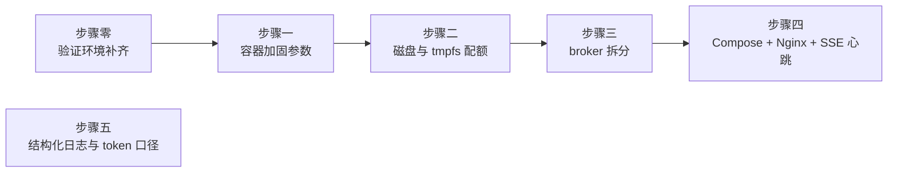
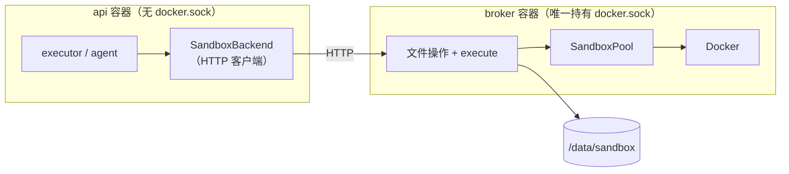

# P1 实施计划

| 项 | 值 |
|---|---|
| 文档状态 | 已完成 |
| 当前版本 | v0.2 |
| 作者 | hxy |
| 日期 | 2026-08-03 |
| 上游文档 | [总体架构设计](../01design/01architecture.md) · [P0 实施计划](./P0-plan.md) |

### 版本历史

| 版本 | 日期 | 修改人 | 说明 |
|---|---|---|---|
| v0.1 | 2026-08-03 | hxy | 初稿。P0 已于同日完成（验收四条全过），本文覆盖上线前必须偿还的加固债 |
| v0.2 | 2026-08-06 | hxy | **六个步骤全部完成，§4 通过条件六条全中**。关闭 §7 两项待决（`projid` 用 `crc32` 派生、`Workspace` 三处收进 broker）；§2 两处定案已回填上游文档；补记落地时发现的 workspace 属主坑与 gVisor 下 `--pids-limit` 的行为差异 |

> **本文档的职责**：回答 **「P1 具体怎么做、做到什么程度算完」**。
>
> **不回答**「为什么用 gVisor 而非 Firecracker」（在 [ADR-0002](../01design/adr/0002-sandbox-isolation-gvisor.md)）、「为什么 broker 要独立」（在 [ADR-0004](../01design/adr/0004-sandbox-broker-docker-sock.md)）、「为什么配额用 XFS」（在 [ADR-0015](../01design/adr/0015-sandbox-disk-quota-xfs.md)）。本文只给相对链接，不复制正文。

---

## 1. P1 的边界

**目标**（[架构 §11](../01design/01architecture.md)）：把 P0 刻意欠下的安全债还清。P0 的裸 Docker 沙箱**不可带入上线** —— 这是架构文档写死的前置条件，不是可以再推一期的偏好。

**与 P0 的根本差别**：P0 回答的是「agent 好不好用」，那是一个**产品不确定性**；P1 回答的是「不可信代码跑在这台机器上安不安全」，那是一个**工程确定性**。前者要探针，后者要的是把已经论证完的加固参数逐条落地并验证生效。**P1 没有未知，只有工作量。**

### 1.1 做什么

| 范围 | 依据 |
|---|---|
| 沙箱加固：gVisor + 完整加固参数 + `/workspace` 5GB 配额 + `/tmp` 512MB 限容 | [架构 §7.3](../01design/01architecture.md)、[ADR-0002](../01design/adr/0002-sandbox-isolation-gvisor.md)、[ADR-0015](../01design/adr/0015-sandbox-disk-quota-xfs.md) |
| `sandbox-broker` 拆分：8 个工具全部改走 broker | [架构 §5.5 §5.6](../01design/01architecture.md)、[ADR-0004](../01design/adr/0004-sandbox-broker-docker-sock.md) |
| Compose 化 + Nginx + SSE 心跳 | [架构 §4.4 §8.4](../01design/01architecture.md)、[ADR-0001](../01design/adr/0001-single-host-compose.md) |
| 结构化日志 + token 计量按 cache 命中拆分 | [架构 §8.3](../01design/01architecture.md)（点名建议前移到 P1）、[§6.4](../01design/01architecture.md) |

### 1.2 P0 已经提前做掉的部分，不重复排期

[架构 §11](../01design/01architecture.md) 的 P1 一行里写了「生命周期管理」，但它**在 P0 步骤三就已经落地**（[`app/sandbox/pool.py`](../../app/sandbox/pool.py)，29 个单测）：[§8.1](../01design/01architecture.md) 点名的四项 —— 容器数上限、LRU 回收、超限排队、健康检查 —— 本期全部已实现并验证。

**因此 P1 对生命周期管理的工作不是「实现」，而是「搬运」**：把 `SandboxPool` 整体移进 broker 进程。功能不变，改的是它跑在哪里、以及排队排位怎么跨进程推回执行器（见步骤三）。

### 1.3 明确不做

**不是遗漏，是分期。**延续 [P0 §1.2](./P0-plan.md) 的登记方式，每条写明由哪一期偿还。

| 不做 | 后果 | 由哪期偿还 |
|---|---|---|
| 拆分 worker 进程 | agent 仍与网关同进程，`kill -9` 网关会带走在跑的 run | P2 |
| Redis Streams 任务队列与事件通道 | 事件日志仍在内存，进程重启即丢 | P2 |
| Postgres checkpointer | 仍用 `InMemorySaver`，进程重启无法恢复 | P2 |
| MinIO 产物存储 | 产物仍直接从 workspace 读 | P2 |
| 认证、RBAC、配额、限流 | 仍是固定假 `user_id`，无越权隔离 | P3 |
| HITL 审批、主动取消 | run 仍只有四态 | P3 |
| 工具幂等键去重 | 崩溃在工具执行途中仍会重复执行 | P3（**broker 拆分后落点已就位**，见步骤三） |
| 跨进程租约的失效兜底 | api 若在 `acquire` 与 `release` 之间崩溃，broker 侧该容器的 `lease` 永远归不了零，既不被 idle 回收也不被驱逐 —— 一个沙箱名额被永久占住 | P2（**本期新增的缺口**：P0 单进程时有 `finally` 兜着，拆开进程后没有了。P2 拆 worker 时正面处理，见 [`sandbox/pool.py`](../../app/sandbox/pool.py) 的 `lease == 0` 判定） |
| 内网 pypi 镜像（devpi） | agent 装不了任何包，只能用镜像预装的栈 | 本期定案不做，见 §2.2 |
| workspace 归档回收 | 磁盘占用仍是「历史 thread 数 × 最多 5GB」，worst case TB 级 | [§6.5](../01design/01architecture.md) 待定，**P2 前必须排** |
| 前端 | 仍只能 curl 验收 | 另行排期，[P0 §4](./P0-plan.md) 的遗留问题仍未关闭 |
| 可观测性指标、链路追踪、成本看板 | 只有日志与 token 数，没有聚合视图 | P4 |

> **`--pids-limit` 挡不住的那类失控**：单进程死循环吃满 1 核、单进程分配 2GB 内存，都在加固参数的允许范围内 —— 它们被 `--cpus=1` 与 `--memory=2g` 限在**本沙箱内部**，不伤宿主机，但该 thread 自己的 run 会卡到 `execute` 超时（120s）才结束。这是设计接受的行为，不是缺口。

---

## 2. 两处与上游文档不一致，本期定案

开工前发现上游文档在两个点上给不出唯一答案。按[项目约定](../../CLAUDE.md)先确认再写，两处均已于 2026-08-03 定案，**结论已于 2026-08-06 回填到对应的上游文档**。

### 2.1 broker 的职责边界：8 个工具全走 broker

**冲突**：[ADR-0004](../01design/adr/0004-sandbox-broker-docker-sock.md) 写 broker「只暴露 `create / exec / destroy` 三个 API」，照此则 7 个文件工具留在 api 进程内直接读写宿主 workspace；而[架构 §5.5](../01design/01architecture.md) 写「文件操作由 **broker** 直接读写宿主机的 bind-mount 目录」，[§5.6](../01design/01architecture.md) 的工具表还给 7 个文件工具标了「broker 去重」列。两处对同一件事给了不同答案。

**定案：按 §5.5 / §5.6，8 个工具全部走 broker。** ADR-0004 的「三个 API」是决策作出时的粗粒度描述，已被后续的 [ADR-0016](../01design/adr/0016-sandbox-filesystem-backend.md)（文件操作不进容器）与 [ADR-0014](../01design/adr/0014-tool-idempotency-key.md)（broker 侧去重）细化，**它过时了，不是 §5.5 错了**。

理由：
- **去重落点**。[§5.6](../01design/01architecture.md) 的 P3 去重要覆盖 `write_file` / `edit_file` / `delete` / `execute` 四个写操作。文件工具若不经 broker，P3 得把它们再搬一次，等于 P1 白拆。
- **边界的完整性**。ADR-0004 要防的是「api 被 agent 输出影响后能直接动沙箱资源」。若 api 仍能任意读写任意 thread 的 workspace，broker 只挡住了容器、没挡住数据，边界形同虚设。

**代价**（明确接受）：`read_file` / `glob` / `grep` 这类高频调用每次多一跳本地 HTTP；大文件读写要走 HTTP body。相对 LLM 调用的耗时可忽略，但**不是零** —— 若实测 grep 大目录明显变慢，处置方式是在 broker 侧加结果上限，不是把工具搬回 api。

**已回填**（2026-08-06）：[ADR-0004](../01design/adr/0004-sandbox-broker-docker-sock.md) 的「决策」一节已改写为按组列出的 API 清单，并补了「本决策于 2026-08-03 按 §5.5 扩展」的记录。

### 2.2 沙箱网络策略：`--network=none`，本期不上 devpi

**冲突**：[架构 §7.3.2](../01design/01architecture.md) 的加固清单写 `--network=none` **或**白名单 bridge，[§7.3.3 陷阱一](../01design/01architecture.md)则说「必须给沙箱配一个内网 pypi 镜像」，[§4.4](../01design/01architecture.md) 的 compose 骨架里也列了 `pypi-mirror` 服务。

**定案：P1 用 `--network=none`，不部署 devpi。**

理由：
- **预装栈已实测够用**。P0 验收全程 agent 没有装包需求（镜像已预装 pandas / numpy / matplotlib 与中文字体）。
- **与加固参数直接冲突**。`--read-only` 使 `pip` 只能装到 `HOME` 下，而 `HOME=/tmp` 是 512MB 且 `noexec` 的 tmpfs —— 装得下的包跑不起来，跑得起来的包装不下。**要支持装包，得先给出一条可写且可执行的路径，那是对加固清单的实质放松**，不能顺手做。
- §7.3.3 那条写于 P0 之前，前提是「agent 一定会想装包」，而 P0 实测的前提已经变了（栈预装 + 提示词显式禁止找字体）。

**代价**：agent 遇到预装栈覆盖不到的分析方法（如 `statsmodels`、`scipy` 的冷门模块）会直接卡住，且**零出网下它的错误信息不会指向「装不了包」**。缓解：把可用库清单写进系统提示词；实测缺哪个就加进镜像重新构建。

**重新评估的触发条件**：教师提出的分析需求反复撞到缺库，且加库的频率高到无法靠重建镜像跟上。届时要连同「可写可执行路径」一起重新设计，见待决 §7.

**已回填**（2026-08-06）：[架构 §7.3.3](../01design/01architecture.md) 陷阱一已注明「P1 定案不做，沙箱保持 `--network=none`」；[§4.4](../01design/01architecture.md) 的 compose 骨架已标注 `pypi-mirror` 未部署。

---

## 3. 环境前提

**gVisor 与 XFS 在开发机上都不具备**，这是 P1 与 P0 最大的操作差别 —— P0 的每一步都能在开发机上验完，P1 不补环境则步骤一、二的验证标准全是空头支票。

实测（2026-08-03，开发机）：

| 项 | 现状 | P1 需要 |
|---|---|---|
| 容器运行时 | 只有 `runc` 与 `nvidia`，**无 `runsc`** | 装 gVisor 并注册为 Docker 运行时 |
| `data/sandbox` 所在文件系统 | **ext4**（`/dev/nvme0n1p3`） | XFS + `prjquota` 挂载 |
| 规格 | 16 核 / 31 GB | 目标服务器是 32 核 / 64 GB |

**已定：在开发机上补齐环境**（2026-08-03），装 `runsc` + 用 loop 设备造一个 XFS 镜像挂到 `data/sandbox`。

> **loop-XFS 与服务器真实分区不等价**，这是本期接受的残留风险。配额语义（`bhard` 触发 `ENOSPC`）一致，但 IO 路径与性能特征不同。**部署到服务器时必须在真实分区上重跑步骤二的验证**，不能因为开发机过了就跳过 —— [§8.5](../01design/01architecture.md) 已把「XFS + prjquota 挂载」列为需提前落实的运维项，挂载选项改动要重启，事后补代价高。

开发机规格低于目标服务器**不影响 P1 验证**：加固验的是「限制是否生效」，不是「能同时跑多少个」。但 `sandbox_max_container` 在开发机上应调低（31GB 内存最多 8–10 个），[§4.4](../01design/01architecture.md) 已要求该值是配置项而非硬编码，[`config.py`](../../app/config.py) 已满足。

---

## 4. 验收标准

与 [P0 §2](./P0-plan.md) 同样的口径，**一条命令能跑完**：

```bash
make all                                     # 门禁全绿
docker build -f deploy/sandbox.Dockerfile -t zuel-sandbox:latest .
docker compose -f deploy/compose.yml up -d   # nginx + api + broker

# 破坏性测试：四条都在沙箱里跑，宿主机均不受影响
bash deploy/test/hostile.sh                  # while True / fork 炸弹 / 写满 workspace / 写满 tmp

# P0 的验收四条，经 Nginx 重跑一遍
bash deploy/test/acceptance.sh
```

**通过条件**（六条全中才算完）：

1. **四条破坏性测试宿主机均不受影响** —— 死循环被 `--cpus=1` 限住、fork 炸弹被 `--pids-limit` 挡住、写满 `/workspace` 在 5GB 处得到 `ENOSPC`、写满 `/tmp` 在 512MB 处得到 `ENOSPC`，宿主机的可用内存与磁盘在四条跑完后回到基线
2. **[P0 的验收四条](./P0-plan.md)在 gVisor + Nginx 下重跑仍全过** —— 这是 [ADR-0002](../01design/adr/0002-sandbox-isolation-gvisor.md) 明确要求的回归：「需要用真实的分析场景回归验证，不能只跑 hello world」，因为 runsc 的 syscall 覆盖不是 100%，pandas / matplotlib 有可能跑不起来
3. **api 容器内不存在 `docker.sock`**，且容器内直接调 Docker API 失败 —— 这是 ADR-0004 的核心目标，要验的是「拿不到」而不是「没用到」
4. **broker 重启后按 label 认领已有容器**，不泄漏孤儿容器，认领后 run 能继续
5. **排队静默期 SSE 不被 Nginx 掐断** —— 模拟沙箱满后新建 run，连接在超过 Nginx 默认 60s 的静默期内保持存活，且能收到心跳
6. **日志是结构化行且带 `run_id` / `thread_id`**；`run.finished` 分别给出 `cache_read` 与未命中两个数

> 破坏性测试脚本要**先记基线再跑**（`free` / `df`），跑完比对。只看「命令报错了」不算通过 —— 要验的是宿主机没事，不是沙箱里的命令失败了。

### 4.1 实测结果（2026-08-06，六条全中）

| 条件 | 结果 |
|---|---|
| ① 四条破坏性测试 | ✅ 死循环 100.25% 限一核；fork 炸弹宿主进程数 501→504；`/workspace` 5120MB 处 `ENOSPC`；`/tmp` 512MiB 处 `ENOSPC`。内存与磁盘均回基线 |
| ② P0 验收四条重跑 | ✅ 按 §6 分三次跑（步骤一 gVisor 下、步骤三经 broker、步骤四经 Nginx），中文四联图无缺字 |
| ③ api 无 `docker.sock` | ✅ 容器内 `docker ps` 报 `Cannot connect to the Docker daemon`，且看不到宿主 workspace |
| ④ broker 重启认领 | ✅ `kill -9` 后 `--rm` 容器仍在（步骤三的疑问就地证实），重启按 label 认领，同会话追问复用同一容器 |
| ⑤ SSE 静默期存活 | ✅ 静默 100 秒经 Nginx 未断，收到 5 个心跳帧且都不带 `id:` |
| ⑥ 日志与 token 口径 | ✅ 全部输出经 `jq` 逐行解析通过 |

> **一处与预期不符，如实记下**：撞上 `--pids-limit` 时 **runsc 直接掀掉整个沙箱**，而不是像 runc 那样让 `fork` 干净地返回 `EAGAIN`。宿主机毫发无损、沙箱池的健康检查会重建，对平台可接受 —— 但与通过条件①「fork 炸弹被 `--pids-limit` 挡住」的字面预期不同：**挡住的是宿主机，不是那次 fork**。已写进 [`sandbox/container.py`](../../app/sandbox/container.py) 的注释。

> **验证脚本本身失效了三次**，每次都表现为「测试通过但什么都没测到」：`repr` 把换行转义导致 fork 炸弹根本没点着；`dd ... | tail -3` 恰好砍掉唯一带 `No space left on device` 的那行；脚本以 root 跑、`mkdir` 出 `root:root` 目录导致容器 `Permission denied` 被误读成「配额生效」（**方向相反的假象**）。**破坏性脚本写完要先对着一个已知应当失败的场景跑一遍**，确认它真能报红。

---

## 5. 任务分解

六个步骤，**每步有独立的验证标准，未通过不进下一步**（[技术章程第四条](../../.claude/python-constitution.md)）。



步骤五与其余全部无关，**可任意时候插入**。

**先加固、后拆分**：步骤一二在现有 [`DockerContainer`](../../app/sandbox/container.py) 上改容器创建参数，改完立刻能验；步骤三是把已验证的东西整体搬进 broker。反过来先拆再加固，等于在跨进程环境里调试加固参数，每次验证多一层间接。

### 步骤零：验证环境补齐

| 项 | 内容 |
|---|---|
| 产出 | 开发机装好 `runsc`；`data/sandbox` 挂到 loop 设备上的 XFS（`prjquota`）；两者的搭建步骤写进 [`deploy/`](../../deploy/) 下的脚本，不留在某人的 shell 历史里 |
| 依据 | 本文 §3 |
| 验证 | ① `docker run --runtime=runsc` 能起 `zuel-sandbox:latest` 并跑通 `import pandas`；② `xfs_quota` 能对一个目录设 `bhard` 并在写超时得到 `ENOSPC` |

**这一步不写业务代码**，但它是步骤一二的验证标准能否成立的前提。脚本要能重跑 —— 开发机重装或换人接手时，这是唯一的恢复路径。

### 步骤一：容器加固参数

| 项 | 内容 |
|---|---|
| 产出 | [`DockerContainer.start()`](../../app/sandbox/container.py) 落齐 [§7.3.2](../01design/01architecture.md) 的加固参数；`execute` 输出加大小上限 |
| 依据 | [架构 §7.3.2](../01design/01architecture.md)、[ADR-0002](../01design/adr/0002-sandbox-isolation-gvisor.md) |
| 验证 | ① 死循环与 fork 炸弹两条破坏性测试通过；② `zuel-sandbox` 镜像在 runsc 下跑通真实分析场景（P0 验收 case）；③ 超长输出被截断且截断处有明确标记；④ 加固参数全部可配（不硬编码进 `start()`） |

逐条落地 [§7.3.2](../01design/01architecture.md) 的清单：`--runtime=runsc`、`--network=none`、`--read-only`、`--tmpfs /tmp`、`--cap-drop=ALL`、`--memory=2g`、`--cpus=1`、`--pids-limit=128`、`--security-opt=no-new-privileges`。

**三个会咬人的地方**：

- **`HOME=/tmp` 撞上 `noexec`**。P0 为了消掉 matplotlib 告警把 `HOME` 与 `MPLCONFIGDIR` 指到 `/tmp`（[`container.py`](../../app/sandbox/container.py) 顶部有注释说明原因）。加了 `--tmpfs /tmp:noexec` 后，写配置仍然可以，但**任何落到 `HOME` 下的可执行文件都跑不了**。本期零出网、不装包，因此不冲突 —— 但这条依赖必须记下来，它是 §2.2 那个决策的一半理由。
- **`--user` 的取值在容器化前后不一样**。P0 用 `os.getuid()` 对齐宿主，是因为进程直接跑在宿主上。broker 进容器后（步骤三）这个值变成 broker 容器内的 uid，与宿主 workspace 属主未必一致 —— [§8.5](../01design/01architecture.md) 点名过这个坑，症状是「agent 写得进、读不出」且不指向权限。
- **`execute` 输出上限是新增项**，P0 没做。[`backend.execute`](../../app/sandbox/backend.py) 现在原样返回容器的全部 stdout+stderr，一句 `while True: print(x)` 就能把网关吃爆。截断标记要让 LLM 看得懂是被截断了，否则它会以为程序输出就这么多。

### 步骤二：磁盘与 tmpfs 配额

| 项 | 内容 |
|---|---|
| 产出 | 创建 workspace 时分配 XFS project quota；`projid` 的分配与回收 |
| 依据 | [架构 §7.3.5](../01design/01architecture.md)、[ADR-0015](../01design/adr/0015-sandbox-disk-quota-xfs.md) |
| 验证 | ① 写满 `/workspace` 在 5GB 处得到 `ENOSPC`，宿主机磁盘可用量不变；② 写满 `/tmp` 在 512MB 处得到 `ENOSPC`，宿主机可用内存不变；③ 配额对**文件工具写入**同样生效（不只是容器内写入）；④ 容器销毁重建后配额仍在 |

验证标准③容易漏：按 [ADR-0016](../01design/adr/0016-sandbox-filesystem-backend.md)，`write_file` 是 broker 直接写宿主目录、**不进容器**的，因此它绕过了一切容器级限制。XFS project quota 恰好是对**目录**生效而非对容器生效，所以这条能成立 —— 但必须实际验一次，不能推理了事。

`projid` 的存放方式见待决 §7。

### 步骤三：sandbox-broker 拆分

**本期最大的一块。**

| 项 | 内容 |
|---|---|
| 产出 | 独立的 broker 服务（持有 `docker.sock`）+ api 侧的 HTTP backend 客户端；`SandboxPool` 迁入 broker |
| 依据 | [ADR-0004](../01design/adr/0004-sandbox-broker-docker-sock.md)、[架构 §5.5 §5.6](../01design/01architecture.md)、本文 §2.1 |
| 验证 | ① 8 个工具经 broker 全部通过（复用 P0 的 backend 测试，换掉传输层）；② api 容器内无 `docker.sock` 且调 Docker API 失败；③ broker 重启后按 label 认领已有容器、不泄漏孤儿；④ 排队排位仍能实时推到事件流；⑤ P0 验收四条全过 |

**职责切分**：



`SandboxBackend` 的 10 个方法（8 工具 + `upload_files` / `download_files`）保持签名不变，只把实现从「直接调 `FilesystemBackend` / `container.exec`」换成「发 HTTP」。**`SandboxBackendProtocol` 这层抽象在 P0 就立住了，这里正好兑现它的价值** —— agent 侧一行不用改。

**三个必须想清楚的点**：

- **排队排位怎么跨进程推回来**。P0 是 `pool.acquire(on_queued=回调)`，执行器在回调里直接产生 `sandbox.queued` 事件。拆开后回调没法跨进程。[§8.1](../01design/01architecture.md) 明确要求「worker 侧异步挂起等待，**不轮询**」，因此 broker 的 acquire 端点要用**流式响应**（SSE 或 chunked）：先流排位变化，最后流一条就绪。平台已有 SSE 技术栈，不引新东西。
- **broker 重启的认领逻辑**。[ADR-0004](../01design/adr/0004-sandbox-broker-docker-sock.md) 点名「这段恢复逻辑必须写对，否则会泄漏孤儿容器」。容器创建时打 label（至少 `thread_id`），重启时 `docker ps` 按 label 过滤重建 `SandboxPool` 的 slot 表。**注意 P0 的容器带 `--rm`**：broker 崩溃不会带走容器（容器不是 broker 的子进程），但要确认这一点，不能假设。
- **P3 的去重落点在这里就位**。broker 成为写操作的唯一入口后，[ADR-0014](../01design/adr/0014-tool-idempotency-key.md) 的 `(thread_id, checkpoint_ns)` 去重只需在 broker 侧加一层缓存。**P1 不实现去重**，但 API 设计要给这两个参数留位置，否则 P3 要改协议。

### 步骤四：Compose + Nginx + SSE 心跳

| 项 | 内容 |
|---|---|
| 产出 | `deploy/compose.yml`（nginx + api + broker 三个服务）+ Nginx 的 SSE 配置 + SSE 心跳 |
| 依据 | [架构 §4.4 §8.4](../01design/01architecture.md)、[ADR-0001](../01design/adr/0001-single-host-compose.md)、[P0 §2](./P0-plan.md) 的心跳欠债 |
| 验证 | ① P0 验收四条经 Nginx 全过（含 `Last-Event-ID` 重连）；② 静默超过 60s 的 SSE 连接不被掐断；③ `docker compose down && up` 后服务自恢复 |

**心跳是本步骤的硬前提，不是附加项。**[P0 §2](./P0-plan.md) 已经写明：P0 的 SSE 没有心跳，事件密集时不成问题，但**排队等沙箱那几分钟是完全静默的**，Nginx 默认 `proxy_read_timeout 60s` 会先掐断连接。所以「上 Nginx」与「补心跳」必须同一步完成，分开做中间态是坏的。

心跳用 SSE 注释行（`: heartbeat\n\n`），不占事件 id、不进事件日志，前端与 `Last-Event-ID` 补齐逻辑都不受影响。

Nginx 的 SSE 配置照 [§8.4](../01design/01architecture.md) 抄，四条一条都不能少（`proxy_buffering off` 尤其关键，默认配置会让流式输出全部卡到响应结束）。

### 步骤五：结构化日志与 token 计量口径

| 项 | 内容 |
|---|---|
| 产出 | JSON 行日志（带 `run_id` / `thread_id`）+ token 按 `cache_read` 与未命中分开记 |
| 依据 | [架构 §8.3](../01design/01architecture.md)（点名建议前移 P1）、[§6.4](../01design/01architecture.md) 的计量口径 |
| 验证 | ① 日志可被 `jq` 解析，一次 run 的全部日志能按 `run_id` 过滤出来；② `run.finished` 分别给出两个数，且与 `usage_metadata` 实测值对得上 |

**token 口径是纠错，不是新增。**[`_token_usage`](../../app/run/executor.py) 现在取 `input_tokens + output_tokens` 总数，而 [§6.4](../01design/01architecture.md) 已经用 P0 实测数据论证过这个口径是错的：62% 的 input 是 cache 命中，按总量记会**高估成本约 1.6 倍**，且方向性地惩罚长会话。两个值都在 `usage_metadata.input_token_details` 里现成。

> **这是一次事件契约变更。** `RunFinishedData.tokens_used: int`（[`event/model.py`](../../app/event/model.py)）要换成拆分后的字段。[架构 §5.2](../01design/01architecture.md) 是该契约的主文档，**改代码的同时必须改它** —— 前端虽未开工，但 §5.2 是前后端共用的唯一契约来源。

日志里带 `run_id` 需要 `contextvars` 传递，不要给每个函数加参数。

---

## 6. 与 P0 的回归关系

P1 全程**不新增业务功能**，因此 [P0 的验收四条](./P0-plan.md)是贯穿始终的回归基线：步骤一（gVisor 下）、步骤三（经 broker）、步骤四（经 Nginx）各要重跑一次。

**每次重跑都是真实调用 DeepSeek，有成本**。P0 单次完整验收实测 31.3 万 token（[§6.4](../01design/01architecture.md)）。三次重跑约 100 万 token 量级，是本期的已知开销，不要为省这笔钱把回归压缩成一次 —— 三个步骤各自会以不同方式打破 P0 的假设（syscall 覆盖、传输层、反代缓冲），一次跑不出是哪一层的问题。

---

## 7. 待决事项

**两项均已于 2026-08-06 关闭**，结论按建议采纳并已落地。

| 项 | 状态 |
|---|---|
| ~~**`projid` 映射存在哪里**~~ | **已关闭**（2026-08-06）。**由 `thread_id` 确定性派生**：`crc32(thread_id) % 0x7FFFFFFF + 1`，见 [`sandbox/quota.py`](../../app/sandbox/quota.py)。不引入任何持久化状态 —— 另外两个方案（broker 内存表 + 启动时从 `xfs_quota report` 恢复、落 JSON 文件）都是给一个 P2 就要拆掉的东西引入状态。<br>**碰撞已接受**：2³¹ 的空间下约 4.6 万个 thread 起有生日碰撞，后果是两个 thread 共享一份 5GB 配额 —— 是容量问题不是越权问题。P2 上 Postgres 后换成 [ADR-0015](../01design/adr/0015-sandbox-disk-quota-xfs.md) 说的表映射是纯替换 |
| ~~**`Workspace` 的物理访问是否也收进 broker**~~ | **已关闭**（2026-08-06）。**三处一并收进 broker**：`POST /threads`（建会话）、`POST /threads/{id}/save`（上传）、`GET /threads/{id}/artifacts[/{path}]`（产物），见 [`broker/route.py`](../../app/broker/route.py)；api 侧只剩 HTTP 客户端 [`sandbox/remote.py`](../../app/sandbox/remote.py)。<br>理由即 §2.1 的第二条（边界的完整性）：留着这三处，api 仍能读写任意 thread 的文件，broker 只挡住了容器、没挡住数据。验收②已实测确认 api 容器看不见宿主 workspace |

> **落地时才发现的坑，记在这里**：broker 在容器里是 root，它建出来的 workspace 目录属主是 `root:root`，而沙箱以宿主用户跑 —— 写不进去。症状**完全不指向权限**：`execute` 全部成功（脚本落在 `/tmp`）、没有一条报错，agent 只是「选择」把图存到别处，最后产物一个都没有并反复重试到撞 recursion limit。[§8.5](../01design/01architecture.md) 点名过这个坑（步骤一「三个会咬人的地方」第二条也抄了），但**真实验收连栽两次才定位到**。处置：`Workspace` 建目录后 `chown` 到 `SANDBOX_USER`，见 [`sandbox/workspace.py`](../../app/sandbox/workspace.py)。
