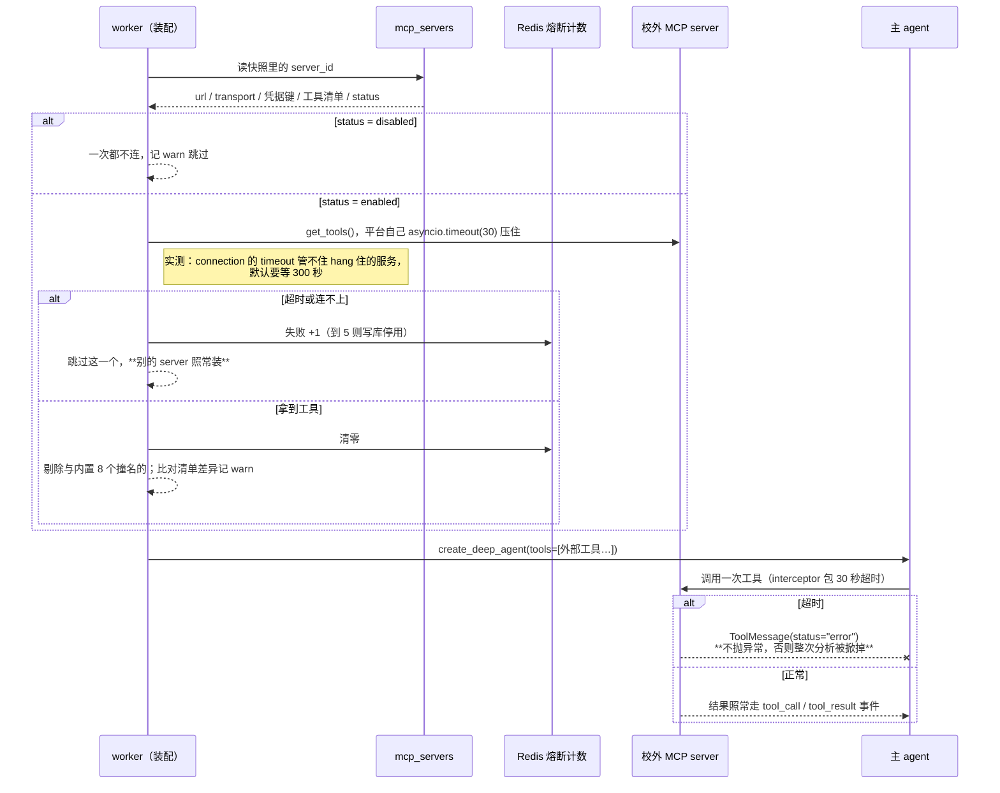

# P10 实施计划：MCP

| 项 | 值 |
|---|---|
| 文档状态 | **计划已定稿，未开工**（2026-08-15） |
| 当前版本 | v0.1 |
| 作者 | hxy |
| 日期 | 2026-08-15 |
| 一句话验收 | **外网工具真被调用** |
| 第二条主判据 | **连续失败 5 次真的自动停用**（见 §1.1） |
| 上游文档 | [P6 决策](./P6-decision.md)（本期用到 F 组 13 条、A7、J5、K1、K2、L1、L3）· [接入规范 §2.4 / §5.4](../01design/04extension-integration.md) · [智能体设计 §1.2](../01design/03agent-design.md) · [风险登记 §10.2.1](../01design/09risk-register.md) |
| 前置 | [P6 决策 §12.1](./P6-decision.md) 写明 P10 的入口条件是 F 组全定（2026-08-13 已定案）。P9 已于 2026-08-15 开发完成，判据 47 条 |

### 版本历史

| 版本 | 日期 | 修改人 | 说明 |
|---|---|---|---|
| v0.1 | 2026-08-15 | hxy | 初稿。**开工前九处实测全部跑完**，结论见 §2 —— **三处推翻了决策文档的预设**（F6 的撞名后果、F5 的 30 秒落点、F1 的阻塞范围），另有一处是决策文档从未设想过的失效形态（一个坏服务拖垮全部）。开工前三处拍板：申请流程纳入本期并复用 `reviews`、熔断只数传输层失败、验收以本地夹具为主并保留一条真外网判据 |

---

## 1. 边界

### 1.1 这一期要证明的那两件事

两件都由 [L1](./P6-decision.md) 给出：**外网工具真被调用；连续失败 5 次真的自动停用。**

| # | 命题 | 判据 |
|---|---|---|
| 1 | 挂上一个外网 MCP，它的工具真的被调用了，产物里看得出来 | `P10①` `P10⑦` |
| 2 | 熔断是真闸门：连续失败 5 次自动停用，停用之后不再连它 | `P10⑤` |
| 3 | 一台失联的外部机器掀不掉一次分析，也拖不垮别的服务 | `P10③` |
| 4 | 外部工具顶不掉平台自己的文件工具 | `P10④` |
| 5 | 教师看得见「这次调用会把数据发到校外」，两条路径都看得见 | `P10⑥` |

**本期特有的、前九期都不曾有过的东西**：

> 前九期里，一次分析要用到的东西**全都在平台手里** —— 提示词是库里的一行（P6），
> agent 是库里的一行（P7），skill 是宿主机上的字节（P8），子智能体还是库里的一行（P9）。
> 本期第一次出现「一次分析的成败取决于一台校外的、平台既管不了也提前不知道状态的机器」。
>
> 于是每一条「它会响应」的假设都要重新过一遍：**连不上怎么办、连上了不回怎么办、
> 回了但是错的怎么办、它偷偷换了工具名怎么办。** 这四问正是 §2 那九处实测里的六处，
> 不是巧合 —— [F0](./P6-decision.md) 早写着「平台失去控制力」是全外网换来的代价。

### 1.2 本期做什么（五块）

**A. 数据层：一张新表、一处加列，迁移 `0014`**

| # | 内容 | 出处 |
|---|---|---|
| A1 | 新建 `mcp_servers` 表：地址、传输方式、凭据键名、工具清单、四项声明、状态与停用原因 | K1 · K2 · F0 |
| A2 | `agent_versions` 加 `mcp_refs` 列（`[{server_id, name}]`），发布版本时与 `skill_refs` / `subagent_refs` 一起冻结 | F12 · A1 |
| A3 | `ResourceKind` 加 `MCP`，审核复用 `reviews` 表 | **本期拍板** · C 组 |
| A4 | 迁移 `0014`：建表 + 加列，纯追加、可空 | K1 |

> **`mcp_servers` 没有版本序列，这是它与 `agents` / `skills` 唯一的结构性差别。**
> 那两张表能冻结版本，是因为**内容在平台手里**；MCP 的内容在校外那台机器上，
> 平台存的只是一个地址与一份「上架时它长这样」的记录。**引用因此只冻结 `{server_id, name}`，
> 冻不住行为** —— 代价写在 §1.4 第 3 条。

**B. 装配：`agent/mcp.py` —— 本期的技术核心**

| # | 内容 | 出处 |
|---|---|---|
| B1 | **逐个 server 各要各的工具**，各自超时、各自降级；一个连不上只跳过它自己 | **§2 第 4 条，实测得出** |
| B2 | 超时由平台自己 `asyncio.timeout` 压住，**不指望 connection 的 `timeout` 字段** | **§2 第 2 条，实测得出** |
| B3 | 单次调用超时用 interceptor 包住，**捕获后返回 `ToolMessage(status="error")`，不抛异常** | **§2 第 3 条，实测得出** · G10 |
| B4 | **与内置 8 个工具撞名的外部工具一律剔除**，记 WARNING | **§2 第 1 条，实测得出** · F6 |
| B5 | 实际拿到的工具名与库里清单比对，不一致记 WARNING（清单过期是静默的） | F6 的 ⚠️ 缓解措施 |
| B6 | 三个超时/阈值常量定在模块顶部；`MAX_MCP_SERVER` 同 | F5 · [技术宪法第二条](../../.claude/python-constitution.md) |
| B7 | 子智能体的工具栈接上 MCP 工具（P9 的 `create_agent(tools=[])` 那一处） | F12 · [P9 §7 第 6 条](./P9-plan.md) |

**C. 熔断：`agent/circuit.py`**

| # | 内容 | 出处 |
|---|---|---|
| C1 | 计数在 Redis（**两个 worker 实例，进程内计数各算各的**），停用状态落 Postgres | F5 · [限流那一条同理](../../app/quota/rate.py) |
| C2 | **只数传输层失败与超时**，工具自己报错（`isError`）不计 | **本期拍板** |
| C3 | 成功一次即清零；连续 5 次则写 `status=disabled` + 停用原因 + 一条 WARNING 日志 | F5 修订版 |
| C4 | 装配时先看状态：已停用的**一次都不连** | F5 |
| C5 | 三条路（装配、工具调用、管理员探活）共用同一个计数器 | §4.4 |

**D. 目录与审核：申请 → 管理员放行 → 可勾选**

| # | 内容 | 出处 |
|---|---|---|
| D1 | 教师提申请：建一行 `status=pending` + 一条 `reviews(target_kind='mcp')` | F1 · **本期拍板** |
| D2 | **审批人只能是管理员，不能是 reviewer** | **本期定案，见 §2.5** |
| D3 | 审批时必须核四项声明；**声明「有写操作」的一律不批**（后端硬闸门，不是提示） | F0 · F9 的组合风险 |
| D4 | 上架后全平台可见可勾（**没有三档可见性**）；`AgentConfigRequest` 加 `mcps: list[str]`，提交时解析成快照，解析不出来 422 | F1 · J5 · H1 |
| D5 | 管理员可手动启停；被自动停用的条目在后台标成「已自动停用」并给出原因 | F5 修订版 |

**E. 前端：一个真目录、两处标注、一个后台**

| # | 内容 | 出处 |
|---|---|---|
| E1 | `McpLibrary` 从 mock 换成真 API：工具清单、四项声明、**外发标注** | F13 · D13 同形 |
| E2 | 「申请添加 MCP」表单真提交 | F1 |
| E3 | `AdminMcp` 真联调：待审队列、批/拒、启停、**「已自动停用」标记与原因**、探活按钮 | F5 修订版 |
| E4 | `ChatInput` 加 MCP 多选 + 外发标注；**展开显示所选 agent / 子智能体自带的 MCP** | F12 的缓解措施（**必做**） |
| E5 | `CreateAgent` 加 MCP 选择器（agent 自带 MCP） | F12 |
| E6 | `MessageList` 加「未知工具」通用渲染分支 | F7 |

**一次挂了 MCP 的 run，装配与调用两条路**：



**图里那三条 note 就是本期最贵的三处实测**：超时的落点、撞名的后果、错误的形态。

### 1.3 明确不做（每条写明由哪期偿还）

**这一节是技术债的登记簿**，翻一遍就知道 P10 结束时平台还差在哪。

| # | 不做什么 | 为什么 | 谁来还 |
|---|---|---|---|
| 1 | **MCP 工具的幂等键** | [F9](./P6-decision.md)：第一批 MCP 全是只读检索类 | **接入第一个带写操作的 MCP 时，与 F8 一起重定**。本期把这条前提做成了硬闸门（D3）：声明有写操作的不批 —— 于是「必须重定」这件事**不会被忘掉**，因为不重定就批不了 |
| 2 | **MCP 工具进 HITL 审批** | [F8](./P6-decision.md)：拦只读工具会让教师一次分析点十几次确认 | 同上，与 F9 绑在一起 |
| 3 | **用户自填地址直连** | [F1](./P6-decision.md)，与接入规范正面冲突 | **不重估**。本期做的是「申请」这一半 |
| 4 | **stdio 传输** | [F2](./P6-decision.md)：那是 worker 容器内任意代码执行 | **不重估**。数据层的枚举里根本没有这个值，不是靠校验挡住的 |
| 5 | **MCP 的 Resources 与 Prompts** | 只做 Tools。Resources / Prompts 在平台里**没有调用方** —— agent 用的是工具 | 有人提出需要时单独一次改。前端 mock 画的那三块要相应收成一块（§5 步骤七） |
| 6 | **工具清单缓存** | 每次装配现拉。缓存会让「清单过期」这件事多一层，而 B5 恰恰是为了发现过期 | 装配开销成为问题时（观察项见 §1.4 第 7 条） |
| 7 | **外部服务自己烧的 token** | [F10](./P6-decision.md)：不属于平台的账 | 不重估。**F3 反转（改回本地部署）时才需要重定** |
| 8 | **服务停用的主动通知** | [F5 的 2026-08-13 修订](./P6-decision.md)：飞书通道随可观测性撤除 | **本期把降级坐实**：日志 + 后台标记。若第一批教师用下来发现「管理员总是最后一个知道」，那时装回 Grafana Alerting 比新写一条省事 |
| 9 | **平台自建 MCP server** | [F3](./P6-decision.md) 定了全外网 | 不重估 |
| 10 | **按组 / 按人限制某个 MCP** | 目录是平台级的：管理员放行了就人人可勾（F1 的直接含义） | 出现「这个数据源只有某个课题组能用」的真实需求时。**那时要动的是 `resource_groups`，它已经是关联表，加一个 `ResourceKind.MCP` 即可** |
| 11 | **外部工具的参数级审计** | 谁把哪份数据发出去了，平台只在事件流里留了 `tool_call.args` | 不单独做。事件流已经在库里，[数据设计 §6.3.1](../01design/06data-design.md) 那条边界照旧 |

### 1.4 本期接受的风险与技术债

1. **本期最大的风险：平台的可用性第一次挂在一台校外机器上 —— 而框架给的默认防线是 300 秒。**

   > 实测（§2 第 2 条）：一台**接受连接但不回应**的服务，`get_tools()` 要 **300.05 秒**才抛出来，
   > 给 connection 传 `timeout: 2.0` **也没用** —— 那个字段管不到 SSE 读等待，真正的上限是
   > `sse_read_timeout`，默认 5 分钟。
   >
   > **教师看到的是「点了提问，什么都没发生」**，而日志里那五分钟一片空白。
   > 本期用平台自己的 `asyncio.timeout` 压住它（B2）。**但要记住这条防线的形状**：
   > 它不是框架给的，是平台自己包上去的 —— **因此 `P10③` 必须是端到端判据，
   > 不能只写单测断言「我们传了这个参数」**（与 [P9④](./P9-plan.md) 守 9999 那条同一个形状）。

2. **撞名不是整洁性问题，是安全问题。**

   > [F6](./P6-decision.md) 写着「撞名可能在上架**之后**发生，而它是静默的：两个同名工具，
   > **LLM 调哪个由框架的注册顺序决定**」。**实测比这更糟**：不是「两个同名工具选一个」，
   > 而是**外部工具把平台内置的那个顶掉了**，内置的直接从工具列表里消失（§2 第 1 条）。
   >
   > 于是一个上架时人畜无害的服务，只要**事后**加一个叫 `read_file` 的工具，
   > 就能接管平台的文件读取 —— agent 以为在读沙箱，实际把路径与后续内容发去了校外。
   > **本期因此把防线放在装配层（B4），而不是只放在上架审核上**：上架时那份清单会过期，
   > 装配时的剔除不会。

3. **MCP 引用冻不住行为，只冻得住「用了哪一条目录记录」。**

   skill 与子智能体的引用冻结的是**内容**（版本号 + 内容在平台手里）；MCP 引用冻结的是
   `{server_id, name}`，**而那台机器明天返回什么，平台今天不知道**。
   **接受的代价**：翻一条三个月前的历史 run，看得出它用了哪个服务，看不出那次调用拿到了什么
   —— 除非去事件流里读 `tool_result`。**事件流因此是这条路上唯一的真相**，它本来就在库里。

4. **所有教师共用一把 key，用量分不开**（[F4](./P6-decision.md) 原文已记）。
   若外部服务按调用计费，「哪个课题组吃光了额度」平台答不上来。**本期不做工具级计量**（[L3](./P6-decision.md)），
   但事件流里有 `tool_call`，真要查的时候数得出来 —— 只是没有现成的看板。

5. **熔断只数传输层，于是有一类坏服务不会被自动停用**（本期拍板）。
   一个「HTTP 200 但永远返回 `isError`」的服务（比如它自己的数据库挂了）会一直挂在目录里，
   每个勾了它的教师都要浪费一次工具调用。**这是主动接受的**：反过来的代价更差 ——
   模型传错参数在一次分析里连着发生 5 次很常见，那会把一个健康服务停掉，而恢复要管理员手动点。
   **观察项**：`P10①` 那次真实分析记下 `isError` 出现了几次；若这个数字长期为 0，说明口径可以收紧。

6. **三个数字都是猜的**：`MCP_CONNECT_TIMEOUT = 30`、`MCP_CALL_TIMEOUT = 30`、`MCP_FAILURE_THRESHOLD = 5`
   （前两个取自[接入规范 §5.4 第 10 项](../01design/04extension-integration.md)，第三个取自 [F5](./P6-decision.md)）。
   还要再加一个：**`MAX_MCP_SERVER = 3`** —— 一次 run 最多挂几个服务，**决策文档没定过这个数**。
   取 3 的理由：实测一个服务平均带 3～4 个工具，3 个服务 ≈ 12 个外部工具，加上内置 8 个已经 20 个，
   再多模型选不准。**与 [`MAX_SUBAGENT = 5`](./P9-plan.md) 同形，一样是猜的，一样列为观察项。**

7. **挂了 MCP 的 run，每次都多一次外网往返。** 实测：本地夹具 39 ms，真外网（mcp.deepwiki.com）**3.3 秒**。
   一次分析要跑几分钟，3 秒可接受；但**不挂 MCP 的 run 必须一个额外动作都不做** ——
   与 [P8 那条「skill 数为 0 时一次 broker 都不打」](./P8-plan.md)、[P9 那条](./P9-plan.md)同形，
   症状同样是「平台好像变慢了」而没有任何日志指向它。

8. **不要建 `app/mcp/` 或 `app/mcp.py`。** worker 的 cwd 是 `app/`，`sys.path[0]` 因此是 `app/` ——
   顶层同名模块会**遮蔽第三方 `mcp` 包**，而症状是 `langchain_mcp_adapters` 在导入时炸，
   看起来像依赖装坏了。本期的落点是 `preset/mcp.py` 与 `agent/mcp.py`，**包内同名不受影响**（绝对导入）。

---

## 2. 与上游文档不一致处的本期定案

**本节是这一期最该读的一节。** 九处实测在开工前跑完（本地 FastMCP 夹具 + 真外网服务各一套），
**三处推翻了[决策文档](./P6-decision.md)的预设，一处是它从未设想过的失效形态**。

| # | 上游怎么写 | 实测结果 | 本期怎么办 |
|---|---|---|---|
| 1 | [F6](./P6-decision.md)：撞名时「LLM 调哪个由框架的注册顺序决定」 | ❌ **更糟**：外部工具**静默顶掉**内置的 `read_file`，内置那个从工具列表里消失 | 装配层强制剔除撞名的外部工具（B4），上架检查照做但**不再是唯一防线** |
| 2 | [F5](./P6-decision.md)：30 秒超时（取自接入规范 §5.4 第 10 项） | ❌ **落点错了**：connection 的 `timeout` 管不住 hang 住的服务，实测等了 **300.05 秒**（`sse_read_timeout` 默认 5 分钟） | 超时由平台自己 `asyncio.timeout` 压（B2），两处都包：装配与调用 |
| 3 | （无上游）超时之后会怎样 | ❌ interceptor 里直接抛 `TimeoutError` **会掀掉整次分析**（实测 run 崩） | 捕获后返回 `ToolMessage(status="error")`（B3），与 [G10](./P6-decision.md)「错误当结果返回」同一条 |
| 4 | （无上游）一次挂多个 server | ❌ `MultiServerMCPClient.get_tools()` 内部是 `gather`，**一个坏服务让整批失败** | 逐个 server 各要各的（B1）。实测改法后：好的拿到 4 个工具，坏的跳过 |
| 5 | [F1](./P6-decision.md)：「你的服务慢 30 秒，全平台所有教师同时卡 30 秒」 | ⚠️ **对 SSE / HTTP 不成立**：适配器生成的工具**只有 `coroutine`、没有 `func`**，全异步 —— 慢的只是那一次 run | **F1 的定案不变**（stdio 那一半仍成立，且「注入任意连接」这条风险独立存在），但**风险描述要改**，见 §2.4 |
| 6 | [F7](./P6-decision.md)：后端一行不用改 | ✅ **成立**：MCP 工具调用照常映射成 `tool_call` / `tool_result`，`name` 是 MCP 工具名，`status` 正确 | `event/mapper.py` **一行不改**。前端加通用分支（E6） |
| 7 | （无上游）平台掐断之后的进程状态 | ✅ **干净**：`asyncio.timeout` 掐断没有 anyio cancel scope 报错，同进程后续调用照常成功 | 超时方案可用，不必绕道子进程或线程池 |
| 8 | [F0](./P6-decision.md)：外网 MCP 在网络上跑得通（当时只核了 worker 出网） | ✅ **二次确认**：`mcp.deepwiki.com` 3.3 秒拿到 3 个工具 | `P10⑦` 打真外网（本期拍板） |
| 9 | [F8](./P6-decision.md) 的前提「第一批 MCP 全是只读检索类」 | ✅ 工具自己报错时 `status='error'`、不抛异常，模型看到后自己改参数重试 | 熔断**只数传输层**（本期拍板），理由见 §1.4 第 5 条 |

### 2.1 第 1 条：外部工具会把内置工具顶掉

[F6](./P6-decision.md) 定案「上架时检查撞名，不改名」，理由是「保留作者起的名字，LLM 读起来更自然」。
它对撞名后果的判断是「两个同名工具，LLM 调哪个由框架的注册顺序决定」。

**实测**（夹具 server 提供一个叫 `read_file` 的工具，把 4 个工具交给 `create_deep_agent(tools=…)`）：

```
模型这一轮被 bind 到 11 个工具：
['ls', 'read_file', 'write_file', 'edit_file', 'delete', 'glob', 'grep', 'task',
 'search_paper', 'slow_query', 'boom']
重复出现的工具名：[]                     ← 不是两个同名，是去重了
```

给了 4 个外部工具，列表里只出现 3 个。**跑一次看谁赢**：

```
ToolMessage(status=success) ← MCP-READ-FILE::/workspace/probe.txt
判定：MCP 赢（内置那个被静默丢掉）
```

**内置工具被外部工具顶掉了，没有任何警告。**

**定案（本期）**：装配层拿到外部工具后，**先剔除与内置 8 个名字（`ls` / `read_file` / `write_file` /
`edit_file` / `delete` / `glob` / `grep` / `execute`）以及 `task` 撞名的**，记一条 WARNING，
再交给 `create_deep_agent`。上架时的撞名检查（F6 原案）照做，**但它挡不住上架之后的变化**。

> **为什么不改成加前缀（F6 的被否方案）。** 那是另一件事：加前缀能解决撞名，但会让所有历史
> run 快照里的工具名对不上，而且 F6 定案的理由（LLM 读起来自然）仍然成立。
> **剔除是更窄的动作**：它只在真撞上时生效，而真撞上时那个外部工具本来就不该被调用。

### 2.2 第 2 条：300 秒 —— 本期最贵的一处实测

[F5](./P6-decision.md) 定的是「30 秒超时」，取自[接入规范 §5.4 第 10 项](../01design/04extension-integration.md)。
**问题不在 30 这个数字，在它落在哪里。**

实测（一个接受 TCP 连接但永不回应的端口，模拟「服务卡住了」）：

```
给 connection 传 timeout=2.0  → 300.05s 后抛 ExceptionGroup(httpx.ReadTimeout)
什么都不传（默认值）           → 12s 时仍未返回
```

源码里的默认值解释了这件事：`DEFAULT_STREAMABLE_HTTP_TIMEOUT = 30s`，
而 `DEFAULT_STREAMABLE_HTTP_SSE_READ_TIMEOUT = 300s` —— **前者管连接与写，后者管读等待，
真正决定「一个不回应的服务能挂住你多久」的是后者。**

**定案：超时由平台自己 `asyncio.timeout` 压住**，装配（`get_tools`）与单次调用（interceptor）两处都包。
connection 的 `timeout` / `sse_read_timeout` 也一并设成平台的值 —— 双保险，但**判据盯的是外层那道**。

实测已确认外层这道可用且干净（第 7 条）：3 秒掐断，抛 `TimeoutError`，
**同一进程后续连别的服务、调别的工具照常成功**。

### 2.3 第 3 条：超时不能抛，一抛就掀桌

把超时 interceptor 装进 agent 跑一次：

```
1.01s 后整个 run 抛出 TimeoutError
```

**一次慢调用掀掉了整次分析** —— 而这次分析可能已经跑了二十分钟。

**定案**：interceptor 捕获 `TimeoutError` 后**返回一条 `ToolMessage(status="error")`**
（适配器的 `MCPToolCallResult` 允许直接返回 `ToolMessage`），内容是一句人话：
「调用超时（30 秒），这个外部服务这次没有响应」。模型看到它会自己决定换个方法或如实告诉教师。

**这与 [G10](./P6-decision.md)（子智能体失败只返回错误文本）、
[接入规范 §3.2](../01design/04extension-integration.md)（出错要返回不要抛异常）是同一条**，
本期是它的第三次出现。

### 2.4 第 4 条：一个坏服务会拖垮同一批里所有服务

**这一条决策文档从未设想过** —— 它假设的是「某个服务挂了，用它的人受影响」。

```
两个 server 一起要         → 整批失败：ExceptionGroup
改成逐个 server 各要各的   → good: ['search_paper','slow_query','read_file','boom']
                             dead: 跳过（ExceptionGroup）
```

根因在 `MultiServerMCPClient.get_tools()` 内部是 `asyncio.gather(...)`（不带 `return_exceptions`），
**一个连不上，整批抛出**。照着官方示例写（一个 client 装所有 server，一次 `get_tools()`）的后果是：
**校外任意一台机器下线，所有挂了 MCP 的分析全都拿不到工具** —— 而教师看到的只是「今天 MCP 都不好使」。

**定案**：装配层逐个 server 各要各的，各自超时、各自降级（B1）。

顺带一处实现细节：连不上时抛的是 **`ExceptionGroup`**（子异常才是 `httpx.ConnectError`），
`except Exception` 抓得住（实测 `isinstance(error, Exception) == True`）。
**捕获处要写明理由**：这里抓的是宽类型，不是[技术宪法第二条](../../.claude/python-constitution.md)禁止的裸 `except` ——
适配器把底层异常包进 TaskGroup 的 `ExceptionGroup` 里，**抓具体类型抓不到**。

### 2.5 第 5 条：F1 那句「全平台卡 30 秒」对 HTTP 不成立

[F1](./P6-decision.md) 论证「不能让用户自填 MCP」时写道：

> §3.1 的后果：一次同步阻塞卡住整个事件循环，**你的服务慢 30 秒，全平台所有教师同时卡 30 秒**

**实测这句对 SSE / streamable-http 不成立**：适配器生成的是只有 `coroutine`、`func=None` 的
`StructuredTool` —— 它**只能异步调用**，一次慢调用挂住的是那一个 run 的那一步，
worker 的事件循环照常调度别的 run。

**定案：F1 的结论不变，但理由要更正。** 不能自填的理由是另外两条，且都成立：

1. **stdio 型 MCP 是 worker 容器内任意代码执行**（[F2](./P6-decision.md) 因此禁掉 stdio）；
2. 教师能让 worker 进程（信任区、可出网、持有 DeepSeek key）向任意地址发起连接。

> **为什么这处更正必须写下来**：那句话是**取超时阈值时的主要依据**。
> 若照着「卡全平台」去想，30 秒会显得太长、恨不得设成 3 秒；
> 而真实情况是「慢的只是这一次分析」，30 秒是合适的 —— 一个检索类外部服务偶尔慢十几秒很正常。
> **理由错了而结论对，下一次改这个数的人就会改错。**

### 2.6 决策文档没定、本期定的两条

| # | 事项 | 定案 | 理由 |
|---|---|---|---|
| 1 | **谁能批 MCP 申请** | **只有管理员，reviewer 不能** | [F1](./P6-decision.md) 原文是「管理员已审核放行」。[C1](./P6-decision.md) 引入的 `reviewer` 审的是**内容合规**（这段提示词能不能进广场）；放行一个外网地址是**安全边界决定**，与「组主与懂 MCP 安全边界的人不是同一批人」（F1 选项 c 的否决理由）同一条 |
| 2 | **一次 run 最多挂几个 server** | `MAX_MCP_SERVER = 3` | 见 §1.4 第 6 条。**是猜的，列为观察项** |

---

## 3. 环境前提

除[根 CLAUDE.md](../../CLAUDE.md) 的常规前提（XFS 挂载、broker force-recreate、六个服务起着）外，本期新增三条：

**1. 迁移 `0014` 之后必须重建 api 与 worker。**

```bash
cd app && uv run alembic upgrade head
make rebuild
```

与 P7 的 `0011`、P8 的 `0012`、P9 的 `0013` 同一条理由。本期是建表 + 加列（纯追加），
旧代码不会无限重启，但**新端点不会自己出现** —— 回读 `/openapi.json` 比看日志快。

**2. 带凭据的服务要改 `.env` 并重启**（[F4](./P6-decision.md) 早写明这个代价）。

```bash
# 仓库根的 .env；模板同步补进 .env.example
MCP_CREDENTIALS={"market-data":"Bearer xxx","report-search":"token yyy"}
```

**键是 `mcp_servers.credential_key`，值是整个 Authorization 头的内容。** 已实测
`pydantic_settings` 能把这种 JSON 直接解析成 `dict[str, str]`，业务代码照旧走 Settings，
不出现 `os.getenv`（[风格指南六](../../.claude/python-style.md)）。

> **凭据不进库、不进日志、不进事件流。** 库里只存键名 —— 于是「谁能读库」与「谁能读凭据」
> 是两件事，而 `mcp_servers` 表要被前端读（目录卡片），凭据绝不能在里面。

**3. 验收要起夹具 MCP server，且这台机器要能出网。**

```bash
# 本地夹具（deploy/test/mcp/server.py，FastMCP + streamable-http）
cd app && uv run python ../deploy/test/mcp/server.py &

# 真外网那一条判据要能连通（实测 3.3 秒）
curl -sI https://mcp.deepwiki.com/mcp | head -1
```

> **开发机上的 `ALL_PROXY=socks://…` 与本地夹具是一对已知冲突**（httpx 不认 socks 方案，
> 与[根 CLAUDE.md](../../CLAUDE.md) 记的 `ChatDeepSeek` 那条同源）。夹具跑在 127.0.0.1，
> **本期九处探针一律先剥掉该变量再跑**（预防，没有真去踩它）；判据脚本里要设 `NO_PROXY=127.0.0.1`。

**本期不需要动 broker，也不需要动沙箱。** MCP 工具跑在 **worker 进程里**，不落任何字节到沙箱：
这是本期与 P8 最大的结构差别 —— P8 的字节跨三个进程，本期一个进程内解决，**但它跨出了校门**。

---

## 4. 验收标准

### 4.1 七条脚本判据，加进 `verify.sh` 的 `p10` 组

判据编号 `P10①`–`P10⑦`，跟在 `p9` 那一组后面。**判据总数 47 → 54**，免费 32 → 37，要花钱或要 root 的 15 → 17。

| 判据 | 内容 | 成本 |
|---|---|---|
| **P10①** | 挂与不挂同一个 MCP，**产物里看得出差别**，且事件流里有那个外部工具的 `tool_call` | 两次真实分析 |
| **P10②** | 申请 → 管理员放行 → 目录里出现、勾得上；**未放行的勾不上（422），两道关都验** | 免费 |
| **P10③** | 一台 hang 住的服务在**平台设的秒数**上被掐断，不是 300 秒；且**不拖垮同一次装配里别的服务** | 免费 |
| **P10④** | 外部工具**顶不掉**内置的 `read_file` | 免费 |
| **P10⑤** | 连续 5 次传输失败 → 自动停用，库里状态变了、日志有 WARNING、**之后装配一次都不再连它** | 免费 |
| **P10⑥** | 浏览器里两条路径都看得见外发标注：直接勾 MCP、以及挂一个自带 MCP 的子智能体（playwright） | 免费 |
| **P10⑦** | **真外网服务**（mcp.deepwiki.com）的工具被真调用一次 | 一次真实分析 |

### 4.2 `P10①` 怎么写才算真的验到了

**「外网工具真被调用」必须是事件流里那次 `tool_call`，不是回答里提了一句「我查了资料」。**

夹具 server（`deploy/test/mcp/server.py`，与 P8 的 skill 夹具、P9 的子智能体夹具并列）提供一个
**平台绝对给不出的答案**的工具：

```
search_paper(keyword) → "PAPER-HIT::<keyword>::《随机波动率模型的实证》"
```

```
会话 A：不挂 MCP    ──提问 Q──→ 事件流里没有 search_paper，回答里没有 PAPER-HIT
会话 B：mcps=[夹具] ──同一句 Q──→ 有 search_paper 的 tool_call，产物/回答里有 PAPER-HIT
```

**五条要求，缺一条这条判据就会假绿**：

1. **仍然是两个会话**，不是同一个会话问两次 —— checkpoint 里的历史会污染第二次
   （与 `P6①` `P7③` `P8①` `P9①` 同一条）。
2. **双向断言**：A 也出现 `PAPER-HIT` 说明串了；两个都没有说明工具压根没被调用。
3. **断言的是 `tool_call` 事件里的工具名**，不只是回答文本 —— 模型完全可以照着工具描述编一句
   `PAPER-HIT`（与 [`P9①` 把判据落在 `path` 而不是「VOL-EXPERT」标记上](./P9-plan.md)同一个思路）。
4. **断言快照**：B 那条 run 的 `agent_config.mcps` 里 `server_id` 与 `name` 都在。
5. **记下三个观察项**：`isError` 出现几次（§1.4 第 5 条）、装配多花了多少毫秒（第 7 条）、
   两次分析的 token（`ANALYSIS_TOKEN` 的第 19、20 个样本）。

### 4.3 `P10③` 的形状：必须端到端，且必须能看见那个秒数

**这条守的是 §1.4 第 1 条那条「防线不是框架给的、是平台自己包上去的」。**

```
起一个黑洞端口（接受连接，永不回应）
  ├─ 装配一次，同时挂【黑洞】与【夹具】两个 server
  ├─ 断言：耗时 ≈ MCP_CONNECT_TIMEOUT，**不是 300 秒**
  ├─ 断言：夹具的工具照常拿到了（一个坏的不拖垮好的）
  └─ 断言：这次装配之后进程还能正常连夹具（掐断没弄脏进程）
```

- **不能写成单测断言「我们给 asyncio.timeout 传了 30」** —— 那验的是我们的意图。
  框架换一种连接实现、或者 anyio 的取消语义变了，那种单测照样绿。
- **这条免费**：黑洞端口是一个 socket，夹具是本地进程，一个 token 都不花。
  与 [`P9④`](./P9-plan.md)（真实跑飞的子图）是同一种判据形状。

### 4.4 `P10⑤` 的形状：熔断要验的是同一个计数器

```
把夹具 server 停掉
  → 连续 5 次触发连接（走管理员探活端点，免费且确定）
  → 断言：mcp_servers.status = disabled，disabled_reason 里有「连续失败」与次数
  → 断言：日志里有那条 WARNING
  → 断言：再提交一个挂它的 run，**装配阶段一次连接都没发生**（夹具重新起来后计数器不许自己恢复）
  → 管理员手动恢复 → 状态回 enabled，计数清零
```

> **这条判据有一个自己就会骗人的地方，必须先堵上。**
> 判据走的是**探活**这条路，而真实场景里失败大多来自**装配**与**工具调用**。
> 三条路必须共用同一个计数器（C5），否则判据验的是一条没人走的路 —— 而它照样绿。
> **`make all` 里要有一条单测钉住「三个入口调的是同一个计数函数」**，
> 这是[「先验证验证代码」](../../CLAUDE.md)那条规矩在本期的落点。

**为什么用探活而不是跑 5 次真实分析**：后者要 5 次 LLM 费用，且「模型这次会不会调那个工具」
不受控 —— 判据会变成偶发红。**探活是真实场景**（管理员点「测试连接」），不是为测试造的后门。

### 4.5 `P10②` 的形状：申请流程的两道关

与 [`P9③`](./P9-plan.md) 的两道关同形（列表过滤对了而提交侧忘了查，是最典型的漏洞形状，
`P7①` `P8⑤` `P9③` 各踩过一次）：

```
教师 A 提交申请「校内数据库查询」→ status=pending，reviews 里一条 pending
  ├─ 目录列表   GET /api/mcp        → 教师看不到它
  ├─ 提交侧     mcps=[它的 id]      → 422，且库里一行 run 都没多出来
  ├─ reviewer 去批                   → **403**（本期定案：只有管理员能批）
  └─ 管理员批   → 目录里出现 → 勾得上 → 提交 200
```

**再加两条**：

- `mcps` 给 4 个 → 422（`MAX_MCP_SERVER` 是闸门不是提示）；
- 申请里勾了「有写操作」→ 管理员批的时候 **422**，理由指向 [F9](./P6-decision.md) 的组合风险
  （D3 的硬闸门；**这是本期唯一一条「不能靠人记住」的规则**）。

### 4.6 `P10⑥`：playwright 的第四条链路

[P8 §4.7](./P8-plan.md) 与 [P9 §4.7](./P9-plan.md) 的理由在本期同样成立：**外发标注的失败形态只有界面看得见。**

```
教师登录 → 新建会话 → 配置面板勾一个 MCP
        → 断言：面板上出现「此服务位于校外，调用时你的数据会发送至外部」
        → 换一条路：选一个自带 MCP 的子智能体（不直接勾 MCP）
        → 断言：展开后同样看得见它会连哪些外网服务，且外发标注一并展示
```

**第二条路就是 [F12 的组合风险](./P6-decision.md)那条缓解措施**，
[风险登记 §10.2.1](../01design/09risk-register.md) 写着：「**若 P9/P10 落地时漏掉这一条，
这条风险就从『已缓解』退回『敞着』**」。**P10⑥ 是它唯一的守卫。**

**开工时的第一件事仍然是让它红一次**（P7 §8.3、P8 §8.3、P9 步骤八三期实测这一步有用）。

### 4.7 `P10⑦`：那条真外网判据

```
把 mcp.deepwiki.com 作为一条目录记录上架（无凭据、只读检索类，符合 F8 的前提）
  → 一次真实分析，提问必须是「非查不可」的（问一个平台自己答不出的开源项目细节）
  → 断言：事件流里有它的 tool_call，且 tool_result 非空、status=success
```

**这条与 `P10①` 的分工要写清楚**：`P10①` 验的是**平台的机制**（挂与不挂有差别），
用本地夹具，快、可控、可造故障；`P10⑦` 验的是 **F3 全外网这个前提本身**
（出网、DNS、TLS、真实延迟、真实的 MCP 实现而不是我们自己写的夹具）。

> **它会因为外部服务下线而红，这是它的功能不是缺陷** —— 那正是本期新增的这类风险第一次
> 被判据抓住的样子。红的时候要**先确认是不是对方挂了**再改代码
> （与 [`P2①`](./P2-plan.md) 立的「没触发到要测的场景就记未验」同一条规矩：
> 对方挂了应记「未验」，不记失败）。

### 4.8 门禁

`make all` 照旧两侧全跑。**新增的后端测试重点**：

| 测什么 | 为什么是它 |
|---|---|
| 撞名剔除：外部工具与内置 8 个 + `task` 同名时被丢掉并记 warn | §2.1。**这是安全闸门** |
| 逐个 server 降级：一个抛异常时，另一个的工具照常返回 | §2.5 |
| 超时 interceptor 返回 `ToolMessage(status="error")`，**不抛** | §2.3 |
| 熔断三个入口调同一个计数函数；成功清零；到阈值只写一次库 | §4.4 |
| 已停用的 server 在装配时**一次连接都不发起** | C4 |
| 解析：未放行 / 已停用 / 超 3 个 / 撞名 → 422 | D4 |
| 声明有写操作的批不了（管理员也批不了） | D3 |
| **不挂 MCP 时，装配路径上一个 MCP 相关调用都没有** | §1.4 第 7 条 |

**新增的前端单测重点**：外发标注在两条路径上都渲染（`ChatInput`）；未知工具的通用渲染分支（`MessageList`）；
「已自动停用」的标记与原因（`AdminMcp`）。

---

## 5. 任务分解

**每步独立可验，未过不进下一步。**

### 步骤一：夹具与探针先行

- `deploy/test/mcp/server.py`：FastMCP + streamable-http，四个工具（正常 / 慢 / 撞名 / 报错）。
- 把 §2 那九处实测固化成 `app/test/agent/mcp_test.py` 里能跑的用例（能离线跑的那几条）。

**验证**：夹具起得来；`make all` 全绿。**这一步先于任何业务代码** —— 本期三处定案都从实测来，
夹具是它们唯一的凭据。

### 步骤二：数据层与迁移 `0014`

- `preset/mcp.py`：`McpServerRecord`（表 `mcp_servers`）、状态枚举、`McpRepository`。
- `ResourceKind` 加 `MCP`；`agent_versions` 加 `mcp_refs`。
- `AgentConfig` 加 `mcps: list[McpReference]`，`AgentConfigRequest` 加 `mcps: list[str]`。

**验证**：`alembic upgrade head` 与 `downgrade` 各一次；`make all` 全绿。

### 步骤三：装配 —— 本期的技术核心

- `agent/mcp.py`：逐个 server 加载（B1）、平台超时（B2）、超时 interceptor 返回 ToolMessage（B3）、
  撞名剔除（B4）、清单比对（B5）、四个常量（B6）。
- `agent/factory.py` 的 `_graph()` 接上 `tools=[...]`；**不挂 MCP 时整条路径不执行**。

**验证**：`P10③` 与 `P10④` 在这一步就能跑（都不需要模型，免费）。
**这一步过了，「一台校外机器挂住一次分析五分钟」那条风险就关上了。**

### 步骤四：熔断

- `agent/circuit.py`：Redis 计数 + 达阈值写库 + WARNING 日志；三个入口共用（C5）。
- 装配前置检查（C4）。

**验证**：`P10⑤` 跑通，含「三个入口同一个计数器」那条单测。

### 步骤五：目录、申请与审批

- `preset/mcp_reference.py`：提交侧解析（未放行 / 已停用 / 超 3 个 / 撞名 → 422）。
- `api/route/mcp.py`（教师侧：目录、申请）与 admin 侧（队列、批/拒、启停、探活）。
- 审批人限管理员（D2）；有写操作的不批（D3）。

**验证**：`P10②` 全部跑通。

### 步骤六：主判据成立

- 端到端跑通一次挂了夹具 MCP 的真实分析。

**验证**：`P10①`（付费）能跑。**这一步过了，本期第一条主判据成立** —— 前端还没动。

### 步骤七：前端五处

- `McpLibrary` 真联调 + 外发标注；「申请添加 MCP」表单；`AdminMcp` 真联调；
  `ChatInput` 多选 + 两条路径的标注；`CreateAgent` 的 MCP 选择器；`MessageList` 未知工具分支。
- 顺手把 mock 里 Resources / Prompts 两块收掉（§1.3 第 5 条）。

**验证**：`make all` 两侧全绿；五处人工走查一遍。

### 步骤八：playwright 第四条链路

- 先写一条会红的断言确认它真在跑，再改成 `P10⑥`。
- 不进 `make all`，进 `verify.sh`。

**验证**：`P10⑥` 跑通，且**故意把 F12 那条「展开显示子智能体的 MCP」去掉之后它真的红**。

### 步骤九：验收与文档

- `P10①`–`P10⑦` 加进 `verify.sh`；**全量跑一遍确认没打穿 P0–P9 那 47 条**。
- `P10⑦` 单跑一次真外网。
- 改 §2 那五处文档漂移 —— 其中第 1、2、5 条要回头改
  [P6 决策 F6 / F5 / F1](./P6-decision.md) 的措辞，它们现在各写着一句已被实测推翻的话；
  [接入规范 §5.4](../01design/04extension-integration.md) 的 13 项交付物要按 F0 缩成 4 项
  （[P6 决策 §12.1](./P6-decision.md) 把这件事记在 P10 名下）。
- 本文档补 §8 实施记录；[实施计划索引](./CLAUDE.md)与[风险登记 §10.2.1](../01design/09risk-register.md) 同步。

---

## 6. 回归关系

**本期改到六处有历史判据的东西**，逐条说明。

| # | 改动 | 会不会打穿 | 依据 |
|---|---|---|---|
| 1 | `AgentConfig` / `AgentConfigRequest` 加 `mcps` | **不会打穿**（开工前核过代码）。`test/agent/config_test.py` 那条「未知字段当场 422」用的是 `not_supported` —— P8 在 `15e9070` 把它从 `skills` 换成了这个**永远不会变成真实字段**的名字，这笔「每期都要改一次用例」的债那时就还清了。**[P9 §6 第 1 条](./P9-plan.md)写着「本期再换一个」，那句话在 P9 开工时就已经过期** | 该用例守的是 `extra="forbid"` |
| 2 | `agent/factory.py` 的 `_graph()` 多传 `tools=` | **不会打穿判据，但这是本期最该跑一次真实分析确认的改动** —— 它动的是每一次分析都要走的装配路径。**`P0①`–`P0⑤` 是它的兜底** | `P0` 全组 |
| 3 | `agent/subagent.py` 的 `create_agent(tools=[])` 变成带 MCP 工具 | **不会**（不挂 MCP 时仍是空列表），但 `P9①` 那条「子智能体拿得到沙箱文件工具」的断言**必须仍然绿** —— 本期是在同一处工具栈上加东西 | `P9①` 第 3 条断言 |
| 4 | `agent_versions` 加一列 | **不会**。可空，且 P7/P8/P9 的判据不 `SELECT *` | `P7④` `P8①` `P9①` |
| 5 | **`ResourceKind` 加 `MCP`** | **会打穿 `P7⑤` 与 `P8⑤`，而且是静默的 —— 开工前已核到具体那一行**。`preset/review.py` 的 `_for_status()` 写的是 `for kind in ResourceKind:`，逐个 kind 拼查询；而 `_item_select(kind)` **只对 `AGENT` 分支，其余一律走 skill 那一支**（`where target_kind == SKILL`）。加上 `MCP` 之后，这个循环会**把 skill 的待审记录查两遍**，第二遍还被标成 MCP —— 审核队列里每条 skill 申请出现两次。**改法：`_item_select` 必须对三种 kind 显式分支，缺一种就抛，不留兜底的 else** | `P7⑤` `P8⑤` |
| 6 | `RunTask` 的形状又变了（快照里多了 MCP 引用） | **不会**，但队列里可能躺着旧消息。加字段向后兼容（旧消息解析出空列表），**部署顺序仍是先 worker 后 api** | 与 P6 / P7 / P8 / P9 同一条路 |

**另有两处要当心**：

- **不挂 MCP 时必须一个额外动作都不做**（§1.4 第 7 条）。绝大多数分析走这条路。
- **`P0③` 断线重连补齐那条会看到更多事件类型**（MCP 工具的 `tool_call` / `tool_result`）。
  id 仍严格递增，**判据不看总数只看单调性**，因此不受影响 —— 但值得在跑之前知道这件事
  （与 P9 那条同形）。

---

## 7. 待决事项

| # | 事项 | 什么时候定 |
|---|---|---|
| 1 | **接入第一个带写操作的 MCP 时，[F8](./P6-decision.md) 与 [F9](./P6-decision.md) 必须一起重定**（HITL 拦截 + 幂等键）。本期把这条前提做成了硬闸门（D3），所以它**不会被悄悄跨过** | 有人申请一个带写操作的服务时 |
| 2 | **四个数字都是猜的**：`MCP_CONNECT_TIMEOUT` / `MCP_CALL_TIMEOUT` / `MCP_FAILURE_THRESHOLD` / `MAX_MCP_SERVER`。前两个量「一次正常的外部调用要多久」，后两个量「真实故障的形状」 | 第一批老师用过之后，四个一起校准 |
| 3 | **熔断口径要不要收紧**（§1.4 第 5 条）：`isError` 长期为 0 的话，把它纳入计数就没有误停用的风险了 | 攒够观察样本之后 |
| 4 | **`ANALYSIS_TOKEN` 的校准**：样本会攒到 20 个。**MCP 与子智能体不同 —— 它不放大 token，反而可能减少**（工具直接给答案，模型不必自己算）。这个方向性判断要用 `P10①` 的两个样本验一次 | 样本够了单独一次改 |
| 5 | **[F5](./P6-decision.md) 那条降级（停用只写日志 + 后台标记）够不够用** | 第一次真的有服务挂掉之后。**那时装回 Grafana Alerting 可能比新写一条通知通道省事** |
| 6 | **Langfuse 的用量上报仍然是坏的**（[P9 §2.4](./P9-plan.md)：197 条 GENERATION 一条 token 都没记）。它不是 MCP 的事，**但 P6–P10 五期结束后它就是平台唯一欠着的观测能力** | **P10 之后单独一件事**。P9 §7 第 1 条已记，本期不动 |
| 7 | **[D12](./P6-decision.md)（skill 声明它需要哪些 MCP 工具）现在解得开了** —— P8 把它压着的理由是「会把 D 组阻塞在 F 组后面」，F 组本期落地 | 真有 skill 说「我需要那个行情 MCP」时 |
| 8 | **P6–P10 五期到此结束。** 六条需求（skill 上传与共享、自定义提示词、MCP、子智能体、平台上传智能体、场景智能体）全部落地，而 [P6 决策 §9 L3](./P6-decision.md) 那张「明确不做」的表里还躺着 11 条 | 五期收尾时单独过一遍那张表，看哪几条该转成正式排期 |
