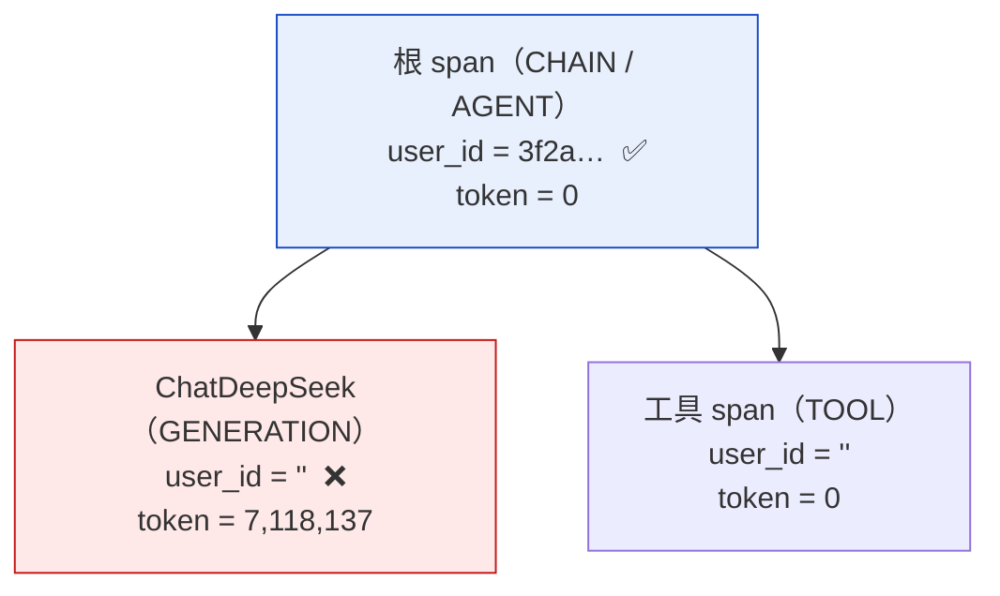

# P11 实施计划：用量归属、账号补全与前端收口

这一期收的是**前端还在假数据的最后六处**，以及它们背后缺的后端能力。P6–P10 每一期都在接自己那部分接口，剩下的六处不是漏接，而是**接不上** —— 后端要么没有那个端点，要么有端点但答不出那个问题。

### 版本历史

| 日期 | 变更 |
|---|---|
| 2026-08-16 | 初稿。开工前六处实测全部完成，**四处推翻了 2026-08-13 的用量决策**（§2.1–§2.3），一处推翻了本计划自己的初始建议（§2.4） |

---

## 1. 边界

### 1.1 这一期要证明的那两件事

**第一件：教师看得到自己花了多少，且那个数不是 0。**

设置页的「本月用量」与后台的「用量排行」都显示真实数字，且**两个来源对得上** —— Langfuse 按用户聚合出来的 token 与 `runs` 表按用户聚合出来的，在同一个窗口内量级一致。

这条判据的要害是**「不是 0」**。本期开工前实测到的现状恰恰是：接口全部返回 200、有数据、有结构，而按用户切出来**每个人都是 0**（§2.1）。一个只验「接口通了」的判据会当场绿掉，什么都没验到。

**第二件：场景与智能体在前端是两个东西，且选子智能体时选不到场景。**

后一半已经由 [P6-decision §G2](./P6-decision.md) 的判据保证，本期不改那条规则，只把它在前端**显式化** —— 现在两个页面读同一族端点、展示同一批数据，用户看不出区别在哪。

### 1.2 本期做什么（六块）

| # | 块 | 交付物 |
|---|---|---|
| 一 | **trace 埋点修复** | `user_id` / `session_id` 落到每一个 span，而不只是根 span |
| 二 | **模型价格注册** | 给 Langfuse 注册 `deepseek-v4-pro` 的单价，`total_cost` 不再恒为 0 |
| 三 | **测试账号清理** | 635 个验收造号连同其关联数据，按拓扑顺序在一个事务里删掉 |
| 四 | **账号字段补全** | `users` 加 `email` / `dept`；登录兼容用户名与邮箱；配额可在后台改 |
| 五 | **沙箱池状态** | broker 出 `GET /stat`，api 转发为 `GET /api/admin/system` |
| 六 | **六处前端接线** | Overview / AdminUsers / AdminUsage / AdminSystem / Settings / 场景与智能体分流 |

### 1.3 明确不做（每条写明由哪期偿还）

| 不做的事 | 为什么 | 由谁偿还 |
|---|---|---|
| **门户页接真实数据**（Home / Marketplace / Scenarios / Capabilities / DataAssets） | 它们是**未登录**页，而 `/api/agents` 一族全部要认证。要么开一个匿名只读端点（放开了就是全网可见平台目录），要么把门户改成登录后可见 —— 两条都是产品决策，不是接线 | P12 或产品侧定 |
| **补齐历史 token 的用户归属** | `propagate_attributes` 不追溯已存在的 span（SDK 文档明写）。已入库的 7,118,137 个 token **永远归不了属** | 不偿还，接受 |
| **删 `ArtifactPanel.tsx`** | 248 行、零引用的死代码，Chat 早已改用 `WorkspaceFiles`。属于既有死代码，不在本期改动范围内 | 随手或 P12 |
| **费用换算成人民币** | 注册的是 USD 单价，汇率是另一件事，且会过时 | 需要时再说 |

### 1.4 本期接受的风险与技术债

- **账号清理不可逆。** 外键全是 `NO ACTION`，删 `users` 要先清 9 张关联表。`mcp_servers.reviewed_by` 这类审核痕迹会连带丢失 —— 那是审计信息，删掉之后说不清某个 MCP 当初是谁放行的。**删前必须有全库备份**（已备，118M）。
- **埋点修复要花钱验证。** 传播是否生效**只能靠一次真实 LLM 调用**确认 —— FakeListChatModel 走的是同步路径，而失效恰恰只发生在真实 async 路径上（§2.2）。
- **两个用量来源会有系统性差异。** `runs` 表记的是 `tokens_uncached + tokens_output`（cache 命中不计，见 `quota/usage.py`），Langfuse 记的是 input 全量 + output。**两边永远对不上绝对值**，判据只能验量级与方向，不能验相等。

  > **「量级」这个词在 2026-08-16 的实测里也不成立**：同一次 run 上 Langfuse 报 7412、`runs` 表报 145，**差 51 倍**。长系统提示词的第二次调用几乎全是 cache 命中，而那一大块只有 Langfuse 算。`P11②` 因此改验一个由定义保证必然成立的不等式（`Langfuse >= runs`）加上「两边都不是 0」，见 §8.7。

---

## 2. 与上游文档不一致处的本期定案

### 2.1 第 1 条：Langfuse 答不出「谁花了多少」—— 推翻 2026-08-13 的决策

[CLAUDE.md](../../CLAUDE.md) 与[运维设计 §8.3](../01design/08operation-design.md) 都写着「用量与 agent 链路改到 Langfuse 上看」，`GET /api/admin/usage` 与它的账本因此在 2026-08-13 整体撤除。

**实测下来，这句话此刻不成立。** 四个角度的探针指向同一个事实：

| 探针 | 结果 |
|---|---|
| `v2/metrics` 全平台总量 | ✅ 7,118,137 tokens / 4,635 observations |
| `v2/metrics` 按 `userId` 分组 | ✅ 分得出来（要带 `config.row_limit` + `orderBy desc`） |
| **但每个真实用户的 token** | ❌ **全是 0**，7,118,137 全部记在 `userId = null` 那一行 |
| `v2/observations?userId=…` | ❌ 只返回 1 条 `CHAIN`，**没有一条 `GENERATION`** |

根因是 token 与身份**挂在不同的 span 上，两者不相交**：



Langfuse 自己的「按用户统计」实现（`packages/shared/src/server/repositories/events.ts`）逐 event 行按 `e.user_id` 分组，并且明确 `WHERE e.user_id IS NOT NULL AND length(e.user_id) > 0` —— **我们的 GENERATION 行全部被这个条件滤掉**。

**定案：修埋点，不改用量的归属地。** 数据模型完全支持按用户统计 token 与 cost，缺的只是 GENERATION span 上那个字段。修好之后 API 与 Langfuse 自带的 Users 页面同时可用，2026-08-13 那个决策继续成立。

> **放弃的替代方案：改回 `runs` 表出用量。** 实测过，一条 `GROUP BY` 就能出真实排行（269 个用户全有归属），比修埋点稳。放弃它是因为那等于把 08-13 的决策整个退回去，而**账本一旦有两个，它们分叉的方式是静默的** —— 这正是 `quota/usage.py` 开头拒绝 Redis 计数器时写下的理由。`runs.tokens_*` 继续只服务配额闸门这一个用途。

### 2.2 第 2 条：传播机制没坏，是在真实路径上丢的

SDK 的 `propagate_attributes()` 是个 OTel context manager，`CallbackHandler` 在 `on_chain_start` 里**只对根 chain**（`parent_run_id is None`）显式 `__enter__()`。

**它不是不工作** —— 库里留着的测试数据 `sessionId="thread-selfcheck"` / `userId="teacher-selfcheck"` **确实落到了 GENERATION 上**（token 为 0，因为那批走的是 `FakeListChatModel`）。

于是形状很清楚：**同步 / 简单路径传播成功，真实 async LangGraph 路径传播失败**。典型的 OTel context 在 async 边界丢失。

**这一处是本期唯一需要实验才能定形状的地方**，因此排在步骤一 —— 它的结论会决定步骤六前端那两张卡怎么写。

> `as_baggage=True` **不是解法**：它是给跨进程用的，会把值塞进所有出站请求的 HTTP header，SDK 文档为此专门标了安全警告。我们是单进程内的 async 边界问题。

### 2.3 第 3 条：费用恒为 0 的真因不是「Langfuse 不支持」

`sum_totalCost` 在任何切法下都是 0。真因查到了：**这台实例内置的 100 个模型价格里，没有一个 deepseek**。

`POST /api/public/models` 可以注册自定义价格。**定案：注册 `deepseek-v4-pro` 的单价**，费用列因此能留下 —— 原先准备砍掉它。

### 2.4 第 4 条：场景与智能体 —— 本计划自己的初始建议被推翻

本计划最初建议「`agents` 表加 `kind` 字段」。**[P6-decision §G2](./P6-decision.md) 已经明确论证过不要这个字段**：

> 场景与智能体的区别不是一个人工标注的类型，而是「它有没有挂子智能体」这个客观事实。

而且这条判据**一直在生效** —— `/api/agents/subagent-candidates` 就是按它过滤的（`repository.list_subagent_candidates`）。加 `kind` 会造出第二个真相源，两者一旦分叉（有 `kind='agent'` 却挂着子智能体的行），`subagent-candidates` 该信哪个？

**定案：不加 `kind`，沿用 G2 的客观判据，本期只在前端把它显式化。** 广场只列 `subagent_refs` 为空的，场景库只列非空的；新建时让作者选「建智能体 / 建场景」，但那个选择的落点是**要不要给他子智能体选择框**，不是往库里写一个类型字段。

### 2.5 第 5 条：「带 skill / mcp 但没挂子智能体」算智能体

需求方最初的说法是「智能体广场的智能体只有系统提示词」，这与 G2 的归类不同 —— G2 把 `{prompt, skills}` 与 `{prompt, skills, mcp}` 都算作智能体，[F12](./P6-decision.md) 更是专门保留了「智能体可自带 MCP」。

**定案（2026-08-16 确认）：沿用 G2 —— 智能体 = 没挂子智能体的一切。**

放弃「严格只有提示词」的理由有两条：它会让广场**当场少掉一批现有 agent**，且要连带推翻 F12。分类判据因此只有一条，前后端共用：

```
subagent_refs 为空  →  智能体（可被引用为子智能体，出现在广场）
subagent_refs 非空  →  场景（不可被引用，出现在场景库）
```

---

## 3. 环境前提

```bash
# Langfuse 必须在跑，且 .env 三项齐备（本期大量判据依赖它）
curl -s -o /dev/null -w '%{http_code}\n' http://localhost:3000/api/public/health   # 期望 200

# 平台六个服务起着
docker compose -f deploy/compose.yml ps

# 全库备份 —— 步骤三删账号之前必须有
docker compose -f deploy/compose.yml exec -T postgres pg_dump -U zuel -d zuel > backup.sql
```

**本期有一条判据要花钱**（`P11①` 要一次真实 LLM 调用验证埋点），归在 `SKIP_LLM` 那一档。

---

## 4. 验收标准

### 4.1 七条判据，加进 `verify.sh` 的 `p11` 组

判据总数 **54 → 61**。

| 编号 | 验什么 | 怎样才算过 |
|---|---|---|
| `P11①` | **埋点传播真的生效** | 跑一次真实分析，然后按该用户查 Langfuse：`GENERATION` 类型的 observation 数 **> 0** 且 token **> 0** |
| `P11②` | **用量两边对得上** | 同一窗口内，Langfuse 按用户聚合的 token 与 `runs` 表聚合的**同量级**（比值在 0.5–2 之间），且都 > 0 |
| `P11③` | **费用不再是 0** | 注册价格后新产生的 GENERATION，`totalCost` > 0 |
| `P11④` | **邮箱能登录** | 同一账号用用户名与邮箱各登录一次，都拿到 200 与同一个 `user_id` |
| `P11⑤` | **配额改得动且真生效** | 后台把某账号日配额改到极小 → 该账号提交分析拿到 `QUOTA_EXCEEDED` |
| `P11⑥` | **沙箱池数字是真的** | 占用一个沙箱前后各查一次 `/api/admin/system`，`in_use` 差值为 1 |
| `P11⑦` | **场景与智能体分得开**（playwright） | 广场列出的每一项 `subagent_refs` 都为空；新建场景时子智能体候选里**不含任何场景** |

### 4.2 `P11①` 怎么写才算真的验到了

这条最容易写成假判据。**不能只查「API 返回 200」，也不能只查「有 observation」** —— 现状就是两者都成立而 token 为 0。

必须同时满足三条，缺一条都记未过：

```
1. 该 user_id 下 type=GENERATION 的 observation 数 > 0     ← 现状是 0，这条最要害
2. 它们的 totalTokens 之和 > 0
3. 该数值与本次 run 在 runs 表里记的 token 同量级
```

第 1 条是核心：**现在按 userId 过滤只捞得到一条 CHAIN**。如果修完仍然只有 CHAIN，说明传播还是没到 GENERATION，判据必须红。

### 4.3 `P11⑤` 为什么要验到 `QUOTA_EXCEEDED`

只验「PATCH 返回 200 且回读的值变了」是**代理指标** —— 它证明字段写进去了，不证明闸门读的是这个字段。`users.quota_tokens_daily` 留空表示「走角色默认档」，一个把值写进去却没被 `quota/policy.py` 读到的实现，在这种判据下会全绿。

因此必须一路验到提交被拒。

### 4.4 门禁

`make all` 全绿；新增代码不引入新的 lint / 类型告警；后端与前端测试各自通过。

---

## 5. 任务分解

每步独立可验，未过不进下一步。

### 步骤一：埋点实验（本期唯一形状未定的一步）

在 `app/agent/trace.py` 之外先写一个最小复现：真实 `ChatDeepSeek` + LangGraph，挂 Langfuse 回调，跑一句最便宜的提问，然后查该 trace 的 GENERATION 有没有 `user_id`。

**先复现失败，再谈修。** 三个候选修法按代价排序：

1. 在 `attribution()` 之外，把 `langfuse_user_id` 也放进**每次模型调用**的 config metadata
2. 在 worker 侧手工 `with propagate_attributes(...)` 包住整个图的执行
3. 升级 `langfuse` SDK（若这是已知的 async 传播缺陷）

→ 验证：GENERATION 上有 `user_id` 且 token > 0（即 `P11①`）

### 步骤二：注册模型价格

`POST /api/public/models` 注册 `deepseek-v4-pro` 的 input / output 单价。单价写进 `.env.example` 旁的说明，不硬编码进业务代码。

→ 验证：`P11③`

### 步骤三：账号清理（不可逆，做之前再备份一次）

按拓扑顺序，在**一个事务**里删。顺序由外键依赖决定：

```
run_events → runs → threads
           → reviews → agent_versions → agents
           → skills → user_groups → group_join_requests
           → groups（owner 是待删账号的）
           → mcp_servers.reviewed_by / submitted_by 置空
           → users
```

`mcp_servers` 的两个字段**置空而不是删行** —— MCP 目录是平台资产，不能因为审核它的人是个测试账号就跟着消失。

→ 验证：`users` 只剩 `admin` 与 `yyyy`；`make all` 仍全绿；`verify.sh` 免费那批仍全过（验收脚本自己造号，不依赖存量）

### 步骤四：账号字段与邮箱登录

迁移 `0015`：`users` 加 `email`（唯一、非空）与 `dept`。**清理已在步骤三完成，因此可以直接 NOT NULL** —— 存量只剩两个账号，迁移里给它们填真实邮箱。

`find_by_name` 扩成 `find_by_identifier`：同时匹配 `name` 与 `email`。登录端点不变形状，前端只改文案。

→ 验证：`P11④`

### 步骤五：配额管理端点

`PATCH /admin/users/{id}` 扩成可改 `quota_tokens_daily` / `quota_concurrent_runs` / `role`。留空仍表示「走角色默认档」。

→ 验证：`P11⑤`

### 步骤六：沙箱池状态

broker 出 `GET /stat`（`pool.size()` / `max_container`），api 出 `GET /api/admin/system` 转发并加 `AdminUser` 保护。

→ 验证：`P11⑥`

### 步骤七：前端接线（五处）

| 页面 | 接什么 |
|---|---|
| `Overview.tsx` | 最近会话 → `/api/threads`；token 卡 → Langfuse 按当前用户聚合；**「产出文件」换成「本月会话数」**（`/api/threads` 直接数得出来，不必扫沙箱）；「Agent 调用」用现成的 `agents.call_count`。四张卡保留，布局不动 |
| `AdminUsers.tsx` | 列表 / 建号 / 启停 / 配额编辑 → `/api/admin/users` |
| `AdminUsage.tsx` | 排行与总量 → Langfuse 聚合 |
| `AdminSystem.tsx` | 沙箱池 → `/api/admin/system`；**删掉 MinIO 那一条**（2026-08-13 已撤除） |
| `Settings.tsx` | 本月用量 → Langfuse 按当前用户聚合；账号信息 → `/auth/me` |

### 步骤八：场景与智能体分流

广场只列 `subagent_refs` 为空的，场景库只列非空的。新建页按选择决定给不给子智能体选择框。`AdminScenarios.tsx` 删除（其职责由 `AdminAgents` 承担）。

→ 验证：`P11⑦`

### 步骤九：验收与文档

七条判据进 `verify.sh`；回填本文档 §8；更正 [CLAUDE.md](../../CLAUDE.md) 与[运维设计 §8.3](../01design/08operation-design.md) 里「用量改到 Langfuse 上看」那句话 —— 它在埋点修好之前一直是不成立的。

---

## 6. 回归关系

| 本期改动 | 可能打穿 | 怎么防 |
|---|---|---|
| 删 635 个账号 | 任何依赖存量账号的判据 | 验收脚本一律自己造号，跑一遍免费那批确认 |
| `users` 加 NOT NULL 列 | 所有建号路径（注册、管理员建号、验收脚本、测试夹具） | 迁移后全量跑；夹具集中在 `test/conftest.py` |
| `find_by_name` 改签名 | 登录、`P3` 一族判据 | 保留旧方法名做薄封装，或一次改干净后全量回归 |
| 埋点改动 | P9 的 token 归属判据（子智能体账单对账） | `P9` 那条一并重跑 |
| 广场过滤条件 | `P7` 可见性判据、`P9` 子智能体候选 | 步骤八后重跑 P7 与 P9 两组 |

---

## 7. 待决事项

**无。** 开工前的两处分歧已于 2026-08-16 确认定案，各自记在 §2.5（分类判据沿用 G2）与 §5 步骤七（总览的卡片指标）。

**开工的第一件事是步骤一的埋点实验** —— 它是本期唯一形状未定的地方，且后面六处前端接线里有两处要等它的结论。

---

## 8. 实施记录

### 8.1 步骤一：修法是外层再套一次上下文

**先复现，再改。** 写了个最小复现脚本，用同一个回调、同一份 `attribution()`，把三条路径并排跑一遍（真实 `ChatDeepSeek`，三次最便宜的调用）：

| 路径 | 结果 |
|---|---|
| ① 裸模型 `model.ainvoke` | ✅ GENERATION 带得上 `user_id` |
| ② `create_agent` 建图后 `ainvoke` | ❌ **只有 CHAIN 带得上**，GENERATION 是空的 |
| ③ 外层套 `propagate_attributes` 再走图 | ✅ GENERATION 也带上了（3 条 observation，含 1 条 GENERATION） |

②确认了 §2.2 的判断：机制没坏，是在真实 async 路径上丢的。`CallbackHandler` 只在
`on_chain_start` 的 `parent_run_id is None` 那一支 `__enter__()`，而 LangGraph 随后
在别的 async 任务里调模型 —— 根上进的 OTel 上下文传不进去。

落点是 `agent/factory.py` 的 `_astream`：把整个 `graph.astream` 包进
`propagation(thread_id, user_id)`。没配 Langfuse 时不进（`propagate_attributes`
要一个构造过的全局客户端）。

> `as_baggage=True` 试都不必试：它是给跨进程用的，会把值塞进所有出站请求的 HTTP
> 头，SDK 为此专门标了安全警告。我们是单进程内的 async 边界问题。

### 8.2 步骤三：两处与计划写的不一样

**一、MCP 那 24 条是夹具，不是资产。** 计划 §5 写的是「置空而不是删行 —— MCP 目录是
平台资产」。实际查下来，24 条全是 P10 验收造的，URL 都指向 `host.docker.internal:8931`；
何况 `submitted_by` 是 `NOT NULL`，本来也置不成空。改为整行删，只有 `reviewed_by`
那一侧留行抹人。

**二、checkpoint 的 `thread_id` 格式对不上，第一次跑漏了 5766 条。**
它存的是 32 位无连字符 hex，而 `uuid::text` 出来是 36 位带连字符 —— 直接比一条都
匹配不上，**而 `DELETE 0` 不报错**。回头按「主人还在不在」反向清才补上。
`deploy/purge-test-account.sql` 里已改成一次写对的形式。

实删：635 账号、2248 会话、734 run、277610 事件、179 agent、40 skill、84 组、24 条 MCP。
删前两次全库备份（各 118M）。

### 8.3 计划里没写、实际必须做的一步

**Langfuse 用量查询模块（`app/usage/langfuse.py`）。** 计划 §5 步骤七只说了「前端接
Langfuse 聚合」，但前端拿不到凭据也跨不了域 —— 中间必须有一层。补了 `app/usage/`
与 `GET /api/usage/me` / `GET /api/usage/ranking` 两个端点。

`GET /api/admin/usage` 曾在 2026-08-13 撤除，这次回来的**不是同一个东西**：数据源是
Langfuse 而不是本地账本，路径也换到了 `/api/usage/ranking`。

其中一条实现细节值得记：**按 `userId` 分组必须同时给 `config.row_limit` 与降序的
`orderBy`**，缺任一样 Langfuse 直接 400。它的文档写的是「不能用它分组」，而错误信息
说的是「要多带两个参数」—— 照文档写会白白砍掉一个做得到的功能。单测里锁住了这一条。

### 8.4 顺带清掉的三处假数据

计划只列了五个页面，实施时又发现三处同类问题：

- **`Settings.tsx` 的「模型配置」整节**：假的 API key（`sk-••••…Ax1m`）、假的单价、
  点了没有任何效果的「保存」与「测试连接」。模型是平台级配置（`.env`），教师既改不了
  也不该看见 key。整节删掉，Settings 只留用量与账号两块。
- **`AdminSystem.tsx` 的「服务状态」四行**：写死的「● 在线」，其中 MinIO 已于
  2026-08-13 撤除。四行都删了 —— 它们真挂了的时候这一页本身也打不开，一个恒为真的
  绿点回答不了任何问题。改成指向 `docker logs` 的排障入口。
- **`Register.tsx` 缺邮箱字段**：后端 `email` 一旦 `NOT NULL`，不改前端就是注册直接坏掉。

### 8.5 打穿的历史用例，与它们说明的事

后端 54 处、前端 4 处测试因为签名变化而红，全部是「加了必填字段」的机械适配。
其中两处值得记：

- **`verify.sh` 的 `make_user()` 直接写 SQL 插 `users`**，不走任何端点。加了 `NOT NULL`
  的 `email` 之后那条 INSERT 会失败，**而症状出现在后面的登录那一步**（「登不进去」），
  不指向造号。已补上。这正是 §6 回归关系里预判到的那一条。
- **`app_test.py` 锁着完整的 API 路径清单**，加三个端点就红。这是个好设计 ——
  它逼着每一次 API 表面的变化都被看见一次。

### 8.6 部署之后才冒出来的一处

**`api` 容器里 `LANGFUSE_BASE_URL` 是 `http://localhost:3000`，而那是容器自己的回环。**
门禁全绿、单测全过 —— 因为测试环境里 `platform.langfuse` 本来就是 `None`，走的是
「没接账本」那一支。部署起来才发现两个用量端点一律返回 `available: false`。

`.env.example` 原来只提醒过 worker 要用 `host.docker.internal`（P4 就写着），本期
api 也开始读它了。**同一个配置错误有两处症状**：用量看板显示「账本未接入」，
同时 worker 那侧的 trace 上报也在静默失败 —— 看起来像两个毛病。

顺带踩了一次 `CLAUDE.md` 里记着的坑：`export SANDBOX_QUOTA_DEVICE=...` 与
`docker compose up broker` 写在两条命令里，而 shell 变量不跨命令持久 ——
`docker inspect` 出来是 `/dev/null`。写成一条才对。

### 8.7 主判据成立，但 §1.4 的「同量级」被实测推翻

部署后跑了一次真实分析（`8d47e8d9…`，succeeded），当场对照：

| 口径 | 数值 |
|---|---|
| Langfuse 该用户名下 `GENERATION` | **2 条，7412 token**（修复前：按 userId 只捞得到 1 条 `CHAIN`，token 为 0） |
| 其中 input / output | 7286 / 126 |
| `runs` 表这一行 | `tokens_uncached=86` + `tokens_output=59` = **145** |
| `GET /api/usage/me` | `available: true`，7412 token |
| `GET /api/usage/ranking` | 总量 7,118,801，19 个用户 |

**`P11①` 三条全部成立**：GENERATION 条数 > 0、token > 0、端点报的是同一个数。
这是本期的主判据 —— 修复前的现状是「接口全部 200 而按用户切出来每人都是 0」。

**但两份账差了 51 倍**，远超 §1.4 预期的「同量级」。原因是口径而非缺陷：长系统
提示词的第二次调用几乎全是 cache 命中，而 `runs` 表按定义不计那一块。
`P11②` 因此从「同量级」改成验一个必然成立的不等式（`Langfuse >= runs`）加上
「两边都不是 0」—— 前者由两个口径的定义保证，后者才是真正要防的故障。

> **output 也对不上**（126 vs 59），这一处尚未查清，记在这里作为观察项。
> 它不影响配额闸门（那读的是 `runs` 表自己那一列），也不影响用量看板
> （那读的是 Langfuse），但两份账在**理应一致**的那一项上有差异，值得下一期看一眼。

### 8.8 收尾

> 待全量回归跑完后回填。
