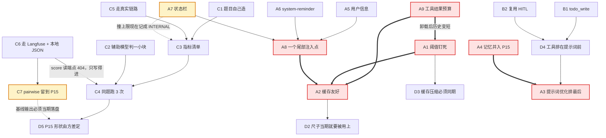

# P13 决策文档：智能体本体优化

| 项 | 值 |
|---|---|
| 文档状态 | **全部定案**（24 条，2026-08-19） |
| 当前版本 | v0.7 |
| 作者 | hxy |
| 日期 | 2026-08-19 |
| 下游文档 | [P13-plan.md](./P13-plan.md)（**已写就 2026-08-19**）· [P14-plan.md](./P14-plan.md)（**已写就 2026-08-19**）· P15-plan.md（未撰写，按 §6 的 D1 分期） |
| 上游文档 | [P6-decision.md](./P6-decision.md)（分期口径的先例）· [P12-plan.md](./P12-plan.md) · [智能体设计](../01design/03agent-design.md) |

### 版本历史

| 版本 | 日期 | 修改人 | 说明 |
|---|---|---|---|
| v0.7 | 2026-08-19 | Claude | **A9 的前提被第二轮数据证伪，定案降级为「留着，但不是那根杠杆」。** 步骤十二实测：成本是**双峰**的（同题副本差 20–30 倍，30 次炸 5 次、占 60% 的钱），而炸掉那几次**单条工具结果最大 1820 字符、工具参数最大 4189 字符** —— 卸载在任何阈值下都拦不住一次。A9 原文说的「大输出整段进历史、每轮重复计费」在这批题上不成立。**主判据同时失去分辨力**：噪声带 43.3%，盖过任何现实中拿得到的改进幅度。§10.3 第 3 条随之收口 |
| v0.6 | 2026-08-19 | Claude | **A9 的诊断改正**：定案（降阈值）不变，但「阈值没配」只说对了一半 —— 阈值降到下限 100 卸载次数仍是 0。真因是**落点**被框架算成 `/large_tool_results`（它只在 `CompositeBackend` 上取 `artifacts_root`），过不了平台「一切在 `/workspace` 下」那道路径闸，而**写盘被驳回是静默的**。同一个 bug 打中压缩的归档：26 次压缩、26 次 `file_path` 为空，折掉的原文没有留底。§10.3 第 3 条的前提随之改写 |
| v0.5 | 2026-08-19 | Claude | **纠正 A8 的核心论证，并改掉本期主判据**。依据是《深入理解 AI Agent》第 2 章（李博杰）与首轮评估数据的复算。① **A8 那段「缓存上安全的结构性论证」是错的** —— 「本轮的块下一轮就被换掉，因此从不参与公共前缀」正是书 2.6.4 说的「实现一：每轮替换」，它**会使状态消息位置之后的缓存失效**；实测每轮多付 200–320 个未命中 token，与 A8 自己估的「17 轮 3400 token」同量级 —— **估算方法一直是对的，错的是把它算成了「只有块自身的 token」**。定案改为书里的**实现二：持久追加**。② **主判据由 `cache_hit_rate` 改成 `cost_yuan`**：首轮按命中率判出「尾部注入有害」，按真实单价复算 9 题里 7 题成本反而下降（合计 −46%），**命中率是会假过的代理指标**。③ **A7 补一条书 2.6.5 的实测**：只给读数与什么都不给差 2–3 个百分点，补上操作策略才 +19~49 个百分点 —— 据此把「策略措辞」破例从 P15 提到 P13。④ **新增 A9 工具结果预算控制**（书 2.7.4 五层里的第一层），条目 23 → 24 |
| v0.4 | 2026-08-19 | Claude | **纠正 v0.3 的一个错误结论**。v0.3 说 Langfuse 在 `events_only` 下「分数写得进、读不回」，据此写了 C6、并改了 C4 与 C7 的理由 —— **错在只测了 v3 遗留端点**。按本机 OpenAPI spec（`/generated/api/openapi.yml`）逐个实测：`/v3/scores`、`/v2/observations`、`/v2/metrics`、`/experiments`、`/experiment-items` 全部可用，**404 响应体里本来就带着 `replacement` 字段指向替代端点**。C6 改成停用↔替代对照表；C4 的「跨批次读不回」这条理由作废（定案不变，换成「更简单」）；C7 的落盘从「必需，否则 P15 卡住」降级为「便利」。另记一条 v0.3 不知道的事实：**平台内置 LLM-as-judge 可用**，库里已有一条 `llm_as_judge` 规则跑出过分数 |
| v0.3 | 2026-08-19 | Claude | **C 组重制**：§10.2 第 3 条实测跑完 —— 本机 Langfuse 4.10.0 在 v4 `events_only` 下 **datasets / prompts / score-configs 可用，scores / traces / dataset-runs / observations / metrics 的读端点一律 404**，`create_score` 走 ingestion 事件不受影响。据此 **C6 由「先落本地文件、Langfuse 可选」改成「两边都要」**、**C3 整张指标表换掉**（分层重排 + 剔掉三项跟着提示词一起动的判据）、**C4 补上三副本同批跑的落法**、**新增 C7 pairwise**（P15 接入，P13 只负责基线落盘），条目 22 → 23。另修 v0.2 漏改的两处计数（§10 与[分期索引](./CLAUDE.md)仍写着 21 条） |
| v0.2 | 2026-08-18 | Claude | **更正 A7**：v0.1 把「状态栏」读成前端展示判掉了，读错了需求 —— 它是**在上下文末尾注入动态元信息的中间件**。随之新增 A8（尾部注入点合一）、重排 A5/A6/A7 为同一族，条目 21 → 22，并改了分期表、耦合图与不做清单 |
| v0.1 | 2026-08-18 | Claude | 初稿并定案。优化点清单三条展开成 21 条决策，**三条与清单原文相反**，各自记了理由；四处开工前实测已跑完，其中两处推翻了清单的前提 |

> **三处结论与优化点原文不同，先在这里列出来**，正文各有出处：
>
> | 优化点原文 | 定案 | 出处 |
> |---|---|---|
> | 「压缩机制」（作为要新增的能力） | **不新增 —— 已经装着**。本期做的是探出真实上下文上限、把阈值钉死成显式常量 | A1 |
> | 「添加 web_search 工具」 | **不新建内置工具**，走 P10 已经建好的 MCP 目录上架 | B3 |

> **本文档的职责**：回答 **「这轮优化到底有几件事、每件事值不值得做、怎么切成期」**。
>
> **不回答**「怎么实现」（那是三份 plan 的任务分解）、「评估集里具体有哪些题」（那是 P13-plan 的交付物）。
>
> **与 P6-decision 的不同**：那份文档的未知在**需求形状**（68 条里 11 条会改表结构）。本期一张表都不改，未知全在**「现在到底是什么样」** —— 清单里七项有两项已经装着、一项不属于 agent。因此本文档的分量不在选项穷举，而在 §2 那四处实测。

---

## 1. 为什么需要这份文档

### 1.1 优化点清单的第 1 点是七件事塞在一行里

`tmp/优化点20260817.md` 第 1 条写着：「智能体优化，缓存友好设计，系统提示词优化，压缩机制，记忆系统，用户信息，system-reminder，状态栏信息」。

这七项的价值、代价、依赖关系差了一个数量级以上；而且**其中三项其实是同一个机制**（A5 用户信息、A6 system-reminder、A7 状态栏 —— 都是往上下文末尾注入每轮都变的内容），**它们又与第四项 A2 缓存友好正面相关**：注入位置放错一格，30 倍的价差就白扔。按一条排期，做完之后没有任何一句话能说清「这期干成了什么」——[P6 L1](./P6-decision.md) 立的规矩正是每期要有一个能干净说出口的验收标准。

### 1.2 一个必须先看清的事实：这七项里最值钱的两项没有尺子

[`app/agent/prompt.py`](../../src/app/agent/prompt.py) 的模块 docstring 自己写着「本期只求能跑通，不做提示词工程」。提示词优化确实是输出质量上最大的一块 —— 但**改完拿什么证明它变好了？**

现有的 [`script/test/verify.sh`](../../script/test/verify.sh) 62 条判据回答的是「跑不跑得通」：产物有没有生成、审批闸门有没有停、token 对不对得上账。它一条都答不了「这次分析答得好不好」。

这与 [P6 §1.2](./P6-decision.md) 记的 `agent_config` 黑洞是同一类失效形态的下一站：那次是**配置写得进读不出而无人发现**，这次是**提示词改了效果没变而无人发现**。两者都不报错、门禁都全绿。**本期最大的风险不是做不出来，是做完一轮说不清有没有用。**

### 1.3 怎么读这份文档

每条标题上写着 **定案：X**，正文保留被否掉的选项与代价 —— 它们是「为什么不走那条路」的记录。

**三条定案与优化点原文相反**（A1、A7、B3），**一条定案与本文档作者的建议相反**（A4，记忆系统），它接受的代价与缓解办法写在正文里。

**四处开工前实测已经跑完**，见 §2；**原本列了三处待测，其中第 3 条已于 2026-08-19 跑完**（Langfuse 可用性，结论改写了 C6），**还剩两处**，见 §10.2 —— 它们不阻塞写计划，但会改变计划里的步骤，形状与 [P9 的四处实测](./P9-plan.md)相同。

---

## 2. 开工前已经跑完的四处实测（2026-08-18）

**两处推翻了优化点清单的前提。**

| # | 问题 | 实测结果 | 证据 | 影响 |
|---|---|---|---|---|
| 1 | 压缩机制装了没有 | **装了**。deepagents 默认栈里就有 summarization，子图还显式装了一份 | `deepagents/graph.py:758`、[`app/agent/subagent.py:86`](../../src/app/agent/subagent.py#L86) | ⚠️ **推翻清单前提**：这一项不是「加功能」，见 A1 |
| 2 | 压缩阈值是多少 | `deepseek-v4-pro` 的 profile 报 `max_input_tokens=1000000`，触发线 `('fraction', 0.85)` —— **85 万 token 才压** | `compute_summarization_defaults()` 探针 | 若真实上下文远小于此，这条线永远够不着，见 A1 |
| 3 | `write_todos` 有没有 | **没有**。`TodoListMiddleware` 在装着的 langchain 里，但 deepagents 默认栈不装它，只有 OpenAI Codex 那个 harness profile 装 | `deepagents/profiles/harness/_openai_codex.py:77` | 确认 B1 是真缺口 |
| 4 | 缓存命中的基线 | 平台**早就在量**：[`app/quota/usage.py`](../../src/app/quota/usage.py#L6) 记着实测 62% 命中；2026-08-14 那次验收的真实分析是 `52480 / 117464` ≈ **31%** | 代码注释 + [分期索引](./CLAUDE.md)的验收记录 | ⚠️ **推翻清单前提**：缓存这一项**有现成基线**，不必从零建度量，见 A2 |

| 5 | 尾部注入怎么落地 | **`wrap_model_call` 里 `request.override(messages=[...])` 可行且不写 state**，`context_editing.py:255` 就是这个用法 | `langchain/agents/middleware/types.py:201`、`context_editing.py:255` | A8 的实现路径成立，块不进 checkpoint |
| 6 | 撞递归上限分不分得出来 | **分不出来**。平台没有任何一处认 `GraphRecursionError`，它与其它内部错误一样记成 `INTERNAL` —— 库里 268 条失败中 `INTERNAL` 占 **224** 条 | `grep recursion` 全仓无命中 + `runs.error_code` 分布 | ⚠️ **状态栏的效果因此现在无法验收**，见 A7 |

> **顺带量到的一个规模事实**（2026-08-18，只查了计数，没有读取任何提问内容）：`runs` 表 2364 条、成功 1998 条、跨 2026-08-07 至 2026-08-18。这个数在 C1 里被否掉了作为评估集来源，理由见正文。

---

## 3. A 组：第 1 点的七项（7 条）—— **全组已定案**

> **定案汇总**：压缩不新增改探阈值；缓存友好是本轮唯一有现成价签的一项；提示词优化排最后；记忆系统并入 P15（**与建议相反**）；用户信息与 system-reminder 拆成「位置」与「内容」两半分属两期；状态栏移出。

### A1 压缩机制 —— **定案：不新增，改为「探真实上限 + 阈值钉死成显式常量」**

§2 第 1、2 条实测：机制已经在跑，阈值是从模型 profile 推出来的 85 万 token。

| 选项 | 代价 |
|---|---|
| a. 按清单原文再加一套压缩 | **和已装的那套打架**。两套都改写历史，谁先触发不确定，且都会打掉前缀缓存 |
| **b. 探出真实上下文上限，把 trigger 写成平台自己的显式常量** | 要一次探针（构造超长输入看在哪报错）；常量从此要跟着模型换而维护 |
| c. 什么都不动，撞上了走 `ContextOverflowError` 兜底 | 兜底是「报错后重试」，代价是一次白烧的调用 + 教师看到一次卡顿；且卡在哪永远没人知道 |

**定案：b。** 理由与[技术宪法](../../.claude/python-constitution.md)第二条一致 —— 关键参数不能是从第三方 profile 里静默推出来的。一个从上游数据推出的阈值，改变时不会有任何提示，症状只是「今天怎么这么贵」。

**阻塞**：A2（压缩一触发就打掉缓存，两者必须同期量）。

### A2 缓存友好设计 —— **定案：做，主判据是每题成本（2026-08-19 修订）**

价签是现成的：`docker/.env` 里 input `9` / cached `0.30` / output `27` —— **命中与不命中差 30 倍**。基线也是现成的（§2 第 4 条：62% 与 31%）。

**定案：做。** 这是七项里唯一一个「改动小、有基线、有价签、能说清值多少钱」的。**它同时是 P13 那把尺子的第一个使用者** —— 见 D2。

> ⚠️ **判据由 `cache_hit_rate` 改成 `cost_yuan`（2026-08-19，首轮数据复算之后）。**
>
> 首轮按命中率判定「尾部注入有害」（9 题里 8 题命中率降 5–6 个点），据此改成了按需注入。**按真实单价复算，方向是反的**：同期总 input 也在降，9 题里 7 题成本下降，合计 −46%；而那个「修复」反而让 E01 贵 36%、E09 贵 26%。
>
> **命中率是个比值，它对分子分母同向变化不敏感**。真实情况是两个效应叠加 —— 尾部块损失了一点缓存（书 2.6.4），但同期轮数下降（E08 13→9、E04 11→9；书 2.6.2 记的 TODO 状态栏也让迭代从 21 降到 15）。只看命中率会把后者整个漏掉。
>
> **凡是同时改变轮数与单轮 token 的改动，一律以 `cost_yuan` 判优劣**，命中率降级为诊断量。这条同时改写 C3 的指标表。

**阻塞**：A1（压缩触发会拉低命中率）、A6（reminder 的注入位置直接决定命中率）。

### A3 系统提示词优化 —— **定案：做，但排在最后一期**

**定案：排 P15。** 不是因为它不重要 —— 恰恰因为它最重要，所以不能在没有尺子、agent 形状还要变（P14 加两个工具）的时候动。**对着一个还要变形的 agent 调提示词是白调。**

> ⚠️ [`prompt.py`](../../src/app/agent/prompt.py) 里有几段**不是文风而是契约**（工作目录、产物目录、装包方式、删文件走哪个工具、图片引用格式），模块 docstring 已经逐条写明删掉的后果。P15 改的只能是①角色段与②分析要求段的表达方式，环境契约段的每一条要动都得单独论证。

### A4 记忆系统 —— **定案：并入 P15，与提示词一起做**（与建议相反）

装配是现成的：`create_deep_agent(memory=...)` 会挂上 `MemoryMiddleware`（`deepagents/graph.py:865`）。

| 选项 | 代价 |
|---|---|
| a. 本期不做 | 教师每次都要重讲一遍口径。**本文档原本的建议** |
| b. 单独排第四期 | 归因干净，但多一次全量回归的成本 |
| **c. 并入 P15** | 装配便宜；**代价是 P15 里有四样东西都会动质量分**（提示词、记忆、用户信息、reminder），分数动了归因不到具体哪一样 |

**定案：c（2026-08-18 拍板）。接受的代价是归因变难，缓解办法是期内逐次提交、逐次量** —— 尺子在 P13 就已经在手，每上一样跑一次评估集，四次的成本是四次评估跑的 token 钱。**这个缓解办法必须写进 P15-plan 的步骤里，否则代价就不是「难归因」而是「说不清」。**

> ⚠️ 还有一处不在装配层的成本：记忆是跨会话的，而教师之间同组共享。**一条串味的记忆污染的是金融分析结论，且失效时不报错。** P15-plan 必须回答记忆按什么隔离（用户 / 课题组 / 会话）以及教师看不看得见、删不删得掉。这一条不解决不能上。

### A5 用户信息 —— **定案：做，内容归 P15，注入位置的规则归 P13**

把「这位教师是谁、属于哪个课题组、今天还剩多少额度」这类信息给到模型。

**定案：做，作为 A8 那个尾部块里的一节。** 注入机制与预算在 P13 定死（它决定命中率），具体注入哪些字段在 P15 定（它决定效果）。

### A6 system-reminder —— **定案：做，但只能挂在最后一条 user message 之后**

> ⚠️ **这一条与 A2 正面打架，是清单里唯一的内部冲突。** reminder 的用处正是「每轮都提醒一次」，而每轮都变的内容**只要落在前缀里，就是每轮打掉整段缓存**。按 A2 的价签，那等于把 30 倍的价差主动放弃掉。

| 选项 | 代价 |
|---|---|
| a. 插在系统提示词里 | 每轮全量重算，与 A2 直接冲突 |
| **b. 挂在最后一条 user message 之后** | 缓存前缀完整保留；代价是模型对它的注意力弱于系统提示词，措辞要更硬 |
| c. 不做 | 少一个纠偏手段 |

**定案：b，且与 A5、A7 共用同一个注入点（A8）。机制在 P13，reminder 的内容在 P15 填。** 这条规则要写在代码里而不只是文档里 —— 后面任何人往前缀里加动态内容，都会静默地把命中率打回去。

### A7 状态栏 —— **定案：做，它是尾部注入这一族的主要用户**

> **v0.1 把这一条判错了** —— 当成前端展示移出了清单，是读错了需求。**状态栏是一种独立的注入机制**：在上下文末尾放一块动态元信息（任务进度、环境状态、工具调用计数），让模型随时「瞥一眼」就知道自己在哪儿，弥补它**无法主动归纳隐式状态**的不足 —— 就像手机顶栏常驻的时间、电量、信号。

**它在这个平台上不是锦上添花，因为平台有三道闸是静默的** —— agent 撞上去之前拿不到任何信号：

| 闸 | 现在的表现 | 状态栏给出什么 |
|---|---|---|
| `RECURSION_LIMIT = 60`（[`factory.py`](../../src/app/agent/factory.py#L37)） | 撞上就断。一次正常分析约 34 步、余量看着够，但复杂分析会撞；**事后也分不出来**（§2 第 6 条：混在 224 条 `INTERNAL` 里） | 已用步数 / 上限 |
| workspace 5g XFS 配额（[ADR-0015](../01design/adr/0015-sandbox-disk-quota-xfs.md)） | 写大文件撞 ENOSPC，agent 不知道自己还剩多少 | 剩余磁盘 |
| 教师日 token 配额 | 由平台在提交侧拦，**agent 侧完全不可见** | 本次已耗 token |

另有两项与平台契约直接相关：**`outputs/` 目录当前有什么**（平台只按这个目录判定交付物，而 agent 常在最后一步才发现产物没落进去）、**本会话已装了哪些包**（P12 之后「装完当前会话一直在」，没有状态栏它会重复装一遍）。

**定案：做。** 分两半落地：**环境状态那几节在 P13**（确定性、不依赖别的期，且它的 token 要计进 P13 的缓存账），**任务进度那一节等 P14**（数据源就是 `todo_write` 的 state，见 B1）。

> ⚠️ **只给读数等于什么都没给 —— 每一节都必须带一句操作策略（2026-08-19 新增）。**
>
> 书 2.6.5 在四个厂商家族的六个模型上量过：**只给原始读数那一档，与什么都不给相差不过两三个百分点**；把通过率从一成出头拉到四五成的（+19~49 个百分点）是那份「这些读数该怎么用」的操作手册。原话是「它缺的不是读数，而是拿这个读数该怎么办的策略」。
>
> 书里也解释了为什么工具调用计数器只靠一行读数就管用 —— 它对应的规则太显然（「到顶了就停」）；而「力气该花多少」「这堵墙要不要绕」这类判断规则不显然，光有读数推导不出来。**我们的步数一节正属于后者。**
>
> **这一条破例把「措辞」放进 P13**：按 A5／A6 的分工内容归 P15，但那样 P13 交付的是一个「按书说没效果」的状态栏，而 P13 的验收又要量它的成本账 —— 等于量一个没效果的东西的成本。**破例的边界是：只补每节的策略句，不加新字段、不动 A5 的用户信息内容。**

> ⚠️ **验收之前得先让「撞上限」可分辨。** 现在 `GraphRecursionError` 与其它一切内部错误一样记成 `INTERNAL`，平台**答不出「有几次是撞了 60 步」**——状态栏最主要的那条判据因此写不出来。**P13-plan 的第一步要补这个错误码**，否则这一项交付了也验收不了。这与 [§9](#9-验收口径的总原则) 说的是同一件事：判据要能回答「这次真的触发了要测的场景吗」。

### A8（新增，由 A5–A7 引出）尾部注入点是一个还是三个 —— **定案：一个中间件、一个块、内部分节**

用户信息（A5）、system-reminder（A6）、状态栏（A7）是**同一个机制的三类内容**：都落在上下文末尾、都每轮变、都抢同一份注意力预算。

| 选项 | 代价 |
|---|---|
| a. 三个中间件各注入各的 | 位置与缓存要各自处理三遍；**先后顺序由注册顺序隐式决定**，改一处会静默挪动另外两处 |
| **b. 一个中间件、一个块、内部分节** | 位置、预算、格式只定义一处；代价是三类内容耦合进同一个模块，加一节要动同一个文件 |

**定案：b。** 理由是[技术宪法](../../.claude/python-constitution.md)第二条：三处隐式约定的失效方式是静默的，而这里失效的表现只是「今天怎么贵了」。

**实现路径**：在 `wrap_model_call` 里 `request.override(messages=[*request.messages, 尾部块])`。

> ⚠️ **v0.4 之前这里有一段错误论证，2026-08-19 依据《深入理解 AI Agent》第 2 章纠正。**
>
> 原文写的是：「本轮注入的块下一轮就被换掉，因此它**从不参与下一轮的公共前缀** —— 代价只有块自身的 token」。**这恰恰是书 2.6.4 归为「实现一：每轮替换」的做法，而书里对它的判定是「移除旧状态会使其位置之后的所有缓存失效」。**
>
> 第 N 轮请求是 `[S, …M_k, 块_N]`，服务端缓存的是这一条；第 N+1 轮请求是 `[S, …M_k, AI_N, T_N, 块_{N+1}]` —— 缓存里 `M_k` 之后是 `块_N`，请求里是 `AI_N`，**从这里分叉**。块不写回 state，等于每轮都替换掉了上一轮的状态消息。
>
> 实测每轮多付 **200–320 个未命中 token**（E01 +1154／6 轮、E10 +1281／4 轮）。**下面那条预算估算一直是对的 —— 错的是把它算成了「只有块自身的 token」**，实际还要加上 64-token 块对齐的跨界作废。

| 选项（书 2.6.4） | 代价 |
|---|---|
| 实现一：每轮替换（块不写回 state） | 上下文只有一份状态、永远最新；**代价是每轮制造一次前缀分叉**，失效范围是最近几轮 |
| **实现二：持久追加（块写回 state）** | 只追加不修改，前缀始终稳定 —— Claude Code 的 `<system-reminder>` 就是这么做的；代价是陈旧状态累积，占 token，且模型要自己认「最新一条」 |

**定案：实现二（2026-08-19 改）。** 书给的取舍法则是「状态更新频繁且轨迹很长时选实现二」，我们的轨迹 6–11 轮、单块几十字，累积几百 token 而已，比每轮分叉便宜。

落法：`response.result = [HumanMessage(block), *response.result]` —— `_build_commands` 把 `result` 写回 state，于是下一轮的请求是上一轮的严格扩展。

> **预算必须当期钉死。** 按一次分析 17 次模型调用估，一个 200 token 的块合计约 3400 个未命中 token。**这笔账记在 P13 上。** 不先定预算，P14 往块里加一节就会把 P13 验收时量到的数改掉。
>
> 改成实现二之后这笔账的形状变了：块本身仍然每轮各付一次未命中，但**不再额外制造前缀分叉**，省下的是「分叉之后本可命中却要重算」的那部分。**验收按 `cost_yuan` 判**（A2），不按命中率。
>
> **它与 A4 的归因困境不是一回事**：状态栏的 token 成本是**可精确扣除的**（块长 × 调用次数），而质量分动了拆不开。可精确扣除，所以它可以和缓存改造同期上。

### A9（2026-08-19 新增）工具结果预算控制 —— **定案：做，排本期第一步**

> **这一项不在优化点清单的七项里**，是读第 2 章时对照出来的缺口。补进来的理由是它**单项就能动一个数量级**，而清单里其余各项都在几个百分点的量级上。

书 2.7.4 把它列为分层压缩五层中的**第一层**：「大体积的工具输出存到磁盘，模型只看摘要预览。替换决策一旦做出就被冻结，以保证缓存的一致性」。书对这一层的判词是「实现成本最低、对缓存的扰动可控，应当优先使用」。

**能力是现成的，阈值没配。** `FilesystemMiddleware` 的默认值是：

```
tool_token_limit_before_evict = 20000
```

**单次工具结果要超过 2 万 token 才卸载。** 而首轮成本最高的 E03（逐行列出 265 条异常交易记录）未命中 12.5 万 token、单题 1.30 元，是其余各题的 10–20 倍 —— 它是**多轮中等输出累积**出来的，单次都够不着 2 万，**一次都没触发过卸载**。

| 选项 | 代价 |
|---|---|
| a. 保持 20000 | 大输出照样整段进历史，且每轮重复计费 |
| **b. 降到 2000–4000** | 触发后模型看到 `saved at {file_path}`，要用时 `read_file` 读；代价是多一次工具调用，且摘要预览可能不够 |
| c. 自己写一层 | 与 b 等效但要自己维护 —— 书 2.3.4 还要求「替换字符串首次出现即冻结」，现成实现已经做了 |

**定案：b。** 具体阈值在 plan 里按实测定，验收按 `cost_yuan`（A2）。

> ⚠️ **2026-08-19 二次修订：定案不变，但「阈值没配」这个诊断只说对了一半。**
>
> 阈值确实没配，可**把它从 20000 降到 4000、再降到下限 100，卸载次数一直是 0**。真因不在阈值，在**落点**：`FilesystemMiddleware` 算卸载路径的办法是「后端是 `CompositeBackend` 就取它的 `artifacts_root`，否则按 `/` 算」，而平台的后端实现的是 `SandboxBackendProtocol` —— 落点因此被算成 `/large_tool_results`，而平台的路径闸要求一切在 `/workspace` 下，写盘每次都被驳回。
>
> **驳回是静默的**：`write` 返回带 `error` 的结果，卸载那边 `if result is None or result.error: return None`，调用方随即原样留下消息，不抛异常也不记日志。**这一层能力从装上那天起就一次都没成功过**，而唯一的症状是「调阈值毫无反应」。
>
> **同一个 bug 打中了压缩**：`SummarizationMiddleware` 用同一段逻辑算归档落点，历史照常被折成摘要，归档写盘却全部失败 —— 库里 26 次压缩、26 次 `file_path` 为空，那句「完整历史已存到 …」根本没拼进摘要，**折掉的原文再也找不回来**。压缩因此一直是有损且无退路的。
>
> 修法与验证见 [P13-plan 步骤十三](./P13-plan.md)。**这条改动之前采的三批评估数据都要重新看待** —— 那时每一条大工具结果都整段留在历史里逐轮重算。

> ⚠️ **2026-08-19 三次修订：机制修好了，但它拦的不是本期最贵的那件事。**
>
> 修好之后第二轮实测（[步骤十二](./P13-plan.md)）：正常阈值 4000 下 **30 次分析触发 0 次**，那一栏记「未验」。而真正的成本大头是**双峰** —— 同一道题的副本之间差 20–30 倍，30 次里 5 次「炸掉」、占掉 60% 的钱。**炸掉那几次的单条工具结果最大只有 1820 字符**（正常那几次反而有 10625），工具参数最大 4189 字符。**卸载在任何阈值下都拦不住其中任何一次。**
>
> **A9 的定案不撤**（这一层成本极低、书 2.7.4 的道理也没错，留着挡真正的大输出），**但它不再是本期的主要杠杆** —— 本文档原先写的「单项就能动一个数量级」这句判断，按实测不成立。真正该动的那件事**真因未查清**：工具结果、工具参数、子图、推理量四条都排除了，下一步要逐次模型调用的 token 埋点。

> ⚠️ **它会改掉 A1 与 A8 量到的数。** 卸载之后历史变短，压缩更难触发（A1 的 `compaction_count` 会更接近零），尾部块占的比例相对变大。**因此 A9 必须排在本期第一步**，让 A8 的改造在已经卸载过的基线上量 —— 反过来做的话 A8 的数要重测一遍。

---

## 4. B 组：三个工具（3 条）—— **全组已定案**

> **定案汇总**：`todo_write` 与 `ask_user_question` 做，同排 P14；`web_search` 走 MCP 目录，不占代码期。

### B1 `todo_write` —— **定案：做，并同期做事件映射**

§2 第 3 条实测确认这是真缺口。装配便宜（挂 `TodoListMiddleware`），但**光挂上去不算做完**。

> ⚠️ 不做事件映射的后果：前端会看到一个不认识的工具在刷。[F7](./P6-decision.md) 当初为 MCP 定的是「未知工具通用渲染分支」—— 那个分支能兜住不崩，但任务清单本来是给教师看进度的，落进通用分支等于这个功能对教师不存在。

**定案：做，判据是「教师在前端看得见清单在勾」，不是「工具被调用了」。**

### B2 `ask_user_question` —— **定案：做，复用 HITL，不新建挂起机制**

平台从 P3 起就有整套人工介入链路：run 挂起时**既不占队列消息也不占沙箱**，教师决策后作为新任务重投、从 checkpoint 接着走；[`interrupt.py`](../../src/app/agent/interrupt.py#L31) 的 `ALLOWED_DECISION` 里 **`respond` 已经在了**。

**定案：做。这是复用一条已验收的路，不是新建机制。** 新增的是工具本身、前端的提问渲染、以及事件模型里的一个分支。

> 一处要在 P14-plan 里回答的：教师一直不回答会怎样。挂起态由 reaper 管着，但「等审批」与「等回答」是不是同一套超时口径，本文档不预判。

### B3 `web_search` —— **定案：走 P10 的 MCP 目录，不新建内置工具**

| 选项 | 代价 |
|---|---|
| **a. 走 MCP 目录上架一个搜索服务** | 放行、熔断、超时、外发标注**全部复用**；代价是要选一个服务并走一次上架 |
| b. 做成内置工具 + 平台自持 API key | 要新做 key 管理、失败降级、以及一笔**不进 token 配额的账**（[F10](./P6-decision.md) 定过外部服务自己的消耗不属于平台的账，内置工具会把这条规矩打破） |
| c. 整个不做 | 沙箱自 P12 起能出网，agent 自己 `pip` + 请求已能取数 |

**定案：a（2026-08-18 拍板）。** 一个搜索服务本来就是一个 MCP server，P10 建的目录正是为它这类东西建的。做成内置等于在旁边复制一份放行与熔断。

**因此这一项不占本期三期中的任何一期** —— 它是一次上架动作，不是代码工作。

> ⚠️ 上架时 [F13](./P6-decision.md) 那条外发标注照常适用：教师的提问会发到校外那台搜索服务上。

---

## 5. C 组：评估集与指标（7 条）—— **全组已定案**

> **定案汇总**：题目由 Claude 按金融分析场景造并人工过；判分以 code-based 判据为主体、辅助模型只判一小块；同题跑 3 次量噪声；走真实链路；**结果走 Langfuse，本地 JSON 同时留一份**；pairwise 留到 P15。

> **2026-08-19 重制过一轮**：C3 整张表换掉、C6 由「Langfuse 待实测」改成实测后的定案、新增 C7。改动理由各自写在条目里。

### C1 题目从哪来 —— **定案：按金融分析场景造，人工过一遍**

| 选项 | 代价 |
|---|---|
| a. 从 `runs` 表捞真实提问（2364 条、成功 1998 条） | 真实分布，且带着当时的产物与 token 可作基线；**代价是绝大多数可能是 `verify.sh` 的固定测试题**，去重筛选的工作量不确定，且要读教师的真实提问 |
| **b. 按金融分析场景造** | 当天就能开工、覆盖面可控 |
| c. 等教师给真题 | 最贴真实教学，但开工时间不由我们定 |

**定案：b（2026-08-18 拍板）。**

> ⚠️ **接受的代价是选择性偏差**：造题的人知道 agent 会做什么，造出来的题会偏向它已经会做的那些，于是分数天然偏高、且改进空间被造题时就抹掉了。
>
> **缓解办法必须写进 P13-plan**：题目里要有一部分是**已知会踩坑的**（缺失值与异常值、需要装包、需要多轮、中文图表、数据量大到要压缩、明确要求删文件因而会撞审批闸门）。**一批全过的评估集不是好评估集，是没校准的评估集。**

### C2 判分怎么判 —— **定案：确定性判据为主，`deepseek-v4-flash` 只判「分析思路」一小块**

**定案（2026-08-18 拍板）。** 理由是方差：判分模型自己有波动，压不住会**把噪声当成改进**。确定性判据没有这个问题，因此凡是能写成客观判据的一律不交给模型。

用主模型判分被否掉：给自己的输出打分有偏，且贵一个数量级（input 9 vs 3）。

> **2026-08-19 补**：辅助模型这一小块在两期里的角色不一样 —— **P13 是绝对打分（1–5），用途是量方差**（D5 要的就是这个数）；**P15 换成 pairwise**，见 C7。绝对打分在 P15 降为参考值，不作判据。

### C3 指标清单 —— **定案：code-based 为主体，judge 一项，人工两处（2026-08-19 整张重制）**

> **v0.2 那张十二行表已被换掉。** 换的理由有两条：一是按「结果 / 过程 / 体验 / 鲁棒与成本 / 判分校准」分层重排之后，原表混在一起的东西该分开；二是原表里有三项经不起 P15 的考验 —— 它们**跟着提示词一起动**，见下面的第一条原则。

**逐题主判据（9 项 score）**

| 组 | score | 类型 | 取自 | 状态 |
|---|---|---|---|---|
| 结果 | `task_success` | BOOLEAN | 每题一条成功定义（二值，见第二条原则） | 靠造题标注 |
| 结果 | `artifact_produced` | BOOLEAN | 沙箱列 `outputs/` | 现成 |
| 成本 | `cost_yuan` | NUMERIC | 三个 token 数 × `docker/.env` 单价（9／0.30／27） —— **A2 的主指标（v0.5 换掉 `cache_hit_rate`）** | 现成 |
| 成本 | `tokens_uncached` | NUMERIC | `runs` 表，与配额同口径 | 现成 |
| 结果 | `latency_s` | NUMERIC | `runs` 时间戳，**扣掉沙箱排队那段** | 现成 |
| 稳态 | `error_code` | CATEGORICAL | `runs` 表 · 失败归因 | ⚠️ 撞递归上限现记成 `INTERNAL`，A7 先补 |
| 稳态 | `compaction_count` | NUMERIC | **A1 的主指标** | ⚠️ **没有采集通路** —— deepagents 放在私有 state `_summarization_event` 与一个追加文件里，事件流里没有 |
| 质量 | `plan_quality` | NUMERIC 1–5 | 辅助模型按 rubric 判，rubric 托管在 Langfuse prompt 里并锁版本 | 现成 |
| 校准 | `probe_hit` | BOOLEAN | 这题标注的期望路径（压缩／审批／装包／多轮）**是否真被触发** | 靠造题标注 |

**整批（4 项 run-level score）**：`pass_rate`、`mean_cost_yuan`、`probe_coverage`、`judge_noise`（同题三副本的极差）。

**诊断信息（写进 trace metadata，不打分、不判优劣）**：`cache_hit_rate`（**v0.5 从主判据降下来**，见下面第四条原则）、`llm_rounds`、`tool_calls`、`tool_error_rate`、`recovery_rate`、`gave_up`、`redundant_call_rate`、`answer_chars`、`answer_cites_artifact`。用途是失败之后回答「卡在哪」。需要时随时能升格成 score，反过来很难。

**人工（Langfuse annotation queue）**：`cjk_ok`、`pass_fail`、`open_coding`。⚠️ **队列建了不能改也不能删**，必须先建 score config 拿到 id 再建队列 —— 少建一项就得重开一个队列。

**judge 校准是一个独立的数据集实验**，不是主评估里的一项分：输入是待判的答复、`expectedOutput` 是人工标签，跑一次 experiment 算 accuracy。三条规矩：绝不能把 `expectedOutput` 喂给 judge（泄题）；标签不在词表内的算 invalid、**排除出分母**而不是当成负例；run metadata 里记死 rubric 名与版本、judge 模型、标签词表、数据集版本。

#### 三条定得比指标本身更重要的原则

1. **判据来自题面，不来自提示词。** P15 要改的就是提示词，照着提示词措辞写的判据等于同时改考卷和答案，分数涨了说明不了任何事。据此把三类分开：**系统级客观量**（token、cache、延迟、失败码、压缩次数）与**任务级判据**（这道题要的数算出来没有、图出来没有）可以进判据；**提示词合规项**（是否用 Markdown 图片语法引用产物、是否先列计划）**一律降级成诊断** —— `answer_cites_artifact` 就是这么从 v0.2 的判据里退下来的。`plan_quality` 的 rubric 同理：按金融分析这个领域本身该有的东西写，不抄提示词里的要求。
2. **任务完成度是二值（2026-08-19 拍板）。** 只判成功／失败，不做逐题 checklist 的部分完成率 —— 造题工作量翻倍换来的分辨率，本期用不上。
3. **判优劣只看钱，不看比值（2026-08-19 加，由一次判错引出）。** `cache_hit_rate` 是分子分母同向变化时不敏感的比值：首轮它一致下降 5–6 个点，据此判定尾部注入有害；按单价复算却是 9 题里 7 题成本下降、合计 −46%。**降的是命中率，省的是轮数，比值把后者抹平了。** 凡是同时改变轮数与单轮 token 的改动，一律以 `cost_yuan` 判；命中率只留作诊断，用途是回答「省下来的钱是从缓存来的还是从少走几轮来的」。
4. **不做需要标注「最优解」的指标。** 工具选择正确率、参数正确率、实际步数／最优步数比这三项都要求每题标一条标准工具序列，而本场景解法本就不唯一（pandas 和 numpy 都对），标出来的「最优」是造题人的偏好不是事实。反面由 `tool_error_rate` 与 `redundant_call_rate` 覆盖，这两个不需要 ground truth。

> **两项要先补采集通路**（`compaction_count` 与 `error_code` 的递归上限），不补则这两栏首轮记「未验」，不记零。

### C4 噪声怎么处理 —— **定案：同题跑 3 次，改进必须超过噪声带**

| 选项 | 代价 |
|---|---|
| a. 跑 1 次 | 便宜，但**分不出改进与波动**，等于没有尺子 |
| **b. 跑 3 次取分布** | 成本 ×3；3 次给不出统计意义上的置信区间，只给出一个粗噪声带 |
| c. 跑 5 次以上 | 更稳，成本更高，且真实 LLM 调用的钱是实打实的 |

**定案：b。** 明确接受「3 次只是粗噪声带」这个局限 —— 它够用来挡掉「一次跑好看了就宣布有效」，这是本期最需要挡的那一类错。

> **三次怎么组织：一个 experiment 内每题三个副本（2026-08-19 拍板）**，`repeat=1/2/3` 写进 item metadata，噪声带当场用 run-level evaluator 算成 `judge_noise`。
>
> **理由在 2026-08-19 二次修订时改过一次**：原本写的是「跨批次的分数取不回来」，那基于 C6 那个已被推翻的前提 —— `/api/public/v3/scores` 与 `/experiment-items` 都读得回，拆成三个批次一样算得出方差。**留着这个定案是因为它更简单**：一次跑完就有噪声带，不必约定三个批次的命名、也不会出现「跑了两个批次就去看方差」的半成品。

### C5 评估集跑在哪 —— **定案：走真实链路（`POST /api/runs`），不直接调装配层**

**定案：真实链路。** 理由是[已经付过学费的那条](../../CLAUDE.md)：最贵的 bug 都是「门禁全绿但产物为零」，而它们全都发生在装配层之外 —— 沙箱没申请、broker 少个环境变量、容器里的地址填成了 `localhost`。**直接调装配层的评估集会把这些全部漏掉，而它们恰恰是最常出事的地方。**

代价是慢、要钱、要六个服务起着 —— 与 `verify.sh` 同一个前提，接受。

### C6 结果存哪 —— **定案：走 Langfuse 的 v4 端点，本地 JSON 留一份副本（2026-08-19 二次修订）**

> ⚠️ **这一条判错过一次，纠正记在这里。** v0.3 测了 `/api/public/scores`、`/traces`、`/observations`、`/metrics`、`/datasets/{name}/runs` 一律 404，就下了「写得进、读不回」的结论 —— **错在只测了 v3 的遗留端点**。这台机器自己的 OpenAPI spec（`http://localhost:3000/generated/api/openapi.yml`）里列着 v4 的新路径，实测全部可用。
>
> **更直接的是：那些 404 的响应体里就带着 `_deprecation.replacement` 字段，写明替代端点是哪个** —— 第一次测时把输出截断到 180 字节，正好切在它前面。**答案一直在响应里。**

**实测**（本机 Langfuse 4.10.0，v4 `events_only`，2026-08-19）：

| v3 遗留端点（404） | v4 替代（200） |
|---|---|
| `/api/public/scores`、`/v2/scores` | **`/api/public/v3/scores`** —— `fields=details,subject` 还能带出 comment、metadata 与被打分的对象 |
| `/api/public/observations`、`/observations/{id}` | **`/api/public/v2/observations`**（要 `fromStartTime`）|
| `/api/public/metrics` | **`/api/public/v2/metrics`**（要 `view` + 时间范围；实测取回了库里那条 EVAL 分数的均值 `0.85`）|
| `/api/public/datasets/{name}/runs`、`/dataset-run-items` | **`/api/public/experiments`、`/api/public/experiment-items`**（要 `fromStartTime`）—— 后者的 spec 写明可导出 **inputs / outputs / expected outputs / metadata / scores**，字段组 `fields=core,dataset,io,metadata,scores` |
| `/api/public/traces`、`/traces/{traceId}`、`/sessions` | **没有替代** —— trace 级读取在 v4 取消了，内容挂在 observation 上。这与技能里那条「OTel 应用的 trace 级 input/output 可能是 null，内容在 GENERATION observation 上」是同一件事的两面 |

**本来就可用的四处**：`/v2/datasets` 与 `/dataset-items`、`/v2/prompts`、`/score-configs`、`/annotation-queues`。

> **另一个 v0.3 不知道的事实：内置 LLM-as-judge 在这台机器上是活的。** `/api/public/unstable/evaluators` 与 `/unstable/evaluation-rules` 都返回 200，库里已经有一条 `llm_as_judge` 类型的规则跑出过分数（`Conciseness`，`source=EVAL`，均值 0.85）。**C2 那条「辅助模型判一小块」因此有两条路都验证可用**，定案仍是脚本里判（rubric 进 git、改了有 diff），但平台内置这条不再是未知数。

**定案：结果走 Langfuse，本地 JSON 留一份副本。**

本地那份的理由**不再是**「取不回来」（那是 v0.3 的错误前提），而是两条弱一些但仍成立的：**pairwise 判分要把两份输出一起喂给模型**，本地有一份省一次往返；**评估结果跟着仓库走**，换台机器复现时不依赖那台 Langfuse 还在不在。**它不再是必需品，只是便利。**

> ⚠️ **三个环境坑，写进 P13-plan 的环境前提**：
>
> - `langfuse-cli` 认 `LANGFUSE_BASE_URL` **优先于** `LANGFUSE_HOST`，而 `docker/.env` 里那个值是 `host.docker.internal`（给容器用的名字），**宿主机上解析不了** —— 两个变量都要显式指到 `http://localhost:3000`。
> - `get_prompt(name)` **默认取 `production` 标签**，只打了 `latest` 的 prompt 会 404，报错信息里才看得出它找的是哪个标签。
> - **v4 的读端点几乎都要 `fromStartTime`**（experiments、experiment-items、v2/observations），不给就是 400 而不是空结果；`v2/metrics` 还要 `view`。

### C7（2026-08-19 新增）pairwise 判分 —— **定案：P15 接入，P13 只负责把基线输出存下来**

**Langfuse 没有内建 pairwise**（2026-08-19 查证：官方在 discussion #14224 明确答复没有这个功能，给出的替代是 experiments 的并排 compare 视图与自定义 evaluator）。

要分两层看，它们的现状完全不同：

| 层 | 现状 |
|---|---|
| **指标层 pairwise**（cache 命中率、token、pass_rate 的 A/B delta） | **已经有** —— 选中两个 run 点 Compare，按 dataset item id 对齐并排，带绿/红 delta |
| **判断层 pairwise**（judge 看两份输出答「哪个更好」） | **没有内建**，要自己在 evaluator 里实现：取基线 run 同一 item 的输出，与候选输出一起交给 judge |

**为什么值得加**：D5 那条风险的根子是绝对打分方差大 —— 同一份输出重判三次可能给 3、4、4，小改进被噪声盖掉。而 P15 要回答的「改完提示词是不是变好了」**本来就是个相对问题**，绝对打分是硬把它翻译成了绝对问题。成对比较不要求模型校准到某个绝对刻度上，方差小得多。

**实现上两处坑要一起处理**：

- **位置偏见**：judge 倾向选排在前面的那个。同一对判两次（A/B 与 B/A），两次结论不一致就记 tie。
- **必须允许平手**：不给平手选项会逼出随机偏好，等于自己制造噪声。

**落成 score**：`pairwise_win`（CATEGORICAL：`baseline` / `candidate` / `tie`），run 层面汇总成 win rate。

> **P13 在这一条上的义务**：首轮 runner 把每题的完整答复原样落盘。
>
> ⚠️ **这条的分量在 2026-08-19 二次修订时降了一级。** 原话是「现在不做，P15 会发现基线不存在，而 Langfuse 读端点 404 补不回来」—— **前提错了**：`/api/public/experiment-items?fields=io` 的 spec 明确写着能导出 inputs 与 outputs，基线取得回来。落盘现在的理由只剩「pairwise 判分时两份输出要一起喂给模型，本地有一份更省事」。**它仍然该做，但不做也不会让 P15 卡住。**
>
> **未验的一点**：`fields=io` 的返回结构没有用真实数据验证过 —— 现在库里 experiments 是空的，端点返回 `{"data":[]}`。**首轮评估跑完之后要回来验一次**，这正是本文档 §9 立的规矩：spec 写着能用，不等于这台机器上真的用得出来。

---

## 6. D 组：分期（5 条）—— **全组已定案**

### D1 分几期 —— **定案：三期（P13–P15）**

按「每期都有一个能干净说出口的验收标准」切。

| 期 | 内容 | 验收标准（一句话） |
|---|---|---|
| **P13** | 评估集与指标（C 组全部）+ 上下文上限探针与阈值钉死（A1）+ 缓存友好改造（A2）+ **尾部注入中间件与 token 预算（A8）+ 状态栏的环境状态几节（A7 的一半）** | **同一批题，改造前后 cache 命中率与压缩触发次数可比，且噪声带已经量出来** |
| **P14** | `ask_user_question` + `todo_write`（B1、B2）+ 事件映射 + 前端渲染 + **状态栏的任务进度一节（A7 的另一半，数据源是 `todo_write`）** | **agent 提一个问题，run 真的挂起且不占队列不占沙箱，教师答完从 checkpoint 接着跑；任务清单在前端可见地刷新** |
| **P15** | 提示词优化（A3）+ 记忆系统（A4）+ 用户信息内容（A5）+ reminder 内容（A6） | **用 P13 的尺子，质量分的提升超过噪声带** |

**任一期卡住不阻塞其他期**，但 **P15 的形状取决于 P13 量出的方差** —— 见 D5。

### D2 评估集为什么不单独成期 —— **定案：与缓存、压缩合并**

拆出来单独成期的话，它的验收标准只能写成「评估集能跑出一张分数表」。

**那是一条代理指标判据，它会假过** —— 脚本跑完、退出码 0、表也生成了，而表里的数字全是从一条根本没触发到的路径上采来的。这个形态在这个仓库里出现过不止一次（[P12 §7](./P12-plan.md) 的判据漏了申请沙箱那一步，红得像装包失败；[P10 §8.4](./P10-plan.md) 的端口被占，红的地方指向熔断）。

**把验收标准换成「用它量出了缓存改造前后的差异」，判据才是硬的** —— 尺子和第一个被量的东西必须在同一期交付。**一把没人用过的尺子不算验收完。**

### D3 缓存与压缩为什么必须同期 —— **定案：它们互相拽**

压缩一触发就重写历史，把前缀缓存整个打掉；缓存友好改造又会改前缀的长度与结构，进而挪动压缩的触发点。

**分两期做，等于第二期把第一期验收时量到的数字改了** —— 那第一期的验收记录就变成了一份不再成立的数。它们必须在同一次测量里一起调。

### D4 工具为什么排在提示词前面 —— **定案：先加能力，再调词**

`todo_write` 的中间件会往提示词里注入内容，`ask_user_question` 改的是交互形态 —— **两个都会动质量分**。

先调词再加工具，等于调完了 agent 又变形一次，前一期的结论作废。反过来不会：能力定型之后再针对最终形态调词。

### D5 P15 的形状为什么现在定不了 —— **定案：由 P13 的方差结论决定**

**如果 P13 量出的判分方差压不住**（同题三次的质量分波动大到盖过任何合理改进），P15 的验收标准就整个改写成确定性判据（产物、格式、轮数、成本），LLM 判分那一栏降级成参考值，不作为判据。

> **2026-08-19 补：现在有第三条路了。** C7 的 pairwise 正是冲着这个方差来的 —— 绝对打分要模型校准到一个刻度上，成对比较不用，方差小得多。**因此方差压不住时的处置不再是二选一**：先试 pairwise，pairwise 的 win rate 仍分不出改前改后，才退回纯确定性判据。这个顺序要写进 P15-plan。

**这与 [P9 单独成期](./P6-decision.md)是同一个理由**：前一期的实测结果会改变后一期长什么样，那就不能把它俩绑在一块儿排。

> **三期的回归成本**：P13 与 P15 主要动装配层与提示词，跑免费那 43 条基本够；**P14 动前端、事件模型与 HITL 路径，是三期里唯一必须跑全量的**（含 playwright 那几条）。[走查判据被文案漂移打穿过三条](./P10-plan.md)，P14 是同一个形状的改动。

---

## 7. 明确不做什么

| 不做 | 理由 | 何时重估 |
|---|---|---|
| 内置 `web_search` 工具 | B3，走 MCP 目录 | 目录里始终没有合适的搜索服务时 |
| 三个独立的注入中间件 | A8，位置与预算只定义一处 | 不重估 |
| 再加一套压缩 | A1，已经装着一套 | 不重估 |
| 主模型判分 | C2，有偏且贵一个数量级 | 辅助模型判分被证明不可用时 |
| A/B 与多模型对比 | 本轮只优化本体，不做**选型** —— 与 C7 的 pairwise 不是一回事，那比的是同一个 agent 改前与改后 | 待观察 |
| 自动化提示词搜索（DSPy 一类） | 手工都还没调过一轮，先有尺子再谈自动化 | P15 收尾后 |
| 评估集进 CI | 每跑一次都是真实 LLM 费用 | 不重估 —— 它是按需跑的工具，不是门禁 |
| 记忆的跨用户共享 | A4 已经承认串味风险，共享会把它放大 | 不重估 |

---

## 8. 定案之间的耦合：改一条要同时看哪条



**读法**：

- **粗箭头是四处会互相咬的**：A9→A2 与 A9→A1（**卸载大工具结果之后历史变短，压缩更难触发、尾部块占比变大 —— 所以 A9 必须排第一步**）、A1→A2 与 A8→A2（压缩触发与尾部块的 token 预算都直接改成本，任一端改了另一端的数就得重测）、A4→A3（记忆与提示词同期上，四样东西一起动质量分，靠逐次提交逐次量来拆）。
- **虚线是被显式接受的缺口**：C7 的 pairwise 本期不实现，但**基线输出必须当期落盘**，否则 P15 接不上；A7 的主判据现在量不出来，要先补错误码。
- **C6 已经不是缺口了**（2026-08-19 实测），但它约束着 C4：读端点 404，所以三副本只能同批跑。
- **实线是普通依赖**：上游改了，下游的理由可能不再成立。

---

## 9. 验收口径的总原则

> **本期每一条判据都要能回答「这次真的触发了要测的场景吗」，而不只是「这次没报错吗」。**

这条规矩在本期比在任何一期都难守，因为**评估集自己就是一个会静默失效的东西**：题目跑完了、分数出来了、表格是满的 —— 而其中一半的题可能压根没走到要测的那条路上（没触发压缩、没撞上审批闸门、产物根本没生成而判分模型对着一段文字给了分）。

因此 P13-plan 的验收标准必须包含**对评估集自身的校验**：每一批跑完，要能报出「这批里有几题真的触发了压缩、几题真的撞了审批、几题真的产出了图」。**这几个数为零的时候，那一栏的分数不是「过」，是「未验」。**

---

## 10. 接下来做什么

**决策阶段结束，24 条已定。** 下一步是把它们展开成三份实施计划。

### 10.1 三期的入口条件

| 期 | 开工前还欠什么 |
|---|---|
| **P13** | **§10.2 剩下的两处实测**（第 3 条已完成）。**A7 的错误码排在最前** —— 撞递归上限现在不可分辨，状态栏的判据写不出来；**其后紧接 A9**（工具结果预算，它会改掉 A1／A8 的基线，必须先落）。**还欠一条采集通路**：`compaction_count` 现在取不到（C3），A1 的主指标量不出来 |
| **P14** | ~~无。B1、B2 定案完整，复用的是已验收的 HITL 链路。~~ **✅ 2026-08-19 已完成**，见 [P14-plan §8](./P14-plan.md) |
| **P15** | **P13 量出的噪声带**（D5：方差压不住则整份验收标准改写）+ **A4 的记忆隔离口径**（本文档只指出必须回答，没有回答）+ **P14 之后的新成本基线**（下面三条 2026-08-19 由 P14 回写） |

**P14 回写给 P15 的三条**（[P14 §2.7](./P14-plan.md) 的实测结论，D4 说的「agent 的形状先定下来」到此完成）：

1. **agent 的形状定了，提示词可以开始调。** 两个工具都装上并实测在用：4 道多步题全调了 `write_todos`（条目中文、状态真的在转移），7 道题里 `ask_user_question` 只出现 1 次 —— **不用改工具描述，也没有滥用要压**。P15 因此不必再为「工具会不会改变形状」留余量。
2. **系统提示词多了 959 字符**（中文版清单提示词，上游英文原版 5243）。它是静态注入、前缀仍逐字节稳定，但**每次分析的第一轮要多付一次未命中** —— **P13 第二轮那条 1.9463 元的基线不再可比**，P15 要拿 P14 收尾那一轮当起点。
3. **A7 的状态栏到此写完**：步数、已装的包、任务进度三节都在。P15 剩下的注入内容是 A3–A6（提示词、记忆、用户信息、reminder），**它们与这三节抢的是同一份 1200 字符预算** —— 加新的一节之前先看 `render_block` 那条「超预算从后往前丢整节」的日志，别让进度节被静默挤掉。

### 10.2 开工前必测（第 3 条已完成，剩两处）

形状与 [P9 的四处实测](./P9-plan.md)相同 —— 结果为否会改变 P13 的步骤：

1. **`deepseek-v4-pro` 的真实上下文上限。** profile 报 100 万（§2 第 2 条）。构造递增的超长输入，看在哪一档真的被拒。**如果远小于 100 万，A1 的阈值改造从「优化」变成「修一个从来没生效过的机制」** —— 那是完全不同的分量。
2. **判分方差。** 同一题、同一份提示词跑 3 次，量辅助模型给出的质量分波动。**这个数直接决定 P15 的验收标准长什么样**（D5）。
   > **2026-08-19 定案：不取消，但移到 [P13-plan 的步骤八](./P13-plan.md)** —— 首轮基线不接 judge（rubric 还没稳定，拿没校准的尺子量等于白量）。**确定性指标的噪声带反而提前成了本期的硬判据**（P13⑥）：主判据比的是 cache 命中率，没有它的噪声带就说不出「提升超过了波动」。
3. ~~**Langfuse 的 dataset / score 在 v4 `events_only` 模式下可不可用**（C6）。~~ **✅ 2026-08-19 已测，且测了两轮** —— 第一轮结论是错的（只测了 v3 遗留端点，见 C6 的纠正块）。**第二轮按本机 spec 逐个打**：dataset、prompt、score-config、annotation-queue 可用；`/v3/scores`、`/v2/observations`、`/v2/metrics`、`/experiments`、`/experiment-items` 可用；只有 trace 与 session 的读取在 v4 真的取消了、没有替代。**平台内置 LLM-as-judge 也是活的。** 逐条见 C6。

> **探针本身要能证伪。** [P12 §2.3](./P12-plan.md) 那次的教训是第一版探针用 `--dry-run` 对比，两个配置都「成功」，分辨不出真相。第 1 条尤其要小心：被拒的报错信息可能来自网关而不是模型，那样量到的是网关的限制。

### 10.3 两个观察项要在第一轮评估之后回看

这两条现在判断不了，只能等第一批数据：

1. **C1 的选择性偏差有多严重**：如果自己造的题第一轮就接近全过，说明题造软了，要按 §5 C1 的缓解清单重造一批。
2. **A2 的改进空间到底有多大**：62% 与 31% 这两个基线差得很远（长会话与单轮的差别）。**如果拆开看发现命中率低的全是短会话，那缓存改造的天花板可能比想象中低** —— 那时该重估的是 P13 值不值得占一整期，而不是硬做完。
3. **（2026-08-19 加，同日改写）A9 落地之后 E03 那一类题还剩多少钱**：首轮它单题 1.30 元、占九题总额的一半。如果卸载之后它掉到与其它题同量级，那么 A1 的压缩阈值（40000，首轮触发 0 次）多半可以一直放着不动 —— **压缩要解决的那个场景，被更便宜的第一层拦掉了**。反之则说明 40000 定高了。
   > ⚠️ **前提变了，这一条还没法回看。** 提出它的时候以为「卸载已经生效，只等下一轮数据」；实际那时它一次都没成功过（见 A9 的二次修订）。**现在才是第一次有真数据的起点**：修完之后真跑一次，卸载 3 次、压缩归档 12/12 落盘 —— 但那是把两个阈值都调到极端值跑的，正常阈值下这批题还剩多少钱仍未量。
   > ✅ **（v0.7）已回看，答案是「两边都不是」。** 步骤十二实测：正常阈值下卸载 **0/30**、压缩 **0/30**。E03 仍然是最贵的那道（三副本 1.2999／0.1589／0.8667 元），**但它贵不贵取决于抽到哪个副本，不取决于卸载有没有生效** —— 便宜的那个副本只花 0.1589 元，比大多数题还便宜。**这条观察项到此收口**：40000 那个阈值不是「定高了」，是这批题的历史规模根本够不着；而 E03 的成本要用别的办法解释，见 [P13-plan §7](./P13-plan.md) 新挂的第 5 条。
