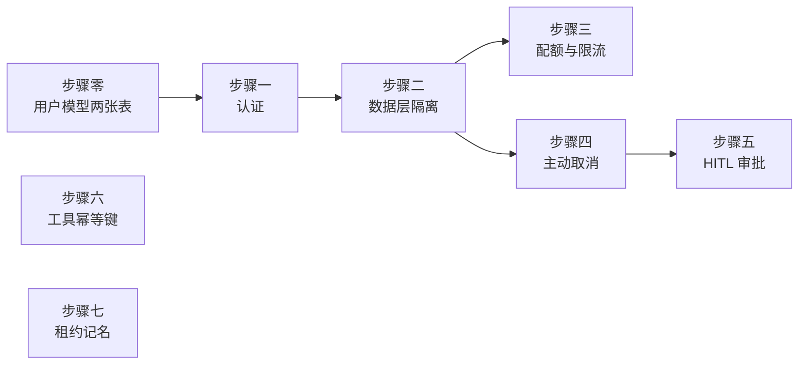

# P3 实施计划

| 项 | 值 |
|---|---|
| 文档状态 | **八个步骤全部落地；验收免费的五条已过，① 与 ⑦ 待跑（见 §8.5）** |
| 当前版本 | v0.3 |
| 作者 | hxy |
| 日期 | 2026-08-08 |
| 上游文档 | [总体架构设计](../01design/01architecture.md) · [P2 实施计划](./P2-plan.md) |

### 版本历史

| 版本 | 日期 | 修改人 | 说明 |
|---|---|---|---|
| v0.1 | 2026-08-08 | hxy | 初稿。P2 已于同日验收六条全过，本文覆盖「谁在用、能用多少、人能不能插手」这条能力线 |
| v0.2 | 2026-08-08 | hxy | **§7 六项待决全部关闭，可以开工**：MinIO 退回 P4、四个未知给保守初值、审批只拦 `delete`、前端本期不做、argon2、管理员走环境变量、`groups` 两张表不建。§2 三处定案已回填上游文档 |
| v0.3 | 2026-08-08 | hxy | **§8 实施回填**：八个步骤全部落地，记下三处偏离、三个只有部署才暴露的问题、一个仍未查清的偶发红 |

> **本文档的职责**：回答 **「P3 具体怎么做、做到什么程度算完」**。
>
> **不回答**「为什么账号自建而不接学校统一认证」（在 [ADR-0010](../01design/adr/0010-self-hosted-accounts-rbac.md)）、「为什么用 Cookie Session 而不是 JWT」（在 [ADR-0011](../01design/adr/0011-cookie-session-not-oauth2.md)）、「幂等键为什么用 `(thread_id, checkpoint_ns)`」（在 [ADR-0014](../01design/adr/0014-tool-idempotency-key.md)）。本文只给相对链接，不复制正文。

---

## 1. P3 的边界

**目标**（[架构 §11](../01design/01architecture.md)）：HITL 审批 + 取消 + 多用户隔离 + 配额限流 + 工具幂等键。

四期一句话：**P0 回答「agent 好不好用」，P1 回答「不可信代码跑在这台机器上安不安全」，P2 回答「这台机器上的东西挂了会怎样」，P3 回答「谁在用、能用多少、人能不能插手」。**

现在的答案是三个「没有」：没有用户（`runs.user_id` 是一列空值，谁都能读谁的 run），没有闸门（token 有计量口径但没有上限），没有插手的余地（run 一旦提交就只能等它自己跑完或失败）。

### 1.1 与前三期最大的不同：这一期有真正的未知

[P1 §1](./P1-plan.md) 与 [P2 §1](./P2-plan.md) 都写着同一句话 ——「**没有未知，只有工作量**」：选型在 ADR 里论证完了，要做的是把已定的方案落到代码里。

**P3 不是。** 架构文档里有四个 `TODO` 至今悬着，全都落在本期范围内：

| 悬着的问题 | 位置 | 为什么还没定 |
|---|---|---|
| 到底哪些操作需要审批 | [§5.3](../01design/01architecture.md) | 全量拦 `execute` 会让平台没法用（P0 实测一次分析要点十几次确认）；条件拦截的谓词写什么，要看真实行为模式 |
| 配额数值、超额行为、重置周期 | [§6.4](../01design/01architecture.md) | 只有一个样本（31 万 token 的单次分析），推不出日配额 |
| 限流阈值与算法 | [§7.5](../01design/01architecture.md) | 同上，没有真实请求分布 |
| 组内共享的 skill / 提示词表要不要预留 | [§6.2](../01design/01architecture.md) | 架构自己倾向不预留 |

**四个问题的输入是同一样东西：真实使用数据。而平台至今没有真实用户** —— 没有前端，只能 curl，所有实测样本都是验收脚本跑出来的同一个 case。

**定案（§7.2、§7.3）：四个未知一律给保守默认值，本期不等真实数据，也不做前端。** 默认值全部可配置，标注「初值，待真实数据校准」。这是明知证据不足仍要往前走的选择，因此**每个默认值旁边都要写清它是怎么外推出来的** —— 将来校准的人要看得见当初的推导，而不是面对一个来路不明的常数。

### 1.2 做什么

| 范围 | 依据 |
|---|---|
| `users` / `threads` 两张表（`groups` / `user_groups` 不建，见 §7.6） | [架构 §6.2](../01design/01architecture.md) |
| 认证：HttpOnly Cookie + Redis Session，`/auth/login`、`/auth/logout`、`/auth/me` | [架构 §7.2.2](../01design/01architecture.md)、[ADR-0011](../01design/adr/0011-cookie-session-not-oauth2.md) |
| 授权与隔离：**在数据访问层注入 `user_id` 过滤**，越权返 404 | [架构 §6.3 §5.7](../01design/01architecture.md) |
| 配额：token 日配额（按未命中加权）+ 并发 run 上限，**按角色分级** | [架构 §6.4](../01design/01architecture.md) |
| 限流：接口层 Redis 分布式计数，三个 429 用 `code` 区分 | [架构 §7.5 §5.7](../01design/01architecture.md) |
| 主动取消：Redis cancel flag + `cancelled` 态 + `run.cancelled` 事件 | [架构 §5.3 §5.4](../01design/01architecture.md) |
| HITL 审批：`interrupt` → `waiting_approval` → `Command(resume=…)` | [架构 §5.3 §5.7](../01design/01architecture.md) |
| 工具幂等键：broker 按 `(thread_id, checkpoint_ns)` 去重 | [架构 §5.6](../01design/01architecture.md)、[ADR-0014](../01design/adr/0014-tool-idempotency-key.md) |
| 沙箱租约记名（P1 遗债） | [P1 §1.3](./P1-plan.md)、[P2 §8.2](./P2-plan.md) |

### 1.3 前几期已经就位、本期不重做的部分

**事件契约早就留好了位置。**[`event/model.py`](../../app/event/model.py) 的 `EventType` 里 `run.cancelled` 与 `interrupt` 两个名字**从 P0 起就在清单里**，那段 docstring 明写「枚举列全清单是为了让前端有一份完整的类型表，但不是每种都已有对应的事件模型 —— 模型随各步骤落地时才添加」。`RunStatus` 的 docstring 也点名了「`cancelled` 与 `waiting_approval` 要等那两项落地」。**本期是填实现，不是改契约** —— 与 P2 处理事件 id 的原则一致。

`interrupt` 的 payload 已按 P0 探针实测在[架构 §5.2](../01design/01architecture.md) 定死，本期照抄即可，不需要再探。

**`runs.user_id` 列已经建好**（[`migration/version/0001_runs.py`](../../app/migration/version/0001_runs.py)），连 `ix_runs_user_started` 索引都在。P2 建表时刻意留的空列，本期只填值，不加列不改索引。

**token 按 cache 拆分的口径 P1 就落地了**，`runs` 表的三列一直在记数。配额要做的是加一道闸，不是重做计量。

**Alembic 在 P2 就引入了**，[P2 §7](./P2-plan.md) 定案时给的理由原文就是「P3 要加五张表并给 `runs` 补 `user_id`，那时再引入就得给已有数据补写第一版迁移」。这笔预付款本期兑现。

**broker 已经拆出来了**，幂等键的落点就位 —— [P1 §1.3](./P1-plan.md) 登记这笔债时写的是「broker 拆分后落点已就位」。

### 1.4 明确不做

**不是遗漏，是分期。**延续 [P2 §1.3](./P2-plan.md) 的登记方式，每条写明由哪一期偿还。

| 不做 | 后果 | 由哪期偿还 |
|---|---|---|
| MinIO 产物存储、`artifacts` 表、workspace 归档回收 | 产物仍从 workspace 直接读，workspace 仍只增不减 | **P4**（2026-08-08 定案退回，见 §7.1）。P2 §2.1 曾移到 P3，与架构 §11 的 P4「产物存储完善」冲突，本期把它落定 |
| `groups` / `user_groups` 两张表 | 用户之上没有组织结构，`/auth/me` 不返回「所属组」 | **P4 或按实际需求随共享资源一起建**（2026-08-08 定案不建，见 §7.6） |
| 组内共享的 skill、自定义系统提示词、MCP 接入 | 无组织结构，也无共享资源 | [架构 §1.2](../01design/01architecture.md) 本就不在范围内 |
| 提示词工程、子 agent 划分、效果评测 | 智能体好不好用仍只有一个 case 的证据 | **仍无期次** —— [架构 §10.3](../01design/01architecture.md) 明写「平台的价值完全取决于智能体好不好用，这块债只是被安排了，不是被还了」 |
| 前端 | 仍只能 curl 验收；而本期的审批、配额提示、越权提示全是给人看的 | **本期明确不做**（2026-08-08 定案，见 §7.3）。这是四期以来第一次它有了明确的处置，不再是无主地挂着 |
| `sandboxes` 表 | — | **大概率永远不需要**，[架构 §6.2](../01design/01architecture.md) 已说明理由 |
| Postgres 主从 | 仍是单点 | [架构 §8.2](../01design/01architecture.md) 待定 |
| 可观测性指标、链路追踪、成本看板 | 只有结构化日志与 token 数 | P4 |
| 测试与业务共用同一个 Postgres 库 | 测试数据混进业务表 | [P2 §8.3](./P2-plan.md) 登记，本期顺手做掉（步骤零要动迁移，成本最低） |

---

## 2. 三处与上游文档不一致，本期定案

### 2.1 `threads` 表建起来之后，「会话存不存在」有两个真相源

**冲突**：现在会话**等同于** workspace 目录，存在性判断走 broker 的 `GET /threads/{id}/exists`（[`sandbox/remote.py`](../../app/sandbox/remote.py)）。建了 `threads` 表之后，同一个问题有两个答案，而两者会分叉 —— 目录被误删、或建表成功但建目录失败。

**定案：表是权威，目录是它的副产品。**

- api 侧一律查表，`/exists` 不再被 api 调用；
- broker 的 `/exists` 保留，但降级为 broker 内部判断（它管容器与目录，本来就该有自己的视角）；
- 建会话是**先落表、后建目录**，与 [P2 的 `RunSubmitter`](../../app/run/submitter.py) 同一顺序原则（先落库再产生副作用）。目录建失败则整体失败，不留半个会话。

**理由**：多租户隔离的过滤条件长在表上（§6.3），而目录没有归属信息。让目录当权威，等于把越权检查建在一个不知道谁是主人的东西上。

### 2.2 `runs.user_id` 的一致性由谁保证

**冲突**：[架构 §6.2](../01design/01architecture.md) 写「由创建 run 的唯一入口（`POST /threads/{id}/runs`）保证，不做触发器」。但 P2 之后那个入口的实现 [`RunSubmitter.submit`](../../app/run/submitter.py) 只认 `thread_id` 与 `content`，**它不知道 user 是谁**。

**定案：`user_id` 从 session 取，经端点传进 submitter；`threads.user_id` 是权威，submit 前先校验该 thread 属于当前用户。**

不做触发器的决定不变，但「唯一入口保证」要落到具体的一行校验上 —— 而那行校验本身就是 §6.3 的隔离过滤，不是额外工作：查 thread 时已经注入了 `user_id` 条件，查不到就是 404，走不到 submit。

### 2.3 `waiting_approval` 不占并发配额，但 worker 要不要 ack

**冲突**：[架构 §5.4](../01design/01architecture.md) 说 `waiting_approval` 期间「不占用任何 worker 资源，可挂起数小时」；而 [P2 的 worker](../../app/worker/loop.py) 是**跑完才 ack**，ack 在 `finally` 里。若审批期间不 ack，这条消息会一直挂在 pending 里，被 `XAUTOCLAIM` 当成「worker 死了」重投 —— 教师还没点确认，任务已经被另一个副本重跑了。

**定案：进入 `waiting_approval` 时 ack 并释放沙箱，审批回传时作为一条新任务重新投递。**

- 这与 P2 的 ack 语义一致：ack 表示「这一段执行结束了」，不表示「整个 run 结束了」。失败的 run 也 ack（[`worker/loop.py`](../../app/worker/loop.py) 的模块 docstring 已经写明这个区分）；
- 挂起数小时期间不持有队列消息、不持有沙箱，正是 §5.4 那句「不占用任何 worker 资源」的字面实现；
- 恢复靠 checkpoint，而 checkpoint 在 P2 已经落库 —— 这是本期能这么做的前提。

**代价**：一次 run 在队列里会出现多次（每轮审批一次）。因此 `run.started` 不能再当「这个 run 第一次开跑」用 —— 那是 [P2 验收①](./P2-plan.md) 依赖的判据。本期要给恢复投递一个区别于首次提交的标记，见步骤五。

---

## 3. 环境前提

**本期几乎没有新的环境依赖**，这是四期里最轻的一次：不像 P1 要改宿主机（gVisor、XFS），也不像 P2 要加两个常驻服务（Postgres、Redis）—— 那两样本期直接用。

只有两项新增：

| 项 | 内容 |
|---|---|
| 密码哈希库 | `uv add argon2-cffi`，Argon2id，参数写成模块顶常量（§7.4）。**不自己实现哈希** |
| 首个管理员账号 | `.env` 里的两个变量，空库时自动建（§7.5）。**放仓库根的 `.env`，不写进 compose** —— 与项目现有的凭据约定一致，`.env.example` 只留模板 |

Redis 本期多两类键：session（`7 天滑动过期`）与 cancel flag。两者都短命且可过期，与[架构 §6.1](../01design/01architecture.md) 选 Redis 的理由一致，不引入新中间件。

> **一条要提前想到的运维项**：session 存 Redis 意味着 **Redis 重启会把所有人踢下线**。[架构 §8.5](../01design/01architecture.md) 要补这一条 —— 它不是故障，但运维要知道「重启 Redis = 全员重新登录」。

---

## 4. 验收标准

与前三期同样的口径，**一条命令能跑完**。本期新增的判据进 `deploy/test/p3.sh`，P0 / P1 / P2 的回归由既有脚本转调。

```bash
make all                                     # 门禁全绿
docker compose -f deploy/compose.yml up -d

bash deploy/test/p3.sh                       # 本期七条，转调 p2.sh 做回归
```

**通过条件**（七条全中才算完）。前三条是[架构 §11](../01design/01architecture.md) 给 P3 定的原文标准：

1. **审批流程走通** —— `interrupt` 事件推给前端 → run 转 `waiting_approval` → **四种决策（`approve` / `reject` / `edit` / `respond`）各走一遍** → run 继续跑到终态。四种都要验：它们在 DeepAgents 侧是四条不同的恢复路径，只验 `approve` 等于没验。

2. **`kill -9` 在工具执行途中，恢复后写操作不重复执行** —— **崩溃点必须是定点注入的，不能靠随机时机**。[P2 §7.1](./P2-plan.md) 量了两轮，两轮的刀都落在两次工具之间，差值都是 0 —— 那证明不了幂等键有效，只证明没砍到。本期要造的是「卡在 `execute` 已经开始、结果还没回来」的那一刀。

3. **30 并发压测不崩溃、不串数据** —— 「不串数据」是这条的重点：并发下每个用户只看得见自己的 thread / run / 事件 / 产物。

4. **越权一律 404，不是 403** —— 拿 A 的 session 去读 B 的 thread / run / 事件 / 产物，四条路径都要返回 404。[架构 §5.7](../01design/01architecture.md) 的理由是不给探测他人资源是否存在的机会，因此**403 也算未过**。同时要验管理员不例外（[架构 §6.3](../01design/01architecture.md) 明确管理员不能看他人会话内容）。

5. **三道闸都关得上，且三个 429 可区分** —— token 日配额耗尽 → `QUOTA_EXCEEDED`；并发 run 超限 → `CONCURRENCY_LIMIT`；接口频率超限 → `RATE_LIMITED`。[架构 §5.7](../01design/01architecture.md) 明确「只给 HTTP 429 的话前端无法区分」，因此**三个 code 各自出现过才算通过**。配额按未命中部分加权计算，不按 input 总数。**token 配额那条用「预置用量」触发，不靠真烧**：把当日已用量直接写到接近上限再提交一次。烧满一个真实日配额又慢又贵，而这条要验的是闸门与扣减口径，不是模型。

6. **主动取消真的停得下来，且 checkpoint 保住** —— 取消一个正在跑的 run：run 转 `cancelled`、推 `run.cancelled` 事件、沙箱释放、**token 不再继续消耗**；随后从该点恢复仍能续跑（[架构 §5.3](../01design/01architecture.md) 明确「已写入的 checkpoint 保留，可从该点恢复」）。

7. **[P2 的六条](./P2-plan.md)不回归** —— 尤其是①「续跑不是重跑」：本期 §2.3 改了 ack 时机与投递次数，那条判据（`run.started` 只有 1 条）会被直接影响。

> **一条要测量、不设门槛的观察项**：**每次验收跑完，把这一次分析的未命中 token 数记下来。**
>
> §7.2 那版初值是从**一个**样本外推的（[架构 §6.4](../01design/01architecture.md) 自己说「不足以直接推出日配额」）。每跑一次验收就多一个样本，攒成一张表，将来校准初值时手里才有分布而不是又一次外推。这条不设门槛，只记账。
>
> 审批那边本期没有条件谓词可观测（只全量拦 `delete`，§7.2），因此没有对应的观察项。**要加 `execute` 的条件拦截时，第一件事是把这个观察项补上** —— 命中 0 次说明谓词太严，命中十几次说明平台没法用，这个数不量出来就定谓词，是在猜。

---

## 5. 任务分解

八个步骤，**每步有独立的验证标准，未通过不进下一步**（[技术章程第四条](../../.claude/python-constitution.md)）。



**顺序的两条理由**：

- **先地基后闸门**：配额要按 user 算、限流要按 user 分级，没有用户模型就无从做起。步骤零到二是一条必须串行的链。
- **先取消后审批**：两者共用同一套「让一个在跑的 run 停下来并保住 checkpoint」的机制，而取消**没有恢复语义**，是其中简单的那一半。先把停下来验对，审批那步就只剩恢复这一个变量。`waiting_approval → cancelled` 也是状态机上的一条边（[架构 §5.4](../01design/01architecture.md)），取消先落地才画得完整。

步骤六与七**与前面几乎正交**（一个在 broker，一个在 broker + worker 之间），不阻塞任何人，排在最后是因为它们不是本期验收的主线。

### 步骤零：用户模型两张表

| 项 | 内容 |
|---|---|
| 产出 | `users` / `threads` 两张表 + Alembic 迁移；`runs.user_id` 与 `runs.thread_id` 补外键。`groups` / `user_groups` **不建**（§7.6） |
| 依据 | [架构 §6.2](../01design/01architecture.md) 的 ER 图与索引表 |
| 验证 | ① `alembic upgrade head` 与 `downgrade` 都跑得通；② [架构 §6.2](../01design/01architecture.md) 索引表里属于这两张表的索引全部建出；③ 已有的 `runs` 行不被破坏（`user_id` 仍可为空，本步不回填） |

**`agent_config` 用 JSONB 不拆列**，理由在[架构 §6.2](../01design/01architecture.md)，本期照办。

**已有的数据不迁移。** 现在的 workspace 目录与 `runs` 行全部是验收脚本跑出来的，没有真实归属 —— 给它们编一个 owner 只会造出一批假数据。定案：**迁移只建表不回填**，`runs.user_id` 保持为空；已有的 workspace 目录成为孤儿目录，由[体检脚本](../../deploy/workspace-report.sh)可见，人工清理。这条要写进迁移的 docstring，否则半年后没人说得清那些空 `user_id` 是遗留还是 bug。

**顺手做掉一件 P2 欠的事**：测试与业务共用同一个 Postgres 库（[P2 §8.3](./P2-plan.md) 登记）。本步本来就要动迁移与 conftest，此时分家成本最低；再往后每加一张表，混进业务表的测试数据就多一批。

### 步骤一：认证

| 项 | 内容 |
|---|---|
| 产出 | `POST /auth/login`、`POST /auth/logout`、`GET /auth/me`；HttpOnly + `SameSite=Lax` Cookie；session 存 Redis，7 天滑动过期；argon2id 哈希；空库时按 `.env` 建首个管理员 |
| 依据 | [架构 §7.2.2](../01design/01architecture.md)、[ADR-0011](../01design/adr/0011-cookie-session-not-oauth2.md)、本文 §7.4 §7.5 |
| 验证 | ① 登录拿到 Cookie，`/auth/me` 答得出 role（**不含所属组**，§7.6）；② 登出后同一 Cookie 立刻失效；③ **SSE 带 Cookie 能连上**（[架构 §7.2.2](../01design/01architecture.md) 点名的坑一）；④ 未登录访问任何业务端点得 401 `UNAUTHENTICATED`；⑤ 密码只以哈希形式落库，日志里不出现明文；⑥ **已有管理员时初始化不再触发**，且重启不覆盖已改过的密码 |

验证③单列出来，是因为它是这一步最容易漏的：SSE 走的是另一套客户端（`@microsoft/fetch-event-source` 默认不带凭据），而本平台的核心交互全在 SSE 上。**没有前端的情况下，用 curl 显式验这条**。

验证⑥是 §7.5 那个「环境变量」方案唯一的正确性要求：初始化必须**只在空库时发生**。否则运维改过管理员密码之后，一次重启就把它改回 `.env` 里那个 —— 而这种回退不报错。

### 步骤二：数据层隔离

| 项 | 内容 |
|---|---|
| 产出 | repository 层统一注入 `user_id` 过滤；越权落 404 |
| 依据 | [架构 §6.3](../01design/01architecture.md) |
| 验证 | ① 拿 A 的 session 读 B 的 thread / run / 事件 / 产物，四条路径全部 404；② **管理员也拿不到**；③ 新增一条测试：repository 的公开查询方法**没有一个**允许不带 user 上下文调用 |

**「不要指望每个接口都记得加 where 条件」**（[架构 §6.3](../01design/01architecture.md) 原话）—— 验证③是这句话的可执行版本。隔离必须做在数据访问层，而「做在数据访问层」这件事本身要有一条测试盯着，否则半年后新加的一个查询方法就会绕过它。

### 步骤三：配额与限流

| 项 | 内容 |
|---|---|
| 产出 | token 日配额（按未命中加权）+ 并发 run 上限，按角色分级；接口层 Redis 计数；三个 429 的 `code` |
| 依据 | [架构 §6.4 §7.5 §5.7](../01design/01architecture.md) |
| 验证 | ① 三道闸各自触发一次，三个 `code` 都出现过；② 配额按未命中扣，`cache_read` 不计入（造一个高命中的会话，验它扣得少）；③ **`waiting_approval` 的 run 不占并发配额**（[架构 §5.4](../01design/01architecture.md)）；④ 数值全部可配置，不硬编码；⑤ 每个默认值旁边有一行注释写清它是怎么外推的 |

验证②是这一步的核心。[架构 §6.4](../01design/01architecture.md) 实测 62% 的 input 是 cache 命中，按总数扣会高估 1.6 倍，**且方向性地惩罚长会话** —— 而长会话深度分析正是平台想鼓励的。扣错方向比扣错数值严重得多。

验证⑤是 §7.2 那个「保守初值」方案的配套。**一个来路不明的常数比没有常数更难改** —— 后来的人不知道它是精心算的还是随手写的，只好不敢动。

### 步骤四：主动取消

| 项 | 内容 |
|---|---|
| 产出 | `POST /runs/{id}/cancel`；Redis cancel flag；worker 在 step 边界检查；`cancelled` 状态与 `run.cancelled` 事件模型 |
| 依据 | [架构 §5.3 §5.4](../01design/01architecture.md) |
| 验证 | ① 取消一个正在跑的 run：转 `cancelled`、推 `run.cancelled`、沙箱释放；② **token 不再继续消耗**（比对取消前后的计数）；③ checkpoint 保住，从该点能续跑；④ 取消一个排队中的 run 同样有效；⑤ 取消一个已终态的 run 是幂等的，不报错 |

验证②不能只看「事件流停了」。事件流停下来只说明没人在推，不说明 worker 那边的模型调用停了 —— 而 LLM 调用是真金白银。

### 步骤五：HITL 审批

| 项 | 内容 |
|---|---|
| 产出 | `interrupt` 事件模型；`waiting_approval` 状态；`POST /runs/{id}/approve`；`interrupt_on` **只全量拦 `delete`**（§7.2）；24 小时超时转 `cancelled` |
| 依据 | [架构 §5.3 §5.4 §5.7](../01design/01architecture.md) |
| 验证 | ① 四种决策各走一遍，run 都能继续跑到终态；② 决策按显式 `index` 重排，缺失或重复的 index 得 `VALIDATION_ERROR`；③ `waiting_approval` 期间**不持有队列消息也不持有沙箱**（§2.3）；④ 超时转 `cancelled`；⑤ 待审批数上限 5 个，超了拒绝新的 |

**本期不写任何 `when` 谓词**（§7.2 定案只全量拦 `delete`），因此[架构 §5.3](../01design/01architecture.md) 引的那条官方警告 ——「非确定性逻辑会破坏基于索引的匹配」—— 本期够不着。**但要在 `interrupt_on` 的配置处就近写明这条约束**：将来加 `execute` 条件拦截的人第一眼就该看见，因为它坏掉的方式是静默的（索引错位，恢复时把 A 的决策套到 B 的调用上）。

**验收①要靠脚本主动造一次 `delete` 才触发得了审批** —— P0 实测 agent 一次都没自发调过它。这不是缺陷，正是选它的理由（低频高危，全量拦不伤可用性），但验收脚本得知道自己在造场景，不能等 agent 自己撞上来。

**§2.3 的代价在这一步兑现**：一次 run 会多次入队，`run.started` 不再等于「第一次开跑」。要给恢复投递一个标记，并同步改 [P2 验收①](./P2-plan.md) 的判据。

### 步骤六：工具幂等键

| 项 | 内容 |
|---|---|
| 产出 | worker 侧传 `(thread_id, checkpoint_ns)`；broker 对全部写操作（`write_file` / `edit_file` / `delete` / `execute`）去重，命中则返回缓存结果（**含错误结果**） |
| 依据 | [架构 §5.6](../01design/01architecture.md)、[ADR-0014](../01design/adr/0014-tool-idempotency-key.md) |
| 验证 | ① 验收标准②那条定点注入的崩溃用例通过；② 命中缓存时不进沙箱（看容器里有没有新进程）；③ **纯读工具不去重**（`ls` / `read_file` / `glob` / `grep`） |

**缓存错误结果**是关键：`edit_file` 重放时 `old_string` 已不存在，会返回一个首次执行时没有的错误，使 LLM 的后续行为偏离（[架构 §5.6](../01design/01architecture.md)）。只缓存成功结果等于没解决这个问题。

**一处要盯着的耦合**：`checkpoint_ns` 是 LangGraph 的编排细节，不是本平台的领域概念。[架构 §10.2](../01design/01architecture.md) 已登记「升级 langgraph 时须重跑并行场景复验」，本步落地时要把那条复验做成可重跑的用例，而不是只留一句提醒。

### 步骤七：租约记名（P1 遗债）

| 项 | 内容 |
|---|---|
| 产出 | broker 的沙箱申请带上持有者身份；新增按持有者回收的路径；worker 崩溃后名额立刻回池，不等 30 分钟超时 |
| 依据 | [P1 §1.3](./P1-plan.md)、[P2 §8.2](./P2-plan.md) |
| 验证 | ① `kill -9` 一个持有沙箱的 worker，名额在**秒级**回池（现状是最多 30 分钟）；② 超时兜底 `_expire_lease` 保留，不因为有了精确回收就删掉 |

验证②不是保守：精确回收靠的是「另一方发现你死了」，而那个判断本身也可能失效。兜底是最后一道，删掉它等于把两层防护变成一层。

---

## 6. 与 P0 / P1 / P2 的回归关系

| 已有能力 | 本期是否触碰 | 怎么防回归 |
|---|---|---|
| P0 事件流与断线重连 | **碰**：新增两个事件类型，且 §2.3 改了投递次数 | `acceptance.sh` 四条转调；`interrupt` / `run.cancelled` 进事件契约测试 |
| P1 沙箱加固与 broker 边界 | **碰**：步骤六、七都改 broker | `p1.sh` 六条转调；破坏性测试不因为 broker 多了去重表而失效 |
| P1 结构化日志 | 碰：新增的端点要带上 `user_id` | 日志验收从 `run_id` / `thread_id` 扩到含 `user_id` |
| P2 崩溃恢复与队列语义 | **碰得最重**：§2.3 改了 ack 时机 | `p2.sh` 六条转调，其中①的判据要同步改（见步骤五） |
| P2 事件 id 契约 | 不碰 | `p2.sh` ⑥ 转调 |

**最需要警惕的是 P2 ①**。本期改 ack 时机之后，「`run.started` 只有 1 条」这个判据会自然失效 —— 而它失效的方式是**报红**，不是静默，这算运气好。真正的风险是有人为了让它变绿而放宽判据，那样就把 P2 最核心的一条保证悄悄稀释了。**改判据时要保住原意：已完成的步骤不重跑。**

---

## 7. 待决事项

**六项均已于 2026-08-08 关闭，可以开工。**

| 项 | 定案 |
|---|---|
| §7.1 MinIO 与 workspace 回收 | **退回 P4** |
| §7.2 四个未知的数值 | **一律给保守初值**，可配置，注明外推依据 |
| §7.3 前端 | **本期不做** |
| §7.4 密码哈希 | **argon2id**，参数显式指定 |
| §7.5 首个管理员 | **环境变量**，仅空库时生效 |
| §7.6 `groups` / `user_groups` | **不建** |

### 7.1 MinIO 与 workspace 回收：留 P3 还是退回 P4

**冲突**：[P2 §2.1](./P2-plan.md) 定案「P2 不做 MinIO，移到 P3」；而[架构 §11](../01design/01architecture.md) 的 P4 一行写的是「产物存储完善」。同一件事仍然被排在两处 —— P2 只是把它从自己身上挪走了，没有真正落定。

**定案：退回 P4。**

- P2 那次决定的实质是「不在 P2」，P3 是当时顺手指的下一个格子；
- 它的驱动理由是「租户前缀隔离依赖 P3 的用户模型」——那说明它**不能早于** P3，不等于**必须在** P3；
- P3 已经有八个步骤，是四期里最大的一期。再挂一条存储线，「未通过不进下一步」会形同虚设；
- 实测约 2.5GB/年（[架构 §6.5](../01design/01architecture.md)），且已有[体检脚本](../../deploy/workspace-report.sh)盯着水位，不紧迫。

**已回填三处**（2026-08-08）：[P1 §1.3](./P1-plan.md)、[P2 §1.3 与 §2.1](./P2-plan.md)、[架构 §6.5](../01design/01architecture.md)。

### 7.2 四个数值：本期定还是留空

[§1.1](#11-与前三期最大的不同这一期有真正的未知) 列的四个 TODO，输入都是真实使用数据，而平台还没有真实用户。

**定案：一律给保守初值，全部可配置，每个都注明外推依据。**

初稿写的是「机制本期做、数值留空」，**那个方案是错的**：阈值为空的闸不是闸。验收⑤要求三道闸各触发一次，留空就只能靠临时把阈值调到 1 来验 —— 那证明的是代码路径通，不是配额能用；而上线时实际上没有任何成本闸门，**LLM 调用是真金白银**。

| 项 | 初值从哪来 |
|---|---|
| token 日配额 | 单次分析实测 31 万 token（[架构 §6.4](../01design/01architecture.md)），按角色乘一个保守的日均次数 |
| 并发 run 上限 | 沙箱池容量（[架构 §8.1](../01design/01architecture.md)）除以预期同时在线人数 |
| 接口限流 | 按「一个人正常操作的手速」定，宁松勿紧 —— 这道闸误伤的是正常用户 |
| 审批触发范围 | 见下，这条不是数值 |

**审批范围那条不像前三条能靠配置留空** —— 谓词写什么直接决定平台能不能用。**定案：本期只全量拦 `delete`**。P0 实测一次分析里 `delete` 一次都没调，属于低频高危，全量拦不影响可用性；`execute` 的条件拦截等攒够样本再加，加之前先补上 §4 那条观察项。

**与 P2「先量后定」的区别要认清**：P2 那次量的是系统行为（工具重跑次数），跑一次验收就有数据；本期要量的是**人的使用行为**，没有真实用户就永远攒不够。所以这里不是「等数据」，而是**明知证据不足仍然先定一版**，靠可配置与外推依据留出校准的余地。

### 7.3 前端还要不要继续挂着

[P0 §4](./P0-plan.md) 的遗留问题至今未关闭，[P2 §1.3](./P2-plan.md) 已经点名「这条不该继续无主地挂着」。

**本期它比前三期更刺眼**：审批要人点、配额耗尽要给人看提示、越权要给人看 404 —— 本期做的东西**大半是给人用的，而没有人能用**。用 curl 验收能证明机制对，证明不了机制可用。

**定案：本期不做前端，四个未知按 §7.2 给保守默认值，后续由 hxy 依据实际情况调整。**

这条与前三期的「挂着」有实质区别：**它现在有了明确的处置**（不做，且不依赖它来关闭任何待决），不再是一个没人认领的缺口。代价明确接受：本期交付的是一套**机制被验证过、参数未被使用验证过**的系统。

### 7.4 密码哈希用 argon2 还是 bcrypt

**定案：argon2id（`argon2-cffi`），参数显式指定，不用库默认档。**

argon2id 是当前的推荐默认，内存硬度优于 bcrypt；bcrypt 另有 72 字节静默截断这个坑。参数（`time_cost` / `memory_cost` / `parallelism`）写成模块顶常量而非依赖库默认，两个理由：将来调高时有据可查；库改默认值不会静默改变已部署系统的安全强度。

**要写进 [ADR-0010](../01design/adr/0010-self-hosted-accounts-rbac.md)。**

### 7.5 首个管理员账号怎么来

空库时没有任何账号，`/auth/login` 谁也进不去。

**定案：环境变量，仅在空库时生效。**

放**仓库根的 `.env`**（不写进 `compose.yml` 的字面量），走 `Settings` 读取 —— 与项目现有的凭据约定一致，`.env.example` 只留模板。

**明确接受的代价**：凭据会出现在进程环境里，能登上服务器的人 `docker inspect` 就看得到。这在内网单机、运维只有一人的前提下可以接受（与[架构 §7.1](../01design/01architecture.md) 接受 HTTP 明文是同一类判断）。

**唯一的正确性要求是「只在空库时建」**（步骤一验证⑥）：否则运维改过管理员密码之后，一次重启就把它改回 `.env` 里那个，而这种回退不报错。

### 7.6 `groups` 建了但组内共享不实现，值不值得

[架构 §7.2.1](../01design/01architecture.md) 说「此处先定角色模型与共享边界，是为了让 §6.2 的表结构将来不必推倒重来」。但组内共享的资源（skill、提示词）本期一样不建，两张表建起来之后**没有任何东西挂在上面**。

**定案：不建。**

[架构 §6.2](../01design/01architecture.md) 对隔壁那张 skill 表的态度就是「倾向不预留 —— 现在猜它的字段，和将来照实际需求建表，成本差不多，但猜错要迁移」。**同一条理由适用于 `groups`**，两处不该用两套标准。何况 `groups` 只有三列、`user_groups` 只有两列，将来照实际需求建也就这几列，谈不上「推倒重来」。

**角色模型照建不误** —— `users.role` 与 §7.2.1 那张权限表本期全部落地。不建的只是「组」这个组织层级，不是角色。

**代价：`/auth/me` 本期不返回「所属组」，与[架构 §5.7](../01design/01architecture.md) 有出入，已回填。**

---

## 8. 实施回填（2026-08-08）

八个步骤已全部落地，每步一个提交（`a358f05` … `6a54ed3`），验收脚本在 `5c2ac54`。

**验收现状：七条全过，其中嵌套的 P1 ① 未验**（要交互式 sudo，本轮在无 tty 的后台跑）。见 §8.6。

本期最贵的一课不在实现里，在验收里：**P3 改的接口打穿了三个历史验收脚本（§8.5），而两条判据本身就不成立（§8.7）**。前者只有 ⑦ 会发现，后者只有真发生一次崩溃恢复才会暴露。

### 8.1 与计划的三处偏离

三处都是实施中发现计划的写法会留下缺口，就地改的，理由在代码里就近写明。

| 计划原文 | 实际做法 | 为什么 |
|---|---|---|
| 步骤零「`runs.user_id` 与 `runs.thread_id` 补外键」 | `user_id` 那条在 0003 建，**`thread_id` 那条推到 0004（步骤二）** | 建 `threads` 表的那一刻它还是空的，而提交 run 的入口此时仍只建目录不落表 —— 外键一加，每一次提交都当场炸在插入上（实测连带 19 个用例报红）。等步骤二让 api 先落 `threads` 行之后再加，它才约束得住真实的写入路径 |
| 步骤五只说「进入 `waiting_approval` 时 ack 并释放沙箱」 | 顺带把 `start` / `succeed` / `fail` / `cancel` / `wait_approval` **全部改成条件更新** | 写审批时发现 worker 跑完会用 `succeeded` 覆盖已经写下的 `cancelled` —— 事件说已取消、状态说已成功，两边对不上而且谁都不报错。这是同一类问题，一次修干净 |
| §7.2「四个未知一律给保守初值」只点了三个数值 | 多定了一个 **output 权重**（当量 = 未命中 input + output × 权重，权重取 1） | 「按未命中部分**加权**计算」里的权重没有可核对的价目表可依。取 1 并写清「拿到真实价目再调」，比拍一个更「精确」的数字诚实 —— 后者会让人以为它是算出来的 |

### 8.2 三个只有部署才会暴露的问题

单测与门禁对这三个全绿，`docker compose up` 之后才现形：

| 问题 | 症状 | 单测为什么抓不到 |
|---|---|---|
| SQLModel 把枚举**按名字**存，库里躺的是 `ADMIN` / `SUCCEEDED` | 照文档写的 SQL 一律查不到东西；`ix_runs_unfinished` 的谓词 `status IN ('queued','running')` **永远匹配不上**，崩溃恢复的扫描静默退化成全表扫 | 查询本身是对的（绑定参数与列用同一套编码），没有任何断言看过**库里那一列长什么样** |
| compose 的 broker 服务没有 `REDIS_URL` 覆盖 | P3 起 broker 要连 Redis 做去重表，于是连到容器自己的 127.0.0.1，第一次 `delete` 就 500 | 测试里的 broker 拿到的是注入进去的 Redis 客户端，**根本不读那份环境变量** |
| `session.commit()` 之后读 ORM 字段触发同步惰性重查 | 建号那一刻 `MissingGreenlet`，症状不指向「提交之后不能再读」 | 之前的仓储都是「写完就不看」，没有一处在 commit 之后取过字段 |

第一条的修法是列声明改成按值存，已有的 2088 行就地小写（0005）。迁移前 `EXPLAIN` 走不到那条部分索引，迁移后走到了 —— 这是它「确实坏过」的直接证据。

第二条一并加了两道：broker 启动时体检 Redis（连不上就起不来，与 api / worker 同一个规矩，配错了在部署那一刻就暴露）；去重表读写失败时降级并告警而不是把工具调用打断 —— 它是崩溃路径上的一道保险，不是执行的前提。

### 8.3 一个仍未查清的偶发红（本期又添了一条证据）

**症状**：产物列表为空。已经在**两条**用例上出现过，都不在 P3 的改动路径上：

| 用例 | 频率 |
|---|---|
| `test/api/artifact_test.py::test_the_run_reports_ids_that_the_artifact_endpoint_accepts` | 约 1/15 |
| `test/broker/route_test.py::test_artifacts_written_after_the_mark_are_reported` | 全量跑里遇到 1 次；单独连跑 5 次全过，紧接着复跑 `make all` 全绿 |

两条都落在 `sandbox/backend.py` 的 `artifact_since`（`st_mtime_ns >= since_ns`）上，因此大概率是同一个原因。

**mtime 时钟精度这条假说可以排除了**：2026-08-08 在 `/tmp` 与 `data/sandbox` 两个文件系统上各探 5,000 次「取 `time.time_ns()` → 写文件 → 读 `st_mtime_ns`」，**负差一次都没有**，中位数正差 31–44 微秒。加上 P1 期那 3,000 次，共 13,000 个样本，没有一个支持这个方向。

**还没查的方向**：`Broker.backend()` 每次请求现组、不缓存，路径串不了；剩下值得查的是 broker 侧那次 HTTP 往返里 `since_ns` 的取值时机，以及负载下 `rglob` 与写入的先后。

**登记而不是绕过**：它是「全绿但产物为零」那一类的近亲 —— 那一类正是最贵的 bug，因为没有任何报错指向原因。值得单独花时间查，但不该占用 P3 的实施时间。

### 8.4 明确接受的两个代价

- **交付的是一套机制被验证过、参数未被使用验证过的系统**（§7.3 定案的原话）。三道闸的数值全部从**一个**样本外推，外推方式写在 `app/quota/policy.py` 的常量旁边。审批范围同理：只全量拦 `delete`，`execute` 的条件拦截推后，**加它之前先补上 §4 那条观察项**。
- **两个 cron 任务**：`python -m store.retention`（P2 就有）与 `python -m run.approval`（本期新增，把挂超过 24 小时的待审批转 `cancelled`）。两者都可重跑。**运维要知道还有第三条**：Redis 重启会把所有人踢下线，session 存在那里。

### 8.5 P3 把三个历史验收脚本打穿了

⑦「P2 验收六条不回归」跑出来的红**全部落在脚本上，产品一条没坏**。但每一处都让对应的回归条目彻底失效，且失效的样子是红成 401 / 422，不是老老实实记「未验」。

| 断点 | 谁在调它 | 症状 |
|---|---|---|
| `/api/*` 一律要会话 cookie（步骤一） | acceptance.sh、p1.sh、p2.sh 共十余处 | 第一次调用 401，之后拿着空 id 一路 404 |
| `RunRepository.create` 多了必填 `user_id`（步骤零） | p2.sh 造 ② 的种子 run | `TypeError`，② 连验都没验上 |
| broker 申请沙箱要 `holder`（步骤七） | p1.sh 两处 | 422 Field required，④⑤⑥ 连环红 |

外加 `runs` 上新增的两条外键让「随手编个 id 造种子数据」这条老路走不通 —— 编出来的 id 被 `fk_runs_user` 当场拒掉。p2.sh 改成走接口建真会话行，与教师走同一条路径。

**为什么单独记一节**：这四处都是 P3 自己改的接口，改的当时三个历史脚本一处都没报错 —— 它们只在被跑到时才炸，而 P0/P1/P2 的脚本平时没人跑。**⑦ 是唯一会跑到它们的地方**，也就是唯一会发现这件事的地方。图省事跳过 ⑦ 的话，交付出去的是「三期回归基线全部失效而无人知晓」。

修法是把「先有个号」抽成 [`deploy/test/session.sh`](../../deploy/test/session.sh)，四个脚本共用一份，下次再改登录方式仍只改一处。它按 compose 标签直接 `docker exec` 找容器而不走 `docker compose`：后者一读配置就要求 `SANDBOX_USER` 已经 export，而 acceptance.sh 不做这件事。

### 8.6 验收现状

```bash
bash deploy/test/p3.sh                        # 七条全跑，有 LLM 费用
SKIP_LLM=1 SKIP_P2=1 bash deploy/test/p3.sh   # 免费的五条，约 3 分钟
```

| 条目 | 状态 |
|---|---|
| ① 四种决策各走一遍 | ✅ 已过（连续两轮） |
| ② 定点注入的崩溃：写操作不重复执行 | ✅ 已过 |
| ③ 30 并发不崩溃、不串数据 | ✅ 已过 |
| ④ 越权一律 404（管理员不例外） | ✅ 已过 |
| ⑤ 三道闸关得上且三个 429 可区分 | ✅ 已过 |
| ⑥ 主动取消停得下来 | ✅ 已过 |
| ⑦ P2 验收六条不回归 | ✅ 已过，但 **P1 ① 未验** —— 见下 |

**一条没验着，且不打算假装它验过了**：P1 ①（四条破坏性测试）要 root，`p1.sh` 在开头取 sudo 凭据，而本轮验收在无 tty 的后台跑，`sudo -n` 不通。它记的是「未验（SKIP_HOSTILE=1）」，逐级传上来仍是未验。**要补这一条，在交互终端里跑 `sudo bash deploy/test/hostile.sh`。**

**脚本自己先验过能报红**，这一期一共抓到自身的五个 bug：

| 脚本的 bug | 表现 |
|---|---|
| psql 的 `RETURNING` 把 `INSERT 0 1` 粘在 run id 后面 | 后续请求全打在一个非法 id 上 |
| 验 cache_read 那步被放行的提交会被 worker 真跑掉 | 既花钱，又让紧接着的「`waiting_approval` 不占并发」数到一个 running |
| ① 只审批一轮 | `edit` 把删除目标改成不存在的文件后 agent 又提一次删除，第二轮中断永远等不到终态 → 改成批到终态为止 |
| `p1.sh` 的 `cleanup` 强制重建 broker 后不等它就绪 | 紧接着的 ② 第一个动作就是建会话，打在正启动的 broker 上 → 500，报错只说「建会话失败」，不指向重建时序 |
| `p2.sh` ① 数 `run.started` 的条数 | 两个方向都会骗人，见 §8.7 |

> **观察项（§4 要求，不设门槛）**：见 §8.7。

### 8.7 两个「判据本身不成立」的发现

**一、`p2.sh` ① 的判据从 P2 起就可能假过。** 它数 `run.started` 的条数（P3 期改成数 `"resumed":false` 的那些）来判断「续跑不是重跑」。2026-08-08 的两轮验收里，两种错都撞上了：

- **假过**：run 在 `kill -9` 真正生效前就跑完了（这道题实测约 20 秒，而脚本等满 20 秒才动手）。重投撞上「已经有终态」的守卫、不再发 `run.started`，于是只有 1 条 —— 判据记通过，可这一次**根本没崩到**，什么都没验着。
- **假红**：真崩了并且正确续跑 —— 崩溃前四次工具调用一次都没重跑，续跑那一程只花了 1,529 未命中 token。但重投照样发一条 `run.started`，而 `resumed` 的定义是 `task.decisions is not None`（`run/executor.py`），它只标「**审批之后**的续跑」，崩溃恢复按定义本来就是 `false`。

改法：不再数条数，直接断言那件要验的事 —— **崩溃前已经成功返回过的 `(工具名, 参数)`，崩溃之后不得再出现**；并且**先证明崩到了**（`run.started` 少于 2 条就记未验，不许记通过）。同时把 kill 前的等待从 20 秒压到 `KILL_DELAY=10`，让刀更可能砍在中间。新判据用四组数据打过：真崩且正确续跑→绿、合成的「崩后重跑已完成调用」→红、崩后是新调用→绿、根本没崩到→未验。

**顺带留下一个待定**：`resumed` 现在只表示「审批之后的续跑」。崩溃恢复对前端的含义其实一样（别把已经显示的对话重置），却报 `false`。前端还没开工，这个契约要不要收紧留到 P4 定 —— 本期只登记，不单方面改事件契约。

**二、`ANALYSIS_TOKEN = 124_000` 既不是上界也不是均值 —— 一次分析的当量能差 55 倍。** 这是 §4 那条观察项第一次攒够样本。同一份 `holdings.csv`、同一道题：

| 来源 | cache_read | 未命中 input | output | 当量（未命中 + output×1） |
|---|---|---|---|---|
| P0 探针 2026-08-02（`policy.py` 的依据） | 未记 | 115,328 | 8,701 | 124,029 |
| P3 验收 2026-08-08 | 21,888 | 2,243 | 3,047 | **5,290** |
| P3 验收 2026-08-08 | 26,496 | 1,971 | 3,228 | 5,199 |
| P3 验收 2026-08-08 | 116,864 | 5,087 | 7,629 | 12,716 |
| P3 验收 2026-08-08 | 171,136 | 127,727 | 4,476 | 132,203 |
| P3 验收 2026-08-08 | 70,528 | 279,875 | 4,782 | **284,657** |

**5,199 到 284,657，五个样本里两个超过初值，最大的是它的 2.3 倍。** 波动主要来自 prompt 缓存冷热与 agent 这一轮兜了多少圈，而不是题目难度 —— 题是同一道。

按初值算「一天能跑几次分析」因此是靠不住的：学生的 400,000 日配额，摊上一次重的分析就只够 **1.4 次**，碰上轻的则有 77 次。**这不是要立刻改数**（§4 明说这条只记账、不设门槛），而是校准时必须先承认「次数」这个说法本身没有意义，配额只能按当量谈。

**审批探针的数不能混进这张表。** `p3.sh` ① 那四行打印的是「把 README.md 删掉」这种一句话任务的量（117–317 未命中），与分析差两三个数量级；脚本里已就地写明，免得后人把它们平均进来。
