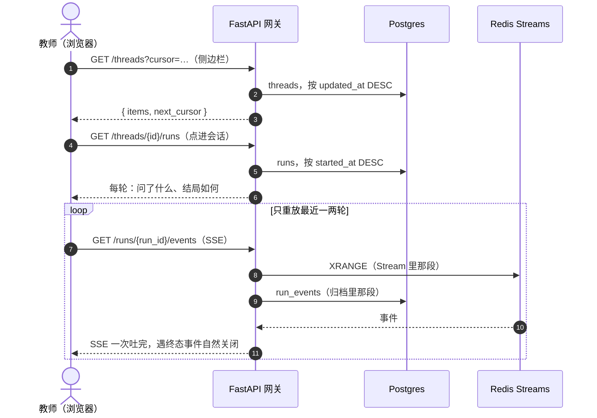

# P5 实施计划

| 项 | 值 |
|---|---|
| 文档状态 | **事后补写**（2026-08-11）—— 见下方说明 |
| 当前版本 | v0.1 |
| 作者 | hxy |
| 日期 | 2026-08-11 |
| 上游文档 | [总体架构设计](../01design/01architecture.md) · [P4 实施计划](./P4-plan.md) |

### 版本历史

| 版本 | 日期 | 修改人 | 说明 |
|---|---|---|---|
| v0.1 | 2026-08-11 | hxy | 初稿。**本期五个提交先落地、文档后补** —— 与前四期「先写计划再开工」的顺序相反，理由与代价见 §1.1 |

> **本文档的职责**：回答 **「P5 做了什么、为什么这么做、哪些还没做」**。
>
> **不回答**「组内角色为什么只有组主一层」（在 [ADR-0010](../01design/adr/0010-self-hosted-accounts-rbac.md)）、「产物为什么走 nginx 直发」（在 [P4 §2.1](./P4-plan.md)）、「会话历史的字段形状」（以 `/docs` 的 OpenAPI 为准）。本文只给相对链接，不复制正文。

---

## 1. P5 的边界

**目标**：把前端要调的接口补齐。前五期建的是能力，这一期建的是**这些能力的入口**。

六期一句话：**P0 回答「agent 好不好用」，P1 回答「不可信代码跑在这台机器上安不安全」，P2 回答「这台机器上的东西挂了会怎样」，P3 回答「谁在用、能用多少、人能不能插手」，P4 回答「出了问题怎么查、花了多少钱、产物放哪」，P5 回答「前端能不能开工」。**

### 1.1 与前四期最大的不同：这一期没有事前计划

[P0](./P0-plan.md) 到 [P4](./P4-plan.md) 都是先写计划、关闭待决、再开工。**本期五个提交是直接落地的，这份文档在当天收尾时补写。**

这不是可以推广的做法，但在这一期是有理由的：本期每一条都来自一个已经论证过的上游结论 —— [运行时设计 §5.7](../01design/05runtime-design.md) 的接口契约表逐行列着该有哪些端点，本期做的多数是**把表上已经定好的那几行实现出来**，未知不在方案而在细节。P4 那种「先要回答需不需要」的未知在这里不存在。

**代价是真实的，记在这里**：五个提交里有一次自我推翻（[§2.2](#22-上传从批量退回单文件本期内自我推翻) 上传批量→单文件，落地后隔 13 分钟就改回去），而事前把「一次选十个」的代价摆出来只要五分钟。**这正是事前计划要买的东西。**

### 1.2 做什么

| # | 提交 | 内容 |
|---|---|---|
| 1 | `08c2537` | **自助注册与课题组**：注册、管理员建号、组的三张表、邀请码入组、入组审批 |
| 2 | `3e21aca` | **会话工作目录的浏览与增删**：列结构、按行读、取字节、上传、删除 |
| 3 | `8cdd0e2` | **上传退回单文件**：撤掉上一个提交里为批量造出来的那套东西 |
| 4 | `5a1f9dc` | **会话列表/详情/改名/删除与聊天历史**，含首次提问后自动起标题 |
| 5 | `5d88a2e` | **修复事件过保留期后订阅永远挂着** |

规模：66 个文件，+6194 / -198 行；两次迁移（`0007_group`、`0008_thread_history`）；用例总数到 **1059 条**。

### 1.3 接口全景：本期之前 vs 之后

| 能力 | 本期之前 | 本期之后 |
|---|---|---|
| 账号 | 只有 `.env` 在空库时建的首个管理员，第二个账号要手工写 SQL | 三条来源定型：首个管理员（仅空库）、管理员建号（教师唯一来源）、自助注册（一律 student） |
| 课题组 | 没有 | 建组、浏览、名册、加人移人、邀请码注册、入组申请与审批 |
| 工作目录 | **不可见** —— 只够得到「某次 run 认领过的产物」 | 列结构、按行读、取字节、上传（可落子目录）、删除 |
| 会话 | 只有「建」与「提交分析」 | 列表、详情、改名/改配置、删除、**会话内的执行历史** |
| 聊天历史 | **做不到** —— 提问原文没落过库 | `runs.content` + 历史列表 + 事件重放两段拼起来 |

### 1.4 前几期已就位、本期不重做

- 认证、Session、多租户隔离过滤、配额与限流（[P3](./P3-plan.md)）—— 本期新增的每一条端点都直接挂在既有的路由器依赖上，**没有一句新的鉴权判断**：越权返 404 是仓储层过滤的副产品。
- 沙箱、broker 边界、磁盘配额（[P1](./P1-plan.md)）—— 工作目录那一族全部是发给 broker 的调用，api 进程一个字节都不碰宿主磁盘。
- 事件流、断线重放、归档（[P2](./P2-plan.md)）—— 聊天历史直接复用 `GET /runs/{id}/events`，没有另造一条「读历史」的路。

### 1.5 明确不做

| 不做的事 | 理由 | 由哪期偿还 |
|---|---|---|
| **前端 `frontend/`** | 本期做的正是它要调的接口。三个提交的结尾都写着「frontend/ 仍未开始」 | **P6** |
| **`p5.sh` 验收脚本** | 本期没有一条命令能跑完的验收 —— 与前四期都不同，**这是本期最该记的一笔债**，见 §4 | **P6，且应在写前端之前** |
| 教师自助换邀请码 | 泄露时只能让管理员重建组。真实频率未知，先不做 | 待观察 |
| 工作目录的重命名与新建目录 | 侧边栏第一版用不到 | 待观察 |
| 会话导出（PDF / Markdown） | 没有需求信号 | 待观察 |
| `runs.content` 的历史回填 | **回填不了**：本版之前的提问不存在于任何地方（checkpoint 里的 messages 是框架自建表，且不是业务真相源）。空值是遗留，不是待补的空缺 | 不偿还 |

---

## 2. 五处定案

### 2.1 推翻 ADR-0010 决策 4：引入 `groups.owner_id`

原文是「不引入组内角色」，改写为「**不引入组内角色表，但引入 `groups.owner_id` 一列**」。

触发它的正是该 ADR 自己列的重估条件 —— 「出现需要按组区分权限的实际需求」。原顾虑（权限判定从查 `role` 变成 `role × 组内身份`，复杂度翻倍）**没有发生**：判定仍是一次等值比较，组员之间也仍然没有级别差异。

**组是名册与准入，不改变任何数据可见性。** 组主看得到名册，看不到组员的会话与用量，[数据设计 §6.3](../01design/06data-design.md) 那张隔离表一行未改。这是本期最容易被顺手破掉的一条 —— 把「教师能看学生用量」加进来只要一个 `join`，而那条边界一旦开就收不回来。

### 2.2 上传：从批量退回单文件（本期内自我推翻）

`3e21aca` 把上传做成了批量（一次多个 `file` 字段，逐个带 `error`，允许部分成功）。`8cdd0e2` 撤回。

**撤回的理由是那套东西只为「一次选十个」存在**，而它带来两处复杂度：响应变成逐个带 `error` 的列表；以及「整批都失败时仍要给非 2xx」这条额外规定 —— 后者不是可有可无，不写的话 `acceptance.sh` 与 `p3.sh` 里 `curl -fsS` 那道「上传失败当场喊」的保险会哑掉。**而前端一个一个发同样做得到，还天然有逐个的进度与重试。**

保留了 `path` 一列：支持落子目录之后，`directory + filename` 拼不出真正落盘的那个（文件名会被收成末段），而前端要拿它去预览与下载。

### 2.3 删会话是软删除

`DELETE /threads/{id}` 只打 `threads.deleted_at` 标记，行留着；workspace 目录与沙箱**真删**。

硬删会撞上 `runs.thread_id` 的外键，而顺着删掉 `runs` 等于把成本账本挖掉一块 —— `runs` 是[数据设计 §6.5](../01design/06data-design.md) 明确「不清」的那张表。**教师删会话要的是「从我的列表里消失、别再占磁盘」**，两件事分别由标记与「broker 真删目录」负责，都不必动 `runs`。

放弃的替代方案：**级联删 `runs`**（账本出洞，成本看板的历史缺一段）、**拒绝删有 run 的会话**（教师删不掉任何用过的会话，等于这个功能不存在）。

代价：每条会话查询都要多带一个 `deleted_at IS NULL`。两个过滤条件（归属 + 未删）集中在仓储的一处 —— 各写各的迟早会漏掉一处，而漏掉的症状是「删了还在」。

### 2.4 `runs.content`：聊天历史的前提

在这一版之前提问只随任务消息走、跑完就没了，而**事件流里没有承载它的事件** —— 把一个 run 的事件全部重放一遍，重建出来的对话只有 agent 那一半。

迁移 `0008` 加 `runs.content`，提交时与队列消息一起写。两份不是冗余：队列那份跑完就没了，库里那份是聊天历史的用户那一侧。

**为什么不从 checkpoint 读**：那是 LangGraph 自建的表，结构随框架版本走，且它不是业务的真相源。

### 2.5 会话标题由辅助模型起，挂在响应之后

新建的会话标题是空的；第一次提问之后，网关挂一个响应之后的后台任务，用辅助模型跑一次概括写回 `threads.title`。教师随时可 `PATCH` 改掉，改过的不会被盖（生成那一侧写入前会再查一次）。

- **不让教师先起名**：那是一道横在「我想问个问题」前面的门槛，多数人会跳过它，于是侧边栏变成一排「未命名」。
- **挂在响应之后**：提交那条路要在几十毫秒内返回 202，而模型往返要几秒。
- **放在网关而不是 worker**：教师要的是提交完就看见侧边栏有了名字，而 worker 可能几分钟后才领到这条任务。代价是网关从此有了一个模型客户端 —— 它只做这一件事，与分析无关。
- **这次调用的 token 不计入配额、不进成本看板**：它不属于任何一个 run，且输入几十、输出十几个 token，相对一次分析的几万是千分之几。

---

## 3. 环境前提

```bash
# 两次迁移。api 容器启动时自己跑 alembic upgrade head，
# **不要在宿主机上手工跑** —— 那会把库推到新版本而旧容器还在跑，
# 症状只是 nginx 502（见 P4 §8 同类记录）
cd app && uv run alembic upgrade head    # 手工部署才需要

# 新增配置项，可不给（有默认值）
# UPLOAD_MAX_BYTE=67108864   # 与 deploy/nginx.conf 的 client_max_body_size 对齐
```

**没有新增的基础设施。** 本期不加任何 compose 服务 —— 这与 P1（gVisor）、P2（Postgres/Redis）、P4（MinIO + 可观测性四件套）都不同。

---

## 4. 验收标准：本期没有 `p5.sh`

**这是与前四期最大的差距，也是本期最该记的一笔债。**

前四期每期都留下一条命令能跑完的验收脚本，且逐级向下转调（`p4.sh` 等于把五期一起跑一遍）。本期没有。实际用到的验证方式是三层：

| 层 | 内容 | 结果 |
|---|---|---|
| 门禁 | `make all`（lint + 类型 + 测试） | **1059 条全绿** |
| 每个提交各自的真机验证 | 见 §8 各节 | 全部通过，并**照出两个门禁抓不到的缺陷** |
| 跨期回归 | 未跑 | **没跑** —— 见下 |

**为什么这是债而不是「不需要」**：[P3 §8.5](./P3-plan.md) 记着「本期改的接口打穿了三个历史验收脚本」，[P4 §8.13](./P4-plan.md) 记着「四条只会绿的判据」。本期改了 `UploadResponse` 的形状（两次）、给 `/threads` 加了单段路由、动了事件流的收尾条件 —— **每一条都有打穿历史脚本的形状**，而没有任何一次跨期重跑证明它们没有。

> 本期确实改到了一条历史判据：`/threads/{thread_id}` 这条单段路由让 broker 的 `GET /threads/metrics` 从 404 变成 405，把一条钉死状态码的用例打红了。判据已改成「那里取不到指标」而不是某个具体状态码 —— 405 与 404 在这里说的是同一件事。**这一条是被单测抓到的；跨期脚本那一层没有对应的保护。**

**补法（P6 开工前）**：至少补四条 —— 注册+入组+审批走通、工作目录五个端点走通、会话增删改查与历史走通、删会话之后目录真的没了。

> **2026-08-13 起补法变了，债本身没变。** 七个验收脚本已合并成
> [`deploy/test/verify.sh`](../../deploy/test/verify.sh) 一个文件，逐级转调那套没有了 ——
> 因此这四条不再是「新写一个 `p5.sh` 再转调 `p4.sh`」，而是**在那个文件里加一个 `p5` 组**，
> 判据编号 `P5①`–`P5④`，跟在 `p4` 那一组后面。跑整个文件即含跨期回归。
>
> **本次合并顺手把这笔债的一半上了保险**：合并前对着现有代码逐条核对过历史脚本依赖的
> 接口与事件契约（`entries[].path` / `is_dir`、`run.finished.data.tokens` 的两个字段、
> `POST /threads` 不收请求体、四种 `run.*` 事件类型、两条被 grep 的日志原文），
> 上面担心的三处改动**都没有打穿历史判据**。但这只是静态核对，**不能替代真跑一遍**。

---

## 5. 五个提交的实施记录

### 5.1 账号与课题组（`08c2537`）

账号来源就此定型为三条：`.env` 的首个管理员（仅空库）、管理员建号（**教师唯一的来源**）、自助注册（**一律 student** —— 能自选角色等于能自选配额档，而配额是 `teacher` 与 `student` 唯一的实质差别）。

注册填对邀请码即入组并可登录；不填则账号先停用等管理员激活。**两种「登不上」在库里都是 `is_active=false`，不另立枚举** —— 管理员对它们要做的是同一个动作，分开换不来任何决策差异。

**邀请码只出现在两处**：建组响应、组主自己的 `/groups/mine`。浏览列表对所有登录用户开放，码跟着它发出去就等于没有准入。有一条用例专门在整份响应文本里搜它。

迁移 `0007` 建三张表。两个不显然的地方：

- **待审批走条件唯一索引而不是普通唯一索引**：`(group_id, user_id)` 全表唯一的话，学生被否决之后就再也申请不了同一个组 —— 那是永久拉黑，不是本意。
- **批准与入组写在同一个事务里，且状态是条件 `UPDATE` 而不是「先读再写」**：两个标签页各点一次，第二次该是「已经处理过了」而不是把否决改成批准。

新增 78 条用例，另在真实进程上跑通 18 步端到端。

### 5.2 工作目录的浏览与增删（`3e21aca`）

此前教师只够得到「某次 run 认领过的产物」，工作目录本身不可见：上传的数据、agent 写的 `.py`、还没被认领的中间文件，一个都看不到。

**当时判断「产物与工作目录是两条路，不是重复」，这个判断在 2026-08-12 被推翻** —— 两条路取的是同一份字节，唯一的差别是删掉会话之后产物那条还能取到，而那正是要去掉的例外而不是要保的特性。产物存储整条撤掉，工作目录成为文件唯一的去处，`files/raw` 接手 nginx 直发。理由与实测见 [P4 计划 §9](./P4-plan.md)。

新增 `sandbox/browse.py`，**刻意不复用框架的 `read`**：

| 框架的做法 | 后果 | 本期的做法 |
|---|---|---|
| 按扩展名判文本/二进制 | `.pkl` 走文本分支然后解码失败 | 按内容判 |
| 整个文件读进内存再分页 | 教师点开一个 200MB 的 csv 就是 200MB | 只读开头 1 MiB |
| `glob` 不返回目录 | 空的 `outputs/` 在侧边栏里不存在 | 自己走树 |

还处理了「截断切在多字节字符中间」—— 否则中文文件会被整体误判成二进制。**符号链接一个都不列、也不走进去**：列进树里就等于把宿主文件摆上货架，而下一步就是可下载的。

路径安全收敛到 `Workspace._within` 一处，`artifact()` 改为复用它（根换成 `outputs/`）。越界与不存在对外一律 404 —— 分开回答等于把这几个端点变成探测宿主机文件的工具。指向目录则不必伪装（目录在树里本来就看得见），给 422。

`path` 一律走**查询参数**而非路径段：文件名带 `/` `#` `?` 与中文都是常事，塞进路径段要两侧各转义一遍，错一次就是一个打不开的文件。

**新增 `UPLOAD_MAX_BYTE`（默认 64 MiB）**：上传是整块进内存再 base64 的，此前没有任何闸 —— 直跑 uvicorn 时一次上传就能吃掉全部内存。

两个只有真机才看得到的数，已记进[运行时设计 §5.7](../01design/05runtime-design.md)：

| 观测 | 结果 | 含义 |
|---|---|---|
| 300 MiB 下载 | api 进程只涨 **1.6 MiB** | 流式成立 |
| 60 MiB 上传 | api 进程涨约 **78 MiB** | 上限即这块内存的上限，**不能随手调大** |
| 超限时 | 答话的是 nginx，413 正文是 HTML | 前端只能认状态码，不能解正文 |

新增 111 条用例，越权路径加进 `isolation_test` 那份逐条列全的清单。

### 5.3 上传退回单文件（`8cdd0e2`）

见 [§2.2](#22-上传从批量退回单文件本期内自我推翻)。

一条用例换了守的东西：一个请求里塞两个 `file` 时框架只取一个，**要守的不是「取哪个」而是「响应里的 `path` 与磁盘对得上」**—— 调用方按它去预览与下载，说的那个必须就是落盘的那个。

### 5.4 会话接口与聊天历史（`5a1f9dc`）

补齐[运行时设计 §5.7](../01design/05runtime-design.md) 契约表里 `/threads` 缺的四条，外加会话历史。

**聊天历史缺的不止一个接口**，这是本期挖得最深的一处：

1. `ix_runs_thread_started` 这条索引早就建好、注明用途是「会话内的执行历史」，**却没有任何查询用它**；
2. 更麻烦的是**教师的提问原文根本没落过库**（[§2.4](#24-runscontent聊天历史的前提)）。

补完之后，读一段历史是两次请求：



**不把事件塞进历史列表**：一轮实测 **1602 条**事件（814 token 增量 + 767 reasoning + 9 对工具调用/结果 + 3 个生命周期），打开会话会变成一次几 MB 的下载。前端因此只重放最近一两轮。

**同一条订阅端点既服务「正在跑」也服务「翻旧账」**：已终态的 run 会先补齐全部历史再自然收尾，前端不必写两套。

新增 `cursor.py` 收口两处游标分页的编解码。游标是**不透明**的 `(时间, 标识)` 复合值 —— 只用时间的话，同一微秒提交的两条会在翻页边界上互相顶掉；解析不了一律 422，不当成「从头开始」（那会让客户端收到一整页重复数据而看不出发生了什么）。

#### 两个只有真部署才照得出来的坑

门禁 1055 条全绿的情况下，真部署后标题一直是空的：

| # | 现象 | 真因 | 修法 |
|---|---|---|---|
| 1 | 标题恒为空，**每次都是 HTTP 200** | 辅助模型是**推理模型**，`max_tokens` 掐的是「推理 + 输出」的总和，而推理不会因为预算见底就收尾 —— 48 / 256 / 512 / 1024 四档全部把额度花光在 `reasoning_tokens` 上，`content` 一个字不剩 | 不设 `max_tokens`，止损改用超时 + 标题长度硬截断 |
| 2 | 标题要 18 秒才出现，日志里有一次 `Retrying request` | 15 秒超时会在真实长度的提问上把第一次调用掐掉，客户端接着重试 —— 白花一份 token | 放宽到 60 秒；改完一次调用 10 秒拿到结果 |

**第一个坑的定位方式值得记**：「模型答了但收拾出来是空的」这条路原来**一条日志都没有**，现场只剩一个空标题和一条 200 的访问日志。是打印了一次 `response_metadata` 原始数据才看见 `reasoning_tokens: 48 / completion_tokens: 48`。现在这条路会带上原始回答记 warning。

### 5.5 事件过保留期后订阅不再挂着（`5d88a2e`）

**这是回答「能不能加载出一个会话的所有对话记录」时发现的。**

答案本身分两层：

| 层 | 存哪 | 保留期 |
|---|---|---|
| 骨架（问了什么、结局、用量） | `runs` | **不清**，永久 |
| 过程（agent 的输出、工具、图） | `run_events` | **180 天** |

超过 180 天只剩骨架，这是有意的取舍（`run_events` 是全库最大的表）。但**超期之后的表现是坏的**：

真因在 `EventLog._ended` —— 事件全部过期之后，事件层面看到的是「一条都没有」，而这与「run 刚提交、worker 还没写第一条」**完全无法区分**。此前一律按后者处理（接着等），于是那条 SSE 永远不收尾，前端一直转圈且没有任何报错。

判据改取 `runs` 表里的状态：**那一行不随保留期清理，是事件没了之后唯一还答得出「它结束了没有」的东西**。SSE 端点把这个事实传给事件日志，不额外查库 —— 越权检查那一步已经把状态拿回来了。

> **只在「一条事件都没有」时用这个判据。** 不能拿它去短路「有事件但最后一条不是终态」那一支：执行器是先落库终态、再推终态事件的，中间那一瞬状态已经变了而事件还没到，收尾会把 `run.finished` 漏掉 —— 教师看到的是一次卡在最后一步的分析。这一条单独有测试钉住。

**在此之前这个缺陷碰不到**：没有任何接口能列出旧 run，所以没人点得到它们。是 `5a1f9dc` 的会话历史接口把它暴露到了主路径上。

**验证方式**（沿用[「先验证验证代码」](./P4-plan.md)那条教训）：把修复退回去跑那两条测试，**挂死被超时掐掉**（不是「恰好绿」）；恢复后 0.31s 通过。真实 compose 栈上清掉某个 run 在 Redis 与 `run_events` 两边的事件，订阅它 **0.055 秒返回空流**，而骨架层完好。

---

## 6. 与 P0–P4 的回归关系

| 期 | 本期是否触碰 | 说明 |
|---|---|---|
| P0（agent 主流程） | 否 | 提交分析那条路只多了一次 `touch` 与一个响应之后的后台任务 |
| P1（沙箱与配额） | **是** | 新增 `DELETE /threads/{id}` 要销毁容器并删目录。XFS project 配额记录**不清** —— projid 由 `thread_id` 确定性派生，uuid 不会重来，那条记录既不会被复用也不会挡住谁 |
| P2（事件流与恢复） | **是** | `5d88a2e` 改了 `follow` 的收尾条件。新增参数默认 `False` 即老行为，既有调用方不受影响 |
| P3（认证隔离与配额） | **是** | 新增的每条端点都挂在既有依赖上；越权路径已逐条加进 `isolation_test` 的清单 |
| P4（可观测性与产物） | 否 | 未动埋点与产物路径。工作目录与产物是两条路，见 §5.2 |

**未跑跨期验收脚本** —— 见 §4。

---

## 7. 待决事项

| # | 事项 | 现状 |
|---|---|---|
| 1 | **`p5.sh` 验收脚本** | **未做**。P6 开工前应补，见 §4 |
| 2 | 前端 `frontend/` | 未开始。本期做的正是它要调的接口 |
| 3 | 教师自助换邀请码 | 未做，泄露时只能让管理员重建组 |
| 4 | 会话导出 | 无需求信号 |
| 5 | `threads(user_id, updated_at DESC)` 是否要改成带 `deleted_at` 的部分索引 | 未做。软删除之后每条查询多一个 `IS NULL`，当前数据量下不构成问题；**重估触发条件**：单用户会话数上千 |
| 6 | 标题生成失败没有重试 | 有意如此 —— 起不出来就留空，前端回落到时间显示。若实测失败率高再议 |

---

## 8. 本期结论

**五个提交把「前端要调的接口」这条线补齐了**：账号能自助进来、工作目录看得见、会话管得了也翻得到。1059 条用例全绿，两次迁移已在真实 compose 栈上验证。

**两件事必须带进下一期**：

1. **`p5.sh` 这笔债**。本期改到的三处（上传响应形状、`/threads` 单段路由、事件流收尾条件）每一处都有打穿历史脚本的形状，而没有任何跨期重跑证明它们没有。
2. **「门禁全绿但产物为零」又出现了一次**（会话标题）。这已经是第 N 次同一形状的故障 —— 调用返回成功、日志全绿、东西没出来，且没有一条报错指向原因。本期的修法是给那条静默路径补了日志；**更普遍的做法是每加一条「后台任务」就问一句「它失败时谁会知道」**。
