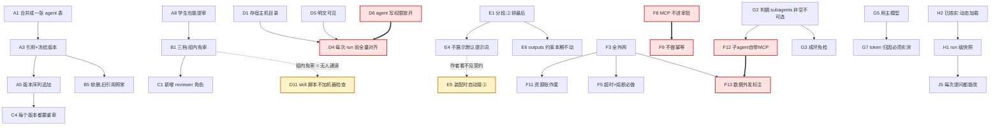

# P6 决策文档：智能体配置与平台能力目录

| 项 | 值 |
|---|---|
| 文档状态 | **全部定案**（68 条，2026-08-13 当日逐组问完） |
| 当前版本 | v0.3 |
| 作者 | hxy |
| 日期 | 2026-08-13 |
| 下游文档 | [P6-plan.md](./P6-plan.md)（2026-08-14 定稿）· [P7-plan.md](./P7-plan.md)（2026-08-14 定稿）· [P8-plan.md](./P8-plan.md)（2026-08-14 定稿，**它的 §2.1 更正了 H2 的一句话**）· P9-plan.md ~ P10-plan.md（按 §9 的 L1 分期，尚未撰写） |
| 上游文档 | [第三方接入规范](../01design/04extension-integration.md) · [智能体设计](../01design/03agent-design.md) · [数据设计](../01design/06data-design.md) · [P5 实施计划](./P5-plan.md) |

### 版本历史

| 版本 | 日期 | 修改人 | 说明 |
|---|---|---|---|
| v0.3 | 2026-08-14 | Codex | 修正 J2：原生 `EventSource` 无法让应用显式控制 `Last-Event-ID` header，改用 `@microsoft/fetch-event-source`；定明同页断线持游标续读、整页刷新无游标从头重放 |
| v0.2 | 2026-08-13 | hxy | **全部定案**。逐组问答收敛，条目从 62 增至 68（新增 F13 数据外发、E6 outputs 约束、F0 全外网连带后果，G3 由 G2 的判据自动关闭）。**14 条与初稿建议相反**，每条记了接受的代价 |
| v0.1 | 2026-08-13 | hxy | 初稿。**穷尽列出 P6 开工前必须拍板的 62 条决策**，每条给选项、代价与建议，不预设答案 |

> **三处结论与需求原文不同，先在这里列出来**，正文各有出处：
>
> | 需求原文 | 定案 | 出处 |
> |---|---|---|
> | 「上传的智能体分成两类，一类提示词，一类服务器部署 agent」 | **只有一类**。部署型 agent 概念整条砍掉 | A7 |
> | 「自定义提示词追加在默认之后」 | **分段替换**，用户只覆盖①角色段，②环境契约排最后 | E1 |
> | 「用户可以配置 mcp」 | **只能从已放行目录勾选**，且 MCP 一律是外网服务、平台不本地部署 | F1 · F3 |

> **本文档的职责**：回答 **「开工之前有哪些事没定，每件事的选项与代价分别是什么」**。
>
> **不回答**「怎么实现」（那是 P6-plan.md 的 §5 任务分解）、「事件契约长什么样」（在[运行时设计 §5.2](../01design/05runtime-design.md)）、「第三方服务该怎么交付」（在[第三方接入规范 §5](../01design/04extension-integration.md)）。
>
> **与前五期的顺序不同**：P0–P4 是「先写计划再开工」，P5 是「先开工后补文档」（[P5 §1.1](./P5-plan.md) 记着它的代价）。本期的未知**不在实现细节而在需求形状本身** —— 62 条里有 11 条会改数据库表结构，定错了要付迁移的代价。因此先出决策文档，再出实施计划。

---

## 1. 为什么需要这份文档

### 1.1 需求已经提出，但它落到这套代码上有四处硬冲突

2026-08-13 提出的需求是六条：用户可上传 skill 并控制共享、可自定义系统提示词、可配置 MCP、可为一次 run 挂子智能体；平台可上传两类智能体、支持场景智能体（= 一份配置）。

代码现状与它有四处直接冲突，每一处都不是「多写点代码」能绕过的：

| # | 冲突 | 证据 |
|---|---|---|
| 1 | **skill 读不到**。DeepAgents 的 `SkillsMiddleware` 经 backend 读 `SKILL.md`，而本平台 backend 的根是会话 workspace，`/workspace` 之外的路径被 `PathEscapeError` 拒掉 | `app/sandbox/path.py`、`deepagents/graph.py:818` |
| 2 | **用户自填 MCP 与自家规范冲突**。MCP 工具跑在 worker 事件循环里，一次同步阻塞卡住全平台；而规范要求 13 项交付物 + 代码通读 + 隔离试跑 | [接入规范 §3.1、§5.4](../01design/04extension-integration.md) |
| 3 | **「独立部署 agent」按规范是不建议接入的形式 F**，它同时绕过沙箱、事件流、配额、多租户隔离四项 | [接入规范 §2.5](../01design/04extension-integration.md) |
| 4 | **子智能体的事件路径从未被真实数据验证过**。`_map_path` 的注释自己写着「实测 ns 全程为空，这条剥离逻辑没有真实子图样本验证过」 | `app/event/mapper.py:186-194` |

### 1.2 一个必须先看清的事实：`agent_config` 是个黑洞

`threads.agent_config` 这个 JSONB 从 2026-08-08 的 `0003_user_thread` 就存在，`PATCH /api/threads/{id}` 能写进去，`GET` 能读出来，测试也覆盖了它 —— **但装配层从来没有读过它一次**。`app/agent/factory.py` 里 `create_deep_agent` 的 `system_prompt` 是硬编码常量。

这正是[「真实验收抓单测抓不到的」](../../CLAUDE.md)那类形态：全绿、接口 200、字段存得进去，而它对行为的影响是零。**本期最大的风险不是做不出来，是做出一堆同样写得进去、读不出来的配置。** §11 的验收口径全部按「配与不配，输出可见地不同」写，理由在此。

### 1.3 怎么读这份文档

每条的标题上写着 **定案：X**，正文保留原来的选项与代价 —— **被否掉的那些选项不是废话，它们是「为什么不选那条路」的记录**（[文档规范](../../.claude/document.md)：选了什么、为什么、放弃了哪个替代方案，三样都要留痕）。

**14 条定案与初稿建议相反**，每一条都在正文里写明了「接受的代价是什么」。这些是最该重读的：A5、A8、B2、B4、C1、D5、D6、D10、E1、E4、F2、F3、F6、F12、G5、H2、J1、J5、K1。

**三处组合风险**在正文里用 ⚠️ 标出 —— 单看每条定案都成立，组合起来会咬人：

| # | 组合 | 出处 |
|---|---|---|
| 1 | D5 明文可见 + D6 写权限放开 → **D4 的对齐必须是全量 hash 覆盖，不能只补缺失** | D4 · D6 |
| 2 | F8 不拦截 + F9 不做幂等 + 带写操作的 MCP → **崩溃恢复重复写，无人拦截** | F9 |
| 3 | F12 子智能体自带 MCP + F13 数据外发 → **你的数据发给了你没同意过的服务** | F12 |

**四处「必须实测、不能推断」**（全部集中在 P9）：G6 嵌套事件的真实 `ns` 形状、G7 子图 token 是否带得上来、G8 嵌套中断能否被 `aget_state` 查到、G9 子图的 `recursion_limit` 是各自计数还是共享父图。

---

## 2. A 组：领域模型与实体（8 条）—— **全组已定案（2026-08-13）**

> 这一组决定建几张表。**全组是后面所有事情的前提。**
>
> **定案汇总**：合并成一张 `agent` 表；配置存引用 + 发布即冻结版本；发布是**版本序列追加**（不是草稿/线上两行）；广场与「我的」分两个端点；**「独立部署 agent」这个概念整条砍掉**；学生与教师权限相同。

### A1 「场景」与「智能体」是不是同一个东西 —— **定案：合并成一张表**

前端现在有四个并列入口（场景库 / 智能体广场 / Skills 库 / MCP 库）与三个「我的」页面。但看数据形状：一个场景是 `{prompt, skills[], mcp[]}`，一个 prompt 智能体是 `{prompt}` —— **后者是前者的退化情况**。

| 选项 | 代价 |
|---|---|
| **a. 合并成一张表**，用展示分类区分 | 前端两个入口读同一族端点，需要一个 `kind` 或标签字段；「我的场景」与「我的智能体」的区别要在 UI 上重新讲清楚 |
| b. 两张表、两套 CRUD + 审核 + 发布 | 几乎一样的代码写两遍；「场景和智能体有什么区别」这个问题要能回答得出，否则用户会一直问 |
| c. 场景是智能体的**组合**（场景引用多个智能体） | 概念上最清楚，但与前端现状差最远，且引出「场景里的智能体是不是子智能体」这个新问题 |

**建议：a。** 判据很简单 —— 如果你能用一句话说清「场景和智能体对用户的区别」，就选 b；说不清就选 a。我目前说不清。

**阻塞**：A2–A8、B 组全部、C 组全部、K1。

### A2 实体叫什么名字 —— **定案：`agent`**

> **随之而来的一件事**：`app/agent/` 现在是**装配层**（`factory.py` + `prompt.py`）。把仓储塞进同一个包会让它同时承担两个职责，违反[技术宪法第三条](../../.claude/python-constitution.md)。装配层留在 `app/agent/`，新的实体与仓储另起一个包（如 `app/preset/`）或在 `app/agent/` 下分文件 —— 这一处留给 P6-plan 定，不阻塞表结构。

若 A1 选 a，这个实体在库里叫什么。备选：`agent` / `scenario` / `agent_config` / `preset`。

**建议：`agent`**，模块与表名单数（[风格指南](../../.claude/python-style.md)）。「场景」保留为前端展示词，不进代码。

**阻塞**：K1 迁移。

### A3 配置是**引用**还是**快照** —— **定案：引用 + 发布即冻结版本**

会话挂了 agent X，X 引用了 skill S。作者随后改了 S 的内容。

| 选项 | 后果 |
|---|---|
| **a. 引用**（存 id） | 历史会话的行为会随作者改动而变；重放一次旧 run 得到的可能不是当时的东西 |
| b. 快照（存内容副本） | 历史可复现；但作者修 bug 后已有会话不会受益，且 skill 字节要复制 N 份 |
| c. 引用 + 版本号（存 `skill_id@version`） | 两者都要，代价是要做版本 |

**建议：c，但版本只做「发布即冻结一个版本号」这一层**，不做分支与回滚。理由：事件日志是不可变的（[ADR-0013](../01design/adr/0013-event-anticorruption-layer-v2-stream.md) 的同一条精神），配置若可变，一次 run 的「当时用了什么」就永远说不清 —— 而这正是出事时第一个要问的问题。

**阻塞**：A4、A5、D8、K1。

### A4 前端卡片上的 `v1.2` 是真版本还是装饰 —— **定案：真版本**（随 A3）

`AgentPlaza` / `AgentScenarios` 的卡片都渲染了版本号。若 A3 选 a，这个字段就是假的。

**建议**：跟 A3 走。选 c 则是真版本，选 a 则**把这个 UI 元素删掉** —— 一个永远显示 v1.0 的版本号比没有更糟。

### A5 「发布到广场」是打标记还是复制一行 —— **定案：版本序列追加**

原选项给的是「打标记 / 草稿+线上两行」，**定案取的是比两者都更严的第三种**：每次发布**追加一个新版本行**，旧版本行原样保留，**已有引用继续指向它们各自冻结的那个版本**。

```
agent_version 表（追加，不原地改）
  a1@v1  status=published   ← 李老师的 agent_config 存的是 a1@v1，永远读这行
  a1@v2  status=published   ← 张老师改完并通过审核后追加，广场展示最新的这行
  a1@v3  status=draft       ← 正在改的那份，谁都读不到
```

这一条同时满足三件事：改动不影响既有调用（用户原话）、历史 run 说得清当时用了什么（A3）、审核真的拦住每一次变更（C4）。

**代价与一个观察项**：版本行只增不减。一个 agent 的版本数不会很多，因此**本期不做清理**；但要在 P6 的观察项里量一次「三个月后平均每个 agent 有几个版本」，超出预期再谈回收。**清理的判据必须是「没有任何引用指向它」，不能是「太旧了」** —— 那正是 B5 的同一条判据。

### A6 用户端与广场端是同一族端点吗 —— **定案：两个端点**

`GET /api/agents`（广场，只看已发布）与 `GET /api/agents/mine`（我的，看全部状态）是两个端点还是一个带过滤参数的端点。

**建议**：两个端点。理由与 `admin.py` 的模块 docstring 同一条 —— 「对别人的操作」与「对自己的操作」不共用端点，共用的那一刻越权判断就要靠参数而不是路由。

### A7 「独立部署 agent」在数据模型里是什么 —— **定案：概念整条砍掉，MCP 保留为工具目录**

**比原来三个选项都更彻底**：不是「换个位置放」，而是**这个概念在平台上不再存在**。需求原文「上传的智能体分成两类」**变成只有一类**（提示词类）。

MCP 不受影响 —— 它是「平台接一组工具」，与「别人上传一个智能体」是两件事，边界见 F 组。

**因此要删的前端**（这些现在都是 mock，删掉不影响任何真实功能）：

| 文件 | 删什么 |
|---|---|
| `CreateAgent.tsx` | 整个类型二选一（`AgentType`、`TypeOption` 两张卡、`deployed` 分支的联系人列表与「给负责人带句话」） |
| `MyAgents.tsx` | `type: 'deployed'`、`isDeploying`、「独立部署」与「部署中」两个徽章、「等待后台部署完成」文案 |
| `AdminAgents.tsx` | `type` 列、`deployed` 的「部署需求说明」分支 |
| `AgentPlaza.tsx` | `kind: '独立部署 MCP'` 徽章与相关卡片分支 |

需求说它「通过 mcp 配置上传调用」—— 那它本来就**不是 agent，是一个 MCP server**。

| 选项 | 后果 |
|---|---|
| a. 存在 `agent` 表，`kind='deployed'`，内部指向一个 mcp_server | 广场上两类卡片并列（与前端现状一致），但详情页、调用路径、事件渲染要写两套 |
| **b. 只存在 `mcp_server` 表**，不出现在智能体广场 | 与[接入规范 §2.5](../01design/04extension-integration.md)一致；代价是要改前端的信息架构，`CreateAgent` 的类型二选一要改掉 |
| c. 存在 `agent` 表但只是一张「登记卡」（联系人 + 部署说明），不可调用 | 与前端现在的实现最接近（现在就是发邮件 + 留言），但用户会问「创建了却不能用是什么意思」 |

**建议：b。** 理由：形式 F 绕过四项核心能力这件事不会因为换个 UI 位置而改变；而把它放在 MCP 库里，[接入规范 §5.4](../01design/04extension-integration.md) 的 13 项交付物与审核流程自然就套上了。

**阻塞**：F 组全部、J4 信息架构。

### A8 学生能不能创建 agent / 上传 skill —— **定案：都能建、都能提审**（不按角色区分）

**这条与我的建议相反，采纳的是「完全平权」。** 代价要记在案：[接入规范 §7 问题 1](../01design/04extension-integration.md) 点出的「单人维护下审核会成为瓶颈」这个风险由此**被接受而不是被规避**。

**因此 C 组必须配一个减压机制**，否则这条定案会在第一个学期就撞墙。候选（在 C1 决定）：管理员之外让组主分担审核、或按可见性分级（组内共享免审、只有推平台目录才审）。

现有角色三档：`admin` / `teacher` / `student`，唯一实质差别是配额档（[schema.py](../../app/api/schema.py) 的 `RegisterRequest` docstring）。

| 选项 | 后果 |
|---|---|
| a. 都能，但只有教师能提交发布审核 | 审核量可控，学生也能自用 |
| b. 只有教师能 | 学生在这个平台上就只剩「提问」一个动作 |
| c. 都能，都能提交审核 | 审核量取决于学生人数，单人维护会成为瓶颈（[接入规范 §7 问题 1](../01design/04extension-integration.md) 已经点出这个风险） |

**建议：a。**

---

## 3. B 组：可见性与共享（7 条）—— **全组已定案（2026-08-13）**

> 需求原文是「控制 skill 是否开放共享」。**「共享」至少有四种含义**，选哪种决定表结构。
>
> **定案汇总**：三档（私有 / 组内 / 平台目录）；**可同时共享给多个组**；内容全部可见；软删；引用不需作者授权；上架时勾选确认责任。

### B1 可见性有几档 —— **定案：三档（私有 / 组内 / 平台目录）**

**组内共享免审，推平台目录才走审核。** 这是 A8「所有人都能提审」之后唯一的减压阀 —— 没有它，一个班的学生同时提审就能把单人维护埋掉。它同时给了 P5 建的三张组表第一个真实用途。

**砍掉的是「全院可见但不经审核」这个中间态** —— 全校都搜得到却没经任何检查，是四档方案里最难解释的一档。

| 档 | 含义 | 依赖 |
|---|---|---|
| 私有 | 只有作者 | 无 |
| 组内 | 作者所在课题组的成员 | `groups` / `user_groups` —— **P5 已经建好了**，[接入规范 §6](../01design/04extension-integration.md) 里「P3 定案不建」那句已过时 |
| 全院 | 所有登录用户 | 无 |
| 平台目录 | 审核后上架，出现在广场 / Skills 库 / MCP 库 | 审核流程（C 组） |

前端 `MySkills` / `MyAgents` / `MyScenarios` 画的都是 **已创建 → 待审核 → 已发布** 三态，即「私有 + 平台目录」两档，**没有组内**。

| 选项 | 代价 |
|---|---|
| a. 两档（私有 / 平台目录），与前端现状一致 | 最省事；但「共享给我课题组的三个学生」这个最常见的需求做不到，只能走全院审核 |
| **b. 四档全上** | 表要加 `visibility` + `group_id`；每个列表端点的过滤条件变复杂；前端三个页面的状态机要重画 |
| c. 三档（私有 / 组内 / 平台目录），砍掉「全院不审核」 | 「全院可见但没人审过」确实是个危险的中间态 |

**建议：c。** 理由：组内共享是课题组这层结构存在的唯一理由（P5 建了三张表，目前它们除了邀请码注册之外没有任何用武之地）；而「全院」若不经审核，等于给了一条绕过审核的公开路径。

**阻塞**：B2–B6、C1、K1。

### B2 一个资源能不能同时共享给多个组 —— **定案：能选多个组**

**与建议相反，代价记在这里**：要多一张 `resource_group` 关联表（`resource_kind` + `resource_id` + `group_id`），且**「我能看见哪些」这个查询从单列过滤变成 JOIN** —— 它出现在每一个列表端点上，是本期被调用最频繁的一条查询。

**因此 K1 的迁移要多建一张表**，且列表端点的越权过滤必须落在仓储层（与 P3/P5 一致：越权返 404 是过滤的副产品，不是端点里的判断）。跨组合作的老师不必传两份，这是买到的东西。

原建议（单列 `group_id`，不够用再迁移）被否，理由见上一句。

### B3 谁能把东西推到平台目录 —— **定案：所有人**（由 A8 决定，不单独决策）

### B4 引用者能不能看到被引用资源的**内容** —— **定案：全部可见**

`AgentPlaza` 的详情抽屉现在**直接渲染系统提示词全文**，`CapabilityLibraries` 的 skill 详情**直接渲染整棵文件树与文件内容**。这是作者的核心资产。

| 选项 | 后果 |
|---|---|
| a. 全部可见（前端现状） | 「共享」等于「开源」。老师可能因此不愿意共享 |
| b. 只可用不可见（只给名称 + 描述 + 输入要求） | 与「工具描述是给 LLM 读的」不冲突；但用户没法判断这个 agent 靠不靠谱 |
| **c. 作者自选** | 多一个字段，UI 多一个开关 |

**定案：a，全部可见**（保持前端现状，不加开关）。

**与建议相反（我建议作者自选），接受的风险要写明**：共享 = 开源。老师若介意提示词被抄走，唯一的选择是不共享。

**这是本期最该在真实用户身上验的一个假设** —— 它是产品判断不是技术判断，而错了的信号是安静的：不会有人来说「因为看得见所以我不传了」，只会是共享数量一直上不来。**列为 P6 观察项**：第一批老师里有几个把东西设成了私有、问一句为什么。

### B5 被引用的资源下线 / 删除时怎么办 —— **定案：软删（新引用不了，旧引用照常）**

A 的 skill 被 20 个人的 agent 引用着，A 点了删除。

| 选项 | 后果 |
|---|---|
| a. 硬删，引用方下次跑就失败 | 教师看到一次莫名其妙的失败 |
| b. 禁止删除（有引用时只能下线） | 引用计数要维护；作者会问「为什么删不掉」 |
| **c. 软删 + 快照兜底**（A3 选 c 时，已引用的版本仍可用，新引用不可） | 与 A3 的版本口径一致，代价最小 |

**建议：c。** 跟 A3 走。

### B6 引用别人的东西要不要作者同意 —— **定案：不要**

已上架 = 已同意。加一道授权 = 加一个待办队列，而平台没有任何用户侧通知通道（C6），这个队列会没人处理。

### B7 共享资源出问题时的责任边界 —— **定案：照抄接入规范 §4，且上架时勾选确认**

[接入规范 §4](../01design/04extension-integration.md) 已经为形式 C/D 写了责任边界（作者负责内容正确性与维护，平台负责编排、资源限制与故障隔离，连续失败平台有权停用并通知作者）。**skill 与 prompt 类 agent 此前没有对应条款，本条把同一套套上去。**

上架前弹一个勾选框确认这三点。**这不是法律文书，是把预期讲在前面** —— 学院内部平台上，出事时「我不知道有这个规矩」是个成立的说法，一个勾选框把它挡掉。**上架时间与勾选记录一并落库**（B7 与 C2 的审核记录同一张表即可）。

---

## 4. C 组：审核（6 条）—— **全组已定案（2026-08-13）**

> **定案汇总**：新增 `reviewer` 角色；一张 `review` 表；拒绝理由必填且后端校验；每个新版本都要过审（随 A5）；待审期间作者可自用；结果只做站内展示。

### C1 谁审 —— **定案：新增 `reviewer` 角色**

**与建议相反（我建议复用 `admin`），但采纳的理由更强**：`admin` 是个捆绑角色 —— 它同时拿到建号、停用账号、看全平台成本看板的权限。为了分担审核而多开几个 `admin`，等于把这三样一起发出去，而实际只想给「看内容、点通过或拒绝」。

**这是对 [ADR-0010](../01design/adr/0010-self-hosted-accounts-rbac.md) 的一次修正** —— 那份 ADR 刻意只定了三个角色。修正的理由要写进 P6-plan：**A8 定了所有人都能提审，审核因此从「偶发的管理动作」变成「持续的日常工作」，而日常工作不该要求最高权限。**

**成本比预估低得多**：`user/model.py` 的 `role_column()` 用的是 `native_enum=False` —— 库里存的是 varchar 而不是 Postgres 原生枚举类型，**加一个角色值不需要任何迁移**。要改的只有三处：`UserRole` 枚举、`api/security.py` 的权限依赖（新增一个 `ReviewerUser`，且 `admin` 应当同时满足它）、前端 `AdminGuard` 的判断。

**边界要写清**：`reviewer` **只能**看审核队列与通过/拒绝，**不能**建号、停用账号、看成本看板。这条边界与 `api/route/admin.py` 模块 docstring 里那条「成本看板只出数字不出内容」是同一种性质的约束 —— 一旦让 `reviewer` 顺手多拿一样，这个角色就退化成 `admin` 的别名。

### C2 三类资源（agent / skill / mcp）是三个队列还是一个 —— **定案：一张 `review` 表**

B7 的责任勾选记录也落这张表（勾选人、勾选时间），不另建。

前端已经画成三个页面（`AdminAgents` / `AdminCapabilities` 的 skill 与 mcp 两个变体）。

**建议**：库里一张 `review` 表（带 `target_kind` + `target_id`），端点按 kind 过滤，前端仍是三个页面。理由：审核记录的字段（提交人、时间、审核人、结论、理由）三类完全一样，建三张表是重复。

### C3 拒绝理由必填吗 —— **定案：必填，后端也校验**

前端 `AdminAgents` 已经实现了「拒绝时必填 + 空值红框报错」。

**建议**：必填，后端也校验。前端已有的行为不要靠前端单方面保证。

### C4 已上架的东西被编辑后，要不要重新审核 —— **定案：要**（由 A5 的版本序列决定，不单独决策）

A5 定了每次发布追加一个新版本行，每个新版本都要经审核才能被广场读到。作者改一个错别字也要重审 —— 这是版本序列换来的代价，接受。

| 选项 | 代价 |
|---|---|
| **a. 要**（编辑草稿 → 重新提交 → 审核通过后替换线上） | 与 A5 的「复制一行」直接配套；作者改一个错别字也要重审 |
| b. 不要（直接改线上） | 审核形同虚设 —— 通过审核后随便改，等于没审 |
| c. 只有提示词 / skill 文件变了才要重审，改名改描述不用 | 更合理，但要判断「什么算实质变更」 |

**建议：a。** c 更合理但引入了一个需要精确定义的判断，而这个判断错了是静默的。

### C5 待审核期间作者能不能自用 —— **定案：能**

审核管的是「别人能不能看见」，不是「作者能不能用」。

### C6 审核结果怎么通知作者 —— **定案：只做站内展示**

前端 `MyAgents` 已经画好了 `rejectedReason` 的红框展示与「修改后重新提交」按钮，后端只需在列表里带上 `rejected_reason` 字段。

**不为用户通知接任何外部通道**（邮件 / 短信 / 飞书）。平台目前没有任何用户侧通知路径，为这一件事建一条不划算；且飞书那条路要先存每个用户的飞书 ID，那是一条新的用户资料采集路径。

> **⚠️ 不要把这一条误读成「撤掉飞书」。** 平台上有两条完全不同的通知：
>
> | | 给谁 | 状态 |
> |---|---|---|
> | **运维告警**（服务挂了、错误率飙升） | 管理员 | ~~已接飞书并验收过（P4 §8.8）~~ **2026-08-13 随 Grafana 一并撤除，现在没有任何告警通道** |
> | **审核结果通知**（拒绝了） | 作者 | 从来没有过，本期也不做，只做站内展示 |
>
> **本条的定案不受影响** —— 它说的是「不为用户通知接外部通道」，撤掉运维告警是另一个决定（2026-08-13 做出的），两者互不依赖。**但 F5 依赖那条通道，见下方修订。**

---

## 5. D 组：Skill（13 条）—— **全组已定案（2026-08-13）**

> 这一组条目最多，因为它是四条需求里**唯一与沙箱物理约束正面冲突**的一条。
>
> **定案汇总**：字节存宿主机目录（broker 持有）；ZIP 与单 md 都收；校验按下方八条规则；**每次 run 开跑前全量对齐文件并重新加载 metadata**；物化到明文 `/workspace/skill/`，用户看得见；agent 的写权限完全放开；不单独管配额；同会话重名在配置时拦住；展示名只用 frontmatter，首版 `name` 冻结；不加机器检查；不做 `allowed_tools`；不预置平台 skill。

### D1 skill 的字节存在哪 —— **定案：宿主机目录，broker 持有**

| 选项 | 代价 |
|---|---|
| a. Postgres（`bytea` 或大对象） | 备份与事务一体；但库里塞二进制，且每次物化都要一次全量读 |
| b. 宿主机一个 skill 仓库目录（如 `data/skill/`），由 broker 持有 | 与 workspace 同一套心智（broker 是唯一碰宿主磁盘的进程）；备份要单独考虑 |
| c. MinIO | **它已经在 compose 里**，但 `0009_drop_artifacts`（2026-08-12）刚刚把应用侧对它的依赖整条撤掉，注释明写「MinIO 只剩 Tempo 与 Loki 两个用户了」。选它等于当月推翻一次决策 |

**建议：b。** 理由：skill 最终一定要变成沙箱文件系统里的目录（D4），而唯一能往那里写的进程是 broker。存在 broker 够得着的地方，物化就是一次 `cp`；存在 Postgres 或 MinIO，物化要多一次跨进程搬运。

**阻塞**：D4、D5、K1。

### D2 上传格式 —— **定案：ZIP 与单个 `.md` 都收**

P8 已让前端 `MySkills` 同时支持 ZIP 与单个 `.md`：直传的 `.md` 由后端自动包装成一个只含 `SKILL.md` 的目录。

理由：[接入规范 §2.4](../01design/04extension-integration.md) 的「形式 A 知识包」本来就是一两页 Markdown，且它被排在第一位（「成本最低、风险为零、见效最快」）。逼老师为一个 md 打个 zip 是纯摩擦。

### D3 校验清单与阈值 —— **定案：按下表全部实现**

前端已经把话说出去了：「解压后不超过 5 MB；仅允许文本与代码类附件」「校验路径穿越、符号链接、文件数量、压缩比和文件类型」。**这些现在一条都没实现。**

要定的阈值：

| 项 | 建议初值 | 说明 |
|---|---|---|
| 解压后总大小 | 5 MB | 前端已写 |
| 文件数上限 | 100 | 防 zip 炸弹的第二道 |
| 压缩比上限 | 100:1 | 第一道 |
| 单文件大小 | 1 MB | |
| 允许扩展名 | `.md` `.txt` `.html` `.py` `.csv` `.json` `.yaml` `.toml` | 白名单而非黑名单；`.html` 用于 Skill 自带的静态评审页与报告模板 |
| 符号链接 | 一律拒绝 | |
| 路径穿越（`..`、绝对路径） | 一律拒绝 | |
| frontmatter `name` | 1–64 位小写字母数字与连字符，且等于 ZIP 根目录名 | P8 补齐；避免 LLM 标识、物化目录与快照名字分叉 |

**建议**：全部实现，阈值定义为模块顶部常量（[技术宪法第二条](../../.claude/python-constitution.md)禁止硬编码）。这几条不是可选项 —— 上传的是别人会加载进自己沙箱的东西。

### D4 什么时候物化进 workspace —— **定案：每次 run 开跑前对齐，且必须是全量覆盖**

> **⚠️ 实现约束（由 D6 推出，不可省）**：对齐**必须按内容 hash 逐文件比对并覆盖**，不能只做「缺的补上」。
>
> D6 定了 agent 对 skill 目录有完整写权限，D5 定了用户也能在侧边栏里改删。因此每次 run 开跑时，`/workspace/skill/` 里的文件**可能被改过而不是只可能缺失**。只补缺失的话，一个被 agent 改坏的 skill 会一直坏下去 —— 而它坏掉的方式是静默的：文件在、名字对、内容不对，agent 照读不误。

`SkillsMiddleware` 经 backend 读文件，而 backend 根是会话 workspace。所以 skill 必须先落到 workspace 里。

> **P8 实施补充**：这里的“对齐”分成两层，不能混为一件事。Broker 负责按内容 hash **全量对齐文件**；`ReloadingSkillsMiddleware` 负责在每次 run 前移除 checkpoint 里的旧 `skills_metadata` 并**重新加载 metadata**。只做前者时，官方中间件会被 checkpoint 中已经存在的 metadata 短路，文件虽已更新，模型仍看见旧清单。

| 选项 | 代价 |
|---|---|
| a. 建会话时一次 | 最省；但配置中途改了就不生效，会变成一个「改了没反应」的静默故障 |
| **b. 每次 run 开跑前对齐**（缺的补、多的删） | 每次多一次 broker 调用（毫秒级，沙箱申请本来就要几秒）；配置改动立刻生效 |
| c. 配置变更时触发 | 要处理「变更时会话正在跑」 |

**建议：b。** 理由：a 的失败方式是静默的，而这个平台已经被静默失败咬过太多次（[「先验证验证代码」](../../CLAUDE.md)）。

**阻塞**：D5、D8、H1。

### D5 物化到哪个路径，用户看不看得见 —— **定案：明文 `/workspace/skill/`，用户看得见**

**与建议相反（我建议隐藏 + 后端排除），接受的理由是透明性**：用户能自己翻开 skill 看 agent 到底被喂了什么，这对「为什么它这么做」是最直接的解释。

**代价由 D4 兜住**：用户删了、改了，下一次 run 开跑前全量对齐会把它恢复。**但当次 run 内删掉是不会恢复的** —— 那一次的 agent 会读不到该 skill，且不报错，只是行为退回没挂 skill 的样子。这是可接受的（用户自己删的），但要在 P6 的日志里留一条 warn。

**一个边界情况要处理**：用户自己在 workspace 根下建了一个叫 `skill` 的目录（放自己的数据）。物化时会撞上。**定案：`skill/` 是保留目录名** —— 上传与新建目录时挡住这个名字，与 `outputs/` 是平台约定目录（`sandbox/path.py` 的 `OUTPUT_DIR`）同一条口径。

workspace 是用户能在侧边栏里浏览、下载、**删除**的（`api/route/file.py` 有 DELETE）。

| 选项 | 代价 |
|---|---|
| a. `/workspace/.skill/`，前端文件树过滤掉点开头的目录 | 用户看不见也删不掉（前端不给入口，但 API 仍然能删） |
| **b. `/workspace/.skill/` + 后端在文件端点里显式排除该前缀** | 真正删不掉；代价是文件端点多一条排除规则 |
| c. 明文放 `/workspace/skill/`，让用户看得见 | 用户能自己看 skill 内容（有助于理解 agent 行为）；但也能删，删了 agent 行为静默变化 |

**建议：b。**

### D6 agent 自己能不能改 / 删 skill 文件 —— **定案：完全放开，不加 deny**

**与建议相反。** 我建议用 DeepAgents 原生的 `FilesystemPermission(operations=["write","edit","delete"], paths=["/skill/**"], mode="deny")`，定案是不加。

**接受的代价，写明**：

1. agent 对 skill 的任何改动**都会在下一次 run 开跑时被抹掉**（D4 的全量覆盖）。这是一个「改了会静默丢失」的权限 —— agent 若真的想改进一个 skill，它的努力不会留下。
2. agent 若在分析中途删掉 skill 目录，**当次 run 的后续步骤就读不到它了**，且不报错。

**因此 D4 的全量覆盖不是优化而是前提** —— 没有它，这条定案会让 skill 在使用中缓慢腐坏。两条定案是绑在一起的，改其中一条要同时看另一条。

### D7 skill 占不占 5 GB workspace 配额 —— **定案：不单独管，只限上界（单个 5 MB、每会话 10 个）**

物化进 workspace 的字节，XFS prjquota 是按目录算的，**它必然占**。

要定的是：是否给 skill 单独留额度、一个会话最多挂几个 skill。

**建议**：单个 skill ≤ 5 MB（D3）、一个会话最多 10 个 → 最坏 50 MB，占 5 GB 的 1%，**不单独留额度也不设二级配额**。这一条只需要记录在案，不需要新机制。

### D8 skill 更新后，已在跑的会话怎么办 —— **定案：不影响**（由 A3 + D4 决定，不单独决策）

物化发生在开跑前（D4），因此正在跑的 run 不受影响；下一次 run 按 A3 冻结的版本对齐 —— 引用方存的是 `skill_id@version`，作者改出的新版本不会自动灌进来。

### D9 skill 重名怎么办 —— **定案：配置保存时拦住**

`SkillsMiddleware` 的语义是 **last one wins**（多个 source 层叠）。两个老师都上传了叫 `financial-metrics` 的 skill，同一个会话挂了两个。

| 选项 | 代价 |
|---|---|
| a. 全库唯一（上传时撞名就拒） | 简单；但「张老师的财务指标」和「李老师的财务指标」都合法，强行唯一会逼出 `financial-metrics-2` |
| **b. 库内不唯一，物化时按 `{作者}-{name}` 展开** | 名字变长，LLM 看到的 skill 名不好看 |
| c. 库内不唯一，同一会话内撞名时拒绝配置 | 报错点在配置时而不是运行时，用户能改 |

**建议：c**，配置校验时挡住。理由：b 会把 skill 作者写在 SKILL.md 里的 `name`（LLM 判断「什么时候该用它」的依据之一）改掉。

### D10 展示名以谁为准 —— **定案：只用 frontmatter 那份；首版 `name` 冻结**

**与建议相反（我建议存两份）。** 采纳的是「一份数据不会不同步」，与前端 `MySkills` 现有文案完全一致（「平台将从 SKILL.md 的 frontmatter 读取名称与描述」），前端不用改。`skills.name` 由第一版 frontmatter 冻结；后续版本改名一律 422，并提示作者新建 Skill。`description` 仍可随版本更新。

**接受的代价**：给 LLM 写的描述与给人看的卡片文案是同一句。前者要回答「什么时候该用它」，后者要回答「它能帮我干什么」—— 两个目标不完全重合，卡片上可能出现一句读起来像技术说明的话。**若第一批老师反馈卡片不好读，再拆成两份**（拆的方向是加一个可选字段，不破坏已有数据）。

SKILL.md 的 frontmatter 有 `name` / `description`（给 LLM 读），平台列表也要名称与描述（给人读）。前端 `MySkills` 写的是「平台将从 SKILL.md 的 frontmatter 读取名称与描述」。

**建议**：库里存两份 —— frontmatter 那份原样保留（不可改，它是给 LLM 的），平台展示那份可由作者单独填（不填则回落到 frontmatter）。理由：给 LLM 的描述与给人的描述目标不同，[接入规范 §5.4 第 6 项](../01design/04extension-integration.md)已经说过这件事。

### D11 skill 里的 `scripts/*.py` 会被 agent 在沙箱里执行 —— **定案：只靠沙箱 + 上架审核时人工通读，不加机器检查**

沙箱有 gVisor + 零出网 + 配额（P1），威胁模型认定「用户是校内实名师生，主要威胁是代码写错或失控，而非定向攻击」（[安全设计 §7.1](../01design/07security-design.md)）。接受这个风险的理由与平台本来就跑 LLM 生成代码是同一条 —— **沙箱正是为「跑不可信代码」建的**。不加关键字扫描，因为 `getattr` 拼字符串就能绕过去，它给的安全感比实际安全多。

> **⚠️ 这条定案留下一个缺口，必须写明**：B1 定了**组内共享免审**。因此「上架审核时人工通读」这道防线**在组内共享这条路上不存在** —— 一个带 `scripts/*.py` 的 skill 可以直接共享给同组的人，没有任何人读过它。
>
> 组内成员会在**自己的沙箱里**执行同组人写的脚本，唯一的防线是沙箱本身。
>
> **这在当前威胁模型下是可接受的**（同组的人本来就是熟人，且沙箱隔离对他们和对 LLM 一视同仁），但它是一条**被显式接受的风险，不是被忽略的风险**。记入 P6-plan 的 §1.4，并在[风险登记](../01design/09risk-register.md)里加一行。
>
> 若要堵这个缺口，最小改动是：**组内共享的 skill 不允许带可执行脚本**（只收 `.md` / `.txt`），推平台目录时才允许带 `.py`。这一条**没有采纳**，留作缺口暴露后的第一手段。

### D12 一个 skill 能不能声明它需要哪些 MCP 工具 —— **定案：本期不做**

`SkillMetadata` 支持 `allowed_tools` 字段，但用它会把 D 组阻塞在 F 组后面。记为待观察 —— 等真有 skill 说「我需要那个行情数据 MCP」时再做。

### D13 平台自带 skill 库要不要有 —— **定案：先不预置**

前端 `CapabilityLibraries` 里那 5 个（数据清洗、PDF 提取、财务指标、回归诊断、图表生成）是 mock 造出来的，**要删掉**。真写就得写好，而写得好不好只有教师用过才知道。等第一批老师上传之后，把好用的收编成平台目录。

> **随之而来的一件事**：L2 要求 `p6.sh` 验「挂了 skill 与没挂，产物里能看出差别」。**这条验收需要一个真实的 skill 当测例** —— 它不必进平台目录，放在 `deploy/test/` 下当测试夹具即可。

---

## 6. E 组：系统提示词（5 条）—— **全组已定案（2026-08-13）**

> **定案汇总**：提示词拆成三段，用户只覆盖①角色段；②环境契约排在最后；上限 4000 字符；不做注入检测但全量落库；前端不展示默认提示词。

### E1 拼接顺序 —— **定案：分段替换，用户只覆盖①角色段，②环境契约排最后**

需求原文是「追加在默认之后」，我建议的是三明治，**定案取的是比两者都更结构化的第三种：把提示词拆成三段，只让用户替换其中一段。**

现有的 `SYSTEM_PROMPT`（`app/agent/prompt.py`）本来就是三段，只是没有被显式拆开：

| 段 | 现有内容 | 归谁 |
|---|---|---|
| **① 角色** | 「你是金融学院的数据分析助手，帮助教师完成金融数据分析任务。」 | **用户可整段替换** |
| **② 工作方式（环境契约）** | `/workspace` 是工作目录 · 先 `write_file` 再 `execute` · 产物一律存 `outputs/` · 无公网 · 不要自己找字体 | 平台，**不可覆盖** |
| **③ 分析要求** | 说明分析思路不要只给结果 · 异常值与缺失值要明确指出如何处理 | 平台，**不可覆盖** |

**最终拼接顺序**（③ 与 ② 的相对位置由本条定案确定，② 必须落在最后）：

```
① 角色      ← 用户填了就用用户的，没填用平台默认那句
③ 分析要求  ← 平台，始终生效
② 环境契约  ← 平台，始终生效，且**必须排在平台基础提示词的最末**
```

P8 接入 Skill 后，官方中间件会把 Skill 段追加在上述基础提示词之后，位置不能通过 E1 调换。平台因此改用自己的 Skill 模板，并在该段末尾再次声明：**Skill 的说明不得改变上面的工作方式约定；冲突时以平台工作方式为准**。这是一层缓解，不改变“Skill 内容仍是不可信输入”的边界。

**为什么 ② 必须排最后**：分段替换只能保证「平台那句话还在」，保证不了「LLM 听哪一句」。教师在角色段里无意写一句「把图保存到当前目录」，两句话就同时在 prompt 里 —— 而 LLM 倾向于遵从更靠后的指令。**顺序是这条定案里唯一真正起作用的机制，分段只是让它更整齐。**

**③ 保留而不给用户覆盖**：教师写的「按以下步骤：1. 读数据 2. 算指标」与平台的「说明分析思路、异常值要说明怎么处理」会并存。两者可能重复，但不矛盾 —— 而「说明思路」「交代缺失值怎么处理的」是金融分析的基本素养，不该因为教师没写就关掉。

### E2 长度上限 —— **定案：4000 字符**

约 2k token × 17 轮 ≈ 34k token/次，可接受。**定为模块顶部常量**（[技术宪法第二条](../../.claude/python-constitution.md)），并在 pydantic 模型上用 `Field(max_length=...)` 校验 —— 前端也要挡，但后端是权威。

### E3 要不要做提示词注入检测 —— **定案：不做检测，但全量落库供事后查**

注入检测是做不完的军备竞赛，而威胁模型认定用户是实名同事（[安全设计 §7.1](../01design/07security-design.md)）；真正要防的是**无意的冲突**，那由 E1 的段落顺序解决而不是由检测解决。

**「落库供事后查」这一条本来就成立** —— H1 定了配置随 run 快照落库，用户提示词的每一个历史版本因此都查得到，不必为它另建日志。

### E4 用户看不看得到默认提示词 —— **定案：不展示，前端保持现状**

**与建议相反（我建议至少展示②那五条边界）。接受的风险写明**：

教师不知道平台已经规定了「产物存 `outputs/`」「不能联网」，因此**会写出与之直接矛盾的句子** —— 这不是假设，「把图保存到当前目录」是最自然的写法之一。

**兜底全靠 E1-B 的顺序**：②排在最后，LLM 遵从后者。因此结果不是「产物落错地方」，而是**「用户写的那句被忽略了，而他不知道」**。

**列为 P6 观察项**：跑一次真实分析，检查用户提示词里是否出现了与②冲突的指令、以及 agent 最终听了哪一句。**若冲突频繁出现，第一手段就是把②那五条以只读形式展示在 textarea 旁**（本条被否的那个选项）。

### E5 子智能体的提示词怎么处理 —— **定案：作者的提示词原样用，但装配时自动接上②环境契约**

**与 E1 的处理方式不同**：主 agent 那边是「用户提示词替换①角色段」，子智能体这边是**作者的提示词整段原样保留**（不裁剪、不当成角色段），平台只在末尾默默接上②。

**这个定案解决了一个矛盾。** 最初的答复是「用作者的即可，因为作者分享的子智能体提示词应该已经包含平台契约」—— 但 **E4 定了前端不展示默认提示词，作者根本看不到那五条契约是什么**，因此「已经包含」是个不成立的假设。

三条路里选了成本最低的那条：**不要求作者知道契约，由平台保证契约生效。** 作者无需照抄，E4 也不用改。

**为什么必须接上**：G5 定了子智能体与主 agent **共享同一个沙箱**。它把图存错地方、试图联网、自己装字体 —— 全都真实发生在教师的会话里，而且不报错。

### E6（新增，由 E5 讨论引出）产物是否仍强制放 `outputs/` —— **定案：本期不动，单独一次改**

补充意见提到「后续会改默认提示词，不再强制产物放 `outputs/`」。**方向是成立的，依据是现成的**：`0009_drop_artifacts`（2026-08-12）已经把产物存储整条撤掉，字节随会话工作目录走，取回的唯一一条路是 `/api/threads/{id}/files/raw` —— `outputs/` 因此**不再是「平台判定哪些文件要交付」的依据，只剩一个约定位置**。

**但本期不动**，它牵动三处且都不属于 P6 的范围：`agent/prompt.py` 的 `OUTPUT_PATH`、`sandbox/path.py` 的 `OUTPUT_DIR`、以及 P4 验收 ⑧ 那条「`outputs/` 被建成 root 属主」的回归。

**本期内 ②环境契约按现状写**（含「产物一律存 `outputs/`」）。改它是一次独立变更，做的时候连带更新 E1 的段落内容与 D5 的保留目录名口径。

---

## 7. F 组：MCP（13 条，含新增 F13）—— **全组已定案（2026-08-13）**

> **这一组是本期唯一有真实安全风险的部分。** 需求原文「用户可以配置 mcp」没有给任何边界，而字面实现与[接入规范](../01design/04extension-integration.md)正面冲突。
>
> **定案汇总**：用户只能从已放行目录勾选；**MCP 一律是外网服务，平台不本地部署**；SSE / streamable-http，地址不限；凭据平台统一持有进 `.env`；30 秒超时 + 连续失败 5 次停用；工具名只查撞名不改名；前端做「未知工具」通用渲染；不做 HITL 拦截；不做幂等，接受重复执行；不管 MCP 内部的 LLM 消耗；**接受数据外发，但上架必须声明且 UI 标明**；子智能体可自带 MCP 配置。
>
> **F11（资源账）作废** —— 它算的是「服务部署在这台 64 GB 的机器上要占多少、沙箱并发要降几格」，而 F3 定了全外网，本地一格都不占。

### F0 全外网这个决定的连带后果（由 F3 引出，先读这一条）

F3 把 MCP 从「部署在平台上的容器」改成「外网既有服务」，这不是换个位置，它改变了整组的性质：

| 变化 | 后果 |
|---|---|
| **不占本地资源** | [接入规范 §3.7](../01design/04extension-integration.md)「每接一个服务全平台并发降一格」不再适用。**这是白赚的**，F11 因此作废 |
| **平台失去控制力** | 外网服务挂了、慢了、改了接口，平台既管不了也提前不知道。**F5 的超时与熔断从「应该有」升级为「必须有」** |
| **§5.4 的 13 项交付物大半失效** | Dockerfile、内网可构建、健康检查端点、资源声明、出网声明 —— 全是针对「部署在平台上」写的。**剩下仍然成立的只有 4 项**：接口描述、耗时声明、数据声明、LLM 调用声明。**上架审核标准要按这 4 项重写**，写进 P6-plan |
| **数据出校** | 见 F13。这是全外网带来的唯一一条**新增**风险，其余都是既有风险的变形 |

技术前提已核实：worker 走默认 bridge 网络、本来就出网调 DeepSeek API，**外网 MCP 在网络上跑得通**，不需要改 compose 的网络配置。

### F1 用户能自填 MCP，还是只能从已放行目录勾选 —— **定案：只能勾选，自填走申请**

| 选项 | 后果 |
|---|---|
| a. 自填 URL / command | 教师可以往 worker 进程（信任区、可出网、持有 DeepSeek key）里注入任意连接。§3.1 的后果：一次同步阻塞卡住整个事件循环，**你的服务慢 30 秒，全平台所有教师同时卡 30 秒**；stdio 型 MCP 直接是 worker 容器内任意代码执行 |
| **b. 只能从管理员已审核放行的目录里勾选**；自填走「申请」流程 | 与规范一致；前端 `CapabilityLibraries` 已经画好了「申请添加 MCP」的表单，方向本来就是对的 |
| c. 组内自建（组主可为本组录入） | 折中，但「组主」与「懂 MCP 安全边界的人」不是同一批人 |

**建议：b。** 需求里的「用户可以配置 MCP」应理解为「用户可以为这次分析挑选已放行的 MCP」。**这一条需要你明确确认**，因为它改变了需求的字面含义。

**阻塞**：F2–F12、A7、J4。

### F2 支持哪些传输方式 —— **定案：SSE 与 streamable-http，禁止 stdio，地址不限**

**stdio 一律禁止**：它意味着在 worker 容器里 `fork/exec` 一个进程 —— 那不是「调用一个服务」，那是任意代码执行。

**地址不限**（与建议的「必须是 compose 内网服务名」相反）—— 这是 F3 全外网的直接结果，见 F0。

### F3 MCP server 怎么部署 —— **定案：不本地部署，用的 MCP 一律是外网既有服务**

**与建议相反（我建议写进 compose 并做资源限制）。** 平台侧只存一条记录（地址、工具清单、声明），不管容器、不管资源、不管健康检查的编排。

**买到的**：上架变成纯后台操作，不必改 compose 也不必重启；不吃本机内存，沙箱并发不受影响。
**付出的**：见 F0 那张表 —— 控制力、可观测性、以及数据出校。

**连带的一件事**：[接入规范 §2.4 的形式 C](../01design/04extension-integration.md)（「MCP Server 作为独立容器部署在应用层」）与本条不再一致。**接入规范要跟着改一版**，否则那份对外文档会指导老师去做一件平台已经不接的事。

### F4 凭据怎么注入 —— **定案：平台统一持有，进仓库根的 `.env`**

与 DeepSeek key 同一条路径：存 `.env`（不入库、不进日志），业务代码走 `pydantic_settings`，模板补进 `.env.example`。这关闭了[接入规范 §7 问题 4](../01design/04extension-integration.md)。

**两个代价要记住**：

1. **上架一个带 key 的 MCP = 改 `.env` + 重启**。F3 说「上架是纯后台操作」只对不需要认证的服务成立。
2. **所有用户共用一把 key，用量分不开**。哪个教师把外部服务的调用额度吃光了，平台查不出来 —— 只能看到总量。若外部服务按调用计费，这一条会变成实际问题。

### F5 单次调用超时与熔断 —— **定案：30 秒超时 + 连续失败 5 次自动停用**

超时值取自[接入规范 §5.4 第 10 项](../01design/04extension-integration.md)。自动停用兑现了 §4 写着却一直没有机制的那句「服务连续失败时平台有权停用它并通知作者」。

~~**告警复用 P4 已接的飞书运维通道** —— 那条路已经验收过（P4 §8.8），不必新建。~~

> **⚠️ 2026-08-13 修订：这条通道没了。** Grafana Alerting 与飞书运维通道随可观测性整体撤除（[运维设计 §8.3](../01design/08operation-design.md)）。
>
> **熔断本身不受影响，「通知」那一半没了着落。** 修订后的定案：**停用事件写一条 WARNING 级日志 + 在管理后台的 MCP 目录页把该条目标成「已自动停用」**。前者保证事后查得到，后者保证管理员看得见 —— 而看得见是有条件的：**要有人去看那一页**。
>
> **这是一次真实的降级，不要粉饰**：原方案是「服务挂了，管理员的手机响一下」，现在是「管理员下次打开那一页时会发现」。P10 排期时若判断这个延迟不可接受，那一期就要单独接一条通知通道 —— 而那时装回 Grafana Alerting 可能比新写一条更省事。

**两个常量定在模块顶部**：超时秒数、连续失败阈值。

### F6 工具名命名空间强制到什么程度 —— **定案：上架时检查撞名，不改名**

**与建议相反（我建议平台强制加前缀）。** 保留作者起的名字，LLM 读起来更自然；上架审核时拒掉与平台自带 8 个名字（`ls` / `read_file` / `write_file` / `edit_file` / `delete` / `glob` / `grep` / `execute`）或与已上架 server 撞名的。

**因此要维护一张全局工具名表**，上架时查它。

> **⚠️ 全外网带来的一个漏洞**：外部服务**自己改了工具名或新增了工具，平台不会知道** —— 上架时查过的那份清单会过期。撞名因此可能在上架**之后**发生，而它是静默的：两个同名工具，LLM 调哪个由框架的注册顺序决定。
>
> **最小缓解（列入 P6-plan）**：每次装配 agent 时，把实际拿到的工具名与库里那份清单比对一次，不一致就记 warn 并跳过该 server。这比「上架时查一次」多花不了什么，但它是唯一能发现清单过期的地方。

### F7 MCP 工具的事件怎么映射 —— **定案：前端做「未知工具」通用渲染分支**

`event/mapper.py` 按 `AIMessage.tool_calls` / `ToolMessage` 提取，**与工具是谁提供的无关** —— MCP 工具的调用因此自动变成 `tool_call` / `tool_result` 事件，**后端一行不用改**。

前端 `MessageList` 加一个兜底分支：名称 + 参数 JSON + 结果摘要。与事件契约要求的「前端须忽略未知 `type`」（[运行时设计 §5.2](../01design/05runtime-design.md)）是同一条精神，而且它一次性解决了以后接任何新工具的问题 —— 这正好配上 F3 定的「上架是纯后台操作，不改前端」。

### F8 MCP 工具要不要进 HITL 审批 —— **定案：都不拦**

现在只全量拦 `delete`，MCP 工具一个都不进审批。

**理由成立的前提是「第一批 MCP 全是只读检索类」** —— 拦只读工具会让教师一次分析点十几次确认，`agent/factory.py` 的注释已经写过这个后果。

**这个前提要能被验证，而不是被假设**：上架审核的 4 项声明里，「有没有写操作」必须是其中一项。**接入一个带写操作的 MCP 时，本条必须回头重定** —— 见 F9 的组合风险。

### F9 幂等键怎么传给 MCP 工具 —— **定案：不做，接受重复执行**

[ADR-0014](../01design/adr/0014-tool-idempotency-key.md) 的机制仍只作用于 broker 侧的沙箱工具，MCP 工具不覆盖。**记为技术债，写进 P6-plan §1.4。**

> **⚠️ 组合风险：F8 + F9 + 一个带写操作的 MCP = 静默数据污染**
>
> 三条定案单看都成立，组合起来有一个必须写明的失效路径：
>
> - 队列是**至少一次投递**，worker 崩溃恢复时工具会被重复调用（[总体架构 §2.3](../01design/01architecture.md)、[运行时设计 §5.6](../01design/05runtime-design.md)）；
> - **F9 定了不传幂等键** → 外部服务无从去重；
> - **F8 定了不拦截** → 没有人在中间看一眼。
>
> 只要接入的 MCP 全是只读的，这条路径就不存在。**一旦接入第一个带写操作的 MCP，F8 与 F9 必须一起重定** —— 而不是等出了问题再查，因为[接入规范 §3.5](../01design/04extension-integration.md) 已经写明它坏掉的方式：「数据污染，或让 LLM 看到一个首次执行时没有的错误，行为随之偏离」。
>
> **落到可执行的一条**：上架审核的 4 项声明里必须含「是否有写操作」，且**声明有写操作的一律先不批**，直到 F8/F9 重定。

### F10 MCP server 自己调 LLM 的 token 算谁的 —— **定案：不管，不属于平台的账**

外部服务内部烧的 token 是它自己的成本，平台的配额只管平台自己发起的模型调用。这关闭了[接入规范 §7 问题 2](../01design/04extension-integration.md)，答案是「都不算」而不是原文预设的两个选项之一。

**成立的前提是 F3 的全外网** —— 服务不在平台上跑、不用平台的 key、不占平台的机器，它的账自然不该记在平台上。**若将来改回本地部署（F3 反转），这一条要跟着重定。**

### F11 每接一个 server，沙箱并发降一格 —— **本条作废**

[接入规范 §3.7](../01design/04extension-integration.md) 的这笔账（64 GB 已排满，一个吃 4 GB 的服务让沙箱数从 20 降到 18）**只在服务部署于本机时成立**。F3 定了全外网，本地一格都不占。

**这条作废是 F3 换来的最实在的一样东西** —— 它原本是接入评审里最硬的一条约束（「每接一个服务，全平台的并发上限就往下走一格」）。

### F12 子智能体能不能用 MCP 工具 —— **定案：可自带 MCP 配置**

**与建议相反（我建议只继承主 agent 的）。** 共享者把完整能力一起带过来，开箱即用 —— 一个「行情分析子智能体」不必等你先自己挂好行情 MCP。

> **⚠️ 组合风险：F12 + F13 = 你的数据发给了你没同意过的服务**
>
> F13 刚定了「数据会外发，因此上架时必须声明、UI 上必须标明」—— 那条标注是给**主动勾选 MCP 的人**看的。而 F12 让子智能体自带 MCP：**你挂的是别人的子智能体，它连的是你从没看过的外网服务，你的财报就这么出去了。**
>
> **缓解（必做，写进 P6-plan）**：在配置界面**展开显示该子智能体会用到哪些 MCP**，且这些 MCP 的外发标注一并展示。让 F13 那条标注在这条路径上也能被看见 —— 否则 F13 只挡住了两条路里的一条。

---

### F13（新增，由 F3 全外网引出）教师的数据会发到校外 —— **定案：接受，但上架必须声明且 UI 必须标明**

**这一条在原稿里不存在**，它是 F3 改成全外网之后新长出来的唯一一条风险。

教师上传的财报、论文、企业数据，会作为 MCP 工具调用的参数**发送到校外服务器**。[接入规范 §3.6](../01design/04extension-integration.md)「不自持用户数据」是写给「接进平台的服务」的约束 —— 平台靠代码通读与隔离部署来保证它。**外网服务平台既管不了也查不了**，那条约束在这里失去执行力。

**定案的两半**：

1. **接受这个风险** —— 平台本来就在往校外发数据（DeepSeek API），这是程度问题不是性质问题。
2. **但把知情权交回给数据的主人**：上架时必须声明数据外发情况，**MCP 卡片与配置界面上显式标明「此服务位于校外，调用时你的数据会发送至外部」**。教师自己决定用不用。

**成本几乎为零，买到的是「出事时不是平台瞒着」。** 第二半不是装饰 —— 没有它，教师在不知情的前提下把学院数据发出去了，而这在学院场景下是个真问题。

> 这条标注只覆盖「用户主动勾选 MCP」这一条路径。**另一条路径由 F12 打开（子智能体自带 MCP），必须一并覆盖** —— 见 F12 的组合风险。

---

## 8. G 组：子智能体（10 条）—— **全组已定案（2026-08-13）**

> **定案汇总**：只做提示词类；**一层，判据是 `config.subagents` 非空则不可被选**；最多 5 个；共享沙箱、继承文件工具、skill 各配、**用主模型**；事件嵌套要先补真实子图用例；token 算调用者但必须先实测；嵌套 HITL 先实测、测不通就禁 delete；递归轮数每个 agent 单独算；子智能体失败只返回错误文本。

### G1 子智能体只做提示词类，还是也做 MCP 类 —— **定案：只做提示词类**

就是 A1 合并后的那个 `agent` 实体 —— 取它的 `{name, description, prompt}` 做成 DeepAgents 的 `SubAgent`。**零新概念：子智能体 = 被别人引用的 agent。** F12 又允许它自带 MCP 配置。

### G2 层数限制 —— **定案：一层。判据是「`config.subagents` 非空的不可被选作子智能体」**

补充意见提出了本文档没有列出的一条约束：**「场景不能被当成子智能体选中 —— 场景是提示词智能体 + 工具 + skill + 子智能体」**。

它与 F12（子智能体可自带 MCP）一度冲突：若「带工具的就算场景」，子智能体就不能带 MCP，F12 作废。**定案取的是更窄的判据 —— 只看它自己有没有挂子智能体**：

```
可被选作子智能体：
  {prompt}                     ✓
  {prompt, skills}             ✓
  {prompt, skills, mcp}        ✓   ← F12 因此保留
不可被选：
  {prompt, ..., subagents}     ✗   ← 它就是「场景」

判据：config.subagents 非空
```

**一条规则同时买到三样东西**：一层限制（G2）、成环不可能（G3）、「场景不能当子智能体」（补充意见）。而且**不需要额外的 `kind` 字段** —— 这正好与 A1 的合并定案自洽：场景与智能体的区别不是一个人工标注的类型，而是「它有没有挂子智能体」这个客观事实。

### G3 成环检测 —— **定案：不需要**（由 G2 的判据自动保证）

A 挂了 B，A 的 `subagents` 就非空，A 因此不可能出现在任何人的候选列表里 —— `A→B→A` 在数据层面就构造不出来。

**若将来放开多层，成环检测必须在配置保存时做**，不能放到运行时 —— 运行时才发现的话 token 已经烧掉了。

### G4 一次 run 最多挂几个子智能体 —— **定案：5 个**

**这个数字是猜的，列为 P6 观察项**：量一次真实分析里子智能体被调了几次。调 0 次说明描述写得不够好，调十几次说明挂多了 —— 不量就是在猜。定为模块顶部常量。

### G5 子智能体继承什么 —— **定案见下表**

| 项 | 定案 | 说明 |
|---|---|---|
| 沙箱 backend | **共享同一个** | 一个会话一个沙箱是 [ADR-0003](../01design/adr/0003-sandbox-per-thread-lifecycle.md) 的既定结构，单独开会打破它 |
| 文件工具 | **继承** | `delete` 可能被禁，取决于 G8 的实测结果 |
| MCP 工具 | **自带**（F12） | 配置界面必须展开显示它会连哪些外网服务（F12 的缓解措施） |
| skill | **各自配** | `SubAgent` 支持 per-subagent `skills` |
| 模型 | **主模型** | ← 与建议相反 |

**模型这一项与建议相反，代价要记住**：我建议用辅模型，理由是 [ADR-0009](../01design/adr/0009-default-model-selection.md) 的「辅助模型下沉」到现在仍无用武之地（[智能体设计 §2.1](../01design/03agent-design.md) 明说「本期辅模型实际上无处可用」），而子智能体正是它设计时设想的场景。

定案取主模型 —— 子智能体干的也是分析活，降模型会降质量。**接受的代价**：一次分析挂 3 个子智能体 ≈ 3 倍的主模型调用。**因此 G7 的 token 归因实测从「应该做」变成「必须做」** —— 成本上升了一个量级，而计量若漏掉子图，教师的配额就形同虚设，且是静默的。

**ADR-0009 的辅模型仍然只有「起会话标题」一个用户**，这一点保持不变，记在案。

### G6 事件的嵌套怎么渲染 —— **定案：用真实 `ns` 与 `task` 映射成可展开折叠块**

`EventEnvelope.path` 早就预留了。P9 开工前用真实子图事件确认：`ns` 不是空，而是 `('tools:<uuid>',)`；冒号前的 `tools` 是父图节点名，不是子智能体名。事件映射因此不能只剥离冒号前缀。

唯一能把 uuid 还原为子智能体名称的是先到达的父图 `task` 调用：映射器登记 `task` 的 `args.subagent_type` 与 uuid，后续嵌套 chunk 翻译成 `path=(子智能体名,)`；若顺序改变导致暂时没有映射，则以 uuid 前 8 位兜底，不能丢事件。

**用例仍必须是真跑一次拿到的 chunk，不能是构造的** —— 构造样本只能证明代码按假设工作，不能证明框架真的吐出这个形状。前端 `MessageList` 对命名 path 渲染可展开折叠块。

### G7 子智能体的 token 算谁的 —— **定案：算调用者的，但必须先实测**

`run/executor.py` 的 `_token_usage` 遍历 `updates` 里每条 message 的 `usage_metadata`。**子图的 updates 会不会带上来，现在没人知道 —— 必须实测，不能推断。**

**测法**：跑一次带子智能体的分析，把 `runs` 表记的 token 与 DeepSeek 后台账单对一次。

**G5 选了主模型之后这条的权重上升了一个量级** —— 挂 3 个子智能体就是 3 倍的主模型消耗，而漏计的表现是「配额看起来还剩很多」，教师和管理员都看不出问题。

### G8 子智能体内部触发 HITL 怎么办 —— **定案：先实测，测不通就禁掉子智能体的 `delete`**

子智能体也能调 `delete`，也会中断，而 `Agent.pending()` 查的是主图状态。**两件事要测**：嵌套中断能不能被 `aget_state` 查到、`Command(resume=...)` 能不能正确路由回子图。

**测不通的退路**：给子智能体加 `FilesystemPermission(operations=["delete"], paths=["/**"], mode="deny")`，问题直接消失（G5 的「文件工具继承」相应收窄）。

**为什么要测而不是直接禁**：将来给 MCP 写工具加审批（F8/F9 的组合风险那条）时，还要再面对同一个未知。现在花一次实测，那时就不用重来。

**失败形态值得写明**：子智能体调了 `delete` → 中断了但主图查不到 → **run 永远停在那里，前端什么都不显示**。它不报错，只是不动。

### G9 `RECURSION_LIMIT = 60` 够不够 —— **定案：每个 agent 单独计数，并由平台绑定子图上限**

P9 实测确认主 agent 与每个子智能体各有自己的递归预算；但声明式子图会把上游默认的 **9999** 带进来，不能仅凭主图的 `RECURSION_LIMIT = 60` 压住它。

因此平台改走 `CompiledSubAgent`：自行调用 `create_agent(...)` 编译子智能体，再对 runnable 执行 `.with_config({"recursion_limit": SUBAGENT_RECURSION_LIMIT})`。实际循环探针抛出的数字是平台绑定的上限，而不是 9999。

跑飞的表现是 run 失败并带 `INTERNAL` —— **看得见，不是静默失败**，`P9④` 负责守住这条行为契约。

### G10 子智能体失败了主 agent 怎么办 —— **定案：返回错误文本，主 agent 自己决定**

`task` 工具把错误当作结果返回，主 agent 自己决定重试、换路还是如实告诉教师。与[接入规范 §3.2](../01design/04extension-integration.md)「出错要返回不要抛异常」是同一条 —— 那里写着：正确做法下「LLM 收到错误信息后会自己改参数重试、换个思路或如实告知教师，这才是 agent 该有的行为」。

---

## 9. H–L 组：配置生命周期、计量、前端、数据、范围（15 条）—— **全组已定案（2026-08-13）**

> **定案汇总**：thread 存默认、run 快照当次生效的配置；系统提示词**已核实是动态加载的**，改配置下一次 run 即生效；`AgentConfig` 用 pydantic 严格校验；调用计数在 run 开跑时 +1；前端做薄 API 层 + TanStack Query + SSE hook + HITL 审批 UI；**每次提问都能改配置**；按分期走、每期一次迁移；表名沿用复数；**分 5 期（P6–P10）**；验收整合成一个 `verify.sh`；不做清单全部收录。

### H1 配置绑在 thread 还是 run —— **定案：thread 存默认，run 覆盖并快照**

需求原文说「agent 这次 **run** 时可以调用的子智能体」，而库里的字段是 `threads.agent_config`。

| 选项 | 代价 |
|---|---|
| a. 只绑 thread（现状字段） | 一个会话里换配置要么改配置（影响历史）要么新开会话；与需求原文的「这次 run」不符 |
| b. 只绑 run | 每次提问都要带全套配置；`runs` 表要加列；会话里每轮配置可能不同，前端要展示「这一轮用的是什么」 |
| **c. thread 存默认，run 可覆盖并快照** | 表要动两处；但既符合「这次 run」，又不用每次重填 |

**建议：c。** `runs` 表加一个 `agent_config` JSONB 存**当次实际生效的快照** —— 这同时解决了 A3 的「历史 run 用了什么」和 G7 的归因问题。

**阻塞**：K1、J5。

### H2 会话中途改配置，已有 checkpoint 怎么办 —— **定案：改了下一次 run 就生效；三类配置分别验证**

原稿把这一条列为「必须实测的未知」。2026-08-13 的源码核对只证明了两件事：

| 依据 | 位置 | 能证明什么 |
|---|---|---|
| `messages = [request.system_message, *messages]` | `langchain/agents/factory.py:1416` | system message 在**每次模型请求时动态 prepend**，不进 state，也不进 checkpoint；提示词天然热更新 |
| `_graph()` 每次调用都 `create_deep_agent(...)` | `app/agent/factory.py` | 图会按本次配置重建；**不能据此推出**所有中间件都会忽略 checkpoint 并重新加载 |

三类配置的实际结论不同：

1. **提示词**：框架天然支持，改动从下一次 run 生效。
2. **Skill**：官方 `SkillsMiddleware.before_agent` 发现 state 已有 `skills_metadata` 就直接跳过，即使值是空列表；该键会进入 checkpoint。P8 通过 `ReloadingSkillsMiddleware` 移除旧 metadata 后重扫，并与 Broker 的文件全量对齐配套，才实现下一次 run 生效。
3. **子智能体**：建图时会传入新配置，但是否存在与 Skill 同形的 checkpoint 短路尚未做行为实测；P9 开工时必须补一条同形探针，不能再由“图重建”直接外推。

历史对话仍留在 checkpoint 里，不受配置切换影响。**定案不变，但“现有架构让三样都天然热更新”的旧理由已撤回。** 三次 Skill 探针与 P8 的实现取舍见 [P8 计划 §2.1](./P8-plan.md)。

> **教训**：「核实源码」不能只核建图那一段；中间件加载发生在跑图阶段，两段之间还隔着 checkpoint。行为结论必须由与真实会话同形的探针兜底。

**验收仍要带行为断言**：改一条显眼指令，下一次 run 必须立刻体现；Skill 还要同时断言文件已对齐且 metadata 已重扫。

### H3 `agent_config` 的 schema 校验 —— **定案：定义 `AgentConfig` pydantic 模型严格校验**

[技术宪法第二条](../../.claude/python-constitution.md)禁止 `Any` 兜底，而一个收任意 JSON 的配置字段在第一次写错 key 时不报错、只静默不生效 —— 又是本期反复出现的那个失败形态。

**四条校验一并落在这个模型上**（都是前面各组定下的规则，集中在一处执行）：

| 规则 | 出处 |
|---|---|
| 同一配置内 skill 不得重名 | D9 |
| 被选作子智能体的 agent，其 `subagents` 必须为空 | G2 |
| 子智能体不超过 5 个 | G4 |
| 用户提示词不超过 4000 字符 | E2 |

### H4 不配置时的默认行为 —— **定案：与现在完全一致**

默认提示词、8 个内置工具、无 skill、无 MCP、无子智能体。**已有会话那些空的 `agent_config` 因此不需要迁移** —— 空对象就是「全部走默认」。

### I1 前端到处显示的「N 次调用」从哪来 —— **定案：run 开跑时给引用到的资源 +1**

不去重、不实时。`AgentPlaza`、`CapabilityLibraries`、`MyScenarios`、`AdminCapabilities` 现有的计数 UI 因此都能用上真数据。

**它的真实用途不是好看**：D13 定了平台不预置 skill，要「等第一批老师上传之后把好用的收编成平台目录」—— 而「哪些好用」除了这个计数没有别的依据。

### J1 前端 API 层怎么建 —— **定案：薄封装 + 引入 TanStack Query**

`web/src/api/` 一层：`request()` + 错误码映射 + 401 统一跳登录。**并引入 TanStack Query**（与建议相反 —— 我建议先不引入，理由是这套代码刚交接过来，加状态管理库会把改动面扩大到每个页面）。

**采纳后要记住的代价**：每个页面的数据获取都要按它的范式重写一遍，改动面是全量而不是增量。**买到的**是缓存、重试、失效、加载态这些本来要手写十几遍的东西 —— 而本期之后前端要接的端点数量会从现在的 5 个涨到 30+，那时手写的成本更高。

### J2 SSE 客户端 —— **定案：`@microsoft/fetch-event-source` + 内存游标，封成 hook**

后端 `GET /api/runs/{id}/events` 是整个平台的核心资产（断线重放、已终态 run 先补历史再自然收尾），**J2 定案时前端尚未消费过它**。

原生 `EventSource` 不能让应用显式控制 `Last-Event-ID` 请求头，与本平台“应用持有游标、后端只从 header 读续读位置”的契约不合。因此用 `@microsoft/fetch-event-source`，请求显式设 `credentials: 'include'`，让 Cookie Session 随 SSE 请求发送；不为游标增加 query 参数退路。

- **同页断线**：hook 在内存里保留最后一条已成功处理的事件 id 和当前 reducer/UI；重连时把该 id 放进 `Last-Event-ID` header，只补断线期事件。
- **整页刷新**：不持久化上一页的游标或 UI，新页从头重放到空 reducer，以重建完整对话。**绝不只持久化游标**；否则空 UI 会永久丢掉游标之前的内容。若未来确需跨刷新续读，必须把“事件投影 + 游标”作为同一份状态原子持久化。

> **注意它与 TanStack Query 的分工**：SSE 是推送流，不走 Query 的请求-响应模型。**事件流自己管，Query 管其余的 REST 端点** —— 别试图把 SSE 塞进 `useQuery`。

### J3 HITL 审批 UI —— **定案：必做，且必须在第一期（P6）**

后端对 `delete` 全量拦截，前端没有任何审批界面。**接上真后端跑一次真分析，agent 一旦调 `delete`，会话就永远停在那里** —— 不报错，只是不动。

**不能推到智能体功能之后** —— 它不是锦上添花，它是主链路能不能跑完的前提。

### J4 四个入口要不要收敛 —— **定案：随 A1 / A7，前端要删的页面清单如下**

A1 合并了场景与智能体，A7 砍掉了部署型 agent。前端要跟着改：

| 动作 | 对象 |
|---|---|
| **删** | `CreateAgent` 的类型二选一与 `deployed` 全部分支；`MyAgents` 的 `deployed` / `isDeploying` 标记；`AdminAgents` 的类型列与部署分支；`AgentPlaza` 的「独立部署 MCP」徽章；`CapabilityLibraries` 里 5 个 mock skill（D13） |
| **合** | 场景库与智能体广场读同一族端点；「我的场景」与「我的智能体」同理 |
| **加** | skill / MCP / 子智能体的选择器（J5）；「未知工具」渲染分支（F7）；子智能体嵌套折叠块（G6）；MCP 外发标注（F13） |

**原则：定案之后不能留下指向不存在实体的入口** —— 一个点进去报错的菜单项比没有这个菜单项更糟。

### J5 用户在哪配置 —— **定案：每次提问都能改**

**取的是最激进的一档**（我建议的是「创建时配默认 + 开会话时可调」）。与 H1 的 run 级覆盖 + 快照完全配套，也最贴合需求原文那句「agent **这次 run** 时可以调用的子智能体」。

**代价**：`ChatInput` 会变重 —— 里面要塞一个可展开的配置面板（选 skill、选 MCP、选子智能体、改提示词）。**且每轮配置可能不同，聊天区必须标明「这一轮用的是什么」**，否则翻旧账时看到的是一串行为不一致的回答而没有任何解释。

F12 要求的「展开显示子智能体会连哪些外网 MCP」与 F13 的外发标注，都落在这个面板里。

### K1 迁移一次还是分次 —— **定案：按分期走，每期一次迁移**

**与建议相反（我建议一次建齐）。** 采纳的理由更强：既然 L1 分成五期，表也跟着分 —— **每一期结束时库都是可用状态，不会躺着一张建了但没人用的空表**。而中间态的空表恰恰是最不会被验证的东西。

| 期 | 建什么 |
|---|---|
| P6 | `runs.agent_config` 列（run 级快照，H1） |
| P7 | `agent`（含版本序列）、`review`、`resource_group`；`UserRole` 加 `reviewer`（**不需要迁移** —— `role_column()` 是 `native_enum=False`，库里存 varchar） |
| P8 | `skill` |
| P10 | `mcp_server` |

### K2 表名单复数 —— **定案：沿用复数**

库里现有的是 `users` / `threads` / `runs` / `groups`。[风格指南](../../.claude/python-style.md)那条「单数」约束的是**模块与文件名**，不是表名。本条只为备案，避免开工时纠结。

### L1 分几期 —— **定案：五期（P6–P10）**

按「每期都有一个能干净说出口的验收标准」切。**任一期卡住不阻塞其他期**。

| 期 | 内容 | 验收标准（一句话） |
|---|---|---|
| **P6** | 前端底座 + 提示词生效：API 层 + TanStack Query + SSE hook + HITL 审批 UI + Chat 真联调 + `agent_config` 第一次被读 | **配与不配自定义提示词，同一个问题的输出可见地不同** |
| **P7** | `agent` 表与版本序列 + CRUD + 三档可见性 + `reviewer` 角色 + 审核后台 | **组内共享的东西同组人看得见、别组看不见；未过审的进不了广场** |
| **P8** | skill 全链路：上传 → 八条校验 → 宿主机存储 → Broker 全量对齐文件 → `ReloadingSkillsMiddleware` 重载 metadata | **挂与不挂同一个 skill，产物里看得出差别** |
| **P9** | 子智能体：一层、最多 5 个、共享沙箱、主模型 + **四处实测**（G6 嵌套事件、G7 token 归因、G8 嵌套 HITL、G9 递归轮数） | **嵌套事件带着真实 `path` 出现在前端；子智能体烧的 token 对得上账单** |
| **P10** | MCP：外网目录 + 勾选 + 超时熔断 + 外发标注 | **外网工具真被调用；连续失败 5 次真的自动停用** |

**P9 是最不确定的一期** —— 四处实测里任一处结果为否，都会改变那一期的形状（如 G8 测不通就禁掉子智能体的 `delete`）。**它单独成期正是因为这个**。

### L2 验收脚本 —— **定案：整合成一个 `verify.sh`，默认全跑，不分 phase**

P5 欠了 `p5.sh` 这笔债（[P5 §4](./P5-plan.md) 自己写着「这是本期最该记的一笔债」，前四期每期都有）。本期不但要还，还要顺手把六个级联脚本（`p4.sh → p3.sh → p2.sh → p1.sh → hostile.sh + acceptance.sh`）整合成一个。

**保留现有的 `SKIP_LLM` / `SKIP_HOSTILE` 等环境变量** —— 定案是「不加 `--phase` 参数」，不是「去掉跳过能力」。没有它们，调一个小改动也要付几十分钟加真实 LLM 费用。

> **⚠️ 整合是一次重构，而被重构的东西是验收过的。** 现有六个脚本每一个都在真实环境下跑绿过，**整合完必须原样重跑一遍确认没打穿** —— [P3 §8.5](./P3-plan.md) 记着「本期改的接口打穿了三个历史验收脚本」，那正是这类改动的形状。

> **进度（2026-08-13，提前于 P6 开工做掉了整合那一半）**：七个脚本（含 `session.sh`）已并成
> [`deploy/test/verify.sh`](../../deploy/test/verify.sh)，22 条判据，默认全跑、不分 phase、
> 保留两个 `SKIP_*`，退出码仍是 0/1/2 三档。**六条纯转调的「判据」随之消失**（P1②⑤、P2④⑤、
> P3⑦、P4⑧），它们指向的判据一条不少。合并时另修掉六处漂移，逐条记在脚本文件头 ——
> 其中一条是真 bug：`p1.sh` 那句 `sudo -E bash hostile.sh` 在默认 sudoers（`env_reset`
> 无 `SETENV`）下必然当场失败，而失败被记成「未过」，是一条永远红的判据。
>
> **上面那条 ⚠️ 已兑现**（2026-08-14，跑了两轮）：第一轮 **22 条里 20 条全过**，含一次完整真实分析
> 与四种审批决策；两条未验是 P2①（run 成功但那一刀没砍到，场景没触发）与 P1①（要交互式 sudo）。
> **第二轮在有 tty 的终端里补上这两条，22 条全过、退出码 0。整合没打穿任何东西。**
>
> **`p5.sh` 那四条也在同日补完**（本条定案里「本期不但要还」的那一半）：形式如上所述，
> 在这个文件里加一个 `p5` 组而不是新写一个脚本，判据 `P5①`–`P5④`，**一次跑过、32 条断言全绿**，
> 判据总数 22 → **26**，免费的那批 14 → **18**。四条全免费 —— P5 改的全是接口层，
> 而那条要真 run 的判据靠「提交前先填标题」避开了起标题的那次轻量模型调用。
>
> **合并时另抓到一个从 P1 起就在的 bug**：`p1.sh` 重建 broker 时漏了 `SANDBOX_QUOTA_DEVICE`，
> 重建出来的 broker 拿到 `/dev/null`，磁盘配额被悄悄关掉，此后每次建会话都 500 ——
> 而症状全落在配额、越权、限流那几条判据上（「配额那道闸没关上」），没有一条指向 broker。
> 这与 [P4 §8.13](./P4-plan.md) 记的「磁盘配额从 P1 起就没生效过」是同一类错的第二次出现。

**判据不能是「接口返回 200」**，每一条都要能回答「这次真的触发了要测的场景吗」（见 §11）。

### L3 明确不做什么 —— **定案：全部收录**

| 不做 | 理由 | 何时重估 |
|---|---|---|
| 效果评测与 A/B | 需求原文已排除 | 待排期 |
| skill 的在线编辑器 | 上传 ZIP + 单 md 已经够用（D2） | 待观察 |
| MCP 用户自助录入 | F1，与接入规范正面冲突 | 不重估 |
| 多层子智能体 | G2，一层判据同时买到成环免检 | 待观察 |
| 站外通知（邮件 / 短信 / 用户侧飞书） | C6，平台没有用户侧通知通道 | 待观察 |
| MCP 工具的幂等键 | F9，第一批 MCP 全只读 | **接入第一个带写操作的 MCP 时必须重估** |
| skill 声明依赖工具（`allowed_tools`） | D12，会把 D 组阻塞在 F 组后面 | 待观察 |
| 平台预置 skill 库 | D13，写得好不好只有教师用过才知道 | 第一批老师上传后 |
| skill 的机器安全检查 | D11，关键字扫描绕得过去 | **组内免审这个缺口暴露后** |
| 产物 `outputs/` 约束放开 | E6，牵动三处且不属本期范围 | 单独一次改，不算本期欠债 |
| 工具级配额计量 | F10 定了不管外网 MCP 自己烧的 token | 待观察 |

---

## 10. 定案之间的耦合：改一条要同时看哪条

依赖图在全部定案之后不再用于「先定哪些」，而是用于**「将来要改某一条时，还得动哪些」**。红色是三处组合风险，改动其中任一端都必须同时重看另一端。



**读法**：

- **粗箭头（`==>`）是三处组合风险** —— D6→D4、F8→F9、F12→F13。改任一端必须同时重看另一端，理由在正文的 ⚠️ 块里。
- **虚线是被显式接受的缺口** —— B1→D11（组内免审那条路上没有人通读脚本）、E4→E5（作者看不见契约，所以由平台自动接上）。
- **实线是普通依赖**：上游改了，下游的理由可能不再成立。

---

## 11. 验收口径的总原则

这份文档里每条建议背后共用同一条判据，单独写出来是因为它是本期最容易失守的地方：

> **一条配置的验收标准，永远是「配与不配，行为可见地不同」，不是「接口返回 200」。**

理由不是洁癖。`threads.agent_config` 从 2026-08-08 的 `0003_user_thread`（P3 步骤零）就在库里了，横跨 P3、P4、P5 三期：写得进、读得出、有测试覆盖、`make all` 全绿 —— 而它对 agent 的行为影响是**零**，这件事三期里没有任何一道门禁发现过。本期要新增的每一项配置（提示词、skill、MCP、子智能体）都有完全相同的失效形态，而且失效时**不报错**。

因此 P6-plan 的 §4 验收标准每一条都必须能回答：**「这次真的触发了要测的场景吗」**，而不只是「这次没报错吗」。

---

## 12. 接下来做什么

**决策阶段结束，全部 68 条已定。** 下一步是把它们展开成五份实施计划。

### 12.1 五期的入口条件

| 期 | 开工前还欠什么 |
|---|---|
| **P6** | 无。可直接写 P6-plan 并开工 |
| **P7** | 无。表结构由 A1/A3/A5/B1/B2/C2 完全确定 |
| **P8** | 无。D 组 13 条全定 |
| **P9** | **四处实测的结论**（G6/G7/G8/G9）—— 它们不阻塞写计划，但会改变计划里的步骤 |
| **P10** | **上架审核标准要重写** —— F0 指出接入规范 §5.4 的 13 项交付物在全外网前提下只剩 4 项成立 |

### 12.2 本文档之外要动的三份上游文档

定案推翻了上游文档里的几处结论，**不改的话它们会继续指导别人做错事**：

| 文档 | 要改什么 | 出处 |
|---|---|---|
| [第三方接入规范](../01design/04extension-integration.md) | §2.4 形式 C 写着「MCP Server 作为独立容器部署在应用层」，与 F3 全外网冲突；§5.4 的 13 项交付物要缩成 4 项；§6 那张「平台侧要做什么」的状态表全部过期 | F0 · F3 |
| [ADR-0010](../01design/adr/0010-self-hosted-accounts-rbac.md) | 刻意只定三个角色，C1 新增了 `reviewer`。要补一条修正说明：审核因 A8 从偶发管理动作变成日常工作，而日常工作不该要求最高权限 | C1 |
| [风险登记](../01design/09risk-register.md) | 加一行：组内共享的 skill 可带可执行脚本且无人通读，唯一防线是沙箱本身 | D11 |

### 12.3 两个观察项要在第一批真实用户身上验

这两条是**产品判断而非技术判断**，错了的信号都是安静的 —— 不会有人来报错，只会是数字一直上不来：

1. **B4 内容全部可见**：老师会不会因为「共享 = 开源」而不愿共享？看第一批里有几个把东西设成私有，问一句为什么。
2. **E4 不展示默认提示词**：教师写的提示词里出现与②环境契约矛盾的句子的频率有多高？高的话第一手段就是把②那五条展示出来。
