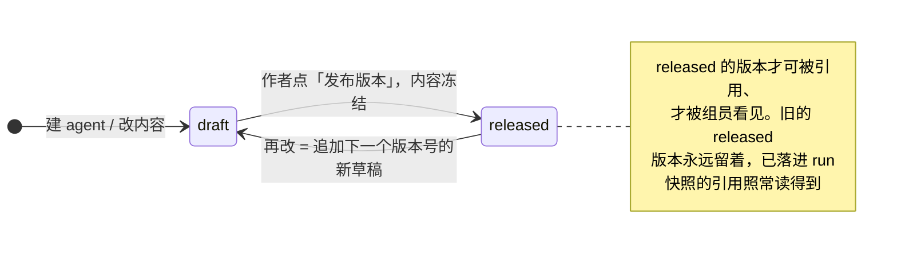
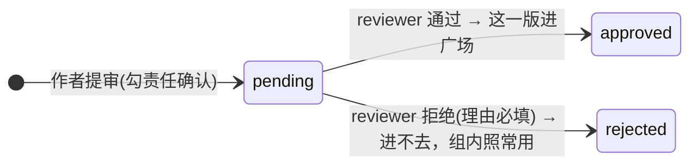

# P7 实施计划：智能体目录、三档可见性与审核

| 项 | 值 |
|---|---|
| 文档状态 | **开发完成**（2026-08-14），实施记录见 §8 |
| 当前版本 | v1.0 |
| 作者 | hxy |
| 日期 | 2026-08-14 |
| 一句话验收 | **组内共享的东西同组人看得见、别组看不见；未过审的进不了广场** |
| 第二条主判据 | **选与不选同一个 agent，同一个问题的输出可见地不同**（开工前拍板纳入，见 §1.1） |
| 上游文档 | [P6 决策](./P6-decision.md)（本期用到 A 组 8 条、B 组 7 条、C 组 6 条、I1、J4、J5、K1、K2）· [安全设计 §7.2.1](../01design/07security-design.md) · [数据设计 §6.3](../01design/06data-design.md) · [ADR-0010](../01design/adr/0010-self-hosted-accounts-rbac.md) |
| 前置 | 无。[P6 决策 §12.1](./P6-decision.md) 写明 P7 的入口条件是「无，表结构由 A1/A3/A5/B1/B2/C2 完全确定」；P6 已于 2026-08-14 开发完成、三条主判据全过 |

### 版本历史

| 版本 | 日期 | 修改人 | 说明 |
|---|---|---|---|
| v0.1 | 2026-08-14 | hxy | 初稿。开工前三处拍板：**引用生效纳入本期**并作为第二条主判据、前端**做主链路四页且场景两页按 J4 合并**、**引入 playwright 但只覆盖可见性主链路** |
| v1.0 | 2026-08-14 | hxy | 开发完成，补 §8 实施记录。**与计划不同的六处**逐条记了理由（§8.2），其中两处是形状上的改进（部分唯一索引、`EXISTS` 取代 JOIN），两处是拆分（配置模型、合并取舍的落点）|
| v1.1 | 2026-08-14 | hxy | **全量回归 35 条全过、退出码 0**，含付费与破坏性那 10 条（§8.6）。三条观察项回填：`ANALYSIS_TOKEN` 第 14 个样本、`P2①` 第三次量到 0、`P3①` 四次审批探针 |

---

## 1. 边界

### 1.1 这一期要证明的那两件事

**第一件由 L1 给出**：三档可见性真的把人挡在外面。

**第二件是开工前补上的**，理由要写清楚 —— [L1](./P6-decision.md) 给 P7 的验收标准只有可见性那一句，而 P8（skill）、P9（子智能体）、P10（MCP）三期各有各的命题，**没有任何一期认领「选中的 agent 真的改变行为」**。若本期不做，P7 结束时 `agents` 表的形状与 [P6 决策 §1.2](./P6-decision.md) 点名的那个黑洞一模一样：

> `threads.agent_config` 写得进、读得出、有测试覆盖、`make all` 全绿 —— 而装配层从来没有读过它一次。

一张有 CRUD、有版本、有审核、有可见性过滤，而**对任何一次分析的输出毫无影响**的表，是同一个错误的第二次犯。P6 花了一整期消灭它，本期不能再造一个。

因此本期的命题是两条，[§11 的总原则](./P6-decision.md)对两条同样适用：

| # | 命题 | 判据 |
|---|---|---|
| 1 | 共享真的是共享，审核真的是闸门 | `P7①` `P7②` |
| 2 | 引用真的改变行为，且版本真的冻结 | `P7③` `P7④` |

### 1.2 本期做什么（四块）

**A. 数据层：四张表与三档可见性**

| # | 内容 | 出处 |
|---|---|---|
| A1 | `agents` 身份行：作者、名称、描述、学科、`visibility`、调用计数、软删标记 | A1 · A2 · B5 · I1 |
| A2 | `agent_versions` 版本序列：追加不原地改，`status ∈ {draft, released}` | A3 · A5 |
| A3 | `reviews` 审核记录：`target_kind` + `target_id`，含 B7 的责任勾选 | C2 · C3 · B7 |
| A4 | `resource_groups` 关联表：一个资源可同时共享给多个组 | B2 |
| A5 | 迁移 `0011`（四张表一次建齐）；`UserRole` 加 `reviewer` **不需要迁移** | K1 · K2 · C1 |

**B. 接口层：三个列表端点 + CRUD + 审核 + `reviewer` 角色**

| # | 内容 | 出处 |
|---|---|---|
| B1 | `GET /api/agents`（广场，只有平台目录）· `GET /api/agents/available`（我能引用的）· `GET /api/agents/mine`（我的全部状态） | A6 · B1 |
| B2 | 我的那一族：建、改元信息、改草稿、发布版本、提审、软删、设可见性与共享的组 | A5 · B2 · B5 |
| B3 | `reviewer` 角色与 `ReviewerUser` 权限依赖（`admin` 同时满足） | C1 |
| B4 | 审核端点：队列与决策，**拒绝理由后端也校验** | C2 · C3 |
| B5 | 越权过滤**只落在仓储层一处**，端点不拼条件 | [数据设计 §6.3](../01design/06data-design.md) |

**C. 引用生效：`agent_config` 第一次能指向一个 agent**

| # | 内容 | 出处 |
|---|---|---|
| C1 | `AgentConfig` 加 `agent_id`，**与 `system_prompt` 互斥**（同时给一律 422） | E1 · H3 |
| C2 | 提交时解析成 `agent_id@version` 并把该版本的提示词写进 `runs` 快照 | A3 · H1 |
| C3 | 解析失败一律 **422 而不是静默回退默认**（fail-closed） | B5 · §11 |
| C4 | 解析成功给 `agents.call_count` +1 | I1 |

> **这一块最漂亮的地方是 worker 一行都不用改。** 快照里躺的仍然是 `system_prompt`，装配层照旧读它 —— 引用在提交那一刻就被解析掉了，执行侧根本不知道有 agent 这回事。

**D. 前端：主链路四页 + 两个入口合并**

| # | 内容 | 出处 |
|---|---|---|
| D1 | `CreateAgent`：删类型二选一与 `deployed` 全部分支，改成「名称 + 描述 + 学科 + 提示词」 | A7 · J4 |
| D2 | `MyAgents`：三态接真数据、拒绝理由红框、提审（带责任勾选）、共享给哪些组 | C6 · B2 · B7 |
| D3 | `AgentPlaza`：广场读真端点，详情抽屉渲染真提示词全文 | B4 |
| D4 | `admin/AdminAgents` 改成审核队列，`reviewer` 也进得来 | C1 · C2 |
| D5 | `ChatInput` 配置面板加 agent 选择器；每轮标明用的是哪个 agent 的哪一版 | J5 |
| D6 | **「场景库」与「我的场景」两个菜单合并掉**，两个 mock 页面删除 | A1 · J4 |

### 1.3 明确不做（每条写明由哪期偿还）

**这一节是技术债的登记簿**，翻一遍就知道 P7 结束时平台还差在哪，不必去猜。

| # | 不做什么 | 为什么 | 谁来还 |
|---|---|---|---|
| 1 | **agent 引用 skill / MCP / 子智能体** | [A3](./P6-decision.md) 说的「agent X 引用了 skill S」要等那三张表存在。本期的 agent **内容只有提示词一项** | skill **P8** · 子智能体 **P9** · MCP **P10** |
| 2 | **`reviews` 表的另外两个 `target_kind`** | 列本期就在，取值只有 `agent` 一个。skill / mcp 的提审入口那时才有东西可指 | **P8** · **P10** |
| 3 | **`CapabilityLibraries` 的 5 个 mock skill** | [J4](./P6-decision.md) 的清单里属于 skill 那一半，P6 §1.3 第 2 条已记 | **P8** |
| 4 | **[G2](./P6-decision.md) 的「`subagents` 非空的不可被选作子智能体」这条校验** | 它校验的字段本期不存在 | **P9** |
| 5 | **版本行的清理与回收** | [A5](./P6-decision.md) 定了本期不做，先量「三个月后平均每个 agent 有几个版本」。**清理的判据必须是「没有任何引用指向它」，不是「太旧了」** | 观察后再定，见 §7 |
| 6 | **审核结果的站外通知** | [C6](./P6-decision.md) 定案：平台没有用户侧通知通道，只做站内展示 | 不重估 |
| 7 | **「N 次调用」的去重与实时** | [I1](./P6-decision.md) 定案就是不去重、不实时。它的用途是判断哪些资源值得收编，不是排行榜 | 不重估 |
| 8 | **广场的排序与推荐** | 按调用数与发布时间排，没有算法。学院内部平台上 agent 是几十个量级 | 待观察 |
| 9 | **playwright 覆盖可见性主链路之外的走查项** | 本期只用它盯「多看见了一条」这一类失效，见 §1.4 第 1 条 | P8 开工前重估 |

### 1.4 本期接受的风险与技术债

1. **本期最大的风险是「多看见了一条」，不是「少看见一条」。**

   > 少看见会有人来报（「我明明共享给他了他怎么看不到」），**多看见没有任何人会来报** —— 别组的老师在广场里刷到一个不该看到的提示词，既不会报错也不会告诉你。这是本期唯一一类会安静失效的缺陷，而 [B2](./P6-decision.md) 把「我能看见哪些」从单列过滤变成了 JOIN，正好是最容易漏条件的形状。
   >
   > **缓解三条**：过滤只在仓储层写一处（端点一个 `where` 都不拼）；`P7①` 做**双向断言**而不只断言「同组看得见」；playwright 用三个真账号在浏览器里把这条链路走一遍。

2. **三档可见性在库里不是一个三值枚举**，读起来比字面绕（理由见 §2 第 2 条）。缓解：仓储层给三个名字说得清的查询方法（`list_catalog` / `list_available` / `list_owned`），调用方不拼条件。

3. **引用解析失败一律 422，会让老师撞到一次硬失败。** 作者撤回共享之后，引用它的会话下一次提问会直接报错而不是悄悄用默认提示词跑完。**这是主动选择**：静默回退不报错，症状只是「今天这个 agent 好像不太灵」—— 那正是这个平台反复警惕的那种失效。代价是话术必须让老师看得懂，不能是「422 Unprocessable Entity」。

4. **playwright 第一次引入，它自己也会假绿。** 选择器匹配不到元素而断言照样通过，是端到端测试最常见的失效。**缓解**：先写一条必然失败的断言、确认它真的红过，再写真判据 —— [「先验证验证代码」](../../CLAUDE.md)的直接应用。

5. **`reviews` 表按三类资源设计但只有一类在用。** P8/P10 复用时可能发现字段不够（比如 skill 要记「审的是哪个文件」）。接受，那时加列 —— 比现在为两个不存在的资源预留字段强。

---

## 2. 与上游文档不一致处的本期定案

| # | 上游怎么写 | 实际怎么办 | 为什么 |
|---|---|---|---|
| 1 | [A5](./P6-decision.md) 的图示里版本行只有一个 `status`（`draft` / `published`） | **拆成两个维度**：`agent_versions.status ∈ {draft, released}` 表示作者定没定稿，平台目录准入另由 `reviews` 表记 | 见下方 |
| 2 | [B1](./P6-decision.md) 说「可见性三档」 | 库里是 `visibility ∈ {private, group}` **两值**，第三档「平台目录」由「有一个版本审核通过」决定，不是 `agents` 上的一列 | 见下方 |
| 3 | `PublishDialog.tsx` 提示「公开名称需全库唯一」 | 改为**同一作者名下唯一**，后端是权威 | 全库唯一意味着谁先占了名字别人就不能用，而广场卡片本来就带作者名 |
| 4 | [数据设计 §6.3](../01design/06data-design.md) 第二行写「组内可见 → **P7 起实现**」 | 本期落地后**改文档**，把「将来」改成事实 | 设计与实现分叉时改一边，不留过期描述 |
| 5 | 前端有「场景库 / 我的场景」与「智能体广场 / 我的智能体」四个菜单 | **合并成两个**，场景那两页删掉 | [A1](./P6-decision.md) 的定案理由原文是「如果你能用一句话说清场景和智能体对用户的区别就选 b，说不清就选 a —— 我目前说不清」。说不清的区别不该做成两个菜单 |

**第 1 条与第 2 条是同一件事的两面，要一起看。**

[B1](./P6-decision.md) 定了**组内共享免审**。于是「作者定稿」与「通过审核」是两件互不蕴含的事：

- 一个版本可以**定稿了但没提审** —— 组内已经在用，广场上没有；
- 一个版本可以**提审被拒** —— 广场进不去，但组内照常可用（[C5](./P6-decision.md)「审核管的是别人能不能看见，不是作者能不能用」的同一条精神）。

单个枚举表达不了第二种状态：`rejected` 一旦盖在版本行上，就说不清它对组内还算不算数。因此本期定：



平台目录的准入走另一条线，记在 `reviews` 里，**一个版本一条**：



**三档可见性因此是这样落地的**：

| 档 | 库里怎么表达 | 谁说了算 |
|---|---|---|
| 私有 | `agents.visibility = 'private'` | 作者 |
| 组内 | `visibility = 'group'` + `resource_groups` 里有行 | 作者 |
| 平台目录 | 有一个版本在 `reviews` 里 `approved` | **reviewer** |

**把第三档塞进 `visibility` 枚举会开出一条不该存在的状态转移** —— 作者把自己的 agent 改成「平台目录」。前两档是作者的开关，第三档要别人点头，它们不属于同一个维度。

---

## 3. 环境前提

除[根 CLAUDE.md](../../CLAUDE.md) 的常规前提（XFS 挂载、broker force-recreate、六个服务起着）外，本期新增三条：

**① 迁移 `0011` 之后必须动 api 容器。**

```bash
cd app && uv run alembic upgrade head
docker compose -f deploy/compose.yml up -d --force-recreate api worker
```

宿主机把库推到新 revision 之后，还跑着旧代码的 api / worker 会因为查不到的列而**无限重启**，而**症状只是 nginx 502** —— 日志里那行 `UndefinedColumn` 埋在几十轮重启记录里。这个坑本仓库踩过一次。

**② 验收要三个账号两个组，且它们必须真的不同组。**

```
组 G1：A（作者）、B（同组）
组 G2：C（别组）
另有：reviewer 一个、admin 一个
```

`verify.sh` 里已有 `make_user`（可指定角色）与 `POST /api/admin/groups`（`P5①` 那段），本期直接复用。**注意 `make_user` 的角色参数本期要能收 `reviewer`** —— `role` 列是 `native_enum=False` 存 varchar，插得进去，但插进去之前得先让 `UserRole` 认得它，否则登录时 `/auth/me` 序列化会炸。

**③ playwright 要浏览器二进制，而它不进 `make all`。**

```bash
cd web && pnpm exec playwright install chromium
```

**理由要说清**：`make all` 是纯本地门禁（lint / 类型 / 单测），跑它不需要任何服务起着；而 playwright 这条判据要六个服务、真账号、真库。把它塞进 `make all`，等于让每一次 `git push` 都依赖一整套 compose 栈起着 —— 那道门禁会在第一次没起服务的机器上变成一条永远红的判据。

**它进 `verify.sh` 的 `P7⑥`**，缺浏览器时记「未验」（退出码 2），不记通过 —— 与沙箱镜像缺失那类情况同一套规矩。

---

## 4. 验收标准

### 4.1 六条脚本判据，加进 `verify.sh` 的 `p7` 组

判据编号 `P7①`–`P7⑥`，跟在 `p6` 那一组后面。**判据总数 29 → 35**，免费 20 → 25，要花钱或要 root 的 9 → 10。

| 判据 | 内容 | 成本 |
|---|---|---|
| **P7①** | 组内共享的同组人看得见、别组看不见，**撤回之后立刻收得回** | 免费 |
| **P7②** | 未过审的进不了广场；拒绝理由回得来；**改一版要重审一版** | 免费 |
| **P7③** | 选与不选同一个 agent，同一问题的输出可见地不同 | 两次便宜的真实分析 |
| **P7④** | 版本冻结：作者发了 v2，历史 run 的快照仍是 v1 | 免费 |
| **P7⑤** | `reviewer` 的边界：审得了，建不了号 | 免费 |
| **P7⑥** | 浏览器里把可见性主链路走完（playwright） | 免费 |

### 4.2 `P7①` 怎么写才算真的验到了

**这是本期第一条主判据，也是最容易假绿的一条**（§1.4 第 1 条）。

```
A（G1）建 agent → 发布 v1 → visibility=group、共享给 G1
  ├─ B（G1）  GET /agents/available  → 有它
  ├─ C（G2）  GET /agents/available  → 没有它
  ├─ C        GET /agents/mine/{id}  → 404（不是 403）
  └─ C        拿着 A 的 agent_id 提交 run → 422，且库里没多出一行跑起来的 run
A 把 visibility 改回 private
  ├─ B        GET /agents/available  → 没有了
  └─ B        用存着这个 agent_id 的会话再提交 → 422，不是静默用默认提示词跑完
```

**五条要求，缺一条这条判据就会假绿**：

1. **三个账号必须真的分属不同组** —— 都在同一个组里的话，「别组看不见」这一半根本没被触发过。脚本要回读 `user_groups` 确认。
2. **双向断言。** 只断言 B 看得见是不够的：C 也看得见说明过滤漏了，两个都看不见说明共享压根没写进去。两种都要判出来。
3. **越权走 404 不是 403**，与 `P3④` 同一条规矩 —— 403 等于确认了「你猜的这个 id 存在」。
4. **不止查列表，还要试着用。** 列表过滤对了而提交侧忘了查可见性，是最典型的漏洞形状：C 从别处拿到 id 就能引用 A 的提示词。**这一条单独断言。**
5. **撤回之后是 422 不是「回退默认」。** 静默回退跑得完、不报错，唯一的症状是回答变了味 —— 判据必须把这两者分开。

### 4.3 `P7②` 的形状

```
A 提审 v1（勾了责任确认）
  ├─ C 看广场 GET /api/agents        → 没有它
  ├─ reviewer 拒绝，理由「提示词过于宽泛」
  ├─ C 看广场                        → 仍然没有
  ├─ A 看 mine                       → 读得到那句理由，一字不差
  └─ B（同组）available              → 仍然有它（被拒不影响组内，C5）
A 改草稿 → 发布 v2 → 再提审 → reviewer 通过
  ├─ C 看广场                        → 有了，且展示的是 v2
A 再改 → 发布 v3 → 提审但先不审
  └─ C 看广场                        → 仍然是 v2，不是 v3
```

**最后那一步是这条判据的核心** —— 它验的是[C4](./P6-decision.md)「审核真的拦住每一次变更」。少了它，一个「审一次之后随便改」的实现照样全绿，而那等于没有审核。

另加两条断言：**拒绝时不填理由 → 422**（[C3](./P6-decision.md) 要求后端也校验，不能只靠前端）；**提审时不勾责任确认 → 422**（[B7](./P6-decision.md)）。

### 4.4 `P7③` 的形状

与 `P6①` 同一个手法，不重复论证，只列差异：

```
agent「喵语老师」：v1 的提示词 = 每一句都以「喵」开头，已发布
会话 A：不选 agent            ──提问 Q──→ 回答不以「喵」开头
会话 B：agent_config={agent_id} ──提问 Q（同一句）──→ 回答以「喵」开头
```

- **仍然是两个会话**，不是同一个会话问两次（checkpoint 里的历史会污染第二次）；
- **仍然双向断言**（A 也带喵说明串了，两个都不带说明引用没生效）；
- **额外断言快照**：会话 B 那条 run 的 `agent_config` 里 `agent_id` 与 `agent_version` 都在，且 `system_prompt` 等于 v1 的原文 —— 只看输出的话，分不清是引用生效了还是模型碰巧这么答的。

### 4.5 `P7④` 的形状

验版本冻结，不跑模型：

1. worker 停着 → 选 agent（v1，提示词「喵」）提交 → run 停在 `queued`，快照 = `{agent_id, agent_version: 1, system_prompt: "…喵…"}`
2. A 改草稿并发布 **v2**（提示词改成「汪」）
3. **那条老 run 的快照仍是 `version: 1`，`system_prompt` 仍是「喵」那份**
4. 再提交一条 → 新 run 的快照是 `version: 2`

> ⚠️ **与 `P6③` 同一个坑**：这条判据要停 worker，而**恢复 worker 之前必须把两条 queued run 全部取消** —— 否则一条免费判据在收尾时变成两次付费分析。`verify.sh` 里已有 `cancel_p6_snapshot_runs` 那套 fail-closed 收尾（对 timeout、5xx、Ctrl-C 都兜住），本期复用它而不是另写一份。

### 4.6 `P7⑤` 的形状

`reviewer` 是本期新增的角色，它的边界[C1](./P6-decision.md) 写得很死：**只能看审核队列与通过 / 拒绝**。

| 谁 | 打哪 | 该得到 |
|---|---|---|
| `reviewer` | `GET /api/reviews` | 200 |
| `reviewer` | `POST /api/admin/users` | **403** |
| `reviewer` | `PATCH /api/admin/users/{id}` | **403** |
| `teacher` | `GET /api/reviews` | **403** |
| `admin` | `GET /api/reviews` | 200（`admin` 同时满足 `reviewer`） |

**这里给 403 而不是 404**，与 `api/security.py` 现有的 `require_admin` 同一条理由：管理端点存不存在本来就写在 `/docs` 上，「你的角色不够」不泄露任何东西。

> **一旦让 `reviewer` 顺手多拿一样，这个角色就退化成 `admin` 的别名** —— [C1](./P6-decision.md) 的原话。这张表就是防它退化的那道门禁。

### 4.7 `P7⑥`：playwright 的一条链路

只覆盖可见性主链路，**不覆盖其余走查项**（§1.3 第 9 条）：

```
A 登录 → 创建 agent → 写提示词 → 发布版本 → 设为组内共享
B 登录 → 广场/可用列表里看得见它 → 详情抽屉里读得到提示词全文
C 登录 → 同一个列表里看不见它
A 提审 → reviewer 登录 → 审核队列里有它 → 通过
C 登录 → 广场里看得见了
```

**为什么是这一条**：它是本期唯一一条**跨三个账号来回切换**的链路，人工走查最容易漏（P6 的 11 条走查里有 4 条至今只是「部分观察」，而那还是单账号的）。

**开工时的第一件事是让它红一次** —— 先写一条断言「C 看得见 A 的私有 agent」，确认它真的失败，再改成正确的断言。选择器匹配不到而断言照样通过，是端到端测试最常见的假绿形态。

### 4.8 门禁

`make all` 照旧两侧全跑，**新增的前端单测范围**：

| 测什么 | 为什么是它 |
|---|---|
| `agent_config` 的组装（选 agent / 写提示词 / 继承 / 恢复默认 四种模式互斥） | 它是 `P7③` 那条链路的前端起点，且**互斥规则错了的表现是 422 而不是崩溃** —— 用户看到的是一句莫名其妙的报错 |
| 我的智能体三态的映射（draft / released / pending / approved / rejected → 三个页签） | 五个后端状态映到三个页签，映错了的表现是「我的东西不见了」 |
| 广场与可用列表的 `source` 展示 | 展示错了会让人以为「组内的东西上了广场」 |

后端仍按[技术宪法第一条](../../.claude/python-constitution.md)先写测试，**仓储层的过滤条件必须有直接针对越权的用例**，不能只测「查得到自己的」。

---

## 5. 任务分解

**每步独立可验，未过不进下一步。**

### 步骤一：四张表与迁移 `0011`

- `agent/` 是装配层（`factory.py` / `prompt.py` / `config.py`），**实体与仓储另起一个包** —— [A2](./P6-decision.md) 已经点明这一处，塞进同一个包会让它同时承担两个职责。本期建 `app/preset/`：`model.py` + `repository.py` + `review.py`。
- 四张表的约束一次写齐：`(owner_id, name)` 唯一；`(agent_id, version)` 唯一；**一个 agent 同时最多一个 draft**、**一个版本同时最多一条 pending** 各一条部分唯一索引（`postgresql_where`，与 `group_join_requests` 的 `PENDING_REQUEST_INDEX` 同一手法）。
- 枚举列一律 `native_enum=False` 且按值存，与 `users.role` 同一条理由。

**验证**：`alembic upgrade head` 与 `downgrade` 各一次；`make all` 全绿。

### 步骤二：`reviewer` 角色

- `UserRole` 加一个值；`api/security.py` 加 `require_reviewer` 与 `ReviewerUser`，**`admin` 同时满足**；前端 `AdminGuard` 分开「管理」与「审核」两种准入。
- **不需要迁移**，但要确认 `/auth/me` 序列化得出来、`make_user` 插得进去。

**验证**：`P7⑤` 那张表在真栈上跑通（此时审核端点还没有，先只验 admin 那几条与 403 那几条）。

### 步骤三：CRUD 与版本序列

- 建 agent（连带 v1 draft）、改元信息、改草稿内容、**发布版本**（draft → released，内容冻结）、再改（追加下一个版本号的新 draft）、软删。
- `GET /api/agents/mine` 与详情：带全部版本、当前审核状态与拒绝理由。

**验证**：单测覆盖「released 的版本改不动」「同时只能有一个 draft」「软删之后 mine 里还在、别处都没了」。

### 步骤四：可见性与共享

- `resource_groups` 的读写；`visibility` 的切换。
- **三个列表查询写在仓储层的三个方法里**，端点一个 `where` 都不拼。
- 「我在哪些组」走 `user_groups`（P5 已建），多组走并集。

**验证**：**`P7①` 在这一步就能跑完整条**。这一步过了，本期第一条主判据成立。

### 步骤五：审核

- `reviews` 的提审（勾责任确认）与决策（拒绝理由必填）；广场端点接上「有 approved 版本」这个条件。
- 待审期间作者与组员照常可用（[C5](./P6-decision.md)）。

**验证**：`P7②` 全部跑通，含「改一版要重审一版」那一步。

### 步骤六：引用生效

- `AgentConfig` 加 `agent_id`，与 `system_prompt` 互斥；快照模型多 `agent_version`。
- 提交侧解析：**用当前用户的身份走 `available` 那条查询**，解析不出来一律 422。
- `agents.call_count` 原子 +1。

**验证**：`P7③`（付费）与 `P7④`（免费）都能跑。**这一步过了，本期第二条主判据成立** —— 前端还没动。

### 步骤七：前端主链路四页与两个入口合并

- `CreateAgent` / `MyAgents` / `AgentPlaza` / `AdminAgents` 接真 API；`AgentScenarios` 与 `MyScenarios` 两个文件删掉，路由与侧边栏合并。
- `ChatInput` 配置面板加 agent 选择器（读 `available`），每轮标明用的是哪个 agent 的哪一版。
- [J4](./P6-decision.md) 清单里属于 agent 的删除项一并还清：`CreateAgent` 的类型二选一、`MyAgents` 的 `deployed` / `isDeploying`、`AdminAgents` 的类型列与部署分支、`AgentPlaza` 的「独立部署 MCP」徽章。

**验证**：`make all` 两侧全绿；人工走查一遍四个页面。

### 步骤八：playwright

- 引入、写一条会红的断言确认它真在跑、再改成 `P7⑥` 那条链路。
- **不进 `make all`**，进 `verify.sh`；缺浏览器二进制时记「未验」。

**验证**：`P7⑥` 跑通，且故意把一处过滤条件注释掉之后它**真的红**。

### 步骤九：验收与文档

- `P7①`–`P7⑥` 加进 `verify.sh`；**全量跑一遍确认没打穿 P0–P6 那 29 条**。
- 改 §2 那五处文档漂移；本文档补 §8 实施记录。

---

## 6. 回归关系

**本期改到六处有历史判据的东西**，逐条说明为什么不打穿 —— [P3 §8.5](./P3-plan.md) 记着「本期改的接口打穿了三个历史验收脚本」，那正是这类改动的形状。

| # | 改动 | 会不会打穿 | 依据 |
|---|---|---|---|
| 1 | `AgentConfig` 加 `agent_id` | **不会**。字段可选，且 `extra="forbid"` 只拦未知字段 | `P6①②③` 发的都是 `{"system_prompt": …}` 或空 |
| 2 | `runs` 快照多两个键 | **不会**。快照按 `exclude_none` 落，不选 agent 时一个键都不多 | `P6③` 断言的是「快照 == 当时那份配置」 |
| 3 | `POST /threads/{id}/runs` 多一条 422 路径 | **不会**。只有带 `agent_id` 才走得到 | `P0`、`P2①`、`P3①③④⑤`、`P5③`、`P6①` 都只发 `{"content": …}` |
| 4 | `UserRole` 加一个值 | **不会**。既有判据不枚举角色；`/auth/me` 多一个可能值 | `P5①` 断言的是「注册出来的是 student」 |
| 5 | 建四张表 | **不会**。验收脚本里那几条 `INSERT INTO runs (...)` 显式列了字段名 | `P3④`、`P3⑤`、`P5③`、`P5④` |
| 6 | 删两个前端页面与两个菜单项 | **不会**。P6 的走查清单一条都没碰它们 | [P6 §4.4](./P6-plan.md) |

**另有两处要当心**：

- **可见性过滤是 JOIN，而它出现在每一个列表端点上**（[B2](./P6-decision.md) 已记）。漏一处的表现是「别人的东西出现在我的列表里」，**而这不报错**。因此过滤只写一处，端点不拼条件 —— 这也是 §5 步骤四把三个查询固定在仓储层的原因。
- **`RunTask` 的形状变了，而队列里可能还躺着旧消息**。加字段是向后兼容的（旧消息解析出 `None`），但**部署顺序要对**：先升 worker 再升 api，否则新 api 投出的消息里带着旧 worker 不认的字段。P6 已经处理过一次同形的兼容，照它那条路走。

---

## 7. 待决事项

| # | 事项 | 什么时候定 |
|---|---|---|
| 1 | **[A5](./P6-decision.md) 的版本数观察项**：三个月后平均每个 agent 有几个版本。超出预期再谈回收，**判据必须是「没有任何引用指向它」而不是「太旧了」** | 2026-11 前后 |
| 2 | **[B4](./P6-decision.md) 观察项**（P6 §7 第 2 条移交本期）：内容全部可见会不会让老师不愿共享。**本期是第一次真的有共享功能**，看第一批里有几个把东西留成私有，问一句为什么 | 第一批老师用过之后 |
| 3 | **[E4](./P6-decision.md) 观察项**（P6 §7 第 1 条继续挂着）：教师写的提示词与②环境契约冲突的频率。P6 只有一个样本，本期 agent 的提示词会多起来 | 样本够了再定 |
| 4 | **平台目录里的重名**：本期定同一作者名下唯一，广场重名靠作者名区分。第一批用户抱怨分不清再加全局唯一 | 待观察 |
| 5 | **playwright 的覆盖面**：本期只有可见性一条链路。P8 前端要接六个页面，那时重估要不要把 P6 遗留的四条走查项也自动化 | P8 开工前 |
| 6 | **`reviews` 表给 skill / mcp 复用时够不够用**（§1.4 第 5 条） | P8 开工时 |

---

## 8. 实施记录（2026-08-14）

| 项 | 值 |
|---|---|
| 状态 | **开发完成，两条主判据都成立** |
| 双端门禁 | `make all` 全绿：后端 1050 条用例、前端 114 条；前端覆盖率 96.0%（阈值 80%）|
| 判据总数 | 29 → **35**，免费 20 → **25** |
| 回归验收 | 两轮。免费轮（`SKIP_LLM=1 SKIP_HOSTILE=1`）：25 条全过、退出码 2（10 条未验）。**全量轮：35 条全过、退出码 0**，见 §8.6。两轮都**没打穿 P0–P6 任何一条** |
| 第一条主判据 | ✅ `P7①` 通过：同组看得见、别组看不见、越权 404、别组拿着 id 提交 422 且库里零行 run、撤回之后 B 的会话提问 422 而不是回退默认 |
| 第二条主判据 | ✅ 两次真实分析实测：默认会话答「四」，引用会话答「**喵**4」；那条 run 的快照是 `{agent_id, agent_version: 1, system_prompt: <v1 原文>}` 三样都在 |

### 8.1 九个步骤的落点

| 步骤 | 落在哪里 |
|---|---|
| 一 四张表 | `app/preset/model.py` + 迁移 `0011_agent_catalog`；`test/migration/schema_test.py` 补 11 条，逐条盯一个约束 |
| 二 `reviewer` | `UserRole` 加一个值（**不需要迁移**）、`api/security.py` 的 `require_reviewer` / `ReviewerUser`、前端 `ReviewerGuard` |
| 三 CRUD 与版本 | `preset/repository.py`；`api/route/agent.py` 九个端点 |
| 四 可见性 | 仓储层三个方法 `list_catalog` / `list_available` / `list_owned`，**端点一个 `where` 都不拼** |
| 五 审核 | `preset/review.py` + `api/route/review.py` |
| 六 引用生效 | `agent/config.py` 拆成请求与快照两个形状、`preset/reference.py` 解析、`route/thread.py` 提交侧调用 |
| 七 前端 | `CreateAgent` / `MyAgents` / `AgentPlaza` / `admin/AdminAgents` 四页接真 API；`ChatInput` 加 agent 选择器；场景两页删除 |
| 八 playwright | `web/playwright.config.ts` + `web/e2e/visibility.spec.ts`，**不进 `make all`** |
| 九 验收 | `verify.sh` 的 `P7①`–`P7⑥` |

**worker 一行都没改**，与 §1.2 C 块的预判一致：引用在提交那一刻就解析掉了，快照里躺的仍然是 `system_prompt`，执行侧根本不知道有 agent 这回事。

### 8.2 与计划不同的六处

| # | 计划怎么写 | 实际怎么做 | 为什么 |
|---|---|---|---|
| 1 | `(owner_id, name)` 唯一 | 改成**部分**唯一索引，只盖 `is_deleted = false` | 全表唯一意味着作者删掉一个 agent 之后再也用不回那个名字，而删掉的行只有他自己看得到。这与 `group_join_requests` 「一次否决不该是永久拉黑」是同一条理由 |
| 2 | 共享过滤「从单列过滤变成 JOIN」（[B2](./P6-decision.md) 原话） | 走**相关子查询 `EXISTS`** 而不是 JOIN | JOIN 到 `resource_groups` 上，一个共享给三个组的 agent 会在列表里出现三次；去重靠有人记得加 `distinct`，而忘了加的症状是列表里有重复项、不报错。`EXISTS` 从形状上就不会多出行来 —— 已有一条用例专盯这个（`test_sharing_with_two_groups_lists_the_agent_once`）|
| 3 | 「`AgentConfig` 加 `agent_id`，与 `system_prompt` 互斥」 | **拆成两个模型**：`AgentConfigRequest`（互斥）与 `AgentConfig`（快照，三样都在）| 快照里本来就同时有引用与它解析出来的提示词（§4.4 自己要求断言这一点）。一个模型同时承担两种约束，只能靠「什么时候校验」来区分，而那种区分写不进类型里 |
| 4 | 合并的取舍留在 `RunSubmitter` | 「会话默认 vs 本轮覆盖」挪进 `agent/config.py::effective_config`，`submit` 只收一份**已经定好的**配置 | 引用解析要作用在合并之后的那一份上。留在 submitter 里就得把目录仓储塞进提交层，而那一层的职责本来只有「记一行、投一条」 |
| 5 | `verify.sh` 复用 `cancel_p6_snapshot_runs` | 把它**泛化**成 `cancel_snapshot_runs`，登记的是「thread jar」对 | 两条判据用的是不同账号，取消要拿本人的 cookie 打。各写一份的话，两处 fail-closed 迟早只有一处是对的，而错的那处的症状是「一条免费判据在收尾时变成一次付费分析」，账单上才看得见 |
| 6 | 「我的智能体」三个页签 | 优先级定为 **待审 > 已发布 > 草稿**，且「已发布」指**定过稿**而不是「在广场上」 | 一个 agent 可以同时在广场上、又有一版在等审 —— 作者这时最关心的是审核走到哪了。把「发布」与「上广场」混成一个状态，正是 §2 第 1 条要拆开的那件事 |

### 8.3 `P7⑥` 先红过两次，破坏过滤条件之后也真的红

§1.4 第 4 条与 §4.7 都要求「开工时的第一件事是让它红一次」。实际红了三次，一次比一次靠后：

1. **故意写反**（`C 看得见 A 的私有 agent`）→ 在第 101 行红，`Received: 0`。这一红证明前 100 行真的走过了：A 建、写提示词、发布、共享，B 看得见并读到提示词全文 —— 否则根本到不了这一行。
2. **改回正确断言之后又红了两次，都是真问题**：审核队列里「已处理」那一段的 `<article>` 漏了 `data-testid`；广场卡片上「平台广场」出现两次，`getByText` 撞上 strict mode（那种失败读起来像「元素不存在」）。两处都改掉了。
3. **把仓储层 `group_shared` 里「是我所在的组」这个条件去掉、重建 api** → 走查在同一行红，`Expected: 0, Received: 1`。**这正是本期唯一会安静失效的那类缺陷**（§1.4 第 1 条的「多看见了一条」），而它被抓住了。同一次破坏也让后端 4 条用例变红（仓储 2 条 + 端点 2 条），还原后 48 条全绿。

**结论**：`P7⑥` 不是一条只会绿的判据。

### 8.4 环境上的两条

- **迁移 `0011` 之后必须重建 api 与 worker**（§3 ①）：本次照做了，先 `alembic upgrade head` 再 `compose up -d --build api worker`。新表是纯追加，旧代码不会无限重启，但**新端点不会自己出现** —— 回读 `/openapi.json` 确认 11 条路径都在，比看日志快。
- **`playwright install chromium` 在这台开发机上装不全**：完整 chromium 装上了，`chrome-headless-shell` 那一份下载失败（`ERR_SSL_DECRYPTION_FAILED_OR_BAD_RECORD_MAC`）。playwright 默认用 headless shell，报的是 `Executable doesn't exist`——**看起来像根本没装浏览器**。配置改成 `channel: 'chromium'` 走完整浏览器的新版无头模式即可。这一条写进 `playwright.config.ts` 的注释里了。

### 8.4.1 `P7③` 的实测数据（2026-08-14）

判据本身在 `verify.sh` 里挂 `SKIP_LLM`，那一轮记的是「未验」；**另单独跑了一次**，
两次便宜的真实分析：

```
会话 A（不选 agent）  ──「二加二等于几？」──→  四
会话 B（agent_config={agent_id}）──同一句──→  喵4
快照：{"agent_id": "dbcc2c…", "agent_version": 1, "system_prompt": "回答任何问题时，正式答复的第一个字符必须是「喵」…"}
```

**双向断言成立**：A 不以「喵」开头（引用没串进全局），B 以「喵」开头（引用真的生效）。
**快照三样都在** —— 只看输出的话，分不清是引用生效了还是模型碰巧这么答的。

> **同日的全量轮里它在脚本内自己跑了一遍，同样双向成立**（§8.6）。手工那次证明的是判据本身
> 立得住，脚本这次证明的是它**在 `verify.sh` 里也真能跑起来** —— 两件不同的事。

### 8.5 留下的与没做的

- §1.3 那九条**一条都没有偷偷做掉**，各自的偿还期次不变。
- §7 的六条待决事项原样挂着；第 5 条（playwright 覆盖面）现在有了第一条链路作为参照。
- **前端人工走查**：四个页面在浏览器里都开过（走查那条链路本身就把 `CreateAgent` / `MyAgents` / `AgentPlaza` / `AdminAgents` 全走了一遍），`ChatInput` 的 agent 选择器由前端单测覆盖两条（选中只发引用、没选拒绝提交），**没有在浏览器里手工点过** —— 这是本期唯一一处「有测试没眼睛」的地方。
- **广场「用它开始分析」的交接走 sessionStorage 而不是路由 state**（`web/src/workspace/pickedAgent.ts`）：从广场跳过去时多半还没有会话，教师要先点一下「新建分析」，而那一下是一次不带 state 的跳转 —— 路由 state 在那一步就丢了，按钮看起来什么都没做。取走即清掉，否则下次自己开新会话会莫名预选上一个 agent。

### 8.6 全量回归：35 条全过，退出码 0（2026-08-14）

`bash deploy/test/verify.sh` **不带任何跳过开关**跑完一轮，含付费的 8 条与要 root 的 P1① 那 4 条。

**这是 `verify.sh` 自 2026-08-13 整合以来第一次把付费那批也一起跑绿。** 此前每次都是
`SKIP_LLM=1 SKIP_HOSTILE=1` 的 25 条，退出码 2；付费判据靠手工单跑补，结果记在各自的
实施记录里 —— 那种补法**证明不了它们在脚本里跑得起来**（§8.4.1 那条正是这样）。

| 组 | 条数 | 结果 |
|---|---|---|
| P0①–⑤ | 5 | 全过。一次完整真实分析，产物 `outputs/industry_annualized_vol.png`（image/png，52863 字节）|
| P1①③④⑤⑥ | 5 | 全过，含四条破坏性 |
| P2①②③⑥ | 4 | 全过。`P2①` 这一刀真砍到了 |
| P3①–⑥ | 6 | 全过 |
| P4②⑦ | 2 | 全过 |
| P5①–④ | 4 | 全过 |
| P6①–③ | 3 | 全过 |
| **P7①–⑥** | **6** | **全过**，含 `P7⑥` 的 playwright 链路 |

**本期改到的东西一条历史判据都没打穿。** 这一轮尤其值得记的是 `P3⑤`（三道闸）与
`P7③`：前者被 §8 之后那次「管理员日配额改为 `None`」动过同一段代码（`_require_quota` 里
新增的 `is not None` 分支），后者是本期唯一一条既花钱又依赖前端配置形状的判据。

**三条观察项回填**（脚本自己在输出里要求记进计划文档）：

- **`ANALYSIS_TOKEN` 的第 14 个样本**：这次真实分析 `cache_read 51,072 / 未命中 107,780 / output 4,510`。
  [P4 §8.13.3](./P4-plan.md) 攒到的区间是 2,514–320,520，这一个落在区间内偏中。
  **`quota/policy.py` 的 `ANALYSIS_TOKEN = 124_000` 仍是从一个样本外推的，实测上界是它的 2.6 倍
  —— 这笔校准债仍然挂着**，与 P4 记的一样，它是一次会改变教师可用额度的取值决定，不是实施细节。
- **`P2①` 第三次量到 0**：工具调用 4 次、返回 4 次，差值 0，且 `run.started` 2 条（真崩了）。
  三次观测都是 0，但 [P2 §7.1](./P2-plan.md) 写明的两条局限一条都没被这次消除 —— 刀仍然是随机落的。
- **`P3①` 四次审批探针的未命中/输出**：73|129、66|172、137|80、50|105。都是探针量级，
  **不进 `ANALYSIS_TOKEN` 的分布** —— 混进去会把那条本来就偏低的初值再拉低一截。
