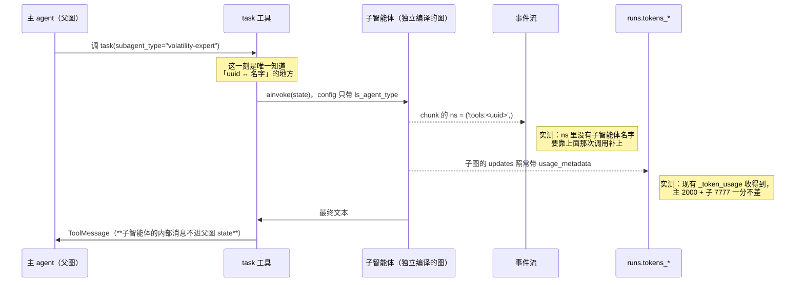

# P9 实施计划：子智能体

| 项 | 值 |
|---|---|
| 文档状态 | **开发完成，验收脚本与实施记录已补齐**（2026-08-15） |
| 当前版本 | v0.3 |
| 作者 | hxy |
| 日期 | 2026-08-15 |
| 一句话验收 | **嵌套事件带着真实 `path` 出现在前端** |
| 第二条主判据 | **子智能体烧的 token 对得上账单**（见 §1.1） |
| 上游文档 | [P6 决策](./P6-decision.md)（本期用到 G 组 10 条、A1、F12 的边界、H1、J5、K1、L1）· [智能体设计 §1.2](../01design/03agent-design.md) · [接入规范 §3.2](../01design/04extension-integration.md) |
| 前置 | [P6 决策 §12.1](./P6-decision.md) 写明 P9 的入口条件是 G 组全定。P8 已于 2026-08-15 开发完成，41 条判据（`P1①` 因需交互式 sudo 未验，其余全过） |

### 版本历史

| 版本 | 日期 | 修改人 | 说明 |
|---|---|---|---|
| v0.1 | 2026-08-15 | hxy | 初稿。**开工前五处实测全部跑完**（G6 / G7 / G8 / G9 + P8 §7 第 8 条），结论见 §2 —— **两处推翻了决策文档的预设**。开工前三处拍板：agent 自带子智能体纳入本期、事件 `path` 映射成子智能体名、验收保留账单对账与 playwright 第三条链路 |
| v0.2 | 2026-08-15 | hxy | 完成步骤一至九；补齐 `verify.sh` 的 `P9①`–`P9⑥`、实施记录与 P6 决策漂移修订。真实服务未启动时，相关判据按“未验”记录，不以 skip 冒充通过 |
| v0.3 | 2026-08-15 | hxy | 在完整 Compose 运行栈上完成真实验收，`P9①`–`P9⑥` 全部通过；记录聚合回归中的既有 `P2①` 失败与本次跳过的 `P1①` |

---

## 1. 边界

### 1.1 这一期要证明的那两件事

**两件都由 [L1](./P6-decision.md) 给出，而且这一期是唯一一期主判据里带着「实测」二字的。**

> **P9 是最不确定的一期** —— 四处实测里任一处结果为否，都会改变那一期的形状。**它单独成期正是因为这个。**

那四处（外加 P8 移交的第五处）现在全部有了硬结论，**这一期的形状因此在开工前就定死了**，见 §2。

| # | 命题 | 判据 |
|---|---|---|
| 1 | 嵌套事件带着真实 `path` 出现在前端 | `P9①` `P9⑥` |
| 2 | 子智能体烧的 token 对得上账单 | `P9②` |
| 3 | 一层限制与递归上限是真闸门，不是提示 | `P9③` `P9④` |
| 4 | 嵌套 HITL 停得下也回得去 | `P9⑤` |

**本期特有的、前八期都不曾有过的东西**：

> 前八期里，一次 run 从头到尾只有**一个** agent 在跑。本期第一次出现「一次分析里跑着不止一个 agent」——
> 于是**每一个按「一个 run 一个 agent」写下的假设都要重新过一遍**：事件的路径、token 的归属、
> 中断查在谁身上、递归轮数算谁的。这四件事正是 G6–G9 四处实测，不是巧合。

### 1.2 本期做什么（五块）

**A. 数据层：一处加列，迁移 `0013`**

| # | 内容 | 出处 |
|---|---|---|
| A1 | `agent_versions` 加 `subagent_refs` 列（`[{agent_id, version, name}]`），发布版本时一起冻结 | G1 · A1 · **本期拍板纳入** |
| A2 | 迁移 `0013`，纯追加、可空 | K1 |

> `AgentVersionRecord` 的 docstring 里早写着「子智能体与 MCP 引用等对应目录存在后再加」——
> 本期还的就是这半句。**不新建任何表**：子智能体就是 `agent` 表里的一行（G1「零新概念」），
> 引用它的方式与 P8 的 `skill_refs` 完全同形。

**B. 装配：`CompiledSubAgent` 路线 —— 本期唯一一处与官方推荐用法相反的地方**

| # | 内容 | 出处 |
|---|---|---|
| B1 | 子智能体不走声明式 `SubAgent` spec，改为**自行编译后 `with_config` 压住递归上限** | **§2 第 4 条，实测得出** |
| B2 | `SUBAGENT_RECURSION_LIMIT` 定为模块顶部常量，与 `RECURSION_LIMIT = 60` 并列 | G9 · [技术宪法第二条](../../.claude/python-constitution.md) |
| B3 | 子智能体的提示词 = 作者原文 + 平台②环境契约（不裁剪、不当角色段） | E5 |
| B4 | 共享同一个沙箱 backend、继承文件工具（**`delete` 不禁**，见 §2 第 3 条）、用主模型 | G5 |
| B5 | 最多 5 个，`MAX_SUBAGENT` 为模块顶部常量 | G4 |

**C. 事件：`_map_path` 第一次被真实数据填上**

| # | 内容 | 出处 |
|---|---|---|
| C1 | `ns` 的真实形状是 `('tools:<uuid>',)`，**冒号前是节点名而不是子智能体名** | **§2 第 1 条，实测得出** |
| C2 | 建立 `task` 调用的 `args.subagent_type` 与那个 uuid 的对应，`path` 出成 `("volatility-expert",)` | **本期拍板** |
| C3 | 映射层因此从纯函数变成「带一张小映射表的对象」，**边界写清楚**（§1.4 第 3 条） | C2 的连带后果 |

**D. 配置解析：`agent_config` 第一次能指向另一个 agent**

| # | 内容 | 出处 |
|---|---|---|
| D1 | `AgentConfigRequest` 加 `subagents: list[str]`（agent_id），提交那一刻解析成 `[{agent_id, version, name}]` 落快照 | J5 · H1 |
| D2 | 解析走**提交者本人**的可见性，解析不出来一律 422（fail-closed），与 agent / skill 引用同一条路 | B5 · §11 |
| D3 | **G2 的判据在这里落地**：被选中的 agent 若自己的那一版 `subagent_refs` 非空，一律 422 | G2 · G3 |
| D4 | 引用了 agent 时，该 agent 自带的子智能体与本轮临时挂的**取并集**；撞名 422、超 5 个 422 | A1 · G4 |
| D5 | 解析成功给被引用 agent 的 `call_count` +1 | I1 |

**E. 前端：嵌套折叠块 + 两处选择器**

| # | 内容 | 出处 |
|---|---|---|
| E1 | `MessageList` 加嵌套分支：`path` 非空的事件收进可展开折叠块，**标题就是子智能体名** | G6 |
| E2 | `ChatInput` 配置面板加子智能体多选（读「我能引用的」，已挂子智能体的不出现在候选里） | J5 · G2 |
| E3 | `CreateAgent` 加子智能体选择器 —— **勾了它，这个 agent 就成了「场景」** | A1 · 本期拍板 |

**一次带子智能体的 run，事件与 token 走的两条路**：



**图里那两条 note 就是 G6 与 G7 的实测结论**：token 那条不用改代码，事件那条必须改。

### 1.3 明确不做（每条写明由哪期偿还）

**这一节是技术债的登记簿**，翻一遍就知道 P9 结束时平台还差在哪。

| # | 不做什么 | 为什么 | 谁来还 |
|---|---|---|---|
| 1 | **多层嵌套（子智能体再挂子智能体）** | [G2](./P6-decision.md) 定案一层；判据是 `subagent_refs` 非空则不可被选，成环因此在数据层面构造不出来（G3） | 放开时**成环检测必须在配置保存时做**，不能放到运行时 —— 运行时才发现的话 token 已经烧掉了 |
| 2 | **子智能体自带 MCP** | [F12](./P6-decision.md) 定了可自带，但 MCP 这一族整体在 P10 | **P10**。届时要一并做 F12 的缓解措施：配置界面展开显示它会连哪些外网服务 |
| 3 | **子智能体用辅模型** | [G5](./P6-decision.md) 定案主模型，理由是子智能体干的也是分析活 | 不重估。**ADR-0009 的辅模型仍然只有「起会话标题」一个用户** |
| 4 | **并行调用多个子智能体时的并发闸门** | 一次 run 内 `task` 是串行调用的（实测：工具在 tools 节点内 `ainvoke`），没有并发问题 | 若将来框架改成并行，`_map_path` 的映射表要先做成按 uuid 分桶的 —— 本期已按这个形状写 |
| 5 | **子智能体失败时的自动重试** | [G10](./P6-decision.md)：错误当结果返回，主 agent 自己决定 | 不做。与[接入规范 §3.2](../01design/04extension-integration.md)「出错要返回不要抛异常」同一条 |
| 6 | **修 Langfuse 的用量上报** | 本期实测发现它一条 token 都没记（§2 第 6 条），但那是独立于子智能体的一笔债 | 见 §7 第 1 条 —— **它单独成一件事，不该塞进本期** |
| 7 | **子智能体的独立配额** | 子智能体的消耗算调用者的（G7），配额闸门读 `runs.tokens_*`，天然覆盖 | 不重估 |

### 1.4 本期接受的风险与技术债

1. **本期最大的风险是成本，而它差一点就是静默的。**

   > [G9](./P6-decision.md) 原文写着「跑飞的表现是 run 失败并带 `INTERNAL` —— **看得见，不是静默失败**，这一点让本条的风险可接受」。
   > **那个「可接受」建立在「60 步就停」这个前提上，而实测前提不成立**：子图硬编码 `recursion_limit=9999`，
   > 实测跑飞会烧掉 **5000 次**模型调用才停 —— 还是主模型（G5）。
   >
   > 本期用 `CompiledSubAgent` 压住它（§2 第 4 条）。**但要记住这条防线的形状**：它不是框架给的，
   > 是平台自己 bind 上去的，**框架升级后可能被悄悄改回去** —— 因此 `P9④` 必须是一条端到端判据，
   > 不能只写单测断言「我们传了这个参数」。

2. **`MAX_SUBAGENT = 5` 这个数字是猜的**（[G4](./P6-decision.md) 自己写着「这个数字是猜的，列为观察项」）。
   本期把观察项落到实处：`P9①` 那次真实分析要**记下 task 被调了几次**。调 0 次说明 description 写得不够好，
   调十几次说明挂多了 —— 不量就是在猜。

3. **映射层从纯函数变成有状态的对象**（C3）。这是本期唯一一处架构性让步，代价要写明：

   - `map_chunk` 现在是 `(ns, mode, payload) -> list[Event]` 的纯函数，一次 run 内谁调都一样；
   - 加了映射表之后，它**必须按 run 隔离**，否则两个并发 run 会互相看见对方的子智能体名字。
   - **落点定在 executor 里每个 run 各持一个映射器实例**，不放模块级 —— 模块级可变状态是[技术宪法第二条](../../.claude/python-constitution.md)明令禁止的。

4. **`ANALYSIS_TOKEN` 那笔校准债又多了一个变量，而且是倍数级的。** 挂 3 个子智能体 ≈ 3 倍的主模型调用（[G5](./P6-decision.md) 接受的代价）。
   `quota/policy.py` 的 `ANALYSIS_TOKEN = 124_000` 至今是从一个样本外推的，样本已攒到 16 个。
   本期不校准，但 `P9①`／`P9②` 要把两次分析的 token 记下来作为第 17、18 个样本。

5. **子智能体看得见教师的工作目录，也删得动里面的文件。** [G5](./P6-decision.md) 定了共享沙箱、继承文件工具，
   而 §2 第 3 条实测 `delete` 的 HITL 在嵌套场景下是通的 —— 于是 `delete` 不禁。
   **接受的代价**：一个写得不好的子智能体会让教师多点几次确认；一个恶意的子智能体能删的东西与主 agent 一样多。
   后者的防线仍是 [B1](./P6-decision.md) 的共享边界与沙箱本身，**本期不新增防线**。

6. **子智能体的提示词排在平台环境契约之前**（[E5](./P6-decision.md)：作者原文原样保留，平台在末尾接上②）。
   与 P8 §1.4 第 5 条那条 skill 的顺序问题**方向相反**：这里平台的话在最后，是好的一侧。记在案，不必处理。

---

## 2. 与上游文档不一致处的本期定案

**本节是这一期最该读的一节。** 五处实测在开工前跑完，两处推翻了[决策文档](./P6-decision.md)的预设。

| # | 上游怎么写 | 实测结果 | 本期怎么办 |
|---|---|---|---|
| 1 | [G6](./P6-decision.md)：`ns` 的每段形如 `research:9d1f0a2b`，冒号后是随机 task id | ❌ **形状对、含义错**：实际是 `('tools:<uuid>',)`，冒号前是**节点名 `tools`**，不是子智能体名 | `_map_path` 重做，靠 `task` 调用补上名字（C2） |
| 2 | [G7](./P6-decision.md)：子图的 updates 会不会带上来，**现在没人知道** | ✅ **带得上来**，一分不差 | `run/executor.py` **一行不改** |
| 3 | [G8](./P6-decision.md)：先实测，**测不通就禁掉子智能体的 `delete`** | ✅ **两半都通**：查得到、也回得去 | **退路用不上**，`delete` 不禁，G5 的「文件工具继承」不必收窄 |
| 4 | [G9](./P6-decision.md)：每个 agent 单独算轮数，⚠️ 依赖一个未经验证的框架行为 | ⚠️ **各自计数成立，但额度不是 60 而是硬编码的 9999** | 改用 `CompiledSubAgent` 自行编译并 bind 上限（B1） |
| 5 | [P8 §7 第 8 条](./P8-plan.md)：P9 要补一条与 skill 同形的实测（「state 里有就跳过」） | ✅ **没有这种短路**，图重建即生效 | 不必做 P8 那样的子类化让开 |
| 6 | [根 CLAUDE.md](../../CLAUDE.md)：「用量与 agent 链路改到 Langfuse 上看」 | ❌ **它一条 token 都没记**（8-13 至 8-15 共 197 条 GENERATION，`usageDetails` 全为 null） | 本期不修，单独记债（§7 第 1 条）；`P9②` 的对账仍以 DeepSeek 账单为准 |

### 2.1 第 1 条：`ns` 里没有子智能体的名字

[G6](./P6-decision.md) 说得很清楚：`_map_path` 的注释自己写着「实测 ns 全程为空，**这条剥离逻辑没有真实子图样本验证过**」，
并要求「用例必须是真跑一次拿到的 chunk，不能是构造的」。

**真跑一次的结果**（`create_deep_agent` + 一个替身模型，不花钱）：

```
ns=()                                              mode=updates   ×4
ns=()                                              mode=messages  ×3
ns=('tools:d9be61f3-312a-d013-84f0-e8784b71e7d3',) mode=updates   ×2
ns=('tools:d9be61f3-312a-d013-84f0-e8784b71e7d3',) mode=messages  ×1
```

**`ns` 确实非空了，但现有的剥离逻辑会把它收成 `("tools",)`** —— 冒号前是**节点名**。
于是前端拿到的 path 既说不出是哪个子智能体，也说不出是第几次调用：所有子智能体的所有事件都叫 `tools`。

**根因在框架的调用方式上**：子智能体不是编译进父图的子图节点，而是由 `task` 工具在 tools 节点内部
`ainvoke` 起来的一张独立的图（`deepagents/middleware/subagents.py` 的 `atask`）。因此 `ns` 记的是
「父图里哪个节点」，而不是「哪个子智能体」。

**定案（本期拍板）**：`path` 出成 `("volatility-expert",)`。

唯一知道「uuid ↔ 名字」对应关系的地方，是那次 `task` 工具调用的 `args.subagent_type` ——
它先于任何嵌套事件到达（父图的 `updates` 里 model 节点先吐出 tool_calls）。映射器记下这一对，
后续带同一个 uuid 的 chunk 就翻译得出名字。

> **顺序是这条方案成立的前提，而它必须被判据盯住。** 若哪天框架改成先吐子图事件再吐父图的工具调用，
> 映射器会翻译不出名字 —— **退化行为定为「用 uuid 前 8 位兜底」，不是丢事件**：
> 前端显示成「子任务 d9be61f3」总好过一条事件凭空消失。`P9①` 因此断言的是
> **`path[0] == 子智能体名**，一旦退化成 uuid 它就红。

### 2.2 第 3 条：G8 两半都通，退路用不上

[G8](./P6-decision.md) 要测两件事，两件都测了：

| 要测什么 | 结果 |
|---|---|
| 嵌套中断能不能被 `aget_state` 查到 | ✅ 查得到，且 `value` 的形状（`action_requests` / `review_configs`）与主图完全一致 —— **`agent/factory.py` 的 `_actions()` 不用改** |
| `Command(resume=...)` 能不能正确路由回子图 | ✅ 回得去：批准之后子模型从 1 次变 2 次、中断清零、主图收尾 |

**源码曾指向相反的结论，这正是必须实测的理由**：`create_sub_agent` 调 `create_agent(...)` 时**不传 checkpointer**，
而 `SubAgent.interrupt_on` 的文档写着 "Requires a checkpointer"。**按源码推断会得出「测不通」，
而实测是通的** —— 中断靠异常冒泡穿过工具调用，落在父图的 checkpointer 上。

> [G8](./P6-decision.md) 写明的失败形态是：「子智能体调了 `delete` → 中断了但主图查不到 → **run 永远停在那里，前端什么都不显示**」。
> 这个形态不会发生了，但 `P9⑤` 仍要盯着它 —— **它是那条退路被撤掉之后唯一的守卫**。

### 2.3 第 4 条：9999 —— 本期最值钱的一处实测

[G9](./P6-decision.md) 的 ⚠️ 块要求「实施第一步就要验它：跑一个会超限的子智能体，看抛出的是子图的限制还是父图的」。

**跑了，抛的是第三个数**：

```
对照组（不干预）  ：子模型被调用 5000 次
                   GraphRecursionError: Recursion limit of 9999 reached
实验组（bind 上限）：子模型被调用 4 次
                   GraphRecursionError: Recursion limit of 8 reached
```

9999 的来源是两处硬编码的 `.with_config()`：`deepagents/graph.py:935` 与 `langchain/agents/factory.py:1780`。
deepagents 自己的注释说明了为什么平台的 60 压不住它 —— 子图**自己 bind 的 config 会赢**：

> the subagent's bound config still wins collisions (e.g. `lc_agent_name`, `recursion_limit`)

**于是 G9 的定案「每个 agent 单独算轮数」成立，但它买到的东西与原文设想的不是一回事**：
各自计数是真的，而子智能体那一份的额度是 9999 不是 60。

**定案：改用 `CompiledSubAgent`。** 平台自己调 `create_agent(...)` 编译子智能体，
再 `.with_config({"recursion_limit": SUBAGENT_RECURSION_LIMIT})`，然后以 `{"name", "description", "runnable"}`
的形式交给 `create_deep_agent(subagents=[...])`。

**为什么这条路走得通**：`_compile_spec` 对带 `runnable` 的 spec **只覆盖 `metadata` 与 `run_name`**，
不碰 `recursion_limit` —— 平台 bind 的值因此留得住（实测：设 8 就报 8）。

**代价要记住**：声明式 `SubAgent` spec 的自动继承（工具、backend、skills）没有了，
**平台要自己组装子智能体的工具栈**。这是 §5 步骤二的主要工作量，也是本期最容易写出「看起来能跑、
其实子智能体拿不到沙箱文件工具」的地方 —— `P9①` 的第 3 条断言专盯这一点。

### 2.4 第 6 条：Langfuse 一条 token 都没记

本期为了论证「能不能用 Langfuse API 代替人工对账」而查了它，结果是个与子智能体无关的发现：

```
2026-08-13 → GENERATION   3 条，带 usageDetails 0 条，带 model 0 条
2026-08-14 → GENERATION 100 条，带 usageDetails 0 条，带 model 0 条
2026-08-15 → GENERATION  94 条，带 usageDetails 0 条，带 model 0 条
```

链路结构（trace、span 嵌套、耗时）都在，**唯独用量是空的**。而平台自己的 `_token_usage` 每次都读得到
（`P0⑤` 每轮验收都过），说明 `usage_metadata` 确实存在 —— 问题在上报侧。

**连带后果**：[根 CLAUDE.md](../../CLAUDE.md) 写着「用量与 agent 链路改到 Langfuse 上看」，
而 `GET /api/admin/usage` 已于 2026-08-13 撤除 —— **「用量」这一半其实没有兑现**。
眼下平台没有任何地方能按用户看用量，只有 `runs.tokens_*` 在库里撑着配额闸门（配额本身没坏）。

**本期不修**（§1.3 第 6 条），但它改变了 `P9②` 的做法：

> **就算 Langfuse 修好了，也不能用它替代账单对账。** 它的 token 与 `runs.tokens_*` **同源** ——
> 都来自 LangChain callback 看到的 `usage_metadata`。用它核对平台的计量是用同一份数据验自己，
> **漏计会一起漏**。**DeepSeek 后台账单是唯一独立于平台代码路径的外部真值**，
> [G7](./P6-decision.md) 定案要的正是这份独立性。
>
> **分工因此是：账单验数字，Langfuse 验结构。** 后者能证明「子智能体的调用挂在同一个 trace 下」，
> 这是账单给不了的旁证，而它不需要 usage 字段就成立。

---

## 3. 环境前提

除[根 CLAUDE.md](../../CLAUDE.md) 的常规前提（XFS 挂载、broker force-recreate、六个服务起着）外，本期新增一条：

**迁移 `0013` 之后必须重建 api 与 worker。**

```bash
cd app && uv run alembic upgrade head
make rebuild
```

与 P7 的 `0011`、P8 的 `0012` 同一条理由，且[记忆里那一条](../../CLAUDE.md)记着这个坑的症状只是 nginx 502。
本期是纯追加（一处加列、可空），旧代码不会无限重启，但**新端点不会自己出现** —— 回读 `/openapi.json` 比看日志快。

> **本期不需要动 broker，也不需要动 `SKILL_ROOT` 那一套。** 子智能体不落任何字节到宿主机：
> 它共享主 agent 的沙箱（G5），提示词随快照走。**这是本期与 P8 最大的结构差别** ——
> P8 的字节跨三个进程，本期一个进程内解决。

---

## 4. 验收标准

### 4.1 六条脚本判据，加进 `verify.sh` 的 `p9` 组

判据编号 `P9①`–`P9⑥`，跟在 `p8` 那一组后面。**判据总数 41 → 47**，免费 29 → 32，要花钱或要 root 的 12 → 15。

| 判据 | 内容 | 成本 |
|---|---|---|
| **P9①** | 挂与不挂子智能体，**事件流里看得出差别**，且 `path` 是子智能体名 | 两次真实分析 |
| **P9②** | 子智能体烧的 token 计进了 `runs`，**并与 DeepSeek 账单对得上** | 与 `P9①` 共用，另加一次人工核对 |
| **P9③** | 一层限制是真闸门：挂了子智能体的 agent 选不了、也提交不了 | 免费 |
| **P9④** | 递归上限压得住：跑飞的子智能体在平台设的步数上停下，**不是 9999** | 免费 |
| **P9⑤** | 嵌套 HITL：子智能体调 `delete` 停得下来，批准之后回得去 | 一次便宜的真实分析 |
| **P9⑥** | 浏览器里看得见嵌套折叠块，展开后是子智能体的过程（playwright） | 免费 |

### 4.2 `P9①` 怎么写才算真的验到了

**「嵌套事件出现」必须是事件流里的 `path`，不是回答里提了一句「我让子智能体算了」。**

测例子智能体（`deploy/test/` 下的夹具，与 P8 的 skill 夹具并列）：

```
name: volatility-expert
description: 专门计算年化波动率的助手。需要波动率计算时委派给它。
prompt: 你只做一件事：算年化波动率。算完后，把结果写进 outputs/ 并在回答开头写「VOL-EXPERT」。
```

```
会话 A：不挂子智能体   ──提问 Q──→ 事件流里所有事件的 path 全为空
会话 B：subagents=[该 agent] ──同一句 Q──→ 出现 path=("volatility-expert",) 的事件
```

**五条要求，缺一条这条判据就会假绿**：

1. **仍然是两个会话**，不是同一个会话问两次 —— checkpoint 里的历史会污染第二次（与 `P6①` `P7③` `P8①` 同一条）。
2. **双向断言**：A 也出现非空 path 说明串了；两个都没有说明子智能体压根没被调用。
3. **断言子智能体真的干了活，而不只是被装配上了**：会话 B 的 workspace 里有它产出的文件，
   且事件流里那条 `path` 非空的 `tool_call` 事件确实是文件工具 —— **这一条专盯 §2.3 那个「拿不到沙箱工具」的失败形态**。
4. **断言快照**：B 那条 run 的 `agent_config.subagents` 里 `agent_id` / `version` / `name` 三样都在。
5. **记下 `task` 被调了几次**（§1.4 第 2 条的观察项）与两次分析的 token（第 17、18 个样本）。

> **为什么判据落在 `path` 上而不是回答文本里。** 「VOL-EXPERT」这个标记只能证明**提示词生效了** ——
> 而主 agent 完全可以自己读到子智能体的描述然后照着写。**`path` 非空是框架层面的事实**：
> 只有真的进了另一张图，`ns` 才会非空。这与 `P8①` 把判据落在产物文件名上是同一个思路。

### 4.3 `P9②` 的形状：两级核对

**第一级（脚本自动，每次跑）**：

```
run 的 tokens_* 之和  ≥  同一次分析里主 agent 单独的消耗
```

判据是 `P9①` 会话 B 的 token **显著高于**会话 A —— 挂了子智能体就是多一个 agent 在烧主模型（G5），
两者相当说明子图的 token 漏计了。

**第二级（人工，本期一次）**：

按 [G7](./P6-decision.md) 定案的原话，**把 `runs` 表记的 token 与 DeepSeek 后台账单对一次**。
`P9①` 那两次分析跑在一个干净的时间窗内，账单按时间段取数即可。

> **这一级不进脚本，也不该进。** 它验的是「平台的计量与计费方的计量是不是一回事」，
> 一次就够；而把它写成自动判据意味着每次验收都要调用账单 API，那既做不到也没必要。
> **对完之后把数字记进 §8** —— 下一次有人怀疑计量时，那个数字就是证据。

**第三级（Langfuse，验结构不验数字）**：确认子智能体的 GENERATION 挂在同一个 trace 下
（`traceId` 相同、`parentObservationId` 指向 task 那一层）。**它不需要 usage 字段就成立**，
因此不受 §2.4 那笔债的影响。

### 4.4 `P9③` 的形状：一层限制的两道关

[G2](./P6-decision.md) 的判据是「`subagent_refs` 非空的不可被选作子智能体」。**列表过滤对了而提交侧忘了查，
是最典型的漏洞形状**（`P7①` 第 4 条、`P8⑤` 第 2 条各踩过一次同形的），因此两道都要验：

```
A 建一个 agent「场景-X」，给它挂上子智能体 → 它自己成了场景
  ├─ 候选列表   GET 我能引用的子智能体  → 「场景-X」不在里面
  └─ 提交侧     subagents=[场景-X 的 id] → 422，且库里一行 run 都没多出来
```

**再加一条**：`subagents` 给 6 个 → 422（`MAX_SUBAGENT` 是闸门不是提示）。

### 4.5 `P9④` 的形状：必须端到端，不能只验参数

**这条判据守的是 §1.4 第 1 条那条「框架升级后可能被悄悄改回去」的防线。**

```
造一个必然跑飞的子智能体（提示词写成「无论如何都再调一次工具」）
  → 提交 → run 以 INTERNAL 失败
  → 断言失败信息里的数字是 SUBAGENT_RECURSION_LIMIT，不是 9999
```

- **不能写成单测断言「我们给 with_config 传了这个值」** —— 那验的是我们的意图，不是框架的行为。
  框架把 bind 的 config 丢掉时，那种单测照样绿。
- **判据必须能看见那个数字。** 实测 `GraphRecursionError` 的文本里带着它（`Recursion limit of 8 reached`），
  这条判据因此抓得住。
- **这条免费**：跑飞的是替身模型还是真模型不影响结论，用平台的测试模型即可，一个 token 都不花。

### 4.6 `P9⑤` 的形状：嵌套 HITL 的一个来回

```
子智能体的提示词要求它删一个文件
  → run 转 waiting_approval，GET /runs/{id} 查得到那条 delete 的 action
  → 断言 args 里是子智能体要删的那个路径（不是主 agent 的）
  → 批准 → run 跑到 succeeded，且文件真的没了
```

**两条与 `P3①` 不同的地方要单独断言**：

1. **中断是从子图冒上来的**，不是主 agent 自己调的 delete —— 断言那次分析里 `task` 确实被调过。
2. **批准之后子智能体接着跑完**，而不是主 agent 从头再来一遍 —— 断言 `run.started` 只有 1 条。

> [G8](./P6-decision.md) 那个失败形态（「中断了但主图查不到 → run 永远停在那里」）**在实测里没有出现，
> 而这条判据是它唯一的守卫**。退路（禁 delete）已经因为实测通过而撤掉了，这里红了就没有第二道防线。

**事件计数要拆开写，不能笼统说“只有 1 条 `run.started`”：**

- `run.started` 且 `resumed=false`：恰好 1 条；
- `run.started` 且 `resumed=true`：恰好 1 条；
- 父图的 `task(delete-expert)`：总计恰好 1 次，批准恢复后不得重放；
- 子图 `delete` 的 `tool_result`：恰好 1 条，且 `path` 必须是 `["delete-expert"]`。

### 4.7 `P9⑥`：playwright 的第三条链路

[P8 §4.7](./P8-plan.md) 的理由在本期同样成立，而且更强：**嵌套渲染的失败形态只有界面看得见**。

```
教师登录 → 新建会话 → 配置面板勾一个子智能体 → 提问
        → 消息流里出现折叠块，标题是子智能体名
        → 展开 → 里面是它的工具调用过程
```

后端把 `path` 发对了而前端把嵌套事件平铺、或者折叠块标题显示成 `tools`、或者展开是空的 ——
**这三种前端脚本判据一律看不出来**，那正是 playwright 该盯的形状。

**开工时的第一件事仍然是让它红一次**（[P7 §8.3](./P7-plan.md) 与 [P8 §8.3](./P8-plan.md) 两期实测这一步有用）。

### 4.8 门禁

`make all` 照旧两侧全跑。**新增的后端测试重点**：

| 测什么 | 为什么是它 |
|---|---|
| `_map_path` 的映射：先 task 后嵌套事件、uuid 对不上时的兜底 | §2.1。**用真跑一次拿到的 chunk 做夹具**，不构造 |
| 映射器按 run 隔离 | §1.4 第 3 条。两个 run 交错喂 chunk，断言各自的名字不串 |
| 子智能体装配：工具栈、递归上限、提示词末尾接上环境契约 | §2.3 · B3 |
| G2 判据：`subagent_refs` 非空的解析不出来 | D3 |
| 撞名与超 5 个的 422 | D4 · G4 |

**新增的前端单测重点**：嵌套事件收进折叠块（`MessageList`）；子智能体多选与 agent 自带子智能体的合并展示（`ChatInput`）。

---

## 5. 任务分解

**每步独立可验，未过不进下一步。**

### 步骤一：加列与迁移 `0013`

- `agent_versions` 加 `subagent_refs`（JSONB，可空）；发布版本时与 `skill_refs` 一起冻结。
- `AgentConfig` 加 `subagents: list[SubagentReference]`，`AgentConfigRequest` 加 `subagents: list[str]`。

**验证**：`alembic upgrade head` 与 `downgrade` 各一次；`make all` 全绿。

### 步骤二：装配 —— 本期的技术核心

- `agent/subagent.py`（新模块）：把快照里的引用编译成 `CompiledSubAgent` 列表。
  - 自行 `create_agent(...)`，工具栈与 backend 显式给全（§2.3 的代价）；
  - `.with_config({"recursion_limit": SUBAGENT_RECURSION_LIMIT})`；
  - 提示词 = 作者原文 + 平台②环境契约（B3）。
- `agent/factory.py` 的 `_graph()` 接上 `subagents=[...]`。

**验证**：`P9④` 在这一步就能跑（不需要模型）。**这一步过了，跑飞烧 5000 次那条风险就关上了。**

### 步骤三：事件映射

- `_map_path` 重做：映射器持有 `{uuid: 子智能体名}`，`task` 调用时登记，嵌套 chunk 翻译，翻译不出用 uuid 前 8 位兜底。
- 映射器按 run 隔离，落在 executor 里。

**验证**：用步骤二真跑一次拿到的 chunk 做夹具写单测；**夹具必须是真的**（G6 原文要求）。

### 步骤四：解析与闸门

- 提交侧解析 `subagents`（走提交者可见性，失败 422）；G2 的判据（D3）；并集、撞名、超 5 个（D4）。
- 候选列表端点：排除 `subagent_refs` 非空的。

**验证**：`P9③` 全部跑通。

### 步骤五：主判据成立

- 端到端跑通一次带子智能体的真实分析。

**验证**：`P9①`（付费）与 `P9②`（付费）都能跑。**这一步过了，本期两条主判据成立** —— 前端还没动。

### 步骤六：嵌套 HITL

- 确认 `Agent.pending()` 与 `run/approval.py` 在嵌套场景下不用改（§2.2 的实测结论）；改不改都要有用例盯着。

**验证**：`P9⑤` 跑通。

### 步骤七：前端三处

- `MessageList` 嵌套折叠块；`ChatInput` 子智能体多选；`CreateAgent` 子智能体选择器。

**验证**：`make all` 两侧全绿；三处人工走查一遍。

### 步骤八：playwright 第三条链路

- 先写一条会红的断言确认它真在跑，再改成 `P9⑥`。
- 不进 `make all`，进 `verify.sh`。

**验证**：`P9⑥` 跑通，且**故意把 `_map_path` 的映射去掉之后它真的红**（折叠块标题会退化成 uuid）。

### 步骤九：验收与文档

- `P9①`–`P9⑥` 加进 `verify.sh`；**全量跑一遍确认没打穿 P0–P8 那 41 条**。
- 与 DeepSeek 账单对一次账（§4.3 第二级），数字记进 §8。
- 改 §2 那六处文档漂移 —— 其中第 1、4 条要回头改 [P6 决策 G6 / G9](./P6-decision.md) 的措辞，
  它们现在各写着一句已被实测推翻的话。
- 本文档补 §8 实施记录。

---

## 6. 回归关系

**本期改到六处有历史判据的东西**，逐条说明。

| # | 改动 | 会不会打穿 | 依据 |
|---|---|---|---|
| 1 | `AgentConfig` 加 `subagents` | **会打穿一条单测**：`test/agent/config_test.py` 里那条「未知字段当场 422」的用例，**P8 已经换过一次字段名**（`skills` 变成已知字段那次）。本期再换一个，**不要删这条用例** | 该用例守的是 `extra="forbid"` |
| 2 | `_map_path` 的返回值变了 | **不会打穿脚本判据，但会打穿单测**：现有 `mapper_test.py` 断言 `("research",)` 这类构造出来的形状，而那个形状**从来没有真实样本支撑**（G6 原文）。**按真实 chunk 重写，不是删掉** | `P0①`–`P0⑤` 断言的是事件类型与顺序，不看 path |
| 3 | `map_chunk` 从纯函数变成对象方法 | **会打穿调用点**：`run/executor.py` 与它的测试。改动机械但要全 | §1.4 第 3 条 |
| 4 | `agent_versions` 加一列 | **不会**。可空，且 P7/P8 的判据不 `SELECT *` | `P7④` `P8①` |
| 5 | `RunTask` 的形状又变了（快照里多了子智能体引用） | **不会**，但队列里可能躺着旧消息。加字段向后兼容（旧消息解析出空列表），**部署顺序仍是先 worker 后 api** | 与 P6 / P7 / P8 同一条路 |
| 6 | `agent/factory.py` 的 `_graph()` 多传一个参数 | **不会**，但**这是本期最该跑一次真实分析确认的改动** —— 它动的是每一次分析都要走的装配路径。`P0①`–`P0⑤` 是它的兜底 | `P0` 全组 |

**另有两处要当心**：

- **不挂子智能体时必须一个额外动作都不做**。绝大多数分析走的是这条路，
  而给每次分析加一次无谓的编译，症状是「平台好像变慢了」，没有任何日志指向它（与 P8 那条「skill 数为 0 时一次 broker 都不打」同形）。
- **`P0③` 断线重连补齐那条会看到更多事件**（4594 条那一条）。嵌套事件也进同一条流，
  id 仍严格递增，**判据不看总数只看单调性**，因此不受影响 —— 但值得在跑之前知道这件事。

---

## 7. 待决事项

| # | 事项 | 什么时候定 |
|---|---|---|
| 1 | **Langfuse 的用量上报是坏的**（§2.4）：197 条 GENERATION 一条 token 都没记，而 `GET /api/admin/usage` 已撤。**它不是子智能体的事，但它让「按用户看用量」这件事目前无处可去** | **本期之后单独一件事**。定位方向：langfuse SDK 与 langchain 集成的版本对不上，或 v4 events_only 模式的上报路径变了 |
| 2 | **`MAX_SUBAGENT = 5` 与 `SUBAGENT_RECURSION_LIMIT` 两个数字都是猜的**。前者量 `task` 被调几次（§1.4 第 2 条），后者量一次正常的子智能体任务走几步 | 第一批老师用过之后，两个一起校准 |
| 3 | **`ANALYSIS_TOKEN` 的校准**：样本会攒到 18 个，而子智能体把方差放大了一个量级 | 样本够了单独一次改。**它是一次会改变教师可用额度的取值决定，不是实施细节** |
| 4 | **多层嵌套要不要放开**（§1.3 第 1 条）。放开的前提是成环检测落到配置保存时 | 有人问起之后 |
| 5 | **子智能体的描述写得好不好，直接决定它被不被调用**（G4 原文：「调 0 次说明描述写得不够好」）。这与 [D10](./P6-decision.md) 给 skill 定的「只用一份 description」是同一个问题的第二次出现 | 第一批老师用过之后，与 P8 §7 第 9 条合并观察 |
| 6 | **P10 的 F12（子智能体自带 MCP）会回到本期的装配层**。§2.3 那条 `CompiledSubAgent` 路线意味着**平台自己组装子智能体的工具栈** —— MCP 工具要挂进去时，落点已经在手里了 | P10 开工时 |

---

## 8. 实施记录

### 8.1 步骤与提交

本期按“每完成一个步骤提交一次 Git”执行，提交顺序如下：

| 步骤 | 内容 | 提交 | 验证记录 |
|---|---|---|---|
| 一 | 引用快照与 `0013` 迁移 | `c5cbac1` | 迁移、模型与快照测试 |
| 二 | 编译受限子智能体 | `857248e` | 装配测试；递归上限探针 |
| 三 | 映射子智能体事件路径 | `5082bc7` | 真实路径快照与映射测试 |
| 四 | 配置解析与层数闸门 | `578ae32` | 候选、嵌套、数量与同名规则测试 |
| 五 | 真实主判据与计量证据 | `6a10b3b` | `P9①` / `P9②` 真实分析样本 |
| 六 | 嵌套审批恢复链路 | `f8e2c4c` | `P9⑤` 真实审批恢复样本 |
| 七 | 子智能体选择与折叠展示 | `992f853` | 前端测试 125 条通过，前端构建通过 |
| 八 | 子智能体浏览器主链路 | `f828874` | Playwright 用例已加入；当前环境后端未启动，判据未验 |
| 九 | 验收脚本与文档 | 本次提交 | `bash -n`、`git diff --check`；完整服务验收受环境限制 |

### 8.2 Token 样本与账单核对

本次完整 Compose 验收中，P9①留下的本地 `runs` 表样本如下，数值单位为 token：

| 样本 | run_id | cache | uncached | output | total |
|---|---|---:|---:|---:|---:|
| 对照组（不挂子智能体） | `a423f3b3505f4846b10de97fc6814972` | 7936 | 96 | 518 | 8550 |
| 实验组（挂子智能体） | `c51afc882ba14c148230084a6533df26` | 45312 | 1052 | 2528 | 48892 |

实验组总 token 大于对照组，`P9②` 已验证子图 token 进入同一条 run 的本地计量。DeepSeek / Langfuse 后台账单的人工逐时间窗核对仍未完成，**该项不能宣称已验**；本地 `runs` 表不能冒充 DeepSeek 后台账单核对结果。

### 8.3 验收脚本状态

`deploy/test/verify.sh` 现包含 P0–P9 共 **47 条**判据，其中 P9③、P9④、P9⑥ 已补齐：

- `P9③`：验证候选列表过滤、已挂子智能体的场景提交返回 422、超过 5 个返回 422、同名提交返回 422，并检查失败提交不新增 run；
- `P9④`：运行真实 `CompiledSubAgent` 循环探针，断言递归错误使用平台 `SUBAGENT_RECURSION_LIMIT`，不回落到 DeepAgents 默认 9999；
- `P9⑥`：复用 `e2e/subagent-workspace.spec.ts`，把 `E2E_API_TARGET`、作者账号、子智能体名称与问题传入 Playwright。

2026-08-15 在完整 Compose 运行栈上执行 `SKIP_HOSTILE=1 bash deploy/test/verify.sh`：`P9①`–`P9⑥` 六条全部通过，其中 P9① 的事件 path、文件产物和快照，P9② 的本地 token 汇总，P9⑤ 的嵌套审批恢复，以及 P9⑥ 的浏览器折叠链路均有真实证据。聚合结果仍因既有 `P2①` 的 worker 重跑断言失败而退出 1；`P1①` 因显式跳过需要 root 的破坏性测试而记为未验。这两项不改变 P9 六条判据的结果。
