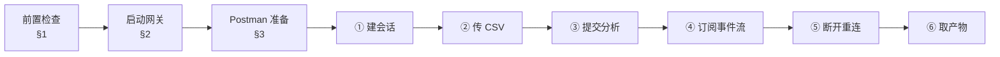

# P0 验收操作指南（Postman）

| 项 | 值 |
|---|---|
| 文档状态 | 可执行 |
| 作者 | hxy |
| 日期 | 2026-08-03 |
| 上游文档 | [P0 实施计划](../../03plan/P0-plan.md) |

> **本文档的职责**：回答 **「怎么用 Postman 一步步把 P0 验收跑完」**。
>
> **不回答**「验收标准为什么是这四条」（在 [P0 计划 §2](../../03plan/P0-plan.md)）、「接口为什么这么设计」（在[架构 §5.7](../../01design/01architecture.md)）。
>
> 配套的 `holdings.csv` 与本文同目录，是验收专用的样例数据，不是业务数据。

---

## 0. 先读这一段

验收要跑一次**真实的** LLM 调用（DeepSeek）与真实的 Docker 沙箱，**会产生 API 费用**，单次分析约几分钟。

四条验收标准（原文见 [P0 计划 §2](../../03plan/P0-plan.md)）与本文步骤的对应：

| 验收标准 | 在哪一步验 |
|---|---|
| ① 事件流完整：`run.started` → 增量 → 工具 → `run.finished` | 步骤四 |
| ② agent 自写 `.py` 并 `execute`，产物落 `outputs/` | 步骤四（看 `tool_call`）+ 步骤六 |
| ③ 断线带 `Last-Event-ID` 重连，补齐不重不漏 | 步骤五 |
| ④ 取回产物图片并正常显示 | 步骤六 |



---

## 1. 前置检查（三项，缺一跑不通）

以下三项已于 **2026-08-03 在本机实测**，结论直接写在表里。

| 检查 | 命令 | 本机实测结果 |
|---|---|---|
| 沙箱镜像在 | `docker images zuel-sandbox:latest` | ✅ 已有，659MB |
| 8000 端口空闲 | `ss -ltn \| grep :8000` | ✅ 空闲 |
| `.env` 有密钥 | `grep DEEPSEEK_API_KEY .env` | ✅ 已配 |

### 1.1 两个必须处理的坑

**坑一：`.env` 里的 `SANDBOX_WORKSPACE_ROOT=/data/sandbox` 在本机不可用。**

那是生产机的路径，本机 `/data` 不存在且当前用户无权在 `/` 下创建。不处理的话**第一步建会话就 500**，服务端日志是 `PermissionError: [Errno 13] Permission denied: '/data'`。

处理方式：**不动 `.env`**，启动时用环境变量临时覆盖（见 §2 的启动命令）。`.env` 里的生产值保持原样，免得下次部署时又改回来。

**坑二：本机的 `ALL_PROXY=socks://127.0.0.1:7890/` 会让网关起不来。**

`ChatDeepSeek` 底层的 httpx 不认 socks 方案，构造时直接报错。`api.deepseek.com` 实测可直连，启动命令里剥掉这个变量即可（内网服务器上没有这些变量，是纯开发机问题）。

---

## 2. 启动网关

**cwd 必须在 `app/`** —— 模块路径是 `api.app`，从仓库根起会 `ModuleNotFoundError`。

```bash
cd app
env -u ALL_PROXY -u all_proxy \
    SANDBOX_WORKSPACE_ROOT="$(git rev-parse --show-toplevel)/data/sandbox" \
    uv run uvicorn api.app:app --host 127.0.0.1 --port 8000
```

看到 `Application startup complete.` 即可。**这个终端不要关**，事件流全靠它。

顺手确认一下接口文档能开：浏览器访问 <http://127.0.0.1:8000/docs>。字段级的请求/响应以这份 OpenAPI 为准，本文不复制第二份。

> 上一轮验收可能留下过沙箱容器（本机检查时有一个 `zuel-sandbox:latest` 容器在跑）。它与新进程无关联，不影响验收，但会占 2GB 内存。要清就 `docker ps` 找出来 `docker rm -f`。

---

## 3. Postman 准备

### 3.1 建一个 Environment

避免每步手工复制 id。新建 Environment（右上角环境选择器 → 加号），三个变量：

| 变量 | 初始值 |
|---|---|
| `baseUrl` | `http://127.0.0.1:8000` |
| `threadId` | 留空 |
| `runId` | 留空 |

建完**记得在右上角把它选中**，否则 `{{baseUrl}}` 解析不出来。

### 3.2 关掉 Postman 的代理

本机有 `HTTP_PROXY=http://127.0.0.1:7890`。Postman 默认可能走系统代理，导致访问 `127.0.0.1:8000` 被代理拦截（表现为一直转圈或 `ECONNREFUSED`）。

`Settings → Proxy` 里关掉 "Use the system proxy"，或在 `Settings → General` 里把 `127.0.0.1` 加进代理排除列表。

### 3.3 SSE 支持

步骤四要看流式事件，**需要 Postman v10.14 或更高**（该版本起响应为 `text/event-stream` 时会流式展示，并给出断开按钮）。低版本会把 SSE 当普通 HTTP 请求，一直缓冲到 run 结束才整块显示 —— 那样步骤五的"中途断开"就没法做。

`Help → About` 查版本。版本过低时用 §7 的 curl 兜底方案完成步骤四、五。

---

## 4. 六个步骤

### 步骤一：建会话

| 项 | 值 |
|---|---|
| Method | `POST` |
| URL | `{{baseUrl}}/api/threads` |
| Body | 无 |

**期望**：`201 Created`，body 形如

```json
{ "id": "17d3f91158ae4076b74474a0333f0eb8" }
```

在该请求的 **Scripts → Post-response** 标签里贴上这段，把 id 自动存进环境变量：

```javascript
pm.environment.set("threadId", pm.response.json().id);
```

> 本期没有 threads 表，一个会话在服务端的全部实体就是 workspace 下的一个目录。可以去 `data/sandbox/{threadId}/` 看到它被建出来了。

---

### 步骤二：上传持仓 CSV

| 项 | 值 |
|---|---|
| Method | `POST` |
| URL | `{{baseUrl}}/api/threads/{{threadId}}/files` |
| Body | `form-data`，key 填 `file`，**类型下拉选 File**（默认是 Text，选错会 422） |

值选与本文同目录的 `holdings.csv` —— 6 只股票 × 7 个月的收盘价与持仓数，带行业分类，**并且 2025-07-01 五粮液的收盘价故意留空**，用来看 agent 会不会按提示词要求说明缺失值怎么处理的。

**期望**：`201 Created`

```json
{ "filename": "holdings.csv", "size": 2236 }
```

文件落在 agent 视角的 `/workspace` 根下，提示词告诉它工作目录就是那里。

---

### 步骤三：提交分析

| 项 | 值 |
|---|---|
| Method | `POST` |
| URL | `{{baseUrl}}/api/threads/{{threadId}}/runs` |
| Body | `raw` → `JSON` |

```json
{ "content": "读取 holdings.csv，按行业分组计算持仓市值占比和各行业月度收益率的年化波动率，画成图表保存到 outputs 目录，并说明缺失值是怎么处理的。" }
```

**期望**：`202 Accepted`，**立刻返回不等待**（执行要几分钟，进度看事件流）

```json
{ "id": "...", "thread_id": "...", "status": "queued" }
```

同样在 **Scripts → Post-response** 存下 runId：

```javascript
pm.environment.set("runId", pm.response.json().id);
```

---

### 步骤四：订阅事件流 ← **验收①②在这里**

| 项 | 值 |
|---|---|
| Method | `GET` |
| URL | `{{baseUrl}}/api/runs/{{runId}}/events` |

发送后 Postman 进入流式接收，事件会不断追加。**这一步要盯着看，别急着关**。

**期望看到的顺序**（这就是验收标准①）：

```
run.started  →  sandbox.ready  →  reasoning / token 大量交替  →
tool_call / tool_result 若干轮  →  run.finished
```

几个要点：

- **`reasoning` 和 `token` 是两种事件**，前者是思考过程，后者是正式答复。它们在模型侧就是两个字段、交替流出。上次验收的量级是 `reasoning` 2021 条、`token` 733 条，**总量约 2700 条事件，Postman 界面会有点吃力**，属正常。
- **验收标准②在这里就能看出苗头**：找 `tool_call` 事件，应当能看到 `write_file`（写 `.py` 文件）后跟 `execute`（运行它）。工具名在 `data.name` 里。
- 每条事件都有 `id:` 行，形如 `1754213456789-0`（毫秒时间戳 + 同毫秒内序号）。**步骤五要用它**。
- **`sandbox.ready` 之前可能停顿**：沙箱要拉起容器。如果沙箱池满了会先收到 `sandbox.queued`（带排位），这段时间**流是完全静默的 —— 本期 SSE 没有心跳**，别当成卡死。

想单独查状态可以另开一个请求：`GET {{baseUrl}}/api/runs/{{runId}}`，返回 `queued` / `running` / `succeeded` / `failed` 四态之一。

---

### 步骤五：断线重连 ← **验收③在这里**

**在 run 还没结束时**（事件还在滚），做这三件事：

1. **点 Postman 的断开按钮**掐断连接。
2. **记下最后一条事件的 `id`**，例如 `1754213456789-42`。同时记下**已收到的事件条数**（Postman 会显示；或看最后几条内容），一会儿要对账。
3. 在同一个请求的 **Headers** 里加一行，然后重新发送：

| Key | Value |
|---|---|
| `Last-Event-ID` | 刚记下的那个 id |

**期望**（这就是验收标准③）：

- 重连后**第一条事件的 id 严格大于**你填的那个 id —— 说明没有重复推送。
- 断开期间产生的事件**全部补齐**，中间没有断档。
- 一路推到 `run.finished` 为止，流自然结束。

**怎么算"不重不漏"**：把两次连接收到的事件条数加起来，应当等于这个 run 的事件总数；且第一段的最后一个 id 与第二段的第一个 id 在序列上首尾相接。上次验收的实测是掐断时收到 223 条，重连补齐 2552 条，id 全唯一、单调递增、首尾严丝合缝。

> 顺带可验一条负路径：把 `Last-Event-ID` 填成 `abc` 再发，应当返回 `422` 与 `{"error":{"code":"VALIDATION_ERROR",...}}`。**注意 runId 必须是真实存在的 run** —— 端点先查 run 再校验游标，用不存在的 runId 会先撞上 404，验不到 422。

---

### 步骤六：取回产物 ← **验收②④在这里**

从 `run.finished` 事件的 `data.artifacts` 数组里取产物标识，形如：

```json
{ "status": "succeeded",
  "tokens": { "input_cache_read": 189312, "input_uncached": 115328, "output": 8701 },
  "artifacts": ["17d3f911.../industry_volatility.png"] }
```

**这个字符串已经包含 thread_id**（形状是 `{thread_id}/{outputs 下的相对路径}`），直接拼在端点后面，**不要再拼一次 threadId**：

| 项 | 值 |
|---|---|
| Method | `GET` |
| URL | `{{baseUrl}}/api/artifacts/17d3f911.../industry_volatility.png` |

**期望**：`200`，`Content-Type: image/png`，Postman 响应面板直接渲染出图（验收标准④）。要存盘就用响应面板的 `Save Response → Save to a file`。

图应当是中文标签且**不出现方块乱码** —— 镜像预装了中文字体并配成 matplotlib 默认。同时去 `data/sandbox/{threadId}/outputs/` 看一眼，agent 写的 `.py` 文件和产物都应在会话目录下（验收标准②的落地证据）。

---

## 5. 验收核对表

四条全中才算过。

| # | 标准 | 判据 | 结果 |
|---|---|---|---|
| ① | 事件流完整 | 见到 `run.started` → `reasoning`/`token` → `tool_call`/`tool_result` → `run.finished` | ☐ |
| ② | agent 自写代码并执行 | `tool_call` 里有 `write_file` + `execute`；`outputs/` 下有产物 | ☐ |
| ③ | 断线重连补齐 | 重连首条 id > 游标；两段合计等于总数；无重无漏 | ☐ |
| ④ | 产物可取回 | 图片 200 返回、正常显示、中文不乱码 | ☐ |

---

## 6. 出问题时看这里

| 现象 | 原因 | 处理 |
|---|---|---|
| 建会话 `500` | workspace 根不可写（`/data` 不存在） | 见 §1.1 坑一，启动时覆盖 `SANDBOX_WORKSPACE_ROOT` |
| 启动即报 socks 相关错误 | `ALL_PROXY=socks://` | 见 §1.1 坑二，启动命令加 `env -u ALL_PROXY -u all_proxy` |
| Postman 一直转圈 / 连不上 | Postman 走了系统代理 | 见 §3.2 |
| 上传返回 `422` | form-data 的 key 类型选成了 Text | 改成 File |
| 提交分析返回 `404` | `threadId` 变量没设上，或环境没选中 | 检查右上角环境选择器 |
| 事件流长时间不动 | 在排队等沙箱，且**本期 SSE 无心跳** | 等；或看服务端终端日志 |
| SSE 不流式、整块才出来 | Postman 版本低于 10.14 | 用 §7 的 curl 兜底 |
| `run.failed` 且 `code=SANDBOX_QUEUE_TIMEOUT` | 排队超过 `SANDBOX_QUEUE_TIMEOUT`（默认 600 秒） | 清理占用的容器后重试 |
| 图里中文是方块 | 用的不是 `zuel-sandbox:latest`，或 agent 自己改了字体 | 确认镜像；看 `tool_call` 里有没有设 `rcParams` 字体 |

---

## 7. curl 兜底（Postman 版本过低时用）

只有步骤四、五需要兜底，其余步骤 Postman 完全够用。

```bash
# 步骤四：订阅（-N 关掉缓冲，否则看不到流式）
curl -N http://127.0.0.1:8000/api/runs/{runId}/events

# 步骤五：Ctrl-C 掐断，记下最后一条的 id，然后
curl -N http://127.0.0.1:8000/api/runs/{runId}/events -H 'Last-Event-ID: 1754213456789-42'

# 想直接对账不重不漏，把两段分别存文件再比
curl -N http://127.0.0.1:8000/api/runs/{runId}/events > part1.txt      # 跑十几秒后 Ctrl-C
grep '^id:' part1.txt | tail -1                                        # 取游标
curl -N http://127.0.0.1:8000/api/runs/{runId}/events \
     -H 'Last-Event-ID: <上面那个 id>' > part2.txt
cat <(grep '^id:' part1.txt) <(grep '^id:' part2.txt) | sort -u | wc -l  # 应等于两段行数之和
```

---

## 8. 收尾

```bash
# 停网关：启动它的终端里 Ctrl-C

# 清沙箱容器（进程正常退出会自己回收；异常退出会留下孤儿）
docker ps --filter ancestor=zuel-sandbox:latest -q | xargs -r docker rm -f

# 验收产生的会话目录（含上传数据与产物），确认不再需要后再删
ls data/sandbox/
```

验收通过后，把实测数据回填到 [P0 计划 §2](../../03plan/P0-plan.md) 的通过条件下方。
