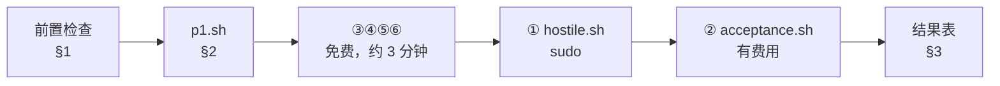

# P1 验收操作指南

| 项 | 值 |
|---|---|
| 文档状态 | 可执行 |
| 作者 | hxy |
| 日期 | 2026-08-07 |
| 上游文档 | [P1 实施计划](../../03plan/P1-plan.md) |

> **本文档的职责**：回答 **「怎么把 P1 验收六条跑完、每条该看到什么」**。
>
> **不回答**「验收标准为什么是这六条」（在 [P1 计划 §4](../../03plan/P1-plan.md)）、「为什么用 gVisor / 为什么拆 broker / 为什么配额用 XFS」（分别在 [ADR-0002](../../01design/adr/0002-sandbox-isolation-gvisor.md)、[ADR-0004](../../01design/adr/0004-sandbox-broker-docker-sock.md)、[ADR-0015](../../01design/adr/0015-sandbox-disk-quota-xfs.md)）。
>
> 与 [P0 验收指南](../P0/P0验收postman指南.md)的关系：P0 那份是**手工点 Postman**，验的是「agent 好不好用」；本期六条里有四条要 kill 进程、改配置、写满磁盘，手工做既慢又容易漏，因此**全部脚本化**。P0 的四条作为回归基线保留，由 `acceptance.sh` 自动跑。

---

## 0. 先读这一段

**六条里有两条是花钱和花时间的大头**，先把预期建立起来：

| 条件 | 由谁验 | 耗时 | 费用 |
|---|---|---|---|
| ③ api 拿不到 `docker.sock` 与宿主 workspace | `p1.sh` 自己 | 数秒 | 免费 |
| ④ broker 重启按 label 认领，不泄漏孤儿 | `p1.sh` 自己 | 约 30 秒 | 免费 |
| ⑤ 排队静默期 SSE 不被掐断 | `p1.sh` 自己 | 约 2 分钟 | **免费**，见 §3.3 |
| ⑥ 日志结构化且带 `run_id` / `thread_id` | `p1.sh` 自己 | 数秒 | 免费 |
| ① 四条破坏性测试宿主机不受影响 | [`hostile.sh`](../../../deploy/test/hostile.sh) | 约 5 分钟 | 免费，**要 sudo** |
| ② P0 验收四条在 gVisor + Nginx 下全过 | [`acceptance.sh`](../../../deploy/test/acceptance.sh) | 约 5 分钟 | **真实调用 DeepSeek，约 30 万 token** |

[`p1.sh`](../../../deploy/test/p1.sh) 是总入口，六条一条命令跑完，后两条由它转调另外两个脚本。



---

## 1. 前置检查

### 1.1 环境（新机器要跑一次，脚本可重跑）

```bash
sudo bash deploy/setup-gvisor.sh    # 装 runsc 并注册成 Docker 运行时
sudo bash deploy/setup-xfs.sh       # 把 workspace 根挂到 XFS（prjquota）
sudo bash deploy/verify-env.sh      # 两条都验一遍，这就是 P1 计划的步骤零
```

`verify-env.sh` 要看到 `✅ runsc + pandas` 与 `✅ 写到 8MB 即 ENOSPC` 两行。**这一步不过，步骤一二的验证标准全是空头支票** —— 没有 runsc 就没有加固，没有 prjquota 就没有配额。

### 1.2 沙箱镜像

```bash
docker build -f deploy/sandbox.Dockerfile -t zuel-sandbox:latest .
```

**新克隆的仓库必须跑这一次**：没有这个镜像时沙箱测试会 skip 而不是失败，`make all` 照样显示通过。

### 1.3 起服务

```bash
export SANDBOX_USER="$(id -u):$(id -g)"
export SANDBOX_WORKSPACE_ROOT="$(pwd)/data/sandbox"
docker compose -f deploy/compose.yml up -d --build
```

**这两个变量不是可选的**，compose 会因缺 `SANDBOX_USER` 直接拒绝启动。原因值得多说一句：

- `SANDBOX_WORKSPACE_ROOT` 在**容器内外必须是同一个路径**。broker 把它交给宿主机的 Docker 守护进程去解析，两边不一致时 `-v` 挂的是一个宿主机上不存在的路径。
- `SANDBOX_USER` 决定沙箱以谁的身份跑。broker 在容器里是 **root**，不给这个值的话它建出来的会话目录属主是 `root:root`，而沙箱以宿主用户跑 —— **写不进去，且症状完全不指向权限**：`execute` 条条成功、一句报错都没有，agent 只是「选择」把图存到别处，最后产物一个都没有。P1 期间真实验收连栽两次才定位到这里。

### 1.4 sudo

① 要 root（设 project quota 要 `CAP_SYS_ADMIN`）。`p1.sh` 在**开头**就取 sudo 凭据，不会让密码提示在十分钟后才冒出来。

---

## 2. 一条命令跑完

```bash
bash deploy/test/p1.sh
```

不想每次都花那 30 万 token，或者暂时没有 sudo：

```bash
SKIP_LLM=1 bash deploy/test/p1.sh        # 跳过 ②
SKIP_HOSTILE=1 SKIP_LLM=1 bash deploy/test/p1.sh   # 只跑免费的 ③④⑤⑥，约 3 分钟
```

**跳过的条目在结果表里记「未验」而不是「通过」**，整体退出码是 2 —— 静默跳过的门禁等于没有门禁。

| 退出码 | 含义 |
|---|---|
| 0 | 六条全过 |
| 1 | 有条目未过 |
| 2 | 已验的都过了，但有条目被跳过，**不能据此判定验收通过** |

**别用 root 跑 `p1.sh`**，脚本会直接拒绝：它以 root 建出的会话目录属主是 root，正好复现 §1.3 那个坑。sudo 只在 ① 处按需提权。

---

## 3. 六条分别在验什么

### 3.1 ③ api 拿不到 `docker.sock` 与宿主 workspace

这是 [ADR-0004](../../01design/adr/0004-sandbox-broker-docker-sock.md) 的核心目标。**要验的是「拿不到」而不是「没用到」**，所以每条都配一个 broker 上的对照组：

```
✅ docker.sock：broker 有，api 没有
✅ api 里 docker ps 被拒：Cannot connect to the Docker daemon at unix:///var/run/docke…
✅ 宿主 workspace：broker 挂了，api 没挂
```

**对照组不是装饰**。只断言「api 上失败」的话，二进制不存在、路径拼错、容器压根没起来都会让它通过 —— 那是三种与边界毫无关系的原因。看到 `对照组不成立` 的红字，说明测试环境有问题，不是边界有问题。

> 镜像里 api 和 broker 用的是同一份，**docker CLI 两边都装了**。边界靠「有没有挂那个 socket」划，不靠「装没装 CLI」—— 后者拦不住真想绕的人。

### 3.2 ④ broker 重启按 label 认领，不泄漏孤儿

```
     沙箱 41a2bd662ec2 ｜ thread eea4d549dcfe…
✅ broker 被 kill -9 后沙箱容器仍在（--rm 不跟着 broker 走）
✅ broker 日志里有对该 thread 的认领记录
✅ 复用的是同一个容器，沙箱总数 0 → 1，没多出孤儿
```

**用 `kill -9` 而不是 `stop`**：优雅退出会走 `pool.aclose()` 把容器一并销毁，那样重启后无物可认，验的就成了「空池能不能启动」。这也顺带证实了 [P1 计划步骤三](../../03plan/P1-plan.md)留的那个疑问 —— 容器带 `--rm` 但**不是 broker 的子进程**，broker 崩溃不会带走它们。

最后一条的两个数是关键：容器 id 不变（是复用不是重建）、沙箱总数只多了 1 个（没留孤儿）。

### 3.3 ⑤ 排队静默期 SSE 不被掐断

```
     排队中的 run fe25e730…，将静默等待约 90s
✅ 连接静默存活 90s，越过了 60s 这道常见的空闲上限
✅ 收到 5 个心跳帧
✅ 心跳不占事件 id（id 行 4 = event 行 4）
✅ 确实排在队里，并以排队超时收场（这条没花任何 token）
```

**这条为什么免费**：脚本先占住沙箱名额，再提交一个 run 让它排队。执行器是**先申请沙箱、后调模型**的，所以排队超时的 run 一个 token 都不会花。为此脚本会临时把 broker 的 `SANDBOX_MAX_CONTAINER` 改成 1、`SANDBOX_QUEUE_TIMEOUT` 改成 90 秒，**跑完自动还原**（异常退出也会，还原写在 trap 里）。跑完可以确认一下：

```bash
docker inspect zuel-platform-broker-1 --format '{{range .Config.Env}}{{println .}}{{end}}' \
  | grep -E 'SANDBOX_MAX_CONTAINER|SANDBOX_QUEUE_TIMEOUT'
```

**这条证明了什么，要说准**：[`nginx.conf`](../../../deploy/nginx.conf) 已经把 `/api/runs/` 的 `proxy_read_timeout` 抬到 3600s，所以「连接没断」主要是那条配置的功劳。**心跳防的是浏览器、公司代理这些我们改不到配置的中间环节**，因此「连接活着」与「心跳真的来了」两条断言缺一不可 —— 只看前者会把话说过头。

第三条断言容易被当成凑数，其实是防一个具体的坑：**心跳一旦带上 `id:`，客户端会把它记成 `Last-Event-ID`**，重连时就从心跳之后开始读，中间的真事件全被跳过。所以心跳走的是 SSE 注释行。

### 3.4 ⑥ 日志结构化且带 `run_id` / `thread_id`

```
✅ api 的 10 行日志全部可被 jq 逐行解析
✅ broker 的 9 行日志全部可被 jq 逐行解析
✅ 按 run_id 能把这一次 run 的 2 行日志过滤出来
✅ 日志带 thread_id
```

失败时脚本会把**具体哪几行不是 JSON**打出来。最常见的来源是 uvicorn 自带的文本 handler 没被摘干净，或者某处 traceback 换行输出把一条日志拆成了十几行。

`run.finished` 里 token 按 cache 拆分那半条**由 ② 断言**（在 `acceptance.sh` 末尾），本脚本不重复验 —— 那个数只有真跑一次模型才有。

### 3.5 ① 四条破坏性测试

转调 [`hostile.sh`](../../../deploy/test/hostile.sh)。**它验的是「宿主机没事」，不是「沙箱里的命令失败了」** —— 后者太容易蒙对，命令因为任何理由报错都会让一个只看退出码的检查通过。所以每条都先记基线（`free` / `df` / `ps`）再跑，跑完比对。

一处**与预期不符、必须知道**的行为：撞上 `--pids-limit` 时 **runsc 直接掀掉整个沙箱**，而不是像 runc 那样让 `fork` 干净地返回 `EAGAIN`。宿主机毫发无损、沙箱池的健康检查会重建，对平台可接受 —— 但和「fork 炸弹被 `--pids-limit` 挡住」的字面预期不同：**挡住的是宿主机，不是那次 fork**。

### 3.6 ② P0 验收四条

转调 [`acceptance.sh`](../../../deploy/test/acceptance.sh)，经 Nginx 走完整链路。这是 [ADR-0002](../../01design/adr/0002-sandbox-isolation-gvisor.md) 明确要求的回归：runsc 的 syscall 覆盖不是 100%，pandas / matplotlib 有可能跑不起来，**不能只跑 hello world**。

脚本最后会打印产物的 URL：

```
✅ ④ 产物取回正常：<thread>/industry_volatility.png（image/png，246013 字节）
     原图：http://127.0.0.1/api/artifacts/<thread>/industry_volatility.png
```

**这张图要用人眼看一次**。脚本只能断言「是一张正常大小的 PNG」，而中文标签有没有变成方块、四联图有没有画全，只有看了才知道。P1 期间最贵的那个 bug 就是这一类 —— 全绿但产物为零，且没有任何报错指向原因。

---

## 4. 出问题时看这里

| 现象 | 原因 | 处理 |
|---|---|---|
| compose 起不来，报 `SANDBOX_USER is missing a value` | 两个变量没 export | 见 §1.3 |
| `nginx 没在跑` / `Nginx 没把 … 转发通` | 栈没起来，或 `HTTP_PORT` 被占 | `docker compose -f deploy/compose.yml ps` 看状态；换端口用 `HTTP_PORT=8080` 并同步 `BASE_URL` |
| ③ 报 `对照组不成立` | broker 容器有问题，不是边界有问题 | 看 `docker compose logs broker` |
| ④ 报 `broker 一崩沙箱就没了` | 沙箱不是用 `--rm` 起的，或被别的东西清了 | 确认没有其他脚本在 `docker rm -f` |
| ⑤ 心跳数为 0 且连接秒断 | 请求没经过 Nginx，或反代配置漏了 `proxy_buffering off` | 确认 `BASE_URL` 指向 Nginx 而不是 api 的 8000 |
| ⑥ 有行不是 JSON | uvicorn 的文本 handler 没摘干净 | 看脚本打出来的那几行 |
| ① 一上来就 `缺 xfs_quota` | 环境没搭 | 见 §1.1 |
| ② 事件流长时间不动 | 在排队等沙箱 | 有心跳，等即可；`docker compose logs api` 看进展 |
| 本机 curl 一直转圈 | 开发机的 `HTTP_PROXY` 拦了本地请求 | 确认 `no_proxy` 含 `127.*`；内网服务器上没有这些变量 |
| 沙箱起不来，报 socks 相关错误 | 开发机的 `ALL_PROXY=socks://…` | 剥掉该变量，`api.deepseek.com` 实测可直连 |

---

## 5. 收尾

```bash
# 清掉验收留下的沙箱容器（p1.sh 正常退出会自己清，异常中断可能留下）
docker ps --filter label=zuel.sandbox -q | xargs -r docker rm -f

# 确认 broker 的临时配置已还原（⑤ 会改，正常退出会还原）
docker inspect zuel-platform-broker-1 --format '{{range .Config.Env}}{{println .}}{{end}}' \
  | grep -E 'SANDBOX_MAX_CONTAINER|SANDBOX_QUEUE_TIMEOUT'

# 验收产生的会话目录，确认不再需要后再删
ls data/sandbox/

docker compose -f deploy/compose.yml down
```

---

## 6. 到真实服务器上要重跑什么

**开发机上过了不等于服务器上过了。** 开发机的 workspace 挂在 loop 设备上的 XFS 镜像，配额语义（`bhard` 触发 `ENOSPC`）与真实分区一致，但 IO 路径与性能特征不同。

到服务器上**整套六条要重跑一遍**，重点是 ①：`xfs_quota` 作用在真实分区上，挂载选项改动要重启，事后补代价高（[架构 §8.5](../../01design/01architecture.md) 已把它列为需提前落实的运维项）。

另外服务器上 `SANDBOX_MAX_CONTAINER` 应按「可用内存 ÷ 单沙箱 2GB」重算 —— 开发机 31GB 取 8–10，目标服务器 64GB 取 20。加固验的是「限制是否生效」不是「能同时跑多少个」，所以这个值不影响验收结论，但影响上线后的容量。

验收通过后，把实测数据回填到 [P1 计划 §4.1](../../03plan/P1-plan.md)。
